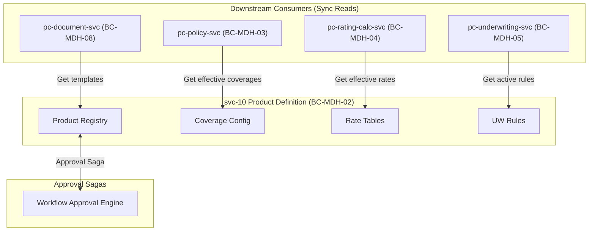

# svc-10: Product Definition Engine Specification (v1)

| Field | Detail |
|:------|:-------|
| **Document ID** | MDH-SVC-SPEC-PC-10-v1 |
| **Service ID** | `svc-10` |
| **Service Name** | Product Definition Engine |
| **Bounded Context** | `BC-MDH-02` — Product Definition |
| **Version** | 1.0 |
| **Status** | Draft |
| **Date** | 2026-07-16 |
| **Classification** | Internal — Confidential |
| **Tier** | Tier-1 |
| **Deploy Mode** | Microservice (`pc-product-defn-svc`) |
| **Target Repo** | `Platform Core/dev/pc-product-defn-svc` |
| **Phase** | Phase 0 (Pilot MVP seed) |
| **PRD Anchor** | [Platform Core PRD](../prd/Medhen-Platform-PRD.md) (`REQ-PRD-*`) |
| **Capability Anchor** | [Capability Doc BC-MDH-02](../prd/Medhen-Platform-Capability-Document.md#bc-mdh-02--product-definition-engine-pc-product-defn-svc) |
| **Capabilities** | `CAP-PROD-001` to `CAP-PROD-A3` |
| **Methodologies** | DDD · Hexagonal · EDA · CQRS-lite · Transactional Outbox |
| **Companion Specs** | `svc-11` Rating Engine · `svc-13` Policy Management |

**Revision history**

| Version | Date | Summary |
|:---|:---|:---|
| 1.0 | 2026-07-16 | Initial Tier-1 specification covering Sections 1-3. Drafted against PRD capabilities (`REQ-PRD-001` through `051`). |

---

## Document Structure Overview

1. **Service Overview**
2. **Technology Stack**
3. **Functional Requirements**
4. **Domain Model & Events (Tactical DDD)** (Upcoming)
5. **API Specifications** (Upcoming)
6. **Event Schemas & Contracts (Avro)** (Upcoming)
7. **Behaviour-Driven Scenarios (BDD)** (Upcoming)
8. **Data Ownership & Persistence** (Upcoming)
9. **Integration & Dependency Contracts** (Upcoming)
10. **Non-Functional Requirements & SLOs** (Upcoming)
11. **Observability Specification** (Upcoming)
12. **Operational Runbooks** (Upcoming)
13. **Engineering Definition of Done (DoD)** (Upcoming)

---

## 1. Service Overview

### 1.1 Mission Statement

`svc-10` Product Definition Engine (`BC-MDH-02`) is the **foundational, product-agnostic configuration substrate** for the Medhen Platform. It is the single source of truth for all insurance product configurations, coverages, rate tables, underwriting rules, and document mappings. The engine provides the immutable templates from which all policies are quoted, underwritten, and issued across all lines of business (Motor, Life, Commercial, Specialty).

The service owns the following strict responsibilities:
1. **Product Lifecycle Management** — Governance of product definitions from `DRAFT` to `APPROVED` to `ACTIVE` through structured workflows.
2. **Coverage & Limits Configuration** — Definition of mandatory/optional coverages, sub-limits, deductibles, and exclusions.
3. **Rate Table Management** — Storage and versioning of multi-dimensional rating matrices, consumed by the Rating Engine (`BC-MDH-04`).
4. **Underwriting Rules Configuration** — Definition of risk assessment logic (auto-accept, refer, decline) consumed by the Underwriting Engine (`BC-MDH-05`).
5. **Versioning & Immutability** — Guaranteeing that every published product version and rate table is immutable, ensuring historical quotes and policies are always tied to the exact rules effective at their inception.

### 1.2 Product Context (Must-Include)

`svc-10` operates in a core registry capacity. Products are defined generically as JSONB structures to support diverse lines of business without core code changes (the "Kernel extension contract").

| Product Line | Namespace | Phase | Key REQs |
|:---|:---|:---|:---|
| **Motor** | `motor.*` | 0 (Pilot MVP) | `REQ-PRD-001`, `REQ-PRD-010`, `REQ-PRD-020` |
| **Life** | `life.*` | 2 | `REQ-PRD-050` |
| **Commercial** | `comm.*` | 3 | `REQ-PRD-050` |
| **Specialty** | `spec.*` | 4 | `REQ-PRD-050` |

### 1.3 Business Context

| Aspect | Description |
|:-------|:------------|
| **Problem** | Hard-coding product logic into the policy or rating engines limits speed-to-market. Changes to rates or coverages often require engineering deployments, increasing risk and delaying product launches. |
| **Value** | Enables business users (Actuaries, Product Managers) to launch and iterate on products through configuration rather than code. Ensures rigorous versioning so that past policies remain structurally sound even as the product evolves. |
| **Stakeholders** | Product Managers, Actuaries, Underwriters, Platform Engineering, Legal/Compliance (for UK conduct / PROD regulations). |

### 1.4 Business Capabilities Delivered

| Capability (CAP) | Description | Primary REQ | Phase |
|:---|:---|:---|:---|
| `CAP-PROD-001` | Product lifecycle management (creation, versioning, status transitions, cloning) | `REQ-PRD-001` - `005` | 1 |
| `CAP-PROD-002` | Coverage configuration (limits, deductibles, dependencies, exclusions) | `REQ-PRD-010` - `013` | 1 |
| `CAP-PROD-003` | Rate table management (dimensions, versioning, import) | `REQ-PRD-020` - `022` | 1 |
| `CAP-PROD-004` | Underwriting rule configuration (accept/refer/decline) | `REQ-PRD-030` - `031` | 1 |
| `CAP-PROD-005` | Document template association (schedules, terms, exclusions) | `REQ-PRD-040` | 1 |
| `CAP-PROD-A1` | Product-line extension registration (risk schemas via Kernel) | `REQ-PRD-050` | per-LOB |
| `CAP-PROD-A2` | Fair-value / product governance record (UK Consumer Duty) | `REQ-PRD-051` | 2 |
| `CAP-PROD-A3` | Product simulation / what-if (simulating rate/rule changes against historical portfolio) | — | 3 |

### 1.5 In-Scope / Out-of-Scope Responsibilities

**In-Scope:**
* Creation, versioning, and lifecycle management of Product Definitions.
* Definition of coverage graphs (dependencies and exclusions).
* Rate table ingestion, storage, and retrieval by effective date.
* Underwriting rule storage and evaluation priority configuration.
* Immutable audit trails for all definition changes.
* Event emission (`platform.product.*`) via outbox.

**Out-of-Scope:**
* Policy lifecycle and quoting (owned by `pc-policy-svc`).
* Rate calculation execution (owned by `pc-rating-calc-svc`, which pulls tables from `svc-10`).
* Underwriting execution (owned by `pc-underwriting-svc`).
* Workflow approval orchestration (owned by the workflow engine).
* Document generation (owned by `pc-document-svc`).

### 1.6 Bounded Context Responsibilities (`BC-MDH-02`)

`BC-MDH-02` is the sole owner of the Product domain.

| Owns | Exposes | Produces (via Outbox) | Invariants |
|:---|:---|:---|:---|
| `Product` aggregate (identity, status, effective dates) | REST authoring API | `platform.product.lifecycle.v1` | A published version is strictly immutable (`INV-PRD-1`) |
| `Coverage` definitions (limits, deductibles) | High-throughput gRPC read API | `platform.product.coverage.v1` | Dependent coverages require their parent (`INV-PRD-2`) |
| `RateTable` matrices (dimensions, factors) | gRPC read API | `platform.product.ratetable.v1` | Rate tables are effective-dated (`INV-PRD-3`) |
| `UWRule` configurations | gRPC read API | `platform.product.uwrule.v1` | Rules have deterministic evaluation order (`INV-PRD-4`) |

### 1.7 Context Map



---

## 2. Technology Stack

### 2.0 Operations-Plane Architecture Narrative

`svc-10` is primarily a **read-heavy** service. While authoring products involves complex transactional state changes, the vast majority of traffic consists of downstream services (Rating, Underwriting, Policy) fetching effective product configurations during the quote-to-issue journey. The architecture heavily leverages PostgreSQL's JSONB for flexible product schemas and materialised caching strategies (via Redis or in-memory caches) to serve high-throughput gRPC reads to the rating and policy engines. All writes follow the write-then-publish outbox pattern.

### 2.1 Technology Selection

| Layer | Technology | Rationale |
|:---|:---|:---|
| Language / runtime | **Go 1.26.x** | House standard; optimized for concurrent gRPC serving |
| API — external/UI | **REST/JSON**, OpenAPI 3.1 | Product Manager authoring UI |
| API — internal | **gRPC** | Low-latency reads for Rating/Policy engines |
| Primary store | **PostgreSQL 18.x** | ACID guarantees for product publish; JSONB for flexible LOB schemas |
| Event backbone | **Kafka** + **Avro** | Durable `platform.product.*` topics |
| Outbox relay | **Transactional outbox** | Atomic commit of config and event |
| File Import | **CSV/Excel parsers** | Bulk ingestion of complex rate tables |
| Cache | **Redis / In-memory LRU** | Sub-millisecond serving of rate tables to `pc-rating-calc-svc` |

### 2.2 Configuration Reference

| Key | Default | Purpose |
|:---|:---|:---|
| `cache.rate_table_ttl` | `5m` | TTL for caching rate table reads |
| `import.max_rows` | `100_000` | Ceiling for rate table bulk CSV import |
| `product.require_fair_value` | `true` | Enforces `REQ-PRD-051` (UK Consumer Duty) block on publish |

### 2.3 Event Publishing (Outbox)

All state changes to products, coverages, and rate tables persist the domain state and the outbox row in a single PostgreSQL transaction.

```sql
CREATE TABLE outbox (
  id            bigserial PRIMARY KEY,
  topic         text NOT NULL,               -- e.g. platform.product.lifecycle.v1
  partition_key text NOT NULL,               -- {tenant_id}:{product_id}
  payload       bytea NOT NULL,              -- Avro-encoded event
  headers       jsonb NOT NULL,              -- CloudEvents v1.0
  created_at    timestamptz NOT NULL DEFAULT now(),
  published_at  timestamptz
);
```

---

## 3. Functional Requirements

### 3.1 Functional Requirement Catalog

The following requirements expand on PRD specifications (`REQ-PRD-001` through `REQ-PRD-051`), stated in normative RFC 2119 language.

#### 3.1.1 Product Lifecycle (`FR-PROD-LFC-*`) — `REQ-PRD-001`, `002`, `003`, `004`, `005`

- **FR-PROD-LFC-1 — Creation API.** The service SHALL expose `POST /v1/products` to create an insurance product defined by `lob`, `name`, `description`, `effective_from`, and `effective_to`. The initial state MUST be `DRAFT`.
- **FR-PROD-LFC-2 — Immutability.** The service SHALL enforce that once a product version is transitioned to `ACTIVE`, its definition, coverages, and bounds CANNOT be modified. Any change requires minting a new version (`v+1`).
- **FR-PROD-LFC-3 — State Machine.** The service SHALL strictly enforce the state transitions: `DRAFT` → `REVIEW` → `APPROVED` → `ACTIVE` → `SUSPENDED` / `RETIRED`. Invalid transitions MUST be rejected with `INVALID_TRANSITION`.
- **FR-PROD-LFC-4 — Cloning.** The service SHALL expose `POST /v1/products/{id}/clone` to copy all coverages, rate table links, and rules into a new `DRAFT` product ID.
- **FR-PROD-LFC-5 — Effective Dating.** Queries for a product (via `GET /v1/products/{id}/effective`) MUST accept an `as_of` date parameter and SHALL ONLY return products where `effective_from <= as_of <= effective_to`.

#### 3.1.2 Coverage Configuration (`FR-PROD-COV-*`) — `REQ-PRD-010`, `011`, `012`, `013`

- **FR-PROD-COV-1 — Definition.** The service SHALL allow definition of Coverages within a `DRAFT` product, capturing `code`, `name`, and an `is_mandatory` boolean flag.
- **FR-PROD-COV-2 — Limits & Deductibles.** Coverages SHALL support configuration of min/max/default bounds for limits and deductibles. Deductibles MUST support flat amounts, percentage of sum insured, and percentage of loss modes.
- **FR-PROD-COV-3 — Dependencies.** The service SHALL allow mapping a Coverage as dependent on another (e.g. `Windscreen` requires `Comprehensive`). API consumers fetching coverages SHALL receive these dependency graphs.
- **FR-PROD-COV-4 — Exclusions.** Coverages SHALL support defining structured exclusions (text blocks) that map to Document generation templates.

#### 3.1.3 Rate Table Management (`FR-PROD-RAT-*`) — `REQ-PRD-020`, `021`, `022`

- **FR-PROD-RAT-1 — Multi-dimensional Setup.** The service SHALL support dynamic rate tables with multiple lookup dimensions (e.g. `Age`, `VehicleMake`) mapping to a specific factor or premium value.
- **FR-PROD-RAT-2 — Effective Dating.** Rate tables SHALL be versioned independently with their own `effective_from`/`effective_to` dates, allowing forward-dated rate changes without altering the base product version.
- **FR-PROD-RAT-3 — Bulk Import.** The service SHALL expose an import endpoint for CSV files, validating all rows in a single transaction. A failure in any row MUST roll back the entire import and return a list of `SCHEMA_INVALID` line-item errors.

#### 3.1.4 Underwriting Rules (`FR-PROD-UWR-*`) — `REQ-PRD-030`, `031`

- **FR-PROD-UWR-1 — Rule Types.** The service SHALL store underwriting rules classified strictly as `AUTO_ACCEPT`, `REFER`, or `DECLINE`.
- **FR-PROD-UWR-2 — Execution Priority.** The service SHALL enforce an integer `priority` field across all rules on a product. Lower numbers evaluate first, ensuring deterministic outcomes for `pc-underwriting-svc`.

#### 3.1.5 Governance & Extensibility (`FR-PROD-GOV-*`) — `REQ-PRD-050`, `051`

- **FR-PROD-GOV-1 — Kernel Extension.** The service SHALL support the registration of LOB risk schemas as JSON schemas. These define the shape of risk objects (e.g., `Vehicle`, `Driver`) that are permitted for the product, consumed by the Kernel.
- **FR-PROD-GOV-2 — Fair Value Block.** If `product.require_fair_value=true`, the transition from `DRAFT` to `REVIEW` SHALL be rejected unless a completed Consumer Duty / Fair Value Assessment payload is attached to the product version.
- **FR-PROD-GOV-3 — Product Simulation (Phase 3).** The service SHALL expose an API to simulate rate and rule changes against a historical portfolio payload, calculating hypothetical premium impact without mutating any `ACTIVE` definitions.

### 3.2 Negative Requirements

- **FR-PROD-NEG-1:** The service SHALL NOT allow the deletion (`DELETE`) of any product version, rate table, or rule that has reached the `APPROVED` or `ACTIVE` states. They MUST only be `RETIRED`.
- **FR-PROD-NEG-2:** The service SHALL NOT permit overlapping `effective_from`/`effective_to` dates for the same active product version.
- **FR-PROD-NEG-3:** The service SHALL NOT perform policy pricing calculations itself; it MUST only serve the structural rules to `pc-rating-calc-svc`.

### 3.3 State Machine Definition (Products)

| From State | Trigger Action | To State | Guards & Preconditions |
|:---|:---|:---|:---|
| `—` | `CreateProduct` | `DRAFT` | Valid schema, unique code |
| `DRAFT` | `SubmitForApproval` | `REVIEW` | Fair Value present (if req), coverages valid |
| `REVIEW` | `Approve` | `APPROVED` | Maker-checker enforced, Workflow engine callback |
| `APPROVED` | `Activate` | `ACTIVE` | `effective_from` is reached |
| `ACTIVE` | `Suspend` | `SUSPENDED` | — |
| `ACTIVE`/`SUSPENDED`| `Retire` | `RETIRED` | Replaced by new version or EOL |

---

## 4. Domain Model & Events (Tactical DDD)

`svc-10` is designed around the principles of Domain-Driven Design (DDD). The domain is decomposed into three primary Aggregates: `Product`, `RateTable`, and `UnderwritingRuleSet`. Each aggregate acts as a transactional boundary, enforcing invariants internally and emitting domain events when mutated.

### 4.1 Bounded Context Boundary (`BC-MDH-02`)

The `Product Definition` context acts as the upstream authority for what a product "is". Downstream contexts (`Policy`, `Rating`, `Underwriting`) do not redefine products; they reference `product_id` and `version` and fetch the effective configuration dynamically.

### 4.2 Aggregate Roots

| Aggregate Root | Definition & Invariants | Emitted Events |
|:---|:---|:---|
| **`Product`** | Represents the lifecycle and structure of an insurance product. It owns `Coverage` definitions and the document template mappings.<br><br>**Invariants:**<br>• Cannot transition backward in lifecycle.<br>• Cannot be mutated once `ACTIVE`.<br>• Must have a non-empty `effective_from` date. | `ProductDraftCreated`<br>`ProductStatusChanged`<br>`ProductCoverageAdded`<br>`ProductActivated` |
| **`RateTable`** | Represents a multi-dimensional pricing matrix. Separated from `Product` to allow independent, high-frequency updates.<br><br>**Invariants:**<br>• Must have at least one dimension and one return value (factor/premium).<br>• Rows cannot contain overlapping dimension bounds (e.g., Age 18-25 and Age 20-30). | `RateTableCreated`<br>`RateTableImported`<br>`RateTableActivated` |
| **`UWRuleSet`** | A collection of rules (accept/refer/decline) bound to a `product_id`.<br><br>**Invariants:**<br>• Priority values must be strictly ordered (no ties).<br>• Must belong to an existing product. | `UWRuleSetUpdated` |

### 4.3 Entities vs Value Objects

| Concept | Type | Justification |
|:---|:---|:---|
| `Product` | Entity (Aggregate Root) | Has a distinct identity (`product_id`) and lifecycle over time. |
| `Coverage` | Entity (Local) | Identified by `coverage_code` within a `Product`; can be modified or removed independently while the product is in `DRAFT`. |
| `RateTable` | Entity (Aggregate Root) | Exists independently of a product version; a single `RateTable` can be referenced by multiple products or versions. |
| `RateRow` | Value Object | An individual row in a rate table has no identity; it is replaced entirely if the rate matrix is updated. |
| `UWRule` | Value Object | Replaced atomically within a `UWRuleSet`. |

### 4.4 Command Catalog

Commands represent intent to mutate the state of an Aggregate. They are dispatched via REST API and execute within a single Unit of Work (UoW).

#### 4.4.1 Product Commands

| Command | Aggregate | Pre-conditions | Post-conditions (Success) | Domain Exception |
|:---|:---|:---|:---|:---|
| `CreateProduct` | `Product` | `code` is globally unique. | Product created in `DRAFT` state. | `DuplicateProductCode` |
| `AddCoverage` | `Product` | Product is in `DRAFT`. | Coverage graph updated; if dependent, parent must exist. | `ProductNotInDraft`<br>`ParentCoverageMissing` |
| `SubmitForApproval` | `Product` | Product is in `DRAFT`. | Status is `REVIEW`; approval saga initiated. | `ProductNotInDraft`<br>`MissingFairValueAssessment` |
| `ActivateProduct` | `Product` | Product is `APPROVED`. | Status is `ACTIVE`; prior overlapping versions are `RETIRED`. | `ProductNotApproved` |

### 4.5 Unit of Work (UoW) & Transaction Boundary

The UoW guarantees that exactly three things occur atomically in a single PostgreSQL transaction:
1. The domain state mutation (e.g., updating the `product_status` column).
2. The domain event serialization into the `outbox` table.
3. The insertion of a record into the `audit_ledger` table (append-only).

Optimistic Locking is employed via a `version` integer column on every Aggregate Root. If two simultaneous commands attempt to mutate the same `Product`, the second will throw an `OptimisticLockException` (HTTP 409 Conflict) preventing lost updates.

### 4.6 Hexagonal Architecture Layering

The codebase strictly follows ports and adapters:
- **`domain`**: Pure Go. Contains Aggregates, Value Objects, and domain rules. No external dependencies.
- **`application`**: Command Handlers and Query Handlers. Orchestrates the UoW.
- **`infrastructure`**: PostgreSQL adapters, Outbox relay, Redis cache implementations.
- **`presentation`**: HTTP REST controllers (writes) and gRPC servers (reads).

---

## 5. API Specifications

`svc-10` exposes two distinct API surfaces following the CQRS-lite pattern: a REST API for mutating commands (Product Authoring) and a gRPC API for high-throughput reads (Quote/Issue path).

### 5.1 REST API (Commands & UI Queries)

Base path: `/api/pc-product-defn/v1`

| Method | Endpoint | Purpose | Idempotency | AuthZ Policy |
|:---|:---|:---|:---|:---|
| `POST` | `/products` | Create new product draft | Required | `product.author` |
| `PUT` | `/products/{id}/coverages` | Upsert coverages | Required | `product.author` |
| `POST` | `/products/{id}/transitions/submit` | Submit for review | Required | `product.author` |
| `POST` | `/products/{id}/transitions/approve` | Approve (System) | Required | `system.workflow` |
| `POST` | `/rate-tables` | Create rate table | Required | `product.author` |
| `POST` | `/rate-tables/{id}/import` | Bulk CSV import | Required | `product.author` |

#### 5.1.1 Payload: `CreateProduct`
```json
{
  "code": "MOT-COMP-01",
  "name": "Comprehensive Motor V1",
  "lob": "motor",
  "effective_from": "2026-08-01T00:00:00Z",
  "effective_to": "2027-08-01T00:00:00Z",
  "description": "Standard comprehensive motor offering."
}
```

#### 5.1.2 Idempotency Contract
All mutating endpoints (`POST`, `PUT`, `PATCH`) MUST supply an `Idempotency-Key` header (UUIDv4). The service utilizes `pc-idempotency-management-sdk`.
- First request: Executes domain logic, caches response, returns 201/200.
- Duplicate request (within 24h): Bypasses domain logic, returns cached response identically.

### 5.2 gRPC API (High-Throughput Reads)

The gRPC API is consumed heavily by `pc-rating-calc-svc` and `pc-policy-svc` during the quoting flow. These calls are served from the Redis cache where possible.

**Service Definition:** `medhen.platform.product.v1.ProductQueryService`

| RPC | Request | Response | SLA (P95) |
|:---|:---|:---|:---|
| `GetEffectiveProduct` | `product_code`, `as_of_date` | `ProductSnapshot` | < 10ms |
| `GetRateTableFactors` | `rate_table_id`, `dimensions_map` | `FactorResult` | < 5ms |
| `GetUWRules` | `product_id` | `UWRuleSet` | < 10ms |

### 5.3 Error Mapping & Taxonomy

`svc-10` employs the standard Medhen error envelope (RFC 7807 Problem Details).

| Domain Exception | HTTP Code | Error Code | Client Action |
|:---|:---|:---|:---|
| `DuplicateProductCode` | `409 Conflict` | `PRD-1001` | Choose a unique code. |
| `ProductNotInDraft` | `422 Unprocessable Entity` | `PRD-1002` | Operation requires DRAFT state. |
| `ParentCoverageMissing` | `400 Bad Request` | `PRD-1003` | Add parent coverage before dependent. |
| `MissingFairValueAssessment`| `422 Unprocessable Entity`| `PRD-1004` | Upload Consumer Duty assessment. |
| `OptimisticLockException` | `409 Conflict` | `SYS-0002` | Refetch resource and retry. |
| `RateTableOverlap` | `400 Bad Request` | `PRD-1005` | Fix overlapping dimensions in CSV. |

### 5.4 Versioning & Deprecation Policy

- **REST API:** Path-based versioning (`/v1/`). Breaking changes require `/v2/` and a 6-month deprecation window.
- **Product Versions:** Product definitions themselves are intrinsically versioned by the business. An `ACTIVE` product that is modified results in the old version being `RETIRED` and a new version entering `ACTIVE`, ensuring API contracts (the quote schema) remain stable for existing policies.

---

## 6. Event Schemas & Contracts (Avro)

All domain events emitted by `svc-10` are published to Kafka via the outbox pattern. Topics strictly enforce `BACKWARD` compatibility mode in the Apicurio Schema Registry. Consumers (Policy, Rating, Underwriting) must handle out-of-order delivery via the `version` field.

### 6.1 Topic Mapping

| Event | Topic | Partition Key | Schema ID |
|:---|:---|:---|:---|
| `ProductDraftCreated`, `ProductActivated`, `ProductStatusChanged` | `platform.product.lifecycle.v1` | `tenant_id:product_id` | `ProductLifecycleEvent` |
| `RateTableActivated` | `platform.product.ratetable.v1` | `tenant_id:rate_table_id` | `RateTableActivatedEvent` |
| `UWRuleSetUpdated` | `platform.product.uwrule.v1` | `tenant_id:product_id` | `UWRuleSetEvent` |

### 6.2 Avro Schema: `ProductLifecycleEvent`

```json
{
  "namespace": "medhen.platform.product.v1",
  "type": "record",
  "name": "ProductLifecycleEvent",
  "fields": [
    {"name": "event_id", "type": "string", "logicalType": "uuid"},
    {"name": "tenant_id", "type": "string"},
    {"name": "product_id", "type": "string"},
    {"name": "lob", "type": "string"},
    {"name": "action", "type": {"type": "enum", "name": "LifecycleAction", "symbols": ["CREATED", "SUBMITTED", "APPROVED", "ACTIVATED", "SUSPENDED", "RETIRED"]}},
    {"name": "status", "type": "string"},
    {"name": "version", "type": "int"},
    {"name": "effective_from", "type": {"type": "long", "logicalType": "timestamp-millis"}},
    {"name": "effective_to", "type": ["null", {"type": "long", "logicalType": "timestamp-millis"}], "default": null},
    {"name": "occurred_at", "type": {"type": "long", "logicalType": "timestamp-millis"}}
  ]
}
```

---

## 7. Behaviour-Driven Scenarios (BDD)

The following BDD scenarios prove the normative functional requirements (§3). They act as the definitive acceptance criteria for the test engineering team.

### 7.1 Product Lifecycle (`FR-PROD-LFC-*`)

**Scenario: PROD-BDD-01 | Create a new Product Draft**
* **Given** an authenticated Product Manager
* **When** they submit a `CreateProduct` command for `MOT-01`
* **Then** the product is persisted in the `DRAFT` state
* **And** the `effective_from` date is recorded
* **And** a `ProductDraftCreated` event is published to `platform.product.lifecycle.v1`

**Scenario: PROD-BDD-02 | Prevent modification of ACTIVE products**
* **Given** a product `MOT-01` in the `ACTIVE` state
* **When** the Product Manager attempts to `AddCoverage` to `MOT-01`
* **Then** the service rejects the request with HTTP 422 `ProductNotInDraft`
* **And** no domain state is mutated

**Scenario: PROD-BDD-03 | Clone an existing product**
* **Given** an `ACTIVE` product `MOT-01`
* **When** the Product Manager triggers `/clone` on `MOT-01`
* **Then** a new product `MOT-02` is created in `DRAFT` state
* **And** all coverages and rules from `MOT-01` are duplicated onto `MOT-02`

### 7.2 Coverage and Dependencies (`FR-PROD-COV-*`)

**Scenario: PROD-BDD-04 | Enforce coverage dependencies**
* **Given** a product in `DRAFT`
* **And** a coverage `Windscreen` that depends on `Comprehensive`
* **When** the Product Manager attempts to add `Windscreen` WITHOUT adding `Comprehensive`
* **Then** the service rejects the request with HTTP 400 `ParentCoverageMissing`

### 7.3 Rate Tables (`FR-PROD-RAT-*`)

**Scenario: PROD-BDD-05 | Bulk import Rate Table with overlaps**
* **Given** a CSV containing Age dimensions `18-25` yielding factor `1.5`
* **And** the same CSV contains Age dimensions `20-30` yielding factor `1.2`
* **When** the file is uploaded to the import endpoint
* **Then** the service detects the dimensional overlap
* **And** the transaction is rolled back entirely
* **And** an error `RateTableOverlap` is returned indicating the conflicting rows

### 7.4 Governance (`FR-PROD-GOV-*`)

**Scenario: PROD-BDD-06 | UK Consumer Duty block**
* **Given** a product in `DRAFT` where `require_fair_value` is `true`
* **And** no Fair Value Assessment document hash is attached
* **When** the Product Manager attempts to `SubmitForApproval`
* **Then** the transition is blocked
* **And** the service returns HTTP 422 `MissingFairValueAssessment`

---

## 8. Data Ownership & Persistence

`svc-10` owns a highly normalised PostgreSQL schema for managing lifecycle state, alongside JSONB columns for flexible LOB extension data.

### 8.1 PostgreSQL DDL

The following represents the authoritative transactional database schema. Note that outbox and audit are strictly maintained in the same database to ensure the UoW.

#### 8.1.1 Products Table

```sql
CREATE TABLE products (
    id UUID PRIMARY KEY,
    tenant_id VARCHAR(36) NOT NULL,
    code VARCHAR(50) NOT NULL,
    lob VARCHAR(50) NOT NULL,
    name VARCHAR(255) NOT NULL,
    status VARCHAR(30) NOT NULL, -- DRAFT, REVIEW, APPROVED, ACTIVE, SUSPENDED, RETIRED
    version INT NOT NULL, -- Optimistic Lock
    effective_from TIMESTAMPTZ NOT NULL,
    effective_to TIMESTAMPTZ,
    require_fair_value BOOLEAN DEFAULT false,
    schema_payload JSONB, -- LOB-specific risk schema overrides
    created_at TIMESTAMPTZ DEFAULT CURRENT_TIMESTAMP,
    updated_at TIMESTAMPTZ DEFAULT CURRENT_TIMESTAMP,
    UNIQUE (tenant_id, code, version)
);
```

#### 8.1.2 Coverages Table

```sql
CREATE TABLE product_coverages (
    id UUID PRIMARY KEY,
    product_id UUID REFERENCES products(id) ON DELETE CASCADE,
    code VARCHAR(50) NOT NULL,
    name VARCHAR(255) NOT NULL,
    is_mandatory BOOLEAN DEFAULT false,
    min_limit NUMERIC(15, 2),
    max_limit NUMERIC(15, 2),
    deductible_config JSONB, -- Defines flat, %, etc.
    parent_coverage_code VARCHAR(50), -- Dependency mapping
    UNIQUE (product_id, code)
);
```

#### 8.1.3 Rate Tables

```sql
CREATE TABLE rate_tables (
    id UUID PRIMARY KEY,
    tenant_id VARCHAR(36) NOT NULL,
    name VARCHAR(100) NOT NULL,
    version INT NOT NULL,
    effective_from TIMESTAMPTZ NOT NULL,
    effective_to TIMESTAMPTZ,
    dimensions JSONB NOT NULL, -- Defines the axes (e.g. ['Age', 'VehicleMake'])
    UNIQUE(tenant_id, name, version)
);

CREATE TABLE rate_rows (
    id BIGSERIAL PRIMARY KEY,
    rate_table_id UUID REFERENCES rate_tables(id) ON DELETE CASCADE,
    dimension_bounds JSONB NOT NULL, -- The bounds for this row
    factor NUMERIC(10, 4) NOT NULL
);
CREATE INDEX idx_rate_rows_table ON rate_rows(rate_table_id);
```

### 8.2 Data Classification & Privacy

`BC-MDH-02` stores **configuration data only**. It does NOT store policyholder PII, risk details, or claims data.

| Data Domain | Classification | Residency Constraints | Notes |
|:---|:---|:---|:---|
| Product Names/Codes | Internal | None | Fully generic |
| Rate Tables / Pricing | **Confidential** | In-country (if mandated) | Highly sensitive trade secrets. Access strictly governed via RBAC. |
| Underwriting Rules | **Confidential** | In-country | Contains proprietary risk logic. |
| Audit Ledger | Internal | In-country | Immutable history of changes. |

### 8.3 Caching Strategy

Because the gRPC read tier must serve `pc-rating-calc-svc` with sub-10ms latency, product configurations and rate tables are actively cached in Redis upon transitioning to `ACTIVE`.

- **Cache Keys:** `rate_table:{tenant_id}:{table_id}:{version}`
- **Eviction:** LRU with a 5-minute TTL.
- **Cache Miss:** Reads directly from PostgreSQL `rate_rows`, recalculates JSON structure, stores in Redis, and returns.

---

## 9. Integration & Dependency Contracts

`svc-10` operates primarily as an upstream provider to the rest of the insurance platform. However, it maintains key dependencies for infrastructure and orchestration.

### 9.1 Dependency Matrix

| Service | Contract | Coupling | Timeout/Circuit Breaker | Fallback/Degraded State |
|:---|:---|:---|:---|:---|
| **`pc-rating-calc-svc`** | Consumer of `GetRateTableFactors` (gRPC) | Sync (Inbound) | N/A (We are the provider) | Rating falls back to local cache on `svc-10` outage. |
| **`pc-policy-svc`** | Consumer of `GetEffectiveProduct` (gRPC) | Sync (Inbound) | N/A | Policy quoting halts if product definitions cannot be retrieved. |
| **`svc-25` Workflow** | Saga approval counterparty | Sync/Async | 5s | If workflow is down, product `SubmitForApproval` fails; product remains in `DRAFT`. |
| **`svc-17` Audit** | Kafka Consumer of outbox | Async | N/A | Backpressure builds in outbox; never drop audit records. |

### 9.2 Workflow Approval Saga (`BC-PC-20`)

When a product transitions from `DRAFT` to `REVIEW`, `svc-10` invokes the `svc-25` workflow engine via gRPC to initiate a maker-checker saga.
- **Request:** Includes the `product_id`, the author (`maker`), and the required approval tier (`ProductCommittee`).
- **Pending State:** The product is locked in `REVIEW`. No mutations are permitted.
- **Callback:** `svc-25` publishes a `WorkflowResolutionEvent` to Kafka. `svc-10` consumes this and transitions the product to `APPROVED` or back to `DRAFT` (if rejected).

---

## 10. Non-Functional Requirements & SLOs

`svc-10` is a Tier-1 operations plane service. It must provide absolute transactional integrity on writes and highly available, low-latency performance on reads.

### 10.1 Service Level Objectives (SLOs)

| Metric | SLO | Consequence of Breach | Measurement |
|:---|:---|:---|:---|
| **Availability (gRPC Reads)** | 99.99% | Entire platform cannot quote or issue new policies. | Prometheus: successful requests / total requests. |
| **Latency (gRPC Reads)** | P95 < 10ms | Impacts total quoting latency for `pc-policy-svc`. | OpenTelemetry span duration. |
| **Availability (REST Writes)** | 99.9% | Product managers cannot author/update products. | Prometheus: successful requests / total requests. |
| **Outbox Publish Lag** | P95 < 5s | Downstream caches and audits are stale. | Max timestamp difference between `created_at` and `published_at`. |

### 10.2 Scalability & Capacity Targets

- **Active Products:** Up to 5,000 active product versions across all tenants.
- **Rate Tables:** Up to 100,000 rate tables; max 1,000,000 rows per table.
- **Read Throughput:** 5,000 gRPC requests/second sustained (served primarily via Redis).

---

## 11. Observability Specification

The service utilizes the standard `pc-telemetry-sdk` for OpenTelemetry instrumentation.

### 11.1 Golden Signals (Prometheus)

- **Traffic:** `grpc_server_handled_total{method="GetEffectiveProduct"}`
- **Latency:** `grpc_server_handling_seconds_bucket`
- **Errors:** `grpc_server_handled_total{grpc_code!="OK"}`
- **Saturation:** `go_goroutines`, `pgxpool_acquired_conns`

### 11.2 Custom Domain Metrics

- `product_transitions_total{from="DRAFT", to="REVIEW"}`
- `rate_table_import_rows_total{status="success|failed"}`
- `cache_hit_ratio{entity="rate_table"}`

### 11.3 Logging (Structured `slog`)

All logs must contain the standard tracing fields contextually injected by the SDK:
- `trace_id`, `span_id`
- `tenant_id`
- `product_id` (if applicable)
- `actor_id` (the authenticated user)

```json
{"level":"INFO","time":"2026-07-16T12:00:00Z","msg":"Product submitted for approval","tenant_id":"t-123","product_id":"p-456","trace_id":"...","span_id":"..."}
```

---

## 12. Operational Runbooks

### 12.1 Outbox Relay Stalled

**Symptom:** Alert `OutboxPublishLagHigh` fires. `published_at` is null for records older than 5 minutes.
**Action:**
1. Check Kafka connectivity: `kcat -b kafka-broker:9092 -L`
2. Restart the relay sidecar pod: `kubectl rollout restart deploy/pc-product-defn-svc`
3. Verify uncompleted rows:
   ```sql
   SELECT count(*) FROM outbox WHERE published_at IS NULL;
   ```

### 12.2 Manual Product Suspension

**Symptom:** A product was launched with a critical defect or regulatory violation, but the UI is unavailable.
**Action:**
Use the CLI or direct curl (requires `system.admin` role) to force the state machine:
```bash
curl -X POST https://api.medhen.internal/pc-product-defn/v1/products/p-456/transitions/suspend \
  -H "Authorization: Bearer $ADMIN_TOKEN" \
  -H "Idempotency-Key: $(uuidgen)"
```

### 12.3 Rate Table Cache Poisoning

**Symptom:** `pc-rating-calc-svc` is returning incorrect premiums based on old cached rates.
**Action:**
Flush the rate table cache explicitly for the tenant:
```bash
redis-cli --scan --pattern "rate_table:t-123:*" | xargs redis-cli DEL
```
The next gRPC read will force a DB hit and re-populate the cache correctly.

---

## 13. Engineering Definition of Done (DoD)

Before `svc-10` can be deployed to the `staging` environment for the Phase 0 Pilot, the following quality gates MUST be passed:

1. **Test Coverage:** Core domain logic (State Machine, Rate Table overlap detection) must have > 90% unit test coverage.
2. **BDD Scenarios:** All 6 scenarios defined in §7 must pass in the integration test suite.
3. **Idempotency:** All mutating endpoints must pass the automated double-submit replay tests.
4. **Outbox Tests:** The chaos suite must prove that terminating the pod during a UoW does not result in an orphaned domain state or an un-published Kafka event.
5. **Observability:** Dashboards and SLO burn-rate alerts must be provisioned via code (Terraform).
6. **Security:** SonarQube scan zero critical/high vulnerabilities; strictly parameterized SQL (no string concatenation).
