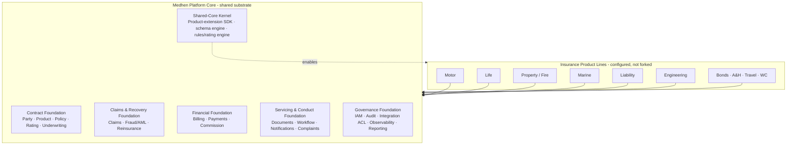
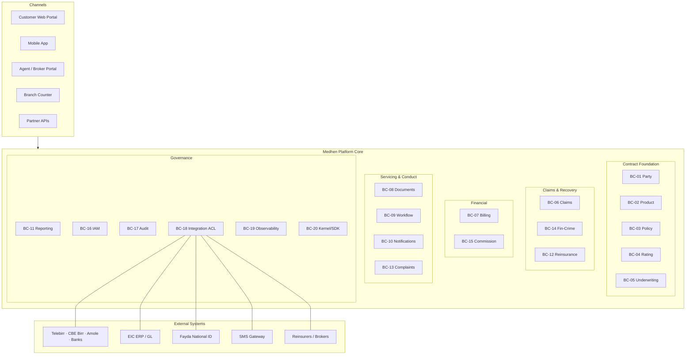

# Medhen Platform — Enterprise Capability Document

## Tier-1 Insurance Automation Platform — DDD · Hexagonal · EDA · Shared-Core Foundation

**Document Classification:** Confidential — Strategic
**Document ID:** MDH-CAP-001
**Version:** 1.0
**Status:** Draft — Pending Stakeholder Review
**Date:** July 2026
**Client:** Ethiopian Insurance Corporation (EIC)
**Author:** InnoSphere Technologies — Senior Solutions Architect
**Supersedes:** [`product_definition_document.md`](./product_definition_document.md) (PDD v1.0 — capability catalog) — *preserved unchanged for audit traceability*

**Companion Documents:**

- [Medhen Platform PRD](./Medhen-Platform-PRD.md) — engineering contract & `REQ ↔ CAP` bidirectional traceability
- [Product Definition Document (PDD v1.0)](./product_definition_document.md) — original capability catalog (superseded, retained for audit)

---

> **Document Identity.** This is the **Medhen capability document** — the *strategic and architectural source of truth* for the shared, product-agnostic insurance-automation platform on which the Ethiopian Insurance Corporation runs all lines of business (Motor, Life, Property, Marine, Liability, Engineering, and beyond). It is decomposed by **Bounded Context** (DDD), exposes **Ports & Events** as the first-class capability surface (Hexagonal + EDA), and is structured for **agentic-engineering** consumption (tabular, self-contained, traceable). It declares **what** the platform does; the [PRD](./Medhen-Platform-PRD.md) declares **commitments + acceptance criteria**; per-service specs (to be authored) declare **how**.
>
> **UK-procedure alignment with Ethiopian localization.** The platform adopts UK insurance operating models and conduct standards (FCA Consumer Duty, ICOBS/IDD, Insurance Act 2015 fair-presentation, Lloyd's/London-market claims practice) as its operational blueprint, while integrating natively with Ethiopian payment rails (Telebirr, CBE Birr, Amole), regulation (NBE), language (Amharic), calendar, and administrative structures.

---

## Table of Contents

**Part I — Strategic Frame**

1. [Executive Summary](#1-executive-summary)
2. [Platform Scope & Boundaries](#2-platform-scope--boundaries)
3. [Capability Map — by Bounded Context](#3-capability-map--by-bounded-context)
4. [Multi-Product / Multi-LOB Story](#4-multi-product--multi-lob-story)

**Part II — Architectural Foundations**

5. [Architecture Style — DDD · Hexagonal · EDA · CQRS](#5-architecture-style--ddd--hexagonal--eda--cqrs)
6. [Control Plane vs Data Plane](#6-control-plane-vs-data-plane)
7. [Latency Budget & Multi-Path SLAs](#7-latency-budget--multi-path-slas)
8. [Multi-Tenancy, Multi-Branch & Isolation Model](#8-multi-tenancy-multi-branch--isolation-model)
9. [Cross-Cutting Patterns — Idempotency · Outbox · Sagas · CQRS · Bi-Temporal](#9-cross-cutting-patterns--idempotency--outbox--sagas--cqrs--bi-temporal)
10. [Security Posture — Zero Trust · mTLS · Encryption](#10-security-posture--zero-trust--mtls--encryption)

**Part III — Bounded Context Capability Decomposition** *(BC-MDH-01 … BC-MDH-20)*

- BC-MDH-01 — Party & Customer Management
- BC-MDH-02 — Product Definition Engine
- BC-MDH-03 — Policy Administration
- BC-MDH-04 — Rating & Premium Calculation
- BC-MDH-05 — Underwriting
- BC-MDH-06 — Claims Management
- BC-MDH-07 — Billing & Payments
- BC-MDH-08 — Document Management
- BC-MDH-09 — Workflow & Approvals
- BC-MDH-10 — Notifications
- BC-MDH-11 — Reporting & Analytics
- BC-MDH-12 — Reinsurance & Coinsurance
- BC-MDH-13 — Complaints & Disputes
- BC-MDH-14 — Financial Crime (Fraud / AML / Sanctions)
- BC-MDH-15 — Commission Management
- BC-MDH-16 — Identity & Access Management
- BC-MDH-17 — Audit & Compliance
- BC-MDH-18 — Integration & Anti-Corruption Layer
- BC-MDH-19 — Observability & Telemetry
- BC-MDH-20 — Shared-Core Kernel & Product Extensibility

**Part IV — Platform Maturity & Future-Proofing**

- 11. Platform Maturity Model
- 12. AI / ML & Agentic Evolution Trajectory
- 13. Multi-LOB Readiness — Onboarding a New Product Line
- 14. Public API & SDK Evolution Discipline
- 15. Schema Evolution & Backward Compatibility

**Part V — Operating Model, Deployment & Rollout**

- 16. Deployment Topology Reference Architectures
- 17. Data Residency & Hosting Model
- 18. Rollout Roadmap & Phasing
- 19. Data Migration & Legacy Coexistence
- 20. Operating Model & Support

**Part VI — Tier-1 International Competitive Benchmark**

- 21. Competitive Landscape Overview
- 22. Capability Parity Matrix — Medhen vs Tier-1 PAS
- 23. Differentiators & Defensible Moats
- 24. Open Standards Compliance Map (ACORD, ISO, IFRS 17)

**Part VII — Regulatory, Compliance & Sovereignty Deep-Dive**

- 25. Ethiopian Primary Legislation — Operational Interpretation
- 26. NBE Directives — Operational Implementation
- 27. UK Conduct & International Frameworks — Implementation Map
- 28. Data Sovereignty & Residency Controls
- 29. Financial Reporting & IFRS 17 Posture

**Part VIII — End-to-End Operational Scenarios & Edge Cases**

- 30. Canonical Happy-Path End-to-End Scenarios
- 31. Degradation & Resilience Scenarios
- 32. Edge Cases & Boundary Conditions
- 33. Disaster Recovery & Business Continuity
- 34. Cross-Region Failover Scenarios

**Part IX — Future-Proofing & Long-Horizon Architecture**

- 35. AI-Native Insurance Trajectory
- 36. Multi-Region Active-Active Evolution
- 37. Open Insurance / Embedded Insurance / API Ecosystem Readiness
- 38. Post-Quantum Cryptography Migration
- 39. Regulatory Horizon Scan (2026–2030)
- 40. Sustainability & ESG Posture
- 41. Stable-Forever Contracts (Backward Compatibility Charter)

**Part X — Appendices**

- Appendix A — Platform Service Registry
- Appendix B — Bounded Context ⇄ Service Mapping
- Appendix C — Product-Line Consumption Matrix
- Appendix D — Unified Domain Event Catalog
- Appendix E — Public API Catalog
- Appendix F — RBAC / IAM Role Catalog
- Appendix G — Regulatory & Compliance Citation Index
- Appendix H — NFR / SLO Catalog (Consolidated)
- Appendix I — Cross-BC Dependency Graph
- Appendix J — Glossary
- Appendix K — CAP ⇄ REQ Traceability Index

---

# Part I — Strategic Frame

## 1. Executive Summary

### 1.1 Platform Vision

**Medhen** (መድህን — "protector / insurer") is an enterprise-grade, **product-agnostic insurance-automation platform** engineered to run the complete insurance value chain for the **Ethiopian Insurance Corporation** across every line of business — **Motor, Life, Property/Fire, Marine, Liability, Engineering, Workmen's Compensation, Bonds, Accident & Health, and Travel**. A single **shared core** (party, product, policy, rating, underwriting, claims, billing) powers all product lines; new products are launched through **configuration, not code**.

Medhen is engineered to **tier-1 international standards** (Guidewire InsuranceSuite, Duck Creek, Sapiens, Majesco class of Policy Administration System) and is differentiated in the Ethiopian and emerging-market context by:

- **UK-procedure alignment** — FCA Consumer Duty, ICOBS/IDD demands-and-needs, Insurance Act 2015 fair-presentation, London-market claims practice — as the operational blueprint.
- **Ethiopian localization as a first-class primitive** — ETB, Ethiopian calendar, Amharic bilingual documents, Region→Zone→Woreda→Kebele addressing.
- **Native Ethiopian payment rails** — Telebirr, CBE Birr, Amole treated as first-class collection/settlement channels, not exceptions.
- **Fayda national digital ID** integration through the External-Integrations Anti-Corruption Layer.
- **NBE-aware compliance hooks** — compulsory motor third-party (Reg. 554/2024), statutory returns, 7-year record retention, immutable audit for examination.
- **Open architecture** — DDD, Hexagonal, EDA, OpenAPI/gRPC public contracts, ACORD-aligned party/policy models; no vendor data lock-in.

### 1.2 Value Proposition

| Dimension | Legacy / Manual Ops | Per-LOB Point Systems | Tier-1 Foreign PAS | **Medhen Platform** |
|---|---|---|---|---|
| **Sharing across product lines** | None — paper & siloed | Duplicate core per LOB | Vendor-licensed suite | **Bounded-context shared core; LOB-scoped extensions** |
| **Time-to-launch a new product** | Months of manual setup | 6–12 months per system | 3–9 months (config + vendor) | **Weeks** (variant = config; new LOB = extension contract) |
| **Schema & API discipline** | Ad hoc | Ad hoc / coupled | Vendor-controlled | **Versioned schemas + OpenAPI/gRPC; backward-compat enforced** |
| **Localization (Amharic / ETB / Fayda / Telebirr)** | Manual | Bolt-on | Absent / costly | **First-class primitives** |
| **Conduct & regulatory posture** | Manual, hard to evidence | Fragmented | Configurable, foreign-centric | **UK-conduct-aligned + NBE-native, audit by architecture** |
| **Auditability** | Paper trail | Partial logs | Configurable | **Immutable, bi-temporal, replayable end-to-end** |
| **Future-proofing** | None | Limited | Vendor-locked roadmap | **Maturity model L1→L4, AI-ready data platform, open contracts** |

### 1.3 Platform Positioning — Shared Core, Many Product Lines

### 1.4 Strategic Outcomes

Medhen delivers four strategic outcomes otherwise impossible with per-LOB point solutions or manual operations:

1. **Engineering economics.** ~70% of an insurer's operational infrastructure (party, policy lifecycle, billing, documents, workflow, audit, identity) is common across LOBs. Building it once as a shared core removes duplication, lowers TCO, and shrinks time-to-launch for every subsequent product line from months to weeks.
2. **Product agility.** Product managers launch and version products, coverages, rate tables, and underwriting rules through configuration with effective-dating — no code release. A new *variant* of an existing LOB is pure configuration; a genuinely new LOB implements the extension contract (risk schema + adapters) without touching core aggregates.
3. **Regulator defensibility.** A single audit trail (`BC-MDH-17`), single IAM (`BC-MDH-16`), single approval engine (`BC-MDH-09`), and single observability spine (`BC-MDH-19`) make NBE examinations repeatable and conduct compliance demonstrable across all product lines.
4. **Future-proofing.** The Maturity Model (§11) and AI/Agentic trajectory (§12) define a deliberate path from digitized operations (L1) through analytics-augmented (L2), intelligent-automation (L3), and AI-native/agentic (L4) — intelligent document processing, photo-based damage estimation, fraud scoring, straight-through claims — without rework.

---

## 2. Platform Scope & Boundaries

### 2.1 In-Scope (Owned by the Medhen Platform)

Medhen owns **20 services** organised into **20 Bounded Contexts**, covering five functional foundations:

| Foundation | Bounded Contexts | Services |
|---|---|---|
| **Contract Foundation** — quote-to-issue lifecycle | `BC-MDH-01` Party, `BC-MDH-02` Product, `BC-MDH-03` Policy, `BC-MDH-04` Rating, `BC-MDH-05` Underwriting | party, product, policy, rating, underwriting |
| **Claims & Recovery Foundation** | `BC-MDH-06` Claims, `BC-MDH-14` Financial Crime, `BC-MDH-12` Reinsurance | claims, fincrime, reinsurance |
| **Financial Foundation** | `BC-MDH-07` Billing & Payments, `BC-MDH-15` Commission | billing, commission |
| **Servicing & Conduct Foundation** | `BC-MDH-08` Documents, `BC-MDH-09` Workflow, `BC-MDH-10` Notifications, `BC-MDH-13` Complaints | document, workflow, notification, complaints |
| **Governance Foundation** — cross-cutting, security, insight | `BC-MDH-11` Reporting, `BC-MDH-16` IAM, `BC-MDH-17` Audit, `BC-MDH-18` Integration ACL, `BC-MDH-19` Observability, `BC-MDH-20` Shared-Core Kernel | reporting, iam, audit, integration, observability, kernel |

### 2.2 Out-of-Scope (Not Built by Medhen)

| Capability | Owner | Why outside the platform |
|---|---|---|
| General ledger / financial accounting | Existing **EIC ERP** | Medhen posts journal events; ERP is system-of-record for accounting |
| National identity issuance & verification source | **Fayda** national digital ID | Medhen integrates as a consumer via `BC-MDH-18` |
| Bank / mobile-money ledgers & settlement | **Telebirr, CBE, Dashen, banks** | Medhen integrates via payment gateways; does not hold funds |
| Actuarial pricing-model development | **EIC Actuarial function** | Medhen consumes resulting rate tables & factors as configuration |
| Product content — rate values, rule thresholds, wordings, authority limits | **EIC business** | Supplied as configuration/data, not engineered |
| Reinsurer / broker external systems | **Reinsurers, brokers** | Medhen exchanges bordereaux & cessions via ACL |

> **Boundary rule.** A capability belongs to the Medhen platform if-and-only-if it is genuinely *product-line-agnostic* — i.e., Motor, Life, and Property could all consume it without forcing LOB-specific logic into the core. Anything failing this test belongs to a product-line extension (configuration + adapters), not the core.

### 2.3 Tier Classification

| Tier | Definition | Bounded Contexts |
|---|---|---|
| **Tier-0** | Regulatory obligation, financial correctness, or hot-path SLA. Failure carries license, financial-loss, or compliance-breach risk | `BC-MDH-01`, `BC-MDH-03`, `BC-MDH-04`, `BC-MDH-06`, `BC-MDH-07`, `BC-MDH-14`, `BC-MDH-16`, `BC-MDH-17`, `BC-MDH-18`, `BC-MDH-19` |
| **Tier-1** | Operationally critical. Degradation impacts staff productivity, examination readiness, or product launch | `BC-MDH-02`, `BC-MDH-05`, `BC-MDH-08`, `BC-MDH-09`, `BC-MDH-11`, `BC-MDH-12`, `BC-MDH-13`, `BC-MDH-15` |
| **Tier-2** | Enhances capability without affecting baseline operation. Async / advisory | `BC-MDH-10` Notifications |
| **Library / SDK** | In-process; lifecycle via dependency, not deployment | `BC-MDH-20` Shared-Core Kernel |

---

## 3. Capability Map — by Bounded Context

### 3.1 The 20 Bounded Contexts at a Glance

| BC | Name | Owning Service | Plane | Tier | Phase |
|---|---|---|---|---|---|
| `BC-MDH-01` | Party & Customer Management | `pc-party-mgmt-svc` | Transactional Core | Tier-0 | 1 |
| `BC-MDH-02` | Product Definition Engine | `pc-product-defn-svc` | Control Plane | Tier-1 | 1 |
| `BC-MDH-03` | Policy Administration | `pc-policy-svc` | Transactional Core | Tier-0 | 1 |
| `BC-MDH-04` | Rating & Premium Calculation | `pc-rating-calc-svc` | Data (hot) | Tier-0 | 1 |
| `BC-MDH-05` | Underwriting | `pc-underwriting-svc` | Transactional Core | Tier-1 | 1 |
| `BC-MDH-06` | Claims Management | `pc-claims-svc` | Transactional Core | Tier-0 | 1 |
| `BC-MDH-07` | Billing & Payments | `pc-billing-svc` | Transactional Core | Tier-0 | 1 |
| `BC-MDH-08` | Document Management | `pc-document-svc` | Servicing | Tier-1 | 1 |
| `BC-MDH-09` | Workflow & Approvals | `pc-workflow-svc` | Operations (Control) | Tier-1 | 1 |
| `BC-MDH-10` | Notifications | `pc-notification-svc` | Servicing (Async) | Tier-2 | 1 |
| `BC-MDH-11` | Reporting & Analytics | `pc-reporting-svc` | Operations | Tier-1 | 2 |
| `BC-MDH-12` | Reinsurance & Coinsurance | `pc-reinsurance-svc` | Financial | Tier-1 | 2 |
| `BC-MDH-13` | Complaints & Disputes | `pc-complaints-svc` | Conduct | Tier-1 | 1 |
| `BC-MDH-14` | Financial Crime (Fraud/AML/Sanctions) | `pc-fincrime-svc` | Governance | Tier-0 | 2 |
| `BC-MDH-15` | Commission Management | `pc-commission-svc` | Financial | Tier-1 | 1 |
| `BC-MDH-16` | Identity & Access Management | Keycloak + `pc-iam-svc` | Governance | Tier-0 | 1 |
| `BC-MDH-17` | Audit & Compliance | `pc-audit-svc` | Governance | Tier-0 | 1 |
| `BC-MDH-18` | Integration & Anti-Corruption Layer | `pc-integration-svc` | Governance / egress | Tier-0 | 1 |
| `BC-MDH-19` | Observability & Telemetry | platform (`pc-observability`) | Governance | Tier-0 | 1 |
| `BC-MDH-20` | Shared-Core Kernel & Product Extensibility | `pc-platform-kernel` (lib/SDK) | Library | Library | 1 |

### 3.2 Master Capability Diagram

### 3.3 Tier–Phase Distribution

| Phase | Focus | Bounded Contexts introduced/proven |
|---|---|---|
| **Phase 0 — Pilot / Design-Partner MVP** | Win the contract: thin end-to-end Motor demo (buy→claim) on synthetic + sandbox data, on the full production stack | Thin slices of BC-01, 02, 03, 04, 05, 06, 07, 08, 10, 16, 17, 20 (happy-path only), each a multi-repo microservice |
| **Phase 1 — Foundational Core + Motor (Production)** | Harden shared core end-to-end on Motor | BC-01..10, 13, 15, 16, 17, 18, 19, 20 |
| **Phase 2 — Life** | Life & group; deepen reporting, fincrime, reinsurance | BC-11, 12, 14 matured; Life extension |
| **Phase 3 — Commercial Lines** | Property, Marine, Liability, Engineering, WC | LOB extensions; coinsurance depth |
| **Phase 4 — Specialty + Intelligence** | Bonds, A&H, Travel; AI/ML & agentic | AI-native capabilities across BCs |

> **Phase 0** is a demo-winning vertical slice built on the **full production architecture** — multi-repo microservices with DDD, hexagonal/clean, EDA, CQRS, outbox, and saga — scoped to the services the Motor demo exercises (not the full 20-service platform), happy-path only with mocked/sandbox integrations, **no throwaway work**. Full scope, storyboard, and milestones are in the [PRD §34.1](./Medhen-Platform-PRD.md#341-phase-0--pilot-mvp-detail) and §18 below.

### 3.4 Status Legend

**Status tags** carried per capability and per BC in Part III: `[PLANNED]` (design only), `[SPEC_DRAFT]` (tier-1 spec exists — sign-off then build), `[IN-BUILD]`, `[IMPLEMENTED]`. As Medhen is greenfield, all BCs begin at `[PLANNED]`/`[SPEC_DRAFT]`; the status column tracks build progress.

---

## 4. Multi-Product / Multi-LOB Story

### 4.1 Product-Line Onboarding Model

A new line of business is onboarded in one of two ways, never by forking the core:

| Onboarding path | What it requires | Example |
|---|---|---|
| **Configuration-only (variant)** | New product config: coverages, rate tables, UW rules, document templates, installment plans — all versioned & effective-dated | A new "Motor Comprehensive – Fleet" variant; a regional pricing update |
| **Extension (new LOB)** | Implement the product-extension contract in `BC-MDH-20`: declare the LOB risk schema (JSON-Schema), rating adapter, UW-rule bindings, claim-type taxonomy, document merge-fields | Adding Life, Property, Marine as first-class LOBs |

### 4.2 Current LOB Map — Capabilities Inherited from the Core

Every LOB inherits, unchanged, the full core capability surface:

| Core capability inherited | Motor | Life | Property | Marine | Provided by |
|---|---|---|---|---|---|
| Party & KYC | ✓ | ✓ | ✓ | ✓ | BC-MDH-01 |
| Quote → bind → issue lifecycle | ✓ | ✓ | ✓ | ✓ | BC-MDH-03 |
| Rating engine (LOB-configured tables) | ✓ | ✓ | ✓ | ✓ | BC-MDH-04 |
| Underwriting rules & authority matrix | ✓ | ✓ | ✓ | ✓ | BC-MDH-05 |
| Claims FNOL → settlement → recovery | ✓ | ✓ | ✓ | ✓ | BC-MDH-06 |
| Billing, installments, payments | ✓ | ✓ | ✓ | ✓ | BC-MDH-07 |
| Documents, workflow, notifications, complaints | ✓ | ✓ | ✓ | ✓ | BC-MDH-08/09/10/13 |
| Audit, IAM, reporting | ✓ | ✓ | ✓ | ✓ | BC-MDH-17/16/11 |
| **LOB-specific risk schema & content** | Vehicle | Life-assured | Property | Cargo/Hull | BC-MDH-20 extension |

### 4.3 Cross-LOB Intelligence (Customer-Centric)

Because all LOBs share one party registry and one policy store, the platform delivers cross-LOB value impossible in siloed systems:

- **Customer 360** across every policy, claim, and payment regardless of LOB.
- **Multi-policy / bundle discounts** applied at rating when a party holds cross-LOB cover.
- **Consolidated billing & collections** across a household or organization.
- **Portfolio-level fraud & AML** signals spanning motor, life, and property claims for one party.
- **Unified renewal & retention** management across the customer's whole book.

### 4.4 Product-Extension Contract (Summary)

The shared-core kernel (`BC-MDH-20`) exposes the stable extension points every LOB plugs into. Full detail is in the BC-MDH-20 decomposition (Part III) and the PRD `CORE` requirements:

| Extension Point | Declared by an LOB plugin as | Validated / owned by |
|---|---|---|
| **Risk schema** | Versioned JSON-Schema for the insured item (vehicle, life-assured, property, cargo) | Kernel + Product Engine |
| **Rating logic** | Rate tables, factors, loadings, discounts (configuration) | Rating + Product Engine |
| **Underwriting rules** | Auto-accept / refer / decline decision logic (configuration) | Underwriting + Product Engine |
| **Coverage catalog** | Coverages, limits, deductibles, exclusions, sub-limits | Product Engine |
| **Claim types** | Loss-type taxonomy, investigation checklists, settlement rules | Claims + Product Engine |
| **Documents** | Templates & merge fields (schedule, certificate, endorsement) | Documents + Product Engine |

---

# Part II — Architectural Foundations

## 5. Architecture Style — DDD · Hexagonal · EDA · CQRS

### 5.0 Technology Neutrality — Capability Doc vs. Service Spec

This capability document declares **technology-class** requirements (relational store, event-streaming backbone, object store, identity provider). Concrete vendor/version selection lives in the per-service spec and ADRs. Where a concrete technology is named below, it is the **reference selection** for EIC, changeable per service without altering the capability surface.

| Decision | Reference Selection |
|---|---|
| Backend | Go microservices |
| Frontend | Next.js (App Router) — customer, agent, staff, admin portals |
| Relational store | PostgreSQL (per-service database) |
| Cache / hot state | Redis |
| Event backbone | Apache Kafka (+ schema registry, backward-compat CI gate) |
| Sync inter-service | gRPC (mTLS) |
| Edge API | REST / OpenAPI via API gateway (BFF per portal) |
| Object store | MinIO (documents, media) |
| Identity | Keycloak (self-hosted, OIDC/OAuth2) |
| Search | Elasticsearch / OpenSearch (party & policy search) |

### 5.1 DDD Layering — Per Service

Each service follows the same clean-architecture layering, enabling agentic-engineering consistency:

- **Domain layer** — aggregates, entities, value objects, domain events, invariants (pure, no I/O). E.g., `Policy`, `Quote`, `Claim`, `BillingAccount` as aggregate roots.
- **Application layer** — use cases / command & query handlers orchestrating the domain; transaction boundaries; saga step handlers.
- **Ports** — inbound ports (commands/queries the BC accepts) and outbound ports (dependencies the BC needs), expressed as interfaces.
- **Adapters** — REST/gRPC controllers, Kafka producers/consumers, repositories, external gateway clients — the only place framework/vendor code lives.

### 5.2 Ports & Adapters — The Public Capability Surface

A bounded context's **public capability surface** is its **Inbound Ports** (APIs it exposes) + **Published Events** (facts it emits). Consumers depend only on these stable contracts, never on internal models. This is what allows LOB extensions and downstream modules to compose the core without coupling to its internals. Every Part III BC section enumerates its ports and events explicitly.

### 5.3 Event-Driven Architecture — Events as First-Class

All meaningful state changes emit **domain events** (e.g., `PolicyBound`, `ClaimSettled`, `PaymentReceived`) onto the Kafka backbone. Events are:

- **Versioned** and registered with backward-compatibility enforced in CI (additive evolution).
- **Published via the Outbox pattern** — event and state mutation commit in one DB transaction; a CDC/relay publishes reliably.
- **Consumed idempotently** — every consumer tolerates at-least-once delivery.

The unified event catalog is in Appendix D.

### 5.4 CQRS — Where Justified

Command (write) models live in each transactional BC. **Read-optimized projections** are built by `BC-MDH-11` (Reporting) and the Customer-360 view by consuming domain events. CQRS is applied where read and write shapes genuinely diverge (dashboards, 360 views, regulatory returns) — not universally.

### 5.5 Microservices from Inception

The platform is **full multi-repo microservices from day one** — including the Phase 0 pilot. There is **no monolith-first / modular-first stage**: every Bounded Context is an independently deployable, independently scalable service, in its own repository, with its own database, communicating only via its published ports (gRPC/REST) and events (Kafka). The BC boundary — ports + events — is the stable contract. Phase 0 does not change the *architecture*; it only **scopes the set of services built** to those the Motor demo exercises. Subsequent phases add services and thicken existing ones without altering established contracts. See the [Service Registry](./service-registry.md) for build order, dependencies, priority, and phase per service.

### 5.6 Agentic-Engineering Discipline

Documentation is structured so AI agents (and engineers) can reason over one BC in a single pass: stable anchors, tabular capability/port/event surfaces, self-contained sections, and bidirectional traceability to PRD REQ-IDs. This is a deliberate future-proofing choice enabling spec-to-code agentic workflows.

## 6. Control Plane vs Data Plane

| Plane | Nature | Bounded Contexts | Characteristics |
|---|---|---|---|
| **Control Plane** | Configuration & governance — changes are deliberate, versioned, approved | `BC-MDH-02` Product, `BC-MDH-09` Workflow, `BC-MDH-20` Kernel, config sides of Rating/UW/Commission | Effective-dated, maker-checker gated, low-volume, high-blast-radius |
| **Data Plane** | Operational transactions — high volume, latency-sensitive | `BC-MDH-01` Party, `BC-MDH-03` Policy, `BC-MDH-04` Rating (runtime), `BC-MDH-06` Claims, `BC-MDH-07` Billing | Hot-path, horizontally scaled, idempotent, observable |

Product configuration (control plane) is authored, versioned, and published as immutable artefacts; the data plane loads the *effective* version at transaction time. This separation lets EIC change pricing/rules safely without redeploying transactional services.

## 7. Latency Budget & Multi-Path SLAs

| Path | Examples | Budget |
|---|---|---|
| **Hot (synchronous)** | Premium calculation, quote retrieval, policy lookup, payment initiation | Premium calc < 1s; API P95 < 500ms (standard), < 2s (complex) |
| **Warm (near-real-time async)** | Domain-event propagation → billing, documents, notifications, reporting projections | End-to-end < 5s |
| **Cold (batch / analytical)** | Renewal identification, overdue sweeps, regulatory returns, reconciliation, bordereaux | Scheduled windows; completeness over latency |

## 8. Multi-Tenancy, Multi-Branch & Isolation Model

While Medhen is single-organization (EIC), it is engineered with tenancy primitives for **branch isolation** today and **multi-entity / white-label** futures.

| Isolation Dimension | Mechanism |
|---|---|
| **Branch scoping** | Every policy, claim, payment, and user carries a `branch_id`; access control and reporting filter by branch; inter-branch transfer is an explicit, audited operation |
| **Data partitioning** | Branch/region partition keys on high-volume event topics and tables |
| **Access isolation** | RBAC + ABAC: authority scoped by role **and** branch **and** product line |
| **Future multi-entity** | `tenant_id` primitive reserved on all aggregates and events for future subsidiaries or white-label deployments |

## 9. Cross-Cutting Patterns — Idempotency · Outbox · Sagas · CQRS · Bi-Temporal

| Pattern | Purpose | Where |
|---|---|---|
| **Idempotency** | At-least-once safety for payments, event consumption, external callbacks | Payment gateway callbacks (`BC-MDH-07`), every event consumer, external ACL (`BC-MDH-18`) |
| **Outbox** | Reliable event publishing atomic with state change | Every transactional BC |
| **Saga (orchestration)** | Multi-service consistency without distributed transactions | Bind→invoice→cession→issue; claim approve→pay→recover→reserve-release |
| **CQRS** | Read-optimized projections | Reporting (`BC-MDH-11`), Customer-360 |
| **Bi-Temporal versioning** | Every policy state reconstructable at any business-time & system-time; no data loss on endorsement | Policy (`BC-MDH-03`) |

## 10. Security Posture — Zero Trust · mTLS · Encryption

| Control | Implementation |
|---|---|
| **Zero-trust mesh** | mTLS between all services; no implicit trust; every call authenticated & authorized |
| **Authentication** | OAuth2 / OIDC via Keycloak; MFA for staff; SSO |
| **Authorization** | RBAC at gateway + service; ABAC for branch/product/authority scoping; enforced on every endpoint & event |
| **Encryption in transit** | TLS 1.3 external, mTLS internal |
| **Encryption at rest** | AES-256 for PII & financial data; field-level for national ID, bank accounts |
| **Secrets & keys** | Centralized secrets manager (e.g., Vault); KMS/HSM for key management; no secrets in code/config |
| **PII protection** | Masked in logs, encrypted in DB, access-controlled; consent & data-subject-rights (Ethiopian DPP) |
| **Audit & forensics** | Immutable, append-only, hash-chained audit of every data change and privileged action (`BC-MDH-17`) |

---

# Part III — Bounded Context Capability Decomposition

> **How to read Part III.** Each Bounded Context section is self-contained for agentic-engineering consumption: it declares the *capability surface* (Core + Advanced capabilities), the *contract surface* (Inbound + Outbound Ports, Published + Consumed Events), the *quality surface* (NFRs / SLOs, Regulatory Mapping), and the *evolution surface* (Capability Maturity Trajectory). Cross-references point to the PRD `REQ-*` IDs and (future) per-service specs. `CAP-*` IDs are reused from the PDD where they exist and extended with `-A#` for advanced/forward-looking capabilities.

---

## BC-MDH-01 — Party & Customer Management (pc-party-mgmt-svc)

| Field | Value |
|---|---|
| **BC ID** | `BC-MDH-01` |
| **Owning Service** | `pc-party-mgmt-svc` |
| **Plane** | Transactional Core |
| **Tier** | Tier-0 |
| **Phase** | Phase 1 |
| **Status** | `[PLANNED]` |
| **Upstream deps** | `BC-MDH-16` IAM (user↔party link), `BC-MDH-18` Integration ACL (Fayda) |
| **Downstream consumers** | Policy, Claims, Billing, Commission, Fin-Crime, Reporting |

### Objective

`BC-MDH-01` is the **central party registry** — the single authority for every individual and organization that interacts with the platform (policyholders, insureds, beneficiaries, agents, brokers, adjusters, service providers, reinsurers). It follows the **ACORD party model** (one party, many roles), owns KYC verification and consent, and serves the **Customer-360** view consumed by every other BC. It is product-line-agnostic: the same party record underlies a motor, life, or property relationship, enabling cross-LOB customer intelligence.

### Core Capabilities

| ID | Capability | Description | Status | Cross-BC Deps |
|---|---|---|---|---|
| `CAP-PARTY-001` | Party registration (individual + organization) | Register individuals (name, DOB, gender, Fayda/national ID, TIN) and organizations (legal name, registration, TIN, industry); duplicate detection (exact + fuzzy); merge with audit | `[PLANNED]` | `BC-MDH-18`, `BC-MDH-17` |
| `CAP-PARTY-002` | Party profile management | Addresses (Region→Zone→Woreda→Kebele), contacts (E.164/email), bank accounts, status lifecycle, profile photo, with change tracking | `[PLANNED]` | `BC-MDH-17` |
| `CAP-PARTY-003` | KYC (Know Your Customer) | Upload & verify identity documents (Kebele/National ID, Passport, Driving License, Business/Trade License); expiry tracking; aggregate KYC status | `[PLANNED]` | `BC-MDH-08`, `BC-MDH-09` |
| `CAP-PARTY-004` | Party roles | Assign multiple roles per party with role-specific attributes (agent license, broker accreditation, adjuster specialization); agent/broker records | `[PLANNED]` | `BC-MDH-15` |
| `CAP-PARTY-005` | Party search & lookup | Basic (name/ID/phone/email), advanced multi-field, full-text search | `[PLANNED]` | Search index |
| `CAP-PARTY-006` | Customer 360° view | Consolidated view of profile, policies, claims, payments, documents, interactions; relationship map; interaction timeline | `[PLANNED]` | `BC-MDH-11` |

### Advanced / Forward-Looking Capabilities

| ID | Capability | Description | Status |
|---|---|---|---|
| `CAP-PARTY-A1` | Consent & data-subject rights | Versioned consent capture; access/rectification/erasure-where-lawful per Ethiopian Personal Data Protection Proclamation | `[PLANNED — Phase 1]` |
| `CAP-PARTY-A2` | Vulnerable-customer flagging | Access-controlled vulnerability flag + driver for UK Consumer-Duty enhanced-care handling | `[PLANNED — Phase 2]` |
| `CAP-PARTY-A3` | Sanctions/PEP screening hook | Invoke `BC-MDH-14` screening at onboarding & material change; gate binding on unresolved hits | `[PLANNED — Phase 2]` |
| `CAP-PARTY-A4` | Household / group aggregation | Aggregate parties into households / corporate groups for bundled pricing & consolidated billing | `[PLANNED — Phase 3]` |

### Domain Model Sketch

- **`Party`** (Aggregate Root) — individual or organization; identity, status, KYC status, consent state
- **`Address`** (Entity) — Ethiopian admin-unit hierarchy, type, primary flag
- **`Contact`** (Entity) — mobile/phone/email/fax, primary flag
- **`BankAccount`** (Entity) — masked account for premium collection & settlement
- **`PartyRole`** (Entity) — role assignment with effective dates & role-specific attributes
- **`KYCDocument`** (Entity) — identity document with verification state & expiry
- **`ConsentRecord`** (Value Object) — versioned processing/marketing consent

### Inbound Ports

| Port | Protocol | Auth | Consumers |
|---|---|---|---|
| `POST /v1/parties` | REST/JSON | OAuth2 + RBAC | Agent/branch onboarding, customer self-registration |
| `GET /v1/parties/{id}` / `/search` | REST/JSON | OAuth2 + RBAC (branch-scoped) | All portals |
| `POST /v1/parties/{id}/kyc-documents` | REST (multipart) | OAuth2 + RBAC | KYC upload |
| `GET /v1/parties/{id}/360` | REST/JSON | OAuth2 + RBAC | Customer-360 |
| `ResolveParty` (gRPC) | gRPC (mTLS) | svc-mesh | Policy, Claims, Billing |

### Outbound Ports

| Port | Target | Failure Mode | Resilience |
|---|---|---|---|
| Fayda verification | `BC-MDH-18` ACL | Degraded → manual KYC fallback | Circuit breaker, cache |
| Sanctions/PEP screening | `BC-MDH-14` | Screening unavailable → flag pending | Async + gate |
| Audit publish | `BC-MDH-17` | Outbox retry | Outbox + DLQ |
| Party events publish | Kafka via outbox | CDC retry | Outbox |

### Published Events

| Topic | Schema Summary | Consumers | Retention |
|---|---|---|---|
| `pc.party.created.v1` | `party_id`, type, identity refs, branch | Reporting, Fin-Crime | Per audit retention |
| `pc.party.updated.v1` | `party_id`, changed fields | Reporting, Policy | 90 days warm |
| `pc.party.verified.v1` | `party_id`, kyc_status | Policy (bind gate), Reporting | Per audit retention |
| `pc.party.merged.v1` | survivor/merged ids | All party consumers | Per audit retention |

### Consumed Events

| Topic | Producer | Action |
|---|---|---|
| `pc.fincrime.screening.result.v1` | `BC-MDH-14` | Update party screening status; raise gate on hit |
| `pc.iam.user.linked.v1` | `BC-MDH-16` | Link portal user to party |

### NFRs / SLOs

| NFR | Target |
|---|---|
| Party lookup latency | P95 ≤ 500ms; 360 view ≤ 2s |
| Registration throughput | ≥ 50/sec sustained |
| Duplicate-detection recall | ≥ 95% on labelled set |
| Availability | ≥ 99.9% (Tier-0, core dependency) |
| PII protection | AES-256 at rest; masked in logs |

### Regulatory & Compliance Mapping

| Capability | Driver |
|---|---|
| KYC verification | NBE KYC/AML directives; FATF R.10 (CDD) |
| Consent & data-subject rights | Ethiopian Personal Data Protection Proclamation |
| Vulnerable-customer flag | FCA Consumer Duty (conduct) |
| Immutable change tracking | NBE record-keeping; 7-year retention |

### Capability Maturity Trajectory

| Level | Capability Set |
|---|---|
| L1 — Digitized | Party CRUD, roles, addresses/contacts, manual KYC |
| L2 — Operational | Duplicate detection, KYC workflow, Customer-360, consent |
| L3 — Intelligent | Fuzzy/Amharic-aware matching, automated Fayda verification, household aggregation |
| L4 — AI-native | ML de-duplication, document IDP for KYC, behavioural customer insight |

### Cross-References

- PRD requirements: `REQ-PTY-*` in [Medhen PRD §7](./Medhen-Platform-PRD.md#7-module-party--customer-management-pty)
- PDD source: [§3 Module 1](./product_definition_document.md)

---

## BC-MDH-02 — Product Definition Engine (pc-product-defn-svc)

| Field | Value |
|---|---|
| **BC ID** | `BC-MDH-02` |
| **Owning Service** | `pc-product-defn-svc` |
| **Plane** | Control Plane |
| **Tier** | Tier-1 |
| **Phase** | Phase 1 |
| **Status** | `[PLANNED]` |
| **Upstream deps** | `BC-MDH-09` Workflow (product approval), `BC-MDH-20` Kernel (schema engine) |
| **Downstream consumers** | Policy, Rating, Underwriting, Claims, Documents |

### Objective

`BC-MDH-02` is the **factory** that configures all insurance products. Products — their coverages, limits, deductibles, rate-table bindings, underwriting rules, and document templates — are defined through **structured, versioned, effective-dated configuration**, not code. This is the mechanism that makes *Configuration over Code* real: business users launch and evolve products without engineering, and the control-plane/data-plane split (§6) ensures the runtime always loads the correct effective version.

### Core Capabilities

| ID | Capability | Description | Status | Cross-BC Deps |
|---|---|---|---|---|
| `CAP-PROD-001` | Product lifecycle management | Create/version products; status lifecycle `DRAFT→REVIEW→APPROVED→ACTIVE→SUSPENDED→RETIRED`; cloning; effective dating | `[PLANNED]` | `BC-MDH-09` |
| `CAP-PROD-002` | Coverage configuration | Define coverages (mandatory/optional), limits (default/min/max), deductibles, dependencies, exclusions, sub-limits | `[PLANNED]` | — |
| `CAP-PROD-003` | Rate table management | Create/version multi-dimensional rate tables; bulk import (CSV/Excel); rating-factor configuration | `[PLANNED]` | `BC-MDH-04` |
| `CAP-PROD-004` | Underwriting rule configuration | Author auto-accept, referral-trigger, and decline rules; rule priority & ordering | `[PLANNED]` | `BC-MDH-05` |
| `CAP-PROD-005` | Document template association | Link templates (schedule, certificate, endorsement) to products; define product-specific merge fields | `[PLANNED]` | `BC-MDH-08` |

### Advanced / Forward-Looking Capabilities

| ID | Capability | Description | Status |
|---|---|---|---|
| `CAP-PROD-A1` | Product-line extension registration | Register a new LOB's risk schema, rating adapter, claim taxonomy via the Kernel extension contract | `[PLANNED — per LOB phase]` |
| `CAP-PROD-A2` | Fair-value / product governance record | Attach product-governance & fair-value assessments (UK PROD / Consumer Duty) to each product version | `[PLANNED — Phase 2]` |
| `CAP-PROD-A3` | Product simulation / what-if | Simulate rate/rule changes against historical portfolio before activation | `[PLANNED — Phase 3]` |

### Domain Model Sketch

- **`ProductDefinition`** (Aggregate Root) — LOB, name, version, status, effective dates
- **`CoverageDefinition`** (Entity) — coverage, limits, deductible, exclusions, sub-limits
- **`RateTable`** (Entity) — versioned multi-dimensional pricing table
- **`UnderwritingRuleDefinition`** (Entity) — auto-decision rule with priority
- **`DocumentTemplateRef`** (Entity) — template association + merge fields
- **`ProductVersion`** (Value Object) — immutable published configuration artefact

### Inbound Ports

| Port | Protocol | Auth |
|---|---|---|
| `POST /v1/products` / `PUT /v1/products/{id}/versions` | REST/JSON | OAuth2 + RBAC (Product Manager) |
| `POST /v1/products/{id}/coverages` `/rate-tables` `/uw-rules` | REST/JSON | OAuth2 + RBAC |
| `GetEffectiveProduct` (gRPC) | gRPC (mTLS) | svc-mesh (Policy, Rating, UW) |

### Outbound Ports

| Port | Target | Resilience |
|---|---|---|
| Product-approval workflow | `BC-MDH-09` | Saga |
| Product config publish | Kafka via outbox | Outbox |

### Published Events

| Topic | Schema Summary | Consumers |
|---|---|---|
| `pc.product.published.v1` | `product_id`, version, effective_from | Policy, Rating, UW, Documents (cache refresh) |
| `pc.product.retired.v1` | `product_id`, version | Policy (stop quoting) |

### Consumed Events

| Topic | Producer | Action |
|---|---|---|
| `pc.workflow.approval.completed.v1` | `BC-MDH-09` | Transition product to `APPROVED`/`ACTIVE` |

### NFRs / SLOs

| NFR | Target |
|---|---|
| Effective-product resolution (gRPC) | P95 ≤ 50ms (cached) |
| Config publish propagation | < 60s to data-plane caches |
| Availability | ≥ 99.9% |

### Regulatory & Compliance Mapping

| Capability | Driver |
|---|---|
| Product governance & fair-value | FCA Consumer Duty / PROD |
| Versioned, approved product config | NBE product-filing; audit |
| Compulsory-coverage enforcement (motor TP) | NBE Reg. 554/2024 |

### Capability Maturity Trajectory

| Level | Capability Set |
|---|---|
| L1 — Digitized | Product & coverage CRUD, manual rate entry |
| L2 — Operational | Versioning, effective dating, rule authoring, cloning |
| L3 — Intelligent | Product simulation/what-if, LOB extension registration |
| L4 — AI-native | AI-assisted product design & pricing recommendation |

### Cross-References

- PRD requirements: `REQ-PRD-*` (to be authored)
- PDD source: [§4 Module 2](./product_definition_document.md)

---

## BC-MDH-03 — Policy Administration (pc-policy-svc)

| Field | Value |
|---|---|
| **BC ID** | `BC-MDH-03` |
| **Owning Service** | `pc-policy-svc` |
| **Plane** | Transactional Core |
| **Tier** | Tier-0 |
| **Phase** | Phase 1 |
| **Status** | `[PLANNED]` |
| **Upstream deps** | Party, Product, Rating, Underwriting, Billing |
| **Downstream consumers** | Billing, Documents, Claims, Reinsurance, Reporting, Notifications |

### Objective

`BC-MDH-03` is the **central nervous system** of the platform, owning the complete policy lifecycle — quotation → binding → issuance → endorsement → renewal → cancellation → expiry/lapse — with **bi-temporal versioning** so any policy state is reconstructable at any business-time and system-time. It is LOB-agnostic: the lifecycle state machine is identical whether the insured item is a vehicle, a life, or a cargo shipment; LOB specifics arrive via the risk schema (`BC-MDH-20`).

### Core Capabilities

| ID | Capability | Description | Status | Cross-BC Deps |
|---|---|---|---|---|
| `CAP-POL-001` | Quotation management | Multi-step quote wizard, premium calculation, comparison, validity/expiry, re-quote, quick quote, assignment, notes, quote document | `[PLANNED]` | Rating, UW, Documents |
| `CAP-POL-002` | Policy binding | Accept quote, payment verification, bind, policy-number generation `EIC/{LOB}/{BRANCH}/{YYYY}/{SEQ}`, cover-note issuance, future effective date | `[PLANNED]` | Billing, Documents |
| `CAP-POL-003` | Policy issuance | Generate schedule, Certificate of Insurance, motor sticker; delivery; batch issuance | `[PLANNED]` | Documents, Notifications |
| `CAP-POL-004` | Policy servicing (endorsements) | Mid-term amendments, pro-rata premium adjustment, endorsement approval, bi-temporal versioning, endorsement history & document | `[PLANNED]` | Rating, Workflow, Billing |
| `CAP-POL-005` | Policy renewal | Renewal identification (configurable lead time), renewal quote, NCD, loss-experience loading, invitation, acceptance, non-renewal, lapse, renewal report | `[PLANNED]` | Rating, Notifications, Billing |
| `CAP-POL-006` | Policy cancellation | Request, reason capture, pro-rata/short-rate refund, approval, notice period, cancellation document, open-claims check | `[PLANNED]` | Rating, Billing, Workflow |
| `CAP-POL-007` | Policy search & retrieval | Search by policy number, customer, insured item; advanced search; detail view; timeline | `[PLANNED]` | Reporting |

### Advanced / Forward-Looking Capabilities

| ID | Capability | Description | Status |
|---|---|---|---|
| `CAP-POL-A1` | Statutory cooling-off / cancellation rights | Enforce 14-day statutory cancellation right with correct refund basis (UK conduct) | `[PLANNED — Phase 2]` |
| `CAP-POL-A2` | Group / fleet master policies | Master policy with member certificates; bulk endorsement | `[PLANNED — Phase 2]` |
| `CAP-POL-A3` | Coinsurance sharing | Record co-insurer shares & lead/follow on large risks | `[PLANNED — Phase 3]` |

### Domain Model Sketch

- **`Policy`** (Aggregate Root) — contract; lifecycle state; bi-temporal versions
- **`Quote`** (Aggregate Root) — pre-bind proposal; coverages; premium; validity
- **`PolicyVersion`** (Entity) — bi-temporal snapshot (business-time + system-time)
- **`Coverage`** / **`QuoteCoverage`** (Entity) — active/proposed coverages
- **`Endorsement`** (Entity) — mid-term amendment with before/after
- **`InsuredItem`** (Entity) — generic; specialized per LOB via risk schema

### Policy Lifecycle State Machine

`DRAFT → QUOTED → (REFERRED) → ACCEPTED → BOUND → ACTIVE → {ENDORSED, PENDING_RENEWAL, PENDING_CANCELLATION, SUSPENDED, EXPIRED}`; terminal: `CANCELLED, EXPIRED, LAPSED, DECLINED`. (Full diagram in PDD §5.2.)

### Inbound Ports

| Port | Protocol | Auth |
|---|---|---|
| `POST /v1/quotes` `/{id}/calculate` `/{id}/accept` | REST/JSON | OAuth2 + RBAC (Agent/UW/Branch) |
| `POST /v1/policies` (bind) | REST/JSON | OAuth2 + RBAC |
| `POST /v1/policies/{id}/endorsements` `/renew` `/cancel` | REST/JSON | OAuth2 + RBAC |
| `GET /v1/policies/{id}` `/versions` `/search` | REST/JSON | OAuth2 + RBAC (branch-scoped) |

### Outbound Ports

| Port | Target | Resilience |
|---|---|---|
| Premium calculation | `BC-MDH-04` (gRPC) | Timeout + retry |
| UW assessment | `BC-MDH-05` | Saga |
| Invoice/cover creation | `BC-MDH-07` | Saga + outbox |
| Document generation | `BC-MDH-08` | Async + outbox |

### Published Events

| Topic | Schema Summary | Consumers |
|---|---|---|
| `pc.policy.bound.v1` | `policy_id`, number, product, premium, party | Billing, Documents, Reinsurance, Notifications, Reporting, Commission |
| `pc.policy.issued.v1` | `policy_id`, documents | Notifications, Reporting |
| `pc.policy.endorsed.v1` | `policy_id`, endorsement, changes, premium adj | Billing, Documents, Reinsurance, Notifications, Reporting |
| `pc.policy.renewed.v1` | old/new `policy_id`, premium | Billing, Documents, Reinsurance, Notifications, Reporting |
| `pc.policy.cancelled.v1` | `policy_id`, reason, effective, refund | Billing, Documents, Notifications, Reporting |
| `pc.policy.expired.v1` / `.suspended.v1` / `.reinstated.v1` | `policy_id`, reason | Notifications, Billing, Reporting |

### Consumed Events

| Topic | Producer | Action |
|---|---|---|
| `pc.billing.payment.received.v1` | `BC-MDH-07` | Confirm payment → bind / reinstate |
| `pc.billing.payment.overdue.v1` | `BC-MDH-07` | Suspend / lapse per grace policy |
| `pc.underwriting.referral.decided.v1` | `BC-MDH-05` | Advance quote per UW decision |

### NFRs / SLOs

| NFR | Target |
|---|---|
| Policy lookup | P95 ≤ 500ms |
| Bind transaction (saga) | ≤ 5s end-to-end |
| Bi-temporal integrity | Zero data loss on amendment; any-point reconstruction |
| Availability | ≥ 99.9% (Tier-0) |

### Regulatory & Compliance Mapping

| Capability | Driver |
|---|---|
| Certificate of Insurance + motor sticker | NBE Reg. 554/2024 (compulsory motor TP) |
| Cooling-off / cancellation rights | UK conduct (ICOBS) |
| Bi-temporal audit of policy states | NBE record-keeping; 7-year retention |
| Pro-rata / short-rate refund correctness | Financial correctness; consumer fairness |

### Capability Maturity Trajectory

| Level | Capability Set |
|---|---|
| L1 — Digitized | Quote, bind, issue, basic endorsement |
| L2 — Operational | Full lifecycle, bi-temporal versioning, renewal automation, cancellation |
| L3 — Intelligent | Auto-renewal with NCD/loss-loading, group/fleet, coinsurance |
| L4 — AI-native | Predictive retention, next-best-action, automated servicing |

### Cross-References

- PRD requirements: `REQ-POL-*` (to be authored)
- PDD source: [§5 Module 3](./product_definition_document.md)

---

## BC-MDH-04 — Rating & Premium Calculation (pc-rating-calc-svc)

| Field | Value |
|---|---|
| **BC ID** | `BC-MDH-04` |
| **Owning Service** | `pc-rating-calc-svc` |
| **Plane** | Data Plane (hot) |
| **Tier** | Tier-0 |
| **Phase** | Phase 1 |
| **Status** | `[PLANNED]` |
| **Upstream deps** | Product (rate tables/factors), Kernel (rating engine) |
| **Downstream consumers** | Policy (quote/endorsement/renewal/cancellation) |

### Objective

`BC-MDH-04` is a **stateless calculation service** that, given risk data + effective product configuration, returns a fully itemized premium breakdown. It is the pricing authority: base-rate lookup, factor/loading/discount application, min/max bounds, taxes (VAT 15%, stamp duty), and pro-rata computations for endorsements, cancellations, and renewals. Every calculation is auditable and reproducible against the exact rate-table version used.

### Core Capabilities

| ID | Capability | Description | Status | Cross-BC Deps |
|---|---|---|---|---|
| `CAP-RATE-001` | Premium calculation | Base-rate lookup, multiplicative/additive factors, loadings, discounts (NCD/multi-policy/fleet/loyalty), min/max bounds, tax calc, itemized breakdown | `[PLANNED]` | Product |
| `CAP-RATE-002` | Rating audit & transparency | Record every calculation (inputs, factors, result); rate-table version tracking; what-if calculation | `[PLANNED]` | Audit |
| `CAP-RATE-003` | Pro-rata calculations | Endorsement additional/refund premium; cancellation return premium (pro-rata/short-rate); renewal re-rating with NCD & loss experience | `[PLANNED]` | Policy |

### Advanced / Forward-Looking Capabilities

| ID | Capability | Description | Status |
|---|---|---|---|
| `CAP-RATE-A1` | Usage-based / telematics rating | Consume telematics/usage signals for motor pricing | `[PLANNED — Phase 4]` |
| `CAP-RATE-A2` | ML-assisted pricing factors | Model-derived risk factors alongside actuarial tables (explainable) | `[PLANNED — Phase 4]` |
| `CAP-RATE-A3` | Multi-LOB bundle pricing | Cross-LOB discount when a party holds bundled cover | `[PLANNED — Phase 3]` |

### Domain Model Sketch

- **`RatingRequest`** (Value Object) — risk data + product code + coverage selection
- **`RatingCalculation`** (Entity) — immutable audit record: inputs, applied factors, rate-table version, result
- **`PremiumBreakdown`** (Value Object) — per-coverage premium, loadings, discounts, taxes, gross
- **`RatingEngine`** (Domain Service) — evaluates factors against effective rate tables (from Kernel)

### Inbound Ports

| Port | Protocol | Auth |
|---|---|---|
| `CalculatePremium` (gRPC) | gRPC (mTLS) | svc-mesh (Policy) |
| `POST /v1/rating/what-if` | REST/JSON | OAuth2 + RBAC (Product/Actuary) |

### Outbound Ports

| Port | Target | Resilience |
|---|---|---|
| Effective rate tables | `BC-MDH-02` / cache | Local cache, TTL |
| Calculation audit | `BC-MDH-17` | Outbox |

### Published Events

| Topic | Schema Summary | Consumers |
|---|---|---|
| `pc.rating.calculated.v1` | `calculation_id`, quote/policy ref, breakdown, rate-table version | Reporting, Audit |

### Consumed Events

| Topic | Producer | Action |
|---|---|---|
| `pc.product.published.v1` | `BC-MDH-02` | Refresh rate-table cache |

### NFRs / SLOs

| NFR | Target |
|---|---|
| Premium calculation latency | < 1s (P95 ≤ 300ms typical) |
| Statelessness | Horizontally scalable, no session state |
| Reproducibility | 100% — recompute yields identical result for same inputs + version |
| Availability | ≥ 99.9% (Tier-0, gates quoting) |

### Regulatory & Compliance Mapping

| Capability | Driver |
|---|---|
| VAT & stamp duty | Ethiopian tax law |
| Transparent, auditable premium | Consumer fairness; NBE examination |
| Rate-table version tracking | Audit; dispute defensibility |

### Capability Maturity Trajectory

| Level | Capability Set |
|---|---|
| L1 — Digitized | Table lookup + factor application + tax |
| L2 — Operational | Full breakdown, pro-rata, versioned audit, what-if |
| L3 — Intelligent | Bundle pricing, scenario testing, actuarial feedback loop |
| L4 — AI-native | Telematics/usage-based & explainable ML-assisted pricing |

### Cross-References

- PRD requirements: `REQ-RAT-*` (to be authored)
- PDD source: [§6 Module 4](./product_definition_document.md)

---

## BC-MDH-05 — Underwriting (pc-underwriting-svc)

| Field | Value |
|---|---|
| **BC ID** | `BC-MDH-05` |
| **Owning Service** | `pc-underwriting-svc` |
| **Plane** | Transactional Core |
| **Tier** | Tier-1 |
| **Phase** | Phase 1 |
| **Status** | `[PLANNED]` |
| **Upstream deps** | Product (UW rules), Party (claims history), Policy |
| **Downstream consumers** | Policy (quote advancement), Workflow, Reporting |

### Objective

`BC-MDH-05` automates risk assessment, implements the **authority matrix**, and manages the **referral workflow**. It evaluates each submission against product-configured underwriting rules to auto-accept (STP), auto-decline, or refer; routes referrals to the correct authority level; and records every decision with conditions for full auditability — aligned with UK fair-presentation and delegated-authority practice.

### Core Capabilities

| ID | Capability | Description | Status | Cross-BC Deps |
|---|---|---|---|---|
| `CAP-UW-001` | Automated risk assessment | Rules-engine evaluation; auto-accept (STP); auto-decline; auto-referral; risk score; claims-history check | `[PLANNED]` | Product, Party |
| `CAP-UW-002` | Referral management | Create referral; underwriter workbench/queue; decision (approve / approve-with-conditions / decline / refer-higher); conditions capture; escalation; SLA tracking | `[PLANNED]` | Workflow |
| `CAP-UW-003` | Authority matrix | Configurable authority levels (premium & sum-insured limits per product); assignment to underwriters; committee referral; authority audit | `[PLANNED]` | IAM, Audit |

### Advanced / Forward-Looking Capabilities

| ID | Capability | Description | Status |
|---|---|---|---|
| `CAP-UW-A1` | Fair-presentation / disclosure capture | Structured proposer disclosure & duty-of-fair-presentation record (Insurance Act 2015) | `[PLANNED — Phase 2]` |
| `CAP-UW-A2` | ML risk triage | Model-assisted risk scoring & referral prioritization (explainable) | `[PLANNED — Phase 4]` |
| `CAP-UW-A3` | External data enrichment | Vehicle/registration, prior-claims, credit signals via ACL for richer assessment | `[PLANNED — Phase 3]` |

### Domain Model Sketch

- **`UnderwritingAssessment`** (Aggregate Root) — submission evaluation, decision, risk score
- **`Referral`** (Entity) — reason, required authority, SLA, assignee
- **`UnderwritingDecision`** (Entity) — decision + conditions (exclusions, loadings, warranties)
- **`AuthorityLevel`** (Value Object) — premium & sum-insured limits per product

### Inbound Ports

| Port | Protocol | Auth |
|---|---|---|
| `AssessRisk` (gRPC) | gRPC (mTLS) | svc-mesh (Policy) |
| `GET /v1/referrals` (workbench) | REST/JSON | OAuth2 + RBAC (Underwriter) |
| `POST /v1/referrals/{id}/decision` | REST/JSON | OAuth2 + RBAC (authority-scoped) |

### Outbound Ports

| Port | Target | Resilience |
|---|---|---|
| Referral routing | `BC-MDH-09` Workflow | Saga |
| Decision audit | `BC-MDH-17` | Outbox |

### Published Events

| Topic | Schema Summary | Consumers |
|---|---|---|
| `pc.underwriting.risk.assessed.v1` | quote ref, decision, risk score | Policy, Reporting |
| `pc.underwriting.referral.created.v1` | referral, reason, required authority | Workflow, Notifications |
| `pc.underwriting.referral.decided.v1` | decision, conditions, decided-by | Policy, Notifications, Reporting |

### Consumed Events

| Topic | Producer | Action |
|---|---|---|
| `pc.workflow.approval.completed.v1` | `BC-MDH-09` | Apply escalated decision |

### NFRs / SLOs

| NFR | Target |
|---|---|
| Auto-assessment latency | < 1s (inline with quote) |
| STP rate (standard motor) | ≥ 80% auto-decisioned |
| Referral SLA tracking | Per authority level; breach alerting |
| Availability | ≥ 99.9% |

### Regulatory & Compliance Mapping

| Capability | Driver |
|---|---|
| Fair presentation / disclosure | Insurance Act 2015 (UK) |
| Authority-limited decisions with audit | Delegated authority governance; NBE |
| Non-discriminatory rule application | Consumer fairness |

### Capability Maturity Trajectory

| Level | Capability Set |
|---|---|
| L1 — Digitized | Manual referral capture & decision |
| L2 — Operational | Rules-engine STP/decline/refer, authority matrix, SLA |
| L3 — Intelligent | External enrichment, risk scoring, disclosure analytics |
| L4 — AI-native | ML triage, automated condition recommendation |

### Cross-References

- PRD requirements: `REQ-UW-*` (to be authored)
- PDD source: [§7 Module 5](./product_definition_document.md)

---

## BC-MDH-06 — Claims Management (pc-claims-svc)

| Field | Value |
|---|---|
| **BC ID** | `BC-MDH-06` |
| **Owning Service** | `pc-claims-svc` |
| **Plane** | Transactional Core |
| **Tier** | Tier-0 |
| **Phase** | Phase 1 |
| **Status** | `[PLANNED]` |
| **Upstream deps** | Policy (coverage validation), Party, Product (loss types) |
| **Downstream consumers** | Billing (payments), Fin-Crime, Reinsurance, Reporting, Notifications |

### Objective

`BC-MDH-06` owns the full claims lifecycle following **UK/London-market claims practice**: FNOL → coverage check → triage → investigation → reserve → assessment → settlement → recovery → closure, with reopening. It enforces reserve discipline, settlement authority, fast-track routing, and fraud-indicator flagging (delegating scoring to `BC-MDH-14`). LOB-agnostic core with LOB-specific loss taxonomies from the product configuration.

### Core Capabilities

| ID | Capability | Description | Status | Cross-BC Deps |
|---|---|---|---|---|
| `CAP-CLM-001` | First Notice of Loss (FNOL) | Multi-channel intake (web/mobile/phone/branch), policy lookup, coverage validation, claim-number generation, loss-type classification, third-party details, document upload, GPS capture | `[PLANNED]` | Policy, Documents |
| `CAP-CLM-002` | Triage & assignment | Severity scoring, auto-assignment (specialization/workload/location), manual assignment, fast-track routing, assignment notification | `[PLANNED]` | Notifications |
| `CAP-CLM-003` | Investigation | Product-specific checklist, document management, site inspection, third-party reports, fraud indicators, claim diary/notes | `[PLANNED]` | Documents, Fin-Crime |
| `CAP-CLM-004` | Reserve management | Set/adjust reserves (indemnity/expense/recovery), reserve authority limits, reserve history audit | `[PLANNED]` | Audit, Reinsurance |
| `CAP-CLM-005` | Assessment & settlement | Settlement calculation (deductibles/limits/depreciation), proposal, approval routing, partial settlement, offer letter, denial, total-loss handling | `[PLANNED]` | Workflow, Documents |
| `CAP-CLM-006` | Claim payment | Payment to claimant/service provider, multiple payees, payment methods (bank/Telebirr/CBE Birr/Amole/check), payment approval | `[PLANNED]` | Billing |
| `CAP-CLM-007` | Recovery (subrogation & salvage) | Subrogation identification & tracking, salvage management, recovery accounting | `[PLANNED]` | Billing, Reinsurance |
| `CAP-CLM-008` | Claim closure & reopening | Close with financial summary, reopen on new info, closure checklist, final reserve release | `[PLANNED]` | Reporting |

### Advanced / Forward-Looking Capabilities

| ID | Capability | Description | Status |
|---|---|---|---|
| `CAP-CLM-A1` | AI damage estimation | Photo-based motor damage estimation & repair-cost prediction | `[PLANNED — Phase 4]` |
| `CAP-CLM-A2` | Straight-through claims | Fully automated settlement for low-value, low-risk claims | `[PLANNED — Phase 4]` |
| `CAP-CLM-A3` | Service-provider network | Approved garage/hospital network with direct billing & SLAs | `[PLANNED — Phase 3]` |

### Domain Model Sketch

- **`Claim`** (Aggregate Root) — lifecycle state, loss details, financials
- **`ClaimReserve`** (Entity) — indemnity/expense/recovery reserve with history
- **`ClaimPayment`** (Entity) — settlement disbursement (payee, method)
- **`ClaimNote`** (Entity) — chronological diary
- **`ClaimParty`** (Entity) — third parties involved
- **`Recovery`** (Entity) — subrogation/salvage

### Claims Lifecycle State Machine

`FNOL → COVERAGE_CHECK → REGISTERED → TRIAGED → {FAST_TRACK, ASSIGNED} → UNDER_INVESTIGATION → ASSESSED → PENDING_APPROVAL → {APPROVED, ESCALATED} → SETTLED → {RECOVERY} → CLOSED`; branches: `COVERAGE_DENIED`, `DENIED`, `REOPENED`. (Full diagram in PDD §8.2.)

### Inbound Ports

| Port | Protocol | Auth |
|---|---|---|
| `POST /v1/claims` (FNOL) | REST/JSON | OAuth2 + RBAC (Customer/Agent/Claims/Branch) |
| `POST /v1/claims/{id}/notes` `/documents` `/reserves` `/settle` `/payments` | REST/JSON | OAuth2 + RBAC (authority-scoped) |
| `PATCH /v1/claims/{id}/assign` `/approve` `/deny` `/close` `/reopen` | REST/JSON | OAuth2 + RBAC |

### Outbound Ports

| Port | Target | Resilience |
|---|---|---|
| Coverage validation | `BC-MDH-03` (gRPC) | Timeout + retry |
| Fraud scoring | `BC-MDH-14` | Async + flag |
| Settlement payment | `BC-MDH-07` | Saga + idempotency |
| Reinsurance recovery | `BC-MDH-12` | Async |

### Published Events

| Topic | Schema Summary | Consumers |
|---|---|---|
| `pc.claim.submitted.v1` | claim, policy, loss type, date | Notifications, Reporting, Fin-Crime |
| `pc.claim.registered.v1` | claim, coverage confirmed | Reporting |
| `pc.claim.reserve.set.v1` / `.adjusted.v1` | claim, reserve type, amount | Reporting, Reinsurance |
| `pc.claim.approved.v1` | claim, amount, approver | Billing, Notifications, Reporting |
| `pc.claim.settled.v1` | claim, payments | Billing, Notifications, Reporting |
| `pc.claim.closed.v1` | claim, final cost | Reporting, Reinsurance |
| `pc.claim.recovery.received.v1` | claim, amount, type | Billing, Reporting |

### Consumed Events

| Topic | Producer | Action |
|---|---|---|
| `pc.fincrime.claim.score.v1` | `BC-MDH-14` | Attach fraud score; route to SIU if high |
| `pc.billing.claim.payment.confirmed.v1` | `BC-MDH-07` | Mark settlement paid |

### NFRs / SLOs

| NFR | Target |
|---|---|
| FNOL registration latency | P95 ≤ 2s |
| Fast-track settlement cycle | < 5 business days median |
| Reserve-change audit | 100% with reason & approver |
| Availability | ≥ 99.9% (Tier-0) |

### Regulatory & Compliance Mapping

| Capability | Driver |
|---|---|
| Fair claims handling | FCA Consumer Duty; UK claims practice |
| Reserve adequacy & audit | NBE solvency; IFRS 17 (via Reporting) |
| Fraud indicators | AML/fraud obligations (`BC-MDH-14`) |
| Third-party settlement (motor TP) | NBE Reg. 554/2024 |

### Capability Maturity Trajectory

| Level | Capability Set |
|---|---|
| L1 — Digitized | FNOL, manual assessment & settlement |
| L2 — Operational | Triage, reserves, authority, recovery, fast-track |
| L3 — Intelligent | Service-provider network, fraud scoring, analytics |
| L4 — AI-native | AI damage estimation, straight-through claims |

### Cross-References

- PRD requirements: `REQ-CLM-*` (to be authored)
- PDD source: [§8 Module 6](./product_definition_document.md)

---

## BC-MDH-07 — Billing & Payments (pc-billing-svc)

| Field | Value |
|---|---|
| **BC ID** | `BC-MDH-07` |
| **Owning Service** | `pc-billing-svc` |
| **Plane** | Transactional Core |
| **Tier** | Tier-0 |
| **Phase** | Phase 1 |
| **Status** | `[PLANNED]` |
| **Upstream deps** | Policy (bind/endorse/renew/cancel), Rating (amounts), Integration ACL (gateways) |
| **Downstream consumers** | Policy (payment confirmation), ERP (journals), Reporting, Notifications |

### Objective

`BC-MDH-07` owns the money: billing accounts, invoices, credit/debit notes, payment processing across Ethiopian rails (Telebirr, CBE Birr, Amole, bank, cash, check), installment plans, refunds, reconciliation, and ERP journal synchronization. It is the financial-correctness authority — idempotent, auditable, and reconciled — and drives policy state transitions on payment confirmation and overdue.

### Core Capabilities

| ID | Capability | Description | Status | Cross-BC Deps |
|---|---|---|---|---|
| `CAP-BIL-001` | Billing account management | Auto-create per policy on bind; real-time balance; statements; transaction history | `[PLANNED]` | Policy |
| `CAP-BIL-002` | Invoice management | Auto-generate on bind/endorse/renew; itemized items; credit & debit notes; status tracking; invoice PDF | `[PLANNED]` | Documents |
| `CAP-BIL-003` | Payment processing | Telebirr, CBE Birr, Amole, bank transfer, cash, check; allocation & partial payments; receipts; reversal | `[PLANNED]` | Integration ACL |
| `CAP-BIL-004` | Installment billing | Configurable plans, schedule generation, down payment, reminders, overdue management, late fee, recalculation on endorsement | `[PLANNED]` | Notifications, Policy |
| `CAP-BIL-005` | Refunds | Calculate return premium; process via original method/bank; refund approval | `[PLANNED]` | Workflow |
| `CAP-BIL-006` | Reconciliation | Payment reconciliation; bank-statement import (CSV/MT940); unallocated-payment handling; reconciliation report | `[PLANNED]` | Integration ACL |
| `CAP-BIL-007` | ERP integration | Sync premium income, claim payments, commissions, refunds to EIC ERP | `[PLANNED]` | Integration ACL |

### Advanced / Forward-Looking Capabilities

| ID | Capability | Description | Status |
|---|---|---|---|
| `CAP-BIL-A1` | Recurring / auto-debit | Tokenized recurring collection for installments (wallet/card) | `[PLANNED — Phase 3]` |
| `CAP-BIL-A2` | Dunning intelligence | Optimized reminder cadence & channel by payer behaviour | `[PLANNED — Phase 4]` |
| `CAP-BIL-A3` | IFRS 17 revenue events | Emit revenue-recognition-grade events for IFRS 17 measurement | `[PLANNED — Phase 2]` |

### Domain Model Sketch

- **`BillingAccount`** (Aggregate Root) — per-policy balances
- **`Invoice`** / **`InvoiceItem`** (Entity) — premium billing lines
- **`Payment`** / **`PaymentTransaction`** (Entity) — payment + gateway transaction
- **`InstallmentSchedule`** / **`Installment`** (Entity) — plan & dues
- **`CreditNote`** / **`DebitNote`** (Entity) — return/additional premium

### Inbound Ports

| Port | Protocol | Auth | Idempotency |
|---|---|---|---|
| `POST /v1/payments` `/payments/telebirr/initiate` `/cash` | REST/JSON | OAuth2 + RBAC | `Idempotency-Key` |
| `POST /v1/payments/telebirr/callback` (webhook) | REST/JSON | signed webhook | provider txn id dedup |
| `POST /v1/refunds` | REST/JSON | OAuth2 + RBAC (Finance) | key |
| `GET /v1/billing-accounts/{id}` `/statement` `/invoices` | REST/JSON | OAuth2 + RBAC | — |

### Outbound Ports

| Port | Target | Resilience |
|---|---|---|
| Payment gateway calls | `BC-MDH-18` ACL | Retry, circuit breaker, idempotent |
| ERP journal sync | `BC-MDH-18` ACL | Outbox + daily reconciliation |
| Document (invoice/receipt) | `BC-MDH-08` | Async |

### Published Events

| Topic | Schema Summary | Consumers |
|---|---|---|
| `pc.billing.invoice.created.v1` | invoice, policy, amount, due | Notifications, Reporting |
| `pc.billing.payment.received.v1` | payment, invoice, amount, method | Policy, Notifications, Reporting |
| `pc.billing.payment.failed.v1` | payment, reason | Policy, Notifications |
| `pc.billing.payment.overdue.v1` | invoice, days past due | Policy, Notifications, Reporting |
| `pc.billing.refund.processed.v1` | refund, policy, amount | Notifications, Reporting |
| `pc.billing.journal.entry.created.v1` | entry, type, accounts, amount | ERP integration |

### Consumed Events

| Topic | Producer | Action |
|---|---|---|
| `pc.policy.bound.v1` | `BC-MDH-03` | Create billing account + invoice |
| `pc.policy.endorsed.v1` | `BC-MDH-03` | Debit/credit note, recalc installments |
| `pc.policy.cancelled.v1` | `BC-MDH-03` | Calculate & process refund |
| `pc.claim.approved.v1` | `BC-MDH-06` | Prepare claim payment |

### NFRs / SLOs

| NFR | Target |
|---|---|
| Payment initiation latency | P95 ≤ 1s (excl. external gateway) |
| Idempotency | 100% — duplicate callbacks never double-post |
| Reconciliation completeness | 100% daily; unallocated tracked |
| Financial correctness | Zero-loss ledger; balanced journals |
| Availability | ≥ 99.9% (Tier-0) |

### Regulatory & Compliance Mapping

| Capability | Driver |
|---|---|
| Receipts & invoices | Ethiopian tax law; VAT compliance |
| ERP journal sync | Statutory accounting; IFRS 17/9 |
| Client-money / premium handling | NBE; conduct (segregation principles) |
| Immutable financial audit | 7-year retention |

### Capability Maturity Trajectory

| Level | Capability Set |
|---|---|
| L1 — Digitized | Invoicing, cash/bank recording, manual reconciliation |
| L2 — Operational | Mobile-money rails, installments, auto-reconciliation, ERP sync |
| L3 — Intelligent | Auto-debit, dunning intelligence, IFRS 17 events |
| L4 — AI-native | Predictive collections, anomaly detection in reconciliation |

### Cross-References

- PRD requirements: `REQ-BIL-*` (to be authored)
- PDD source: [§9 Module 7](./product_definition_document.md)

---

## BC-MDH-08 — Document Management (pc-document-svc)

| Field | Value |
|---|---|
| **BC ID** | `BC-MDH-08` |
| **Owning Service** | `pc-document-svc` |
| **Plane** | Servicing |
| **Tier** | Tier-1 |
| **Phase** | Phase 1 |
| **Status** | `[PLANNED]` |
| **Upstream deps** | Product (templates), Policy/Claims/Billing (data), Kernel (merge engine) |
| **Downstream consumers** | Notifications (delivery), all portals (download) |

### Objective

`BC-MDH-08` generates, stores, and serves every document the platform produces — policy schedules, certificates of insurance, motor stickers, endorsements, renewal/cancellation notices, quotes, debit/credit notes, invoices/receipts, and claim letters — **bilingually (English + Amharic)** from managed templates, and stores uploaded documents (KYC, claim evidence) with metadata and secure retrieval.

### Core Capabilities

| ID | Capability | Description | Status | Cross-BC Deps |
|---|---|---|---|---|
| `CAP-DOC-001..011` | Document generation catalog | Policy schedule, COI, cover note, motor sticker, endorsement schedule, renewal/cancellation notice, quote summary, debit/credit notes, invoice/receipt, claim letters | `[PLANNED]` | Policy, Billing, Claims |
| `CAP-DOC-012` | Bilingual rendering | All customer-facing documents render in English and Amharic (Noto Sans Ethiopic) per user preference | `[PLANNED]` | i18n (Kernel) |
| `CAP-DOC-013` | Template CRUD | Manage HTML/CSS templates & merge fields via admin portal | `[PLANNED]` | Product |
| `CAP-DOC-014` | Document storage | Store generated & uploaded docs in MinIO with metadata, linking, versioning, secure download | `[PLANNED]` | MinIO, IAM |

### Advanced / Forward-Looking Capabilities

| ID | Capability | Description | Status |
|---|---|---|---|
| `CAP-DOC-A1` | E-signature | Digital signing of proposals/acceptances | `[PLANNED — Phase 3]` |
| `CAP-DOC-A2` | Intelligent document processing (IDP) | OCR/extraction from uploaded KYC & claim documents | `[PLANNED — Phase 4]` |
| `CAP-DOC-A3` | QR-verifiable certificates | QR on COI/sticker for third-party & police verification | `[PLANNED — Phase 2]` |

### Domain Model Sketch

- **`DocumentTemplate`** (Aggregate Root) — versioned HTML/CSS + merge-field schema, locale variants
- **`GeneratedDocument`** (Entity) — rendered artefact, metadata, entity linkage, storage ref
- **`StoredDocument`** (Entity) — uploaded file, type, metadata

### Inbound Ports

| Port | Protocol | Auth |
|---|---|---|
| `GenerateDocument` (gRPC/async) | gRPC / Kafka command | svc-mesh |
| `GET /v1/documents/{id}` (download) | REST | OAuth2 + RBAC |
| `POST /v1/documents` (upload) | REST (multipart) | OAuth2 + RBAC |
| `POST /v1/templates` (CRUD) | REST/JSON | OAuth2 + RBAC (Admin) |

### Outbound Ports

| Port | Target | Resilience |
|---|---|---|
| Object storage | MinIO | Retry, redundancy |
| Generation-complete event | Kafka outbox | Outbox |

### Published Events

| Topic | Schema Summary | Consumers |
|---|---|---|
| `pc.document.generated.v1` | document id, type, entity ref, storage ref | Notifications, Policy/Claims |

### Consumed Events

| Topic | Producer | Action |
|---|---|---|
| `pc.policy.issued.v1` / `.endorsed.v1` / `.cancelled.v1` | `BC-MDH-03` | Generate corresponding documents |
| `pc.billing.invoice.created.v1` | `BC-MDH-07` | Generate invoice PDF |

### NFRs / SLOs

| NFR | Target |
|---|---|
| Document generation latency | < 5s (P95) |
| Bilingual fidelity | 100% of customer-facing docs render en + am |
| Storage durability | No document loss; versioned |
| Availability | ≥ 99.9% |

### Regulatory & Compliance Mapping

| Capability | Driver |
|---|---|
| Motor sticker & COI | NBE Reg. 554/2024 (legal requirement) |
| Bilingual documents | Ethiopian localization / accessibility |
| Document retention | 7-year retention |

### Capability Maturity Trajectory

| Level | Capability Set |
|---|---|
| L1 — Digitized | Templated PDF generation + storage |
| L2 — Operational | Bilingual, template CRUD, linking, QR verification |
| L3 — Intelligent | E-signature, IDP extraction |
| L4 — AI-native | Auto-generated correspondence, summarization |

### Cross-References

- PRD requirements: `REQ-DOC-*` (to be authored) · PDD source: [§10 Module 8](./product_definition_document.md)

---

## BC-MDH-09 — Workflow & Approvals (pc-workflow-svc)

| Field | Value |
|---|---|
| **BC ID** | `BC-MDH-09` |
| **Owning Service** | `pc-workflow-svc` |
| **Plane** | Operations (Control) |
| **Tier** | Tier-1 |
| **Phase** | Phase 1 |
| **Status** | `[PLANNED]` |
| **Upstream deps** | IAM (roles/authority), all business BCs (initiators) |
| **Downstream consumers** | Originating BCs (decision callback), Notifications, Reporting |

### Objective

`BC-MDH-09` is the platform's **maker-checker & approval engine** — a reusable workflow substrate any BC uses for approvals (endorsements, cancellations, settlements, refunds, product activation, UW referrals). It routes tasks by role/authority/branch, supports multi-level and parallel approval, delegation, SLA tracking, and escalation, with a complete approval audit.

### Core Capabilities

| ID | Capability | Description | Status | Cross-BC Deps |
|---|---|---|---|---|
| `CAP-WF-001` | Define workflow | Workflow definitions: steps, conditions, assignee rules | `[PLANNED]` | — |
| `CAP-WF-002` | Initiate workflow | Instance linked to a business entity (quote/claim/endorsement/refund) | `[PLANNED]` | all BCs |
| `CAP-WF-003` | Approval routing | Route by role, authority level, branch | `[PLANNED]` | IAM |
| `CAP-WF-004` | Approve / reject / refer | Decisions with comments | `[PLANNED]` | — |
| `CAP-WF-005/006` | Multi-level & parallel approval | Sequential chains + parallel all-must-approve | `[PLANNED]` | — |
| `CAP-WF-007` | Delegation | Delegate authority during absence | `[PLANNED]` | IAM |
| `CAP-WF-008/009` | SLA tracking & escalation | Track vs. SLA; auto-escalate on breach | `[PLANNED]` | Notifications |
| `CAP-WF-010` | Approval history | Full audit of decisions | `[PLANNED]` | Audit |
| `CAP-WF-011/012` | My Tasks & dashboard | User task inbox; manager oversight view | `[PLANNED]` | Reporting |

### Advanced / Forward-Looking Capabilities

| ID | Capability | Description | Status |
|---|---|---|---|
| `CAP-WF-A1` | Visual workflow designer | No-code workflow authoring | `[PLANNED — Phase 3]` |
| `CAP-WF-A2` | Intelligent routing | ML-based assignment by expertise & load | `[PLANNED — Phase 4]` |

### Domain Model Sketch

- **`WorkflowDefinition`** (Aggregate Root) — template: steps, conditions, assignees
- **`WorkflowInstance`** (Entity) — running workflow bound to an entity
- **`ApprovalStep`** / **`ApprovalDecision`** (Entity) — step & decision record

### Inbound Ports

| Port | Protocol | Auth |
|---|---|---|
| `InitiateWorkflow` (gRPC/event) | gRPC / Kafka | svc-mesh |
| `GET /v1/tasks` (My Tasks) | REST | OAuth2 + RBAC |
| `POST /v1/tasks/{id}/decision` | REST | OAuth2 + RBAC (authority-scoped) |

### Published Events

| Topic | Schema Summary | Consumers |
|---|---|---|
| `pc.workflow.initiated.v1` | workflow, entity type/id | Notifications |
| `pc.workflow.approval.required.v1` | task, assignee, entity | Notifications |
| `pc.workflow.approval.completed.v1` | task, decision, comments, by | Originating BC |
| `pc.workflow.escalated.v1` / `sla.breached.v1` | workflow, levels/elapsed | Notifications, Reporting |

### Consumed Events

| Topic | Producer | Action |
|---|---|---|
| Approval-request commands | Policy, Claims, Billing, UW, Product | Create workflow instance |

### NFRs / SLOs

| NFR | Target |
|---|---|
| Task routing latency | < 1s |
| SLA tracking accuracy | 100%; breach alert < 1 min |
| Approval audit completeness | 100% |
| Availability | ≥ 99.9% |

### Regulatory & Compliance Mapping

| Capability | Driver |
|---|---|
| Maker-checker segregation of duties | NBE governance; audit |
| Authority-limited approvals | Delegated-authority governance |

### Capability Maturity Trajectory

| Level | Capability Set |
|---|---|
| L1 — Digitized | Single-step approvals |
| L2 — Operational | Multi-level/parallel, delegation, SLA, escalation |
| L3 — Intelligent | Visual designer, dynamic routing |
| L4 — AI-native | Predictive bottleneck detection, auto-approval of low-risk |

### Cross-References

- PRD requirements: `REQ-WFA-*` (to be authored) · PDD source: [§11 Module 9](./product_definition_document.md)

---

## BC-MDH-10 — Notifications (pc-notification-svc)

| Field | Value |
|---|---|
| **BC ID** | `BC-MDH-10` |
| **Owning Service** | `pc-notification-svc` |
| **Plane** | Servicing (Async) |
| **Tier** | Tier-2 |
| **Phase** | Phase 1 |
| **Status** | `[PLANNED]` |
| **Upstream deps** | Integration ACL (SMS/email), all BCs (event triggers) |
| **Downstream consumers** | Reporting (delivery stats), Party (interaction timeline) |

### Objective

`BC-MDH-10` is the event-driven, multi-channel **notification hub** — SMS, email, in-app, and (later) push — with per-event/per-channel/per-locale templates, delivery tracking, customer preferences, and scheduling. It reacts to domain events across the platform to keep customers, agents, and staff informed.

### Core Capabilities

| ID | Capability | Description | Status | Cross-BC Deps |
|---|---|---|---|---|
| `CAP-NOT-001..004` | Channels | SMS (Ethiopian gateway), email (SMTP/SendGrid), in-app, push (Phase 4) | `[PLANNED]` | Integration ACL |
| `CAP-NOT-005` | Template engine | Per event/channel/locale (en/am) templates | `[PLANNED]` | i18n |
| `CAP-NOT-006` | Event-driven triggers | Auto-send on domain events (PolicyBound, ClaimSubmitted, PaymentDue…) | `[PLANNED]` | all BCs |
| `CAP-NOT-007` | Delivery tracking | Sent/delivered/failed status | `[PLANNED]` | — |
| `CAP-NOT-008` | Preferences | Per-customer channel opt-in/opt-out (+ consent link) | `[PLANNED]` | Party |
| `CAP-NOT-009` | Scheduled notifications | Future/scheduled (reminders, renewal notices) | `[PLANNED]` | — |
| `CAP-NOT-010` | Notification history | Full per-party log | `[PLANNED]` | Party |

### Advanced / Forward-Looking Capabilities

| ID | Capability | Description | Status |
|---|---|---|---|
| `CAP-NOT-A1` | Conversational / chatbot | Two-way WhatsApp/Telegram/chatbot servicing | `[PLANNED — Phase 4]` |
| `CAP-NOT-A2` | Send-time & channel optimization | ML-optimized channel/timing | `[PLANNED — Phase 4]` |

### Domain Model Sketch

- **`NotificationTemplate`** (Entity) — per event/channel/locale
- **`Notification`** (Entity) — sent record with delivery status
- **`NotificationPreference`** (Value Object) — per-party channel consent

### Inbound / Outbound Ports

| Port | Direction | Notes |
|---|---|---|
| Domain-event consumer | in | Subscribes to platform events |
| `POST /v1/notifications` | in | Ad-hoc send (RBAC) |
| SMS/email gateway | out | via `BC-MDH-18` ACL; retry + DLQ |

### Published Events

| Topic | Schema Summary | Consumers |
|---|---|---|
| `pc.notification.sent.v1` / `.failed.v1` | notification id, channel, status | Reporting, Party |

### Consumed Events

Subscribes broadly per the Notification Trigger Matrix (PDD §12): quote created, policy issued, payment received/due/overdue, endorsement, renewal due, claim submitted/updated/settled, approval required, policy cancelled.

### NFRs / SLOs

| NFR | Target |
|---|---|
| Notification dispatch latency | < 5s from triggering event |
| SMS volume | 10,000+/day sustained |
| Delivery tracking | 100% status captured |
| Availability | ≥ 99.5% (Tier-2, degradation tolerable) |

### Regulatory & Compliance Mapping

| Capability | Driver |
|---|---|
| Consent-based marketing | Ethiopian DPP; conduct |
| Statutory notices (renewal, cancellation) | ICOBS-style disclosure timing |

### Capability Maturity Trajectory

| Level | Capability Set |
|---|---|
| L1 — Digitized | SMS/email on key events |
| L2 — Operational | Multi-channel, templates, preferences, scheduling, tracking |
| L3 — Intelligent | Conversational servicing |
| L4 — AI-native | Optimized send-time/channel, generative content |

### Cross-References

- PRD requirements: `REQ-NOT-*` (to be authored) · PDD source: [§12 Module 10](./product_definition_document.md)

---

## BC-MDH-11 — Reporting & Analytics (pc-reporting-svc)

| Field | Value |
|---|---|
| **BC ID** | `BC-MDH-11` |
| **Owning Service** | `pc-reporting-svc` |
| **Plane** | Operations |
| **Tier** | Tier-1 |
| **Phase** | Phase 2 (foundations in Phase 1) |
| **Status** | `[PLANNED]` |
| **Upstream deps** | All BCs (domain events) |
| **Downstream consumers** | Executives, managers, finance, compliance, NBE |

### Objective

`BC-MDH-11` is the primary **CQRS read-side** — consuming domain events from every BC to build denormalized, read-optimized projections powering dashboards, operational/financial reports, and NBE regulatory returns. It is the analytical and regulatory-reporting authority and the future home of the data-warehouse / BI layer.

### Core Capabilities

| ID | Capability | Description | Status | Cross-BC Deps |
|---|---|---|---|---|
| `CAP-RPT-001` | Dashboard KPIs | GWP, NWP, in-force, claims frequency/severity, loss ratio, combined ratio, collection rate, retention, outstanding reserves | `[PLANNED]` | all |
| `CAP-RPT-002` | Operational reports | Production, claims, collection, agent performance, renewal pipeline, underwriting, endorsement, cancellation | `[PLANNED]` | all |
| `CAP-RPT-003` | Financial reports | Premium income, claims paid, aged outstanding premium, commission, reinsurance cession | `[PLANNED]` | Billing, Reinsurance, Commission |
| `CAP-RPT-004` | Regulatory reports (NBE) | Quarterly return, annual statutory, motor third-party (Reg. 554/2024), solvency | `[PLANNED]` | all |
| `CAP-RPT-005` | Report features | Date filters, drill-down, export (PDF/Excel/CSV), scheduled generation, custom report builder | `[PLANNED]` | Documents |

### Advanced / Forward-Looking Capabilities

| ID | Capability | Description | Status |
|---|---|---|---|
| `CAP-RPT-A1` | Data warehouse / lakehouse | Dedicated analytical store beyond CQRS projections | `[PLANNED — Phase 3]` |
| `CAP-RPT-A2` | Self-service BI | Business-user analytics/exploration | `[PLANNED — Phase 3]` |
| `CAP-RPT-A3` | Predictive analytics | Churn, loss-ratio forecasting, pricing insight, fraud propensity | `[PLANNED — Phase 4]` |
| `CAP-RPT-A4` | IFRS 17 reporting | Contract-group measurement, CSM, disclosures | `[PLANNED — Phase 2]` |

### Domain Model Sketch

- **Materialized projections / read models** per report domain (production, claims, collection, regulatory)
- **`ReportDefinition`** (Entity) — parameterized report spec
- **`ScheduledReport`** (Entity) — schedule + delivery

### Inbound / Outbound Ports

| Port | Direction | Notes |
|---|---|---|
| Domain-event consumers | in | Build projections (idempotent) |
| `GET /v1/reports/{id}` `/dashboards/{id}` | in | REST, RBAC (branch/role scoped) |
| Export to Documents | out | PDF/Excel generation |

### Published Events

| Topic | Schema Summary | Consumers |
|---|---|---|
| `pc.report.generated.v1` | report id, type, params | Notifications (scheduled delivery) |

### Consumed Events

Consumes the full platform event stream (policy, claims, billing, underwriting, party, commission, reinsurance) to maintain projections.

### NFRs / SLOs

| NFR | Target |
|---|---|
| Projection lag | < 5s from source event (warm path) |
| Dashboard query | P95 ≤ 2s |
| Report export | Async for large; scheduled overnight for statutory |
| Read-replica isolation | Reporting load isolated from transactional DBs |

### Regulatory & Compliance Mapping

| Capability | Driver |
|---|---|
| NBE quarterly/annual returns | NBE reporting directives |
| Motor third-party report | NBE Reg. 554/2024 |
| Solvency reporting | NBE solvency regime |
| IFRS 17 measurement | International financial reporting |

### Capability Maturity Trajectory

| Level | Capability Set |
|---|---|
| L1 — Digitized | Canned operational reports |
| L2 — Operational | Dashboards, regulatory returns, exports, scheduling |
| L3 — Intelligent | Data warehouse, self-service BI, IFRS 17 |
| L4 — AI-native | Predictive analytics, NL query, automated insight |

### Cross-References

- PRD requirements: `REQ-RPT-*` (to be authored) · PDD source: [§13 Module 11](./product_definition_document.md)

---

## BC-MDH-12 — Reinsurance & Coinsurance (pc-reinsurance-svc)

| Field | Value |
|---|---|
| **BC ID** | `BC-MDH-12` |
| **Owning Service** | `pc-reinsurance-svc` |
| **Plane** | Financial |
| **Tier** | Tier-1 |
| **Phase** | Phase 2 |
| **Status** | `[PLANNED]` |
| **Upstream deps** | Policy (risks), Claims (recoveries), Billing (settlements) |
| **Downstream consumers** | Reporting (NWP, cession), ERP, reinsurers/brokers (via ACL) |

### Objective

`BC-MDH-12` manages risk transfer — **treaty and facultative reinsurance** plus **coinsurance** (peer-insurer risk-sharing common on large Ethiopian risks). It configures treaties, computes automatic cessions on bind, maintains the cession register, generates bordereaux, and tracks reinsurance recoveries and premium settlements.

### Core Capabilities

| ID | Capability | Description | Status | Cross-BC Deps |
|---|---|---|---|---|
| `CAP-RI-001/002` | Treaty configuration & terms | Quota-share, surplus, excess-of-loss; retention, cession %, layer limits, reinstatements | `[PLANNED]` | — |
| `CAP-RI-003` | Automatic cession | Compute & record cessions on policy bind per applicable treaties | `[PLANNED]` | Policy |
| `CAP-RI-004` | Facultative placement | Record individual risk placements with reinsurers | `[PLANNED]` | Integration ACL |
| `CAP-RI-005` | Cession register | Register of all ceded risks | `[PLANNED]` | — |
| `CAP-RI-006` | Bordereaux generation | Periodic bordereaux reports for reinsurers | `[PLANNED]` | Documents |
| `CAP-RI-007/008` | Claims recovery & premium settlement | Track reinsurance recoveries & premium settlements | `[PLANNED]` | Claims, Billing |
| `CAP-RI-009..012` | Reinsurer mgmt & reporting | Reinsurer records (EthioRe, international), treaty reporting, retention analysis, renewal tracking | `[PLANNED]` | — |

### Advanced / Forward-Looking Capabilities

| ID | Capability | Description | Status |
|---|---|---|---|
| `CAP-RI-A1` | Coinsurance management | Co-insurer shares, lead/follow, settlement split on large risks | `[PLANNED — Phase 3]` |
| `CAP-RI-A2` | Treaty optimization analytics | Retention-vs-cession optimization modelling | `[PLANNED — Phase 4]` |

### Domain Model Sketch

- **`Treaty`** (Aggregate Root) — reinsurance agreement; type; terms
- **`TreatyLayer`** (Entity) — layer within treaty
- **`Cession`** (Entity) — ceded portion of a risk
- **`Bordereaux`** (Entity) — periodic report
- **`Coinsurance`** (Entity) — co-insurer share record

### Inbound / Outbound Ports

| Port | Direction | Notes |
|---|---|---|
| `POST /v1/treaties` `/cessions` | in | REST, RBAC (Reinsurance Officer) |
| Cession event consumer | in | On `policy.bound` compute cession |
| Bordereaux/settlement to reinsurer | out | via `BC-MDH-18` ACL |

### Published Events

| Topic | Schema Summary | Consumers |
|---|---|---|
| `pc.reinsurance.cession.recorded.v1` | policy, treaty, ceded amount | Reporting, Billing |
| `pc.reinsurance.recovery.recorded.v1` | claim, reinsurer, amount | Reporting, Billing |

### Consumed Events

| Topic | Producer | Action |
|---|---|---|
| `pc.policy.bound.v1` / `.endorsed.v1` | `BC-MDH-03` | Compute/adjust cession |
| `pc.claim.settled.v1` | `BC-MDH-06` | Compute reinsurance recovery |

### NFRs / SLOs

| NFR | Target |
|---|---|
| Cession computation | On bind, < 5s (warm path) |
| Bordereaux accuracy | 100% reconciled to policy/claim data |
| Availability | ≥ 99.5% |

### Regulatory & Compliance Mapping

| Capability | Driver |
|---|---|
| Cession reporting (NWP) | NBE returns; solvency |
| Reinsurance recoverables | IFRS 17 reinsurance-held measurement |

### Capability Maturity Trajectory

| Level | Capability Set |
|---|---|
| L1 — Digitized | Manual cession recording |
| L2 — Operational | Automatic cession, register, bordereaux, recoveries |
| L3 — Intelligent | Coinsurance, treaty analytics |
| L4 — AI-native | Optimized retention/cession recommendation |

### Cross-References

- PRD requirements: `REQ-RIN-*` (to be authored) · PDD source: [§14 Module 12](./product_definition_document.md)

---

## BC-MDH-13 — Complaints & Disputes (pc-complaints-svc) · *new*

| Field | Value |
|---|---|
| **BC ID** | `BC-MDH-13` |
| **Owning Service** | `pc-complaints-svc` |
| **Plane** | Conduct |
| **Tier** | Tier-1 |
| **Phase** | Phase 1 |
| **Status** | `[PLANNED]` |
| **Upstream deps** | Party, Policy, Claims (linked entities), Workflow |
| **Downstream consumers** | Reporting (complaints MI), Compliance, NBE/Ombudsman |

### Objective

`BC-MDH-13` is a **new module** (not in the PDD) delivering **UK-aligned complaints handling (FCA DISP)** — a mandatory tier-1 conduct capability. It captures complaints across channels, classifies and routes them, enforces acknowledgement/resolution SLAs, manages root-cause and redress, escalates to the Ombudsman/NBE where unresolved, and produces complaints MI for Consumer-Duty evidence.

### Core Capabilities

| ID | Capability | Description | Status | Cross-BC Deps |
|---|---|---|---|---|
| `CAP-CPL-001` | Complaint intake | Multi-channel logging (portal, phone, branch, email); link to party/policy/claim | `[PLANNED]` | Party, Policy, Claims |
| `CAP-CPL-002` | Classification & routing | Category, severity, root-cause taxonomy; route to owner | `[PLANNED]` | Workflow |
| `CAP-CPL-003` | SLA management | Acknowledgement & final-response SLAs (DISP timescales); breach alerting | `[PLANNED]` | Notifications |
| `CAP-CPL-004` | Investigation & redress | Investigation notes, decision (uphold/reject), redress/compensation, apology | `[PLANNED]` | Billing (redress payment) |
| `CAP-CPL-005` | Escalation | Ombudsman/NBE referral tracking; regulator correspondence | `[PLANNED]` | Integration ACL |
| `CAP-CPL-006` | Complaints MI | Root-cause trend analysis; Consumer-Duty & fair-value evidence; regulatory complaints return | `[PLANNED]` | Reporting |

### Advanced / Forward-Looking Capabilities

| ID | Capability | Description | Status |
|---|---|---|---|
| `CAP-CPL-A1` | Sentiment & theme detection | NLP over complaint text for emerging-harm detection | `[PLANNED — Phase 4]` |
| `CAP-CPL-A2` | Proactive harm prevention | Link complaint themes back to product governance (`BC-MDH-02`) | `[PLANNED — Phase 3]` |

### Domain Model Sketch

- **`Complaint`** (Aggregate Root) — complainant, linked entity, category, status, SLA clocks
- **`ComplaintDecision`** (Entity) — outcome + redress
- **`EscalationRecord`** (Entity) — Ombudsman/NBE referral

### Inbound / Outbound Ports

| Port | Direction | Notes |
|---|---|---|
| `POST /v1/complaints` | in | REST, RBAC (any staff/customer) |
| `POST /v1/complaints/{id}/decision` | in | RBAC (Complaints handler) |
| Redress payment | out | `BC-MDH-07` Billing |

### Published Events

| Topic | Schema Summary | Consumers |
|---|---|---|
| `pc.complaint.logged.v1` | complaint, category, linked entity | Reporting, Notifications |
| `pc.complaint.resolved.v1` | complaint, outcome, redress | Reporting, Billing |
| `pc.complaint.escalated.v1` | complaint, external body | Reporting, Compliance |

### Consumed Events

| Topic | Producer | Action |
|---|---|---|
| `pc.claim.denied.v1` | `BC-MDH-06` | Offer complaint/appeal path |

### NFRs / SLOs

| NFR | Target |
|---|---|
| Acknowledgement SLA | Per DISP (prompt acknowledgement) |
| Final-response SLA | Configurable to DISP timescales; breach alerting |
| MI completeness | 100% complaints captured & categorized |
| Availability | ≥ 99.5% |

### Regulatory & Compliance Mapping

| Capability | Driver |
|---|---|
| Complaints handling & timescales | FCA DISP (UK conduct) |
| Fair-value & consumer-understanding evidence | FCA Consumer Duty |
| Regulatory complaints reporting | NBE consumer-protection expectations |

### Capability Maturity Trajectory

| Level | Capability Set |
|---|---|
| L1 — Digitized | Complaint logging & tracking |
| L2 — Operational | SLA, redress, escalation, MI |
| L3 — Intelligent | Theme detection, product-governance feedback |
| L4 — AI-native | Predictive harm detection, auto-triage |

### Cross-References

- PRD requirements: `REQ-CPL-*` (to be authored) · PDD source: *new — addresses PDD gap (no complaints module)*

---

## BC-MDH-14 — Financial Crime · Fraud / AML / Sanctions (pc-fincrime-svc) · *new*

| Field | Value |
|---|---|
| **BC ID** | `BC-MDH-14` |
| **Owning Service** | `pc-fincrime-svc` |
| **Plane** | Governance |
| **Tier** | Tier-0 |
| **Phase** | Phase 2 (screening hooks in Phase 1) |
| **Status** | `[PLANNED]` |
| **Upstream deps** | Party, Claims, Billing, Integration ACL (list providers) |
| **Downstream consumers** | Party (screening result), Claims (fraud score), Compliance/NBE/FIS |

### Objective

`BC-MDH-14` is a **new module** delivering financial-crime controls the PDD only gestured at (a single "fraud indicator" flag). It provides **sanctions/PEP screening**, **AML/CFT monitoring**, and **insurance fraud detection** (SIU case management), producing regulator-defensible controls for NBE/FIS and FATF/ESAAMLG expectations. It integrates with the shared audit and workflow substrates rather than duplicating them.

### Core Capabilities

| ID | Capability | Description | Status | Cross-BC Deps |
|---|---|---|---|---|
| `CAP-FIN-001` | Sanctions / PEP screening | Screen parties at onboarding & material change against sanctions/PEP lists (Amharic-aware matching); disposition hits | `[PLANNED]` | Party, Integration ACL |
| `CAP-FIN-002` | AML/CFT monitoring | Monitor premium/claim flows for suspicious patterns (structuring, unusual settlement routing); risk-rate customers | `[PLANNED]` | Billing, Claims |
| `CAP-FIN-003` | Fraud detection & indicators | Configurable fraud indicators + scoring on claims; anomaly detection | `[PLANNED]` | Claims |
| `CAP-FIN-004` | SIU case management | Special-investigations case workflow, evidence, outcome | `[PLANNED]` | Workflow, Documents |
| `CAP-FIN-005` | Suspicious-transaction reporting | STR/SAR drafting & filing to FIS; audit of decisions | `[PLANNED]` | Integration ACL, Audit |
| `CAP-FIN-006` | Watchlist & list management | Ingest & version sanctions/PEP lists | `[PLANNED]` | Integration ACL |

### Advanced / Forward-Looking Capabilities

| ID | Capability | Description | Status |
|---|---|---|---|
| `CAP-FIN-A1` | ML fraud scoring | Model-based claim-fraud propensity (explainable) | `[PLANNED — Phase 4]` |
| `CAP-FIN-A2` | Network/graph fraud | Entity-graph detection of organized fraud rings | `[PLANNED — Phase 4]` |
| `CAP-FIN-A3` | Cross-LOB fraud intelligence | Portfolio-level fraud signals across a party's motor/life/property claims | `[PLANNED — Phase 3]` |

### Domain Model Sketch

- **`ScreeningResult`** (Entity) — party, list, match score, disposition
- **`MonitoringAlert`** (Aggregate Root) — pattern alert with risk score
- **`FraudCase`** (Aggregate Root) — SIU investigation
- **`SuspiciousReport`** (Entity) — STR/SAR filing record
- **`Watchlist`** (Entity) — versioned list snapshot

### Inbound / Outbound Ports

| Port | Direction | Notes |
|---|---|---|
| `ScreenParty` (gRPC) | in | Called by Party at onboarding |
| `ScoreClaim` (gRPC/async) | in | Called by Claims |
| List ingestion | out | `BC-MDH-18` ACL |
| STR filing | out | `BC-MDH-18` ACL → FIS |

### Published Events

| Topic | Schema Summary | Consumers |
|---|---|---|
| `pc.fincrime.screening.result.v1` | party, disposition | Party, Reporting |
| `pc.fincrime.claim.score.v1` | claim, score, indicators | Claims |
| `pc.fincrime.alert.raised.v1` | alert, risk score | Workflow, Reporting |

### Consumed Events

| Topic | Producer | Action |
|---|---|---|
| `pc.party.created.v1` / `.updated.v1` | `BC-MDH-01` | Trigger screening |
| `pc.claim.submitted.v1` | `BC-MDH-06` | Score for fraud |
| `pc.billing.payment.received.v1` | `BC-MDH-07` | AML monitoring |

### NFRs / SLOs

| NFR | Target |
|---|---|
| Screening latency (inline) | P95 ≤ 2s |
| Screening recall | ≥ 99% on labelled list-match set |
| Audit of dispositions | 100% immutable |
| Availability | ≥ 99.9% (Tier-0; gates binding) |

### Regulatory & Compliance Mapping

| Capability | Driver |
|---|---|
| Sanctions/PEP screening | FATF R.6/R.12; NBE AML directives |
| AML/CFT monitoring & STR | Proclamation on money laundering; FIS filing; FATF R.20 |
| Customer risk rating | FATF R.10 (risk-based CDD) |
| ESAAMLG examination posture | Regional mutual evaluation |

### Capability Maturity Trajectory

| Level | Capability Set |
|---|---|
| L1 — Digitized | Manual screening & fraud flags |
| L2 — Operational | List-based screening, rule-based monitoring, SIU cases, STR |
| L3 — Intelligent | ML fraud scoring, cross-LOB signals |
| L4 — AI-native | Graph/network fraud, autonomous alert triage |

### Cross-References

- PRD requirements: `REQ-FIN-*` (to be authored) · PDD source: *new — addresses PDD gap (fraud/AML/sanctions)*

---

## BC-MDH-15 — Commission Management (pc-commission-svc) · *new*

| Field | Value |
|---|---|
| **BC ID** | `BC-MDH-15` |
| **Owning Service** | `pc-commission-svc` |
| **Plane** | Financial |
| **Tier** | Tier-1 |
| **Phase** | Phase 1 |
| **Status** | `[PLANNED]` |
| **Upstream deps** | Party (agent/broker), Policy (production), Billing (collection) |
| **Downstream consumers** | Billing/ERP (payout), Reporting, agents/brokers |

### Objective

`BC-MDH-15` is a **new module** turning the PDD's passing mention of "commission structures" and "commission sync" into a first-class capability: commission scheme configuration, accurate calculation on production, clawbacks on cancellation, statements, and payout — a tier-1 distribution-management necessity.

### Core Capabilities

| ID | Capability | Description | Status | Cross-BC Deps |
|---|---|---|---|---|
| `CAP-COM-001` | Commission scheme configuration | Per product/LOB/producer: rates, tiers, overrides, caps; effective-dated | `[PLANNED]` | Product |
| `CAP-COM-002` | Commission calculation | Compute on bind/renewal/endorsement; base vs. override; tiered volume | `[PLANNED]` | Policy |
| `CAP-COM-003` | Clawback & adjustment | Reverse/adjust commission on cancellation, refund, or non-payment | `[PLANNED]` | Policy, Billing |
| `CAP-COM-004` | Commission statements | Per-producer statements & payout runs | `[PLANNED]` | Documents |
| `CAP-COM-005` | Payout & ERP sync | Approve & sync commission payouts to ERP | `[PLANNED]` | Billing, Integration ACL |

### Advanced / Forward-Looking Capabilities

| ID | Capability | Description | Status |
|---|---|---|---|
| `CAP-COM-A1` | Incentive / bonus schemes | Contests, growth bonuses, retention incentives | `[PLANNED — Phase 3]` |
| `CAP-COM-A2` | Producer performance analytics | Commission-vs-loss-ratio, profitability by producer | `[PLANNED — Phase 4]` |

### Domain Model Sketch

- **`CommissionScheme`** (Aggregate Root) — versioned rate/tier/override config
- **`CommissionEntry`** (Entity) — earned commission per transaction
- **`Clawback`** (Entity) — reversal record
- **`CommissionStatement`** (Entity) — period statement + payout

### Inbound / Outbound Ports

| Port | Direction | Notes |
|---|---|---|
| `POST /v1/commission-schemes` | in | REST, RBAC (Finance/Admin) |
| `GET /v1/producers/{id}/statements` | in | RBAC (agent self / finance) |
| Payout to ERP | out | `BC-MDH-18` ACL |

### Published Events

| Topic | Schema Summary | Consumers |
|---|---|---|
| `pc.commission.earned.v1` | producer, policy, amount | Reporting, Billing |
| `pc.commission.clawed-back.v1` | producer, policy, amount | Reporting, Billing |
| `pc.commission.paid.v1` | producer, statement, amount | ERP, Reporting |

### Consumed Events

| Topic | Producer | Action |
|---|---|---|
| `pc.policy.bound.v1` / `.renewed.v1` / `.endorsed.v1` | `BC-MDH-03` | Calculate commission |
| `pc.policy.cancelled.v1` | `BC-MDH-03` | Clawback |

### NFRs / SLOs

| NFR | Target |
|---|---|
| Calculation accuracy | 100% reconciled to production |
| Statement generation | Scheduled per period |
| Availability | ≥ 99.5% |

### Regulatory & Compliance Mapping

| Capability | Driver |
|---|---|
| Producer remuneration transparency | UK conduct (fair value; commission disclosure) |
| Commission accounting | Statutory accounting; ERP sync |

### Capability Maturity Trajectory

| Level | Capability Set |
|---|---|
| L1 — Digitized | Flat-rate calculation & manual statements |
| L2 — Operational | Tiers/overrides, clawbacks, statements, ERP payout |
| L3 — Intelligent | Incentive schemes, producer analytics |
| L4 — AI-native | Optimized incentive design, profitability steering |

### Cross-References

- PRD requirements: `REQ-COM-*` (to be authored) · PDD source: *new — formalizes PDD commission mentions*

---

## BC-MDH-16 — Identity & Access Management (Keycloak + pc-iam-svc)

| Field | Value |
|---|---|
| **BC ID** | `BC-MDH-16` |
| **Owning Service** | Keycloak (OIDC) + `pc-iam-svc` |
| **Plane** | Governance |
| **Tier** | Tier-0 |
| **Phase** | Phase 1 |
| **Status** | `[PLANNED]` |
| **Downstream consumers** | Every BC (authN/authZ), Workflow (authority), Party (user link) |

### Objective

`BC-MDH-16` is the single **identity & access authority** — authentication (OIDC via Keycloak), fine-grained RBAC + ABAC authorization enforced on every endpoint and event, user lifecycle for internal staff and external customers/agents/brokers, branch- and product-scoped access, and login/security auditing. One IAM for all product lines makes access governance demonstrable under examination.

### Core Capabilities

| ID | Capability | Description | Status | Cross-BC Deps |
|---|---|---|---|---|
| `CAP-IAM-001` | User registration | Internal staff + external customers/agents/brokers | `[PLANNED]` | Party |
| `CAP-IAM-002` | Authentication | Username/password, MFA, SSO | `[PLANNED]` | Keycloak |
| `CAP-IAM-003` | RBAC on every endpoint/UI | Role-based access enforced everywhere | `[PLANNED]` | all BCs |
| `CAP-IAM-004` | Fine-grained permissions (ABAC) | Per-module, per-action; attribute-based (branch, product, authority) | `[PLANNED]` | all BCs |
| `CAP-IAM-005/006` | User management & custom roles | Admin portal; custom role/permission-set creation | `[PLANNED]` | — |
| `CAP-IAM-007` | Branch-level restriction | Scope access by branch | `[PLANNED]` | — |
| `CAP-IAM-008/009` | Session & password policy | Timeouts, concurrent-session limits, complexity/expiry/history | `[PLANNED]` | — |
| `CAP-IAM-010` | Login history audit | Success/failure with IP, device, timestamp | `[PLANNED]` | Audit |

### Advanced / Forward-Looking Capabilities

| ID | Capability | Description | Status |
|---|---|---|---|
| `CAP-IAM-A1` | Adaptive / risk-based auth | Step-up MFA on anomalous login | `[PLANNED — Phase 3]` |
| `CAP-IAM-A2` | Delegated external identity | Fayda-backed customer login | `[PLANNED — Phase 3]` |

### Domain Model Sketch

- **`User`** (Aggregate Root) — credentials (in Keycloak), roles, branch/product scope, party link
- **`Role`** / **`Permission`** (Entity) — RBAC definitions
- **`AccessPolicy`** (Value Object) — ABAC rule (attribute conditions)

### Ports & Events

| Port/Event | Direction | Notes |
|---|---|---|
| OIDC token / introspection | in/out | Keycloak; validated at gateway + services |
| `AuthorizeAction` (gRPC) | in | ABAC decision point |
| `pc.iam.user.linked.v1` | out | User↔party linkage → Party |
| `pc.iam.login.recorded.v1` | out | → Audit |

### NFRs / SLOs

| NFR | Target |
|---|---|
| Token validation | P95 ≤ 20ms (cached JWKS) |
| Authorization decision | P95 ≤ 30ms |
| Availability | ≥ 99.95% (Tier-0; gates all access) |

### Regulatory & Compliance Mapping

| Capability | Driver |
|---|---|
| Access control & SoD | NBE governance; audit |
| Login auditing | Security event logging; examination |
| Least-privilege / ABAC | Data-protection; conduct |

### Capability Maturity Trajectory

| Level | Capability Set |
|---|---|
| L1 — Digitized | RBAC + basic auth |
| L2 — Operational | ABAC, MFA, SSO, branch scope, session/password policy |
| L3 — Intelligent | Risk-based auth, Fayda federation |
| L4 — AI-native | Behavioural anomaly detection, continuous auth |

### Cross-References

- PRD requirements: `REQ-IAM-*` (to be authored) · PDD source: [§16.1](./product_definition_document.md)

---

## BC-MDH-17 — Audit & Compliance (pc-audit-svc)

| Field | Value |
|---|---|
| **BC ID** | `BC-MDH-17` |
| **Owning Service** | `pc-audit-svc` |
| **Plane** | Governance |
| **Tier** | Tier-0 |
| **Phase** | Phase 1 |
| **Status** | `[PLANNED]` |
| **Downstream consumers** | Compliance, NBE examiners, Reporting |

### Objective

`BC-MDH-17` is the single **immutable audit authority** — an append-only, hash-chained record of every data change (who, what, when, old→new) and every privileged action (login, approve, decline, issue, settle), searchable and exportable for regulatory examination, with retention enforced (≥ 7 years financial).

### Core Capabilities

| ID | Capability | Description | Status | Cross-BC Deps |
|---|---|---|---|---|
| `CAP-AUD-001` | Data-change audit | Who/what/when/old/new for every mutation | `[PLANNED]` | all BCs |
| `CAP-AUD-002` | Action audit | Login, approve, decline, issue, settle, etc. | `[PLANNED]` | all BCs |
| `CAP-AUD-003` | Immutable append-only log | Hash-chained, tamper-evident | `[PLANNED]` | — |
| `CAP-AUD-004/005` | Search & export | Filterable audit search; compliance export | `[PLANNED]` | Reporting |

### Advanced / Forward-Looking Capabilities

| ID | Capability | Description | Status |
|---|---|---|---|
| `CAP-AUD-A1` | Legal hold | Suspend deletion on specific records under investigation | `[PLANNED — Phase 2]` |
| `CAP-AUD-A2` | Examination egress pack | One-click examiner data package | `[PLANNED — Phase 2]` |

### Domain Model Sketch

- **`AuditRecord`** (Entity) — immutable event: actor, action, entity, before/after, hash-link
- **`RetentionClass`** (Value Object) — retention policy per data category

### Ports & Events

| Port/Event | Direction | Notes |
|---|---|---|
| Audit event consumer | in | Subscribes to all `pc.audit.*` & domain events |
| `GET /v1/audit` (search) | in | RBAC (Compliance) |
| Export | out | to Documents/Reporting |

### NFRs / SLOs

| NFR | Target |
|---|---|
| Audit write durability | 100% — no dropped audit records |
| Immutability | Tamper-evident hash chain verified |
| Retention | ≥ 7 years financial; enforced |
| Availability | ≥ 99.95% (Tier-0) |

### Regulatory & Compliance Mapping

| Capability | Driver |
|---|---|
| Immutable audit trail | NBE examination; record-keeping |
| Retention (7-year) | Ethiopian financial-records law |
| Examination egress | NBE supervisory access |

### Capability Maturity Trajectory

| Level | Capability Set |
|---|---|
| L1 — Digitized | Change & action logging |
| L2 — Operational | Immutable hash-chain, search, export, retention |
| L3 — Intelligent | Legal hold, examiner packs |
| L4 — AI-native | Anomaly detection over audit stream |

### Cross-References

- PRD requirements: `REQ-AUD-*` (to be authored) · PDD source: [§16.2](./product_definition_document.md)

---

## BC-MDH-18 — Integration & Anti-Corruption Layer (pc-integration-svc) · *new*

| Field | Value |
|---|---|
| **BC ID** | `BC-MDH-18` |
| **Owning Service** | `pc-integration-svc` |
| **Plane** | Governance / egress |
| **Tier** | Tier-0 |
| **Phase** | Phase 1 |
| **Status** | `[PLANNED]` |
| **Upstream/Downstream** | Billing, Party, Notifications, Fin-Crime, Reinsurance ↔ external systems |

### Objective

`BC-MDH-18` is the **single anti-corruption layer** for all external integrations — payment gateways (Telebirr, CBE Birr, Amole, banks), EIC ERP, Fayda national ID, SMS gateway, reinsurers/brokers, and government systems. It isolates the core from external protocol quirks, enforces idempotency/retry/circuit-breaking, and translates external formats to canonical platform models. The PDD scattered integrations across modules; consolidating them into one ACL is a tier-1 discipline.

### Core Capabilities

| ID | Capability | Description | Status | Cross-BC Deps |
|---|---|---|---|---|
| `CAP-INT-001` | Payment-gateway connectors | Telebirr, CBE Birr, Amole (+ bank/cash/check); initiate, status, refund, reconciliation | `[PLANNED]` | Billing |
| `CAP-INT-002` | Webhook/callback handling | Idempotent, signature-verified gateway callbacks | `[PLANNED]` | Billing |
| `CAP-INT-003` | ERP integration | Event + REST sync of journals (premium, claims, commission, refunds) | `[PLANNED]` | Billing, Commission |
| `CAP-INT-004` | Fayda national ID | Identity verification connector | `[PLANNED]` | Party |
| `CAP-INT-005` | SMS gateway | Send + delivery-report callback | `[PLANNED]` | Notifications |
| `CAP-INT-006` | Reinsurer/broker exchange | Bordereaux & settlement exchange | `[PLANNED]` | Reinsurance |
| `CAP-INT-007` | Resilience primitives | Retry, circuit breaker, idempotency, DLQ, sandbox routing | `[PLANNED]` | all connectors |

### Advanced / Forward-Looking Capabilities

| ID | Capability | Description | Status |
|---|---|---|---|
| `CAP-INT-A1` | Vehicle/transport-authority connector | Registration/inspection verification for motor | `[PLANNED — Phase 3]` |
| `CAP-INT-A2` | Open-insurance / partner API gateway | Embedded-insurance & aggregator integrations | `[PLANNED — Phase 4]` |
| `CAP-INT-A3` | ISO 20022 messaging | Standardized financial messaging readiness | `[PLANNED — Phase 4]` |

### Domain Model Sketch

- **`ExternalConnector`** (Domain Service) — per-system adapter (translate + resilience)
- **`OutboundMessage`** / **`InboundCallback`** (Entity) — with idempotency key & status
- **`IntegrationAudit`** (Entity) — every external exchange recorded

### Ports & Events

| Port/Event | Direction | Notes |
|---|---|---|
| Connector APIs (gRPC/REST) | in | Called by Billing, Party, Notifications, etc. |
| External REST/webhook | in/out | mTLS/signed; idempotent |
| `pc.integration.*.v1` | out | Status/result events |

### NFRs / SLOs

| NFR | Target |
|---|---|
| Callback idempotency | 100% — duplicate callbacks safe |
| External-failure isolation | Circuit breaker; no cascade into core |
| Reconciliation | Daily with each gateway/ERP |
| Availability | ≥ 99.9% (Tier-0) |

### Regulatory & Compliance Mapping

| Capability | Driver |
|---|---|
| Payment handling | NBE payment-system rules |
| Fayda integration | National ID governance |
| Data-in-transit protection | Ethiopian DPP; TLS/mTLS |

### Capability Maturity Trajectory

| Level | Capability Set |
|---|---|
| L1 — Digitized | Point connectors per system |
| L2 — Operational | ACL isolation, idempotency, reconciliation, resilience |
| L3 — Intelligent | Government/transport connectors, partner gateway |
| L4 — AI-native | Open-insurance ecosystem, ISO 20022, adaptive routing |

### Cross-References

- PRD requirements: `REQ-INT-*` (to be authored) · PDD source: [§17 Integration Specifications](./product_definition_document.md) *(consolidated into an ACL — addresses PDD gap)*

---

## BC-MDH-19 — Observability & Telemetry (pc-observability)

| Field | Value |
|---|---|
| **BC ID** | `BC-MDH-19` |
| **Owning Service** | Platform observability stack (`pc-observability`) |
| **Plane** | Governance |
| **Tier** | Tier-0 |
| **Phase** | Phase 1 |
| **Status** | `[PLANNED]` |
| **Downstream consumers** | SRE/Ops, every BC (telemetry emission) |

### Objective

`BC-MDH-19` is a **new cross-cutting capability** (absent from the PDD) providing the observability spine — structured logging, metrics, and distributed tracing (OpenTelemetry) — with golden-signal dashboards, SLO/burn-rate alerting, and runbooks. Tier-1 operations are impossible to run or examine without it.

### Core Capabilities

| ID | Capability | Description | Status | Cross-BC Deps |
|---|---|---|---|---|
| `CAP-OBS-001` | Structured logging | Correlation-id-linked, PII-masked logs | `[PLANNED]` | all BCs |
| `CAP-OBS-002` | Metrics & golden signals | Latency, throughput, errors, saturation per BC | `[PLANNED]` | all BCs |
| `CAP-OBS-003` | Distributed tracing | End-to-end traces across services (OpenTelemetry) | `[PLANNED]` | all BCs |
| `CAP-OBS-004` | SLO & alerting | SLOs, burn-rate alerts, on-call routing | `[PLANNED]` | — |
| `CAP-OBS-005` | Event-flow & DLQ monitoring | Kafka lag, DLQ depth, saga health | `[PLANNED]` | — |

### Advanced / Forward-Looking Capabilities

| ID | Capability | Description | Status |
|---|---|---|---|
| `CAP-OBS-A1` | Business observability | Real-time business KPIs (bind rate, payment success) as telemetry | `[PLANNED — Phase 2]` |
| `CAP-OBS-A2` | AIOps | Anomaly detection & predictive incident alerting | `[PLANNED — Phase 4]` |

### Ports & Events

| Port/Event | Direction | Notes |
|---|---|---|
| OTLP telemetry ingest | in | From every service |
| Dashboards / alerts | out | To SRE/Ops |

### NFRs / SLOs

| NFR | Target |
|---|---|
| Telemetry coverage | 100% of services emit golden signals |
| Alert latency | < 1 min on SLO burn |
| Trace sampling | Adaptive; 100% on errors |
| Availability | ≥ 99.9% (observability must outlive incidents) |

### Regulatory & Compliance Mapping

| Capability | Driver |
|---|---|
| Operational resilience evidence | NBE operational-risk expectations |
| PII-masked logging | Ethiopian DPP |

### Capability Maturity Trajectory

| Level | Capability Set |
|---|---|
| L1 — Digitized | Centralized logs |
| L2 — Operational | Metrics, tracing, SLOs, alerting, DLQ monitoring |
| L3 — Intelligent | Business observability |
| L4 — AI-native | AIOps, predictive incident prevention |

### Cross-References

- PRD requirements: `REQ-NFR-*` / `REQ-OBS-*` (to be authored) · PDD source: *new — addresses PDD gap (no observability)*

---

## BC-MDH-20 — Shared-Core Kernel & Product Extensibility (pc-platform-kernel)

| Field | Value |
|---|---|
| **BC ID** | `BC-MDH-20` |
| **Owning Service** | `pc-platform-kernel` (library / SDK + control-plane service) |
| **Plane** | Library (cross-cutting) |
| **Tier** | Library / SDK (Tier-0 criticality) |
| **Phase** | Phase 1 |
| **Status** | `[PLANNED]` |
| **Downstream consumers** | Every business BC; every LOB extension |

### Objective

`BC-MDH-20` is the **engineering heart of the shared-core promise** — the kernel and SDK that let one platform core serve many product lines through **configuration and plugins, not code forks**. It owns the product-extension contract, the dynamic risk-schema engine, the rating/rules execution engines, and shared cross-cutting primitives (idempotency, i18n, Ethiopian calendar, money/tax). This BC is what operationalizes design principle *Configuration over Code* and PP-2 *Product Extensibility*.

### Core Capabilities

| ID | Capability | Description | Status | Cross-BC Deps |
|---|---|---|---|---|
| `CAP-CORE-001` | Product-extension contract | Stable interface an LOB plugin implements: risk schema, rating adapter, UW-rule bindings, claim taxonomy, document merge-fields | `[PLANNED]` | Product, Policy, Rating, UW, Claims, Documents |
| `CAP-CORE-002` | Dynamic risk-schema engine | JSON-Schema-driven definition/validation/rendering of LOB insured-item data (vehicle, life-assured, property, cargo) with versioning | `[PLANNED]` | Product, Policy |
| `CAP-CORE-003` | Rating execution engine | Deterministic, versioned evaluation of rate tables/factors/loadings/discounts | `[PLANNED]` | Rating |
| `CAP-CORE-004` | Rules execution engine | Versioned decision logic for underwriting/eligibility (auto-accept/refer/decline) | `[PLANNED]` | Underwriting, Product |
| `CAP-CORE-005` | Idempotency SDK | Shared idempotency-key store & helpers | `[PLANNED]` | Billing, Integration, all consumers |
| `CAP-CORE-006` | Internationalization primitives | en/am bilingual, Noto Sans Ethiopic, Ethiopian calendar, ETB/locale formatting | `[PLANNED]` | Documents, all UIs |
| `CAP-CORE-007` | Money & tax primitives | ETB money type, VAT/stamp-duty, rounding, pro-rata-temporis helpers | `[PLANNED]` | Rating, Billing |

### Advanced / Forward-Looking Capabilities

| ID | Capability | Description | Status |
|---|---|---|---|
| `CAP-CORE-A1` | Low-code product-extension toolkit | Visual authoring of risk schemas, rules, rate tables for new LOBs | `[PLANNED — Phase 3]` |
| `CAP-CORE-A2` | Extension marketplace / registry | Versioned catalog of LOB extensions with compatibility metadata | `[PLANNED — Phase 4]` |

### Domain Model Sketch

- **`ProductExtension`** (Aggregate Root) — an LOB plugin: schema + adapters + bindings + compatibility version
- **`RiskSchema`** (Value Object) — versioned JSON-Schema for an insured item
- **`RatingRuleSet`** / **`UnderwritingRuleSet`** (Value Object) — versioned executable configuration
- **`ExtensionRegistry`** (Entity) — installed extensions & versions

### Extension Points (the shared-core contract)

| Extension Point | Plugin declares | Consumed by |
|---|---|---|
| Risk schema | JSON-Schema for insured item | Product, Policy, Documents |
| Rating adapter | Rate tables + factor logic | Rating |
| UW-rule bindings | Auto-accept/refer/decline rules | Underwriting |
| Claim taxonomy | Loss types, checklists, settlement rules | Claims |
| Document merge-fields | LOB-specific template variables | Documents |

### Ports & Events

| Port/Event | Direction | Notes |
|---|---|---|
| SDK (in-process) | lib | Imported by services |
| `RegisterExtension` / `GetEffectiveSchema` (gRPC) | in | Control-plane registration & runtime resolution |
| `pc.core.extension.registered.v1` | out | New/updated LOB extension published |

### NFRs / SLOs

| NFR | Target |
|---|---|
| Schema resolution | P95 ≤ 20ms (cached) |
| Backward compatibility | Additive-only; existing LOBs never break |
| New-LOB onboarding | New variant = config-only; new LOB = extension, zero core change |
| Reproducibility | Rating/rules deterministic per version |

### Regulatory & Compliance Mapping

| Capability | Driver |
|---|---|
| Versioned, auditable product logic | NBE product filing; audit |
| Deterministic pricing/rules | Consumer fairness; dispute defensibility |

### Capability Maturity Trajectory

| Level | Capability Set |
|---|---|
| L1 — Digitized | Hard-coded per-LOB logic (anti-pattern — avoided) |
| L2 — Operational | Extension contract, schema/rating/rules engines, i18n/money primitives |
| L3 — Intelligent | Low-code extension toolkit |
| L4 — AI-native | AI-assisted product/LOB generation, extension marketplace |

### Cross-References

- PRD requirements: `REQ-CORE-*` (to be authored) · PDD source: *new — operationalizes PDD principle "Shared Core, Product Extensions" & §5 of the PRD*

---

# Part IV — Platform Maturity & Future-Proofing

## 11. Platform Maturity Model

Every BC declares a four-level maturity trajectory (see each Part III section). At platform level:

| Level | Name | Definition | Illustrative Platform State |
|---|---|---|---|
| **L1** | Digitized Operations | Manual processes moved online; core CRUD & lifecycle | Motor quote-bind-issue online; digital claims file |
| **L2** | Operational Automation | STP, event-driven automation, config-driven products, reconciliation | Auto-underwriting STP, installment billing, auto-renewal, immutable audit |
| **L3** | Intelligent | Analytics, external enrichment, decision support, cross-LOB intelligence | Data warehouse/BI, fraud scoring, service-provider networks, bundle pricing |
| **L4** | AI-Native / Agentic | ML-native decisioning, generative & agentic assistance | Photo damage estimation, straight-through claims, AI product design, agentic servicing |

The platform ships at **L2 across the core in Phase 1**, progressing to L3 in Phases 2–3 and L4 capabilities in Phase 4. Advancement is additive — no rework — because the BC contracts (ports + events) are stable.

## 12. AI / ML & Agentic Evolution Trajectory

| Horizon | AI/ML Capability | Owning BC(s) |
|---|---|---|
| Phase 2 | Intelligent Document Processing (KYC/claim extraction) | Documents, Party |
| Phase 3 | Fraud propensity scoring; churn/retention prediction; pricing insight | Fin-Crime, Reporting, Rating |
| Phase 4 | Photo-based damage estimation; straight-through claims; conversational servicing; agentic underwriting/claims copilots | Claims, Notifications, UW |
| Long-horizon | Graph/network fraud; AI-assisted product & LOB generation | Fin-Crime, Kernel |

**Guardrails:** all AI decisions are explainable, human-in-the-loop where they affect customer outcomes, audited (`BC-MDH-17`), and governed under product-governance/fair-value (`BC-MDH-02`).

## 13. Multi-LOB Readiness — Onboarding a New Product Line

The canonical "add a new LOB" path (e.g., adding Life or Property):

1. **Author product config** in `BC-MDH-02` — coverages, limits, deductibles, wordings.
2. **Declare the risk schema** (JSON-Schema for the insured item) in `BC-MDH-20`.
3. **Supply rate tables & factors** (`BC-MDH-04` config) and **UW rules** (`BC-MDH-05` config).
4. **Define claim taxonomy** (loss types, checklists, settlement rules) in `BC-MDH-06` config.
5. **Associate document templates & merge-fields** in `BC-MDH-08`.
6. **Test in shadow** using synthetic data; **approve** via workflow; **activate** with effective dating.

No core aggregate changes. A *variant* of an existing LOB skips steps 2 and (usually) 4 — pure configuration.

## 14. Public API & SDK Evolution Discipline

- **API-first:** every capability exposed via versioned OpenAPI (REST) / gRPC contracts.
- **Versioning:** URI-versioned public APIs (`/v1`); breaking changes → new major version + co-existence window.
- **BFF per portal:** customer, agent, staff, admin portals get tailored backends-for-frontend over the same core APIs.
- **SDK:** the Kernel (`BC-MDH-20`) ships client SDKs for internal consumers and LOB extensions.
- **Deprecation policy:** documented sunset timelines; no silent removal.

## 15. Schema Evolution & Backward Compatibility

- **Event schemas** registered with a schema registry; **backward compatibility enforced in CI** (additive-only fields; optional/defaulted new fields).
- **Product-scoped extension fields** evolve without breaking existing consumers (unknown fields ignored).
- **Bi-temporal data** guarantees historical reconstruction survives schema change.
- Governed by the Backward-Compatibility Charter (§41).

---

# Part V — Operating Model, Deployment & Rollout

## 16. Deployment Topology Reference Architectures

| Topology | Description | Use |
|---|---|---|
| **Single-region HA (baseline)** | Kubernetes cluster in an Ethiopian data center; multi-AZ where available; PostgreSQL primary + replicas; Kafka cluster; MinIO; Keycloak | EIC production baseline |
| **DR site (active-passive)** | Warm standby in a second location; async replication; documented failover | Business continuity (RTO/RPO §33) |
| **Non-prod environments** | Dev, Test/QA, UAT, Staging — parity with prod config, isolated data | SDLC |

**Platform runtime:** containerized microservices on Kubernetes; service mesh (mTLS); GitOps/IaC for reproducible environments; blue-green / canary releases; feature flags for progressive rollout.

## 17. Data Residency & Hosting Model

- **Residency:** production data (PII, financial) hosted **within Ethiopia** per regulation/sovereignty (§28); no cross-border storage of regulated data without lawful basis.
- **Encryption:** AES-256 at rest, TLS 1.3 / mTLS in transit; KMS/HSM key custody.
- **Backups:** daily full + hourly incremental; ≥ 30-day retention; encrypted; tested restores.

## 18. Rollout Roadmap & Phasing

| Phase | Scope | Exit Criteria |
|---|---|---|
| **Phase 0 — Pilot MVP** (~10–12 wks) | Thin end-to-end **Motor** slice (quote→STP UW→Telebirr sandbox→bilingual issuance→mobile FNOL→fast-track settlement) on synthetic data; multi-repo microservices on the production stack (scoped service set); shared-core config teaser | Full buy→claim demo runs bilingually on a demo env; contract-pitch-ready; artifacts = this Cap doc + PRD |
| **Phase 1** | Shared core + **Motor** end-to-end (production hardening); core governance BCs; complaints; commission; migration | Motor quote→claim→settlement live in production; NBE motor reporting; audit/IAM/observability operational |
| **Phase 2** | **Life**; reporting depth; fin-crime; reinsurance; IFRS 17 events | Life live; NBE returns automated; screening live |
| **Phase 3** | **Commercial lines** (Property, Marine, Liability, Engineering, WC); coinsurance; data warehouse | Commercial LOBs live via extension contract |
| **Phase 4** | **Specialty** (Bonds, A&H, Travel); AI/ML & agentic | AI capabilities in production with guardrails |

**Phase 0 milestones (~4–6 engineers):** M0 Foundations (wks 1–2: per-service repos scaffolded (hexagonal template) + CI, shared-go, IAM basic, i18n/ETB/calendar primitives, seeded Motor product + rate table + risk schema) → M1 Buy journey (wks 3–6: rating, STP UW, Telebirr sandbox, bind, bilingual schedule+COI+sticker, notifications) → M2 Claim + story (wks 7–10: mobile FNOL→fast-track settle, audit trail, KPI tile, shared-core teaser, demo data + deploy) → M3 Polish (wks 11–12: hardening, rehearsal, buffer). Detail in [PRD §34.1](./Medhen-Platform-PRD.md#341-phase-0--pilot-mvp-detail).

## 19. Data Migration & Legacy Coexistence

A tier-1 concern absent from the PDD, essential for a live insurer:

- **Migration strategy:** phased, LOB-by-LOB migration of parties, in-force policies, open claims, and financial balances from legacy systems.
- **Strangler-fig coexistence:** Medhen runs alongside legacy during transition; a routing/coexistence layer directs new business to Medhen while legacy runs off in-force until renewal-onto-Medhen.
- **Reconciliation:** financial and record counts reconciled at each migration wave; discrepancies triaged before cutover.
- **Data quality:** cleansing, de-duplication (via `BC-MDH-01`), and mapping to canonical models through `BC-MDH-18` ACL.
- **Rollback:** each wave has a tested rollback and a freeze/cutover plan.

## 20. Operating Model & Support

- **SRE ownership** of SLOs (Appendix H) via `BC-MDH-19` observability.
- **Runbooks** per BC failure mode; on-call rotation; incident management.
- **Release governance:** maker-checker on production config changes (`BC-MDH-09`); change-control per §41.
- **Support tiers:** L1 (branch/helpdesk) → L2 (ops) → L3 (engineering), with the audit trail enabling reproducible diagnosis.

---

# Part VI — Tier-1 International Competitive Benchmark

## 21. Competitive Landscape Overview

Medhen positions against the tier-1 Policy Administration System (PAS) / insurance-suite class — **Guidewire InsuranceSuite, Duck Creek, Sapiens, Majesco, EIS** — and against regional/point solutions. These are powerful but foreign-centric, license-heavy, and lack native Ethiopian localization and payment rails.

## 22. Capability Parity Matrix — Medhen vs Tier-1 PAS

| Capability | Tier-1 Foreign PAS | Regional Point Systems | **Medhen** |
|---|---|---|---|
| Multi-LOB shared core | ✓ (vendor-coupled) | ✗ (per-LOB) | ✓ **BC-decomposed, config-driven** |
| Config-driven product launch | ✓ | Partial | ✓ **Kernel extension contract** |
| Bi-temporal policy | ✓ | ✗ | ✓ |
| UK conduct alignment | Configurable | ✗ | ✓ **native** |
| Ethiopian localization (Amharic/ETB/calendar) | ✗ | Partial | ✓ **first-class** |
| Ethiopian payment rails (Telebirr/CBE Birr/Amole) | ✗ | Partial | ✓ **native** |
| Fayda national ID | ✗ | ✗ | ✓ |
| Immutable audit & NBE returns | Configurable | Partial | ✓ **native** |
| Complaints (DISP) | ✓ | ✗ | ✓ |
| Fraud/AML/sanctions | ✓ (add-on) | ✗ | ✓ **integrated** |
| IFRS 17 readiness | ✓ | ✗ | ✓ **planned** |
| Open architecture / no data lock-in | ✗ | Varies | ✓ **DDD/EDA/OpenAPI** |
| Total cost of ownership | High (license) | Low but limited | **Owned, no per-seat vendor license** |

## 23. Differentiators & Defensible Moats

1. **Localization as architecture, not bolt-on** — Amharic, Ethiopian calendar, ETB, Ethiopian addressing, Telebirr/CBE Birr/Amole, Fayda are first-class primitives.
2. **UK-conduct + NBE-native in one platform** — internationally credible governance tuned to Ethiopian regulation.
3. **Shared-core extensibility** — new LOBs in weeks via the Kernel contract; no vendor dependency.
4. **Regulator-defensible by design** — one audit, one IAM, one workflow, one observability spine across all LOBs.
5. **Open, owned, future-proof** — no data lock-in; explicit maturity path to AI-native.

## 24. Open Standards Compliance Map

| Standard | Applicability | Where |
|---|---|---|
| **ACORD** | Party & policy data models | BC-MDH-01, 03 |
| **ISO 4217 / 3166** | Currency & country codes | Kernel primitives |
| **ISO 20022** | Financial messaging (readiness) | BC-MDH-18 (Phase 4) |
| **IFRS 17 / IFRS 9** | Insurance-contract & financial-instrument accounting | BC-MDH-07, 11 |
| **OpenAPI / gRPC** | API contracts | All BCs |
| **OpenTelemetry** | Observability | BC-MDH-19 |
| **OIDC / OAuth2** | Identity | BC-MDH-16 |

---

# Part VII — Regulatory, Compliance & Sovereignty Deep-Dive

## 25. Ethiopian Primary Legislation — Operational Interpretation

| Instrument | Operational Implication | Platform Control |
|---|---|---|
| **Insurance Business Proclamation** | Licensed insurer operations, product filing, solvency | Product governance (BC-02), reporting (BC-11) |
| **Personal Data Protection Proclamation (2024)** | Consent, data-subject rights, lawful processing, residency | Consent & DSR (BC-01), residency (§28), masking/encryption (§10) |
| **Financial records / tax law** | 7-year retention; VAT & stamp duty | Audit retention (BC-17); tax primitives (Kernel); Billing |
| **AML/CFT Proclamation** | CDD, screening, STR filing | Fin-Crime (BC-14) |

## 26. NBE Directives — Operational Implementation

| Directive / Rule | Implementation |
|---|---|
| **Compulsory Motor Third-Party (Reg. 554/2024)** | Mandatory TP coverage; Certificate of Insurance + windshield sticker (BC-03/08); motor third-party report (BC-11) |
| **Insurance supervision & returns** | NBE quarterly/annual statutory returns auto-generated (BC-11) |
| **Solvency regime** | Solvency reporting; reserve adequacy (BC-06/11/12) |
| **Payment-system rules** | Mobile-money & bank integration governance (BC-18) |
| **KYC/AML directives** | KYC verification (BC-01), screening & monitoring (BC-14) |

## 27. UK Conduct & International Frameworks — Implementation Map

| Framework | Implementation |
|---|---|
| **FCA Consumer Duty** | Fair-value/product-governance records (BC-02), vulnerable-customer flag (BC-01), fair claims (BC-06), complaints MI (BC-13) |
| **ICOBS / IDD** | Demands-and-needs & suitability capture in quote journey; statutory notices timing (BC-03/10) |
| **Insurance Act 2015** | Fair-presentation/disclosure capture at underwriting (BC-05) |
| **FCA DISP** | Complaints handling & timescales, Ombudsman escalation (BC-13) |
| **FATF / ESAAMLG** | Screening, monitoring, STR, examination posture (BC-14, §29-equivalent) |

## 28. Data Sovereignty & Residency Controls

- Regulated data (PII, financial) stored and processed **within Ethiopia**.
- Cross-border data movement only with lawful basis and appropriate safeguards.
- Access governed by ABAC (branch/product/role) and fully audited.
- Examination egress provided to NBE without exposing data outside sovereign boundaries.

## 29. Financial Reporting & IFRS 17 Posture

- Billing (`BC-MDH-07`) emits **revenue-recognition-grade events**; Reporting (`BC-MDH-11`) supports **IFRS 17** contract-group measurement (CSM, risk adjustment) and **IFRS 9** for financial instruments — planned from Phase 2.
- Reinsurance-held measurement supported via `BC-MDH-12` recoverables.
- ERP remains system-of-record for the general ledger; Medhen supplies sub-ledger detail and journals.

---

# Part VIII — End-to-End Operational Scenarios & Edge Cases

## 30. Canonical Happy-Path End-to-End Scenarios

**S1 — Motor quote → bind → issue (online, self-service).**
Customer (BC-01) → quote wizard (BC-03) → premium calc (BC-04) → auto-underwriting STP (BC-05) → accept → Telebirr payment (BC-07 via BC-18) → `PolicyBound` → billing account + invoice (BC-07), cession (BC-12), commission (BC-15) → documents: schedule + COI + sticker (BC-08) → SMS/email delivery (BC-10). *Target: < 15 min end-to-end.*

**S2 — FNOL → fast-track settlement (motor, low value).**
Mobile FNOL with photos + GPS (BC-06) → coverage validation (BC-03) → severity triage → fast-track → fraud score clean (BC-14) → settlement calc within authority → approve (BC-09) → Telebirr payout (BC-07) → `ClaimSettled` → notification (BC-10) → closure. *Target: < 5 business days.*

**S3 — Renewal with NCD.**
Renewal identification 45 days pre-expiry (BC-03) → re-rate with NCD & loss-experience (BC-04) → invitation (BC-10) → accept + pay (BC-07) → new term bound; commission earned (BC-15); cession refreshed (BC-12).

**S4 — Mid-term endorsement (change of vehicle).**
Endorsement request (BC-03) → pro-rata premium adjustment (BC-04) → approval if over threshold (BC-09) → debit/credit note + installment recalculation (BC-07) → endorsement schedule (BC-08) → bi-temporal version recorded.

## 31. Degradation & Resilience Scenarios

| Scenario | Behaviour |
|---|---|
| **Payment gateway (Telebirr) down** | BC-18 circuit-breaker opens; customer offered alternate rail (CBE Birr/branch); payment intent queued idempotently; policy remains in `ACCEPTED` (not bound) until confirmed |
| **Rating rate-table cache stale** | BC-04 refuses to quote on unknown/expired product version rather than misprice; alert raised |
| **Fayda verification unavailable** | BC-01 falls back to manual KYC; policy flagged pending-verification per rules |
| **Fraud-screening service down** | BC-14 returns "pending"; binding gated (Tier-0) or allowed with post-bind screening per risk policy; audited |
| **Kafka lag / consumer backlog** | Warm-path features (documents, notifications, reporting) lag gracefully; hot-path (quote/bind/pay) unaffected; BC-19 alerts on lag SLO |
| **ERP sync outage** | Journals buffered in outbox; replayed on recovery; daily reconciliation catches gaps |

## 32. Edge Cases & Boundary Conditions

| Edge case | Handling |
|---|---|
| Duplicate payment callback | Idempotency key dedups; no double-credit (BC-07/20) |
| Backdated endorsement | Bi-temporal versioning records business-time vs system-time correctly (BC-03) |
| Cancellation with open claim | Warn + block/route to approval; refund adjusted for claim (BC-03/06) |
| Ethiopian calendar / Gregorian boundary | Kernel calendar primitives handle policy-period math consistently (BC-20) |
| Party merge with active policies | Relationships re-pointed atomically with audit (BC-01) |
| Sanctions hit mid-lifecycle | Fin-Crime raises case; servicing gated; audit trail (BC-14) |
| Leap-day / month-end installment due dates | Deterministic schedule generation (BC-07/20) |

## 33. Disaster Recovery & Business Continuity

| Metric | Target |
|---|---|
| **RTO** | ≤ 4 hours |
| **RPO** | ≤ 1 hour |
| Backup | Daily full + hourly incremental; 30-day retention; tested restores |
| Failover | Documented active-passive failover to DR site; runbook-driven |
| Maintenance window | Saturday 00:00–04:00 EAT |

## 34. Cross-Region Failover Scenarios

Baseline is single-region HA with a warm DR site (§16). Long-horizon evolution to multi-region active-active is described in §36. Failover procedures: promote DR PostgreSQL replica, redirect traffic via DNS/gateway, replay outbox, reconcile — all rehearsed in disaster drills using synthetic-event injection.

---

# Part IX — Future-Proofing & Long-Horizon Architecture

## 35. AI-Native Insurance Trajectory

Progression to embedded intelligence across the lifecycle: IDP for onboarding & claims, photo-based damage estimation, straight-through claims, fraud/graph intelligence, conversational & agentic servicing, and AI-assisted product design — all under explainability, human-in-the-loop, audit, and product-governance guardrails.

## 36. Multi-Region Active-Active Evolution

Path from single-region HA → active-passive DR → active-active (should EIC scale or regulation permit), leveraging partitioned event topics, conflict-free replication strategies, and region-aware routing — without changing BC contracts.

## 37. Open Insurance / Embedded Insurance / API Ecosystem Readiness

The API-first, ACL-mediated design (BC-18) positions Medhen for embedded insurance (bancassurance, retail, telco partners), aggregator integrations, and open-insurance data sharing — new channels attach via the partner API gateway without core change.

## 38. Post-Quantum Cryptography Migration

Crypto-agility: centralized key management (§10) enables migration to post-quantum algorithms for data-at-rest and TLS as standards mature, without application rewrites.

## 39. Regulatory Horizon Scan (2026–2030)

| Horizon trend | Platform readiness |
|---|---|
| Deepening Ethiopian data-protection enforcement | Consent/DSR, residency already first-class |
| IFRS 17 adoption & maturation | Revenue events + measurement planned from Phase 2 |
| Open-insurance / digital-ID expansion (Fayda) | ACL + API gateway ready |
| Enhanced NBE conduct & consumer protection | Consumer-Duty-aligned complaints & fair-value already built |
| Climate/parametric insurance | Extensible product & rating engines accommodate parametric triggers |

## 40. Sustainability & ESG Posture

Efficient shared-core operation (one platform vs. many) reduces compute footprint; paperless bilingual documents reduce physical waste; ESG reporting supported via the analytics layer.

## 41. Stable-Forever Contracts (Backward Compatibility Charter)

- BC **ports + published events** are stable contracts; changes are **additive-only**.
- Breaking changes require a **major version + co-existence window** and maker-checker approval.
- **CAP-IDs and BC-IDs are never renumbered or reused.**
- CI enforces event-schema backward compatibility.
- The PRD's REQ-IDs bind to these CAP-IDs; traceability is validated continuously (Appendix K).

---

# Part X — Appendices

## Appendix A — Platform Service Registry

> The authoritative registry with **build order, dependencies, priority, and phase** per service is maintained separately in [`service-registry.md`](./service-registry.md). The table below is the summary view.

| Service | BC | Tier | Phase |
|---|---|---|---|
| `pc-party-mgmt-svc` | BC-MDH-01 | 0 | 1 |
| `pc-product-defn-svc` | BC-MDH-02 | 1 | 1 |
| `pc-policy-svc` | BC-MDH-03 | 0 | 1 |
| `pc-rating-calc-svc` | BC-MDH-04 | 0 | 1 |
| `pc-underwriting-svc` | BC-MDH-05 | 1 | 1 |
| `pc-claims-svc` | BC-MDH-06 | 0 | 1 |
| `pc-billing-svc` | BC-MDH-07 | 0 | 1 |
| `pc-document-svc` | BC-MDH-08 | 1 | 1 |
| `pc-workflow-svc` | BC-MDH-09 | 1 | 1 |
| `pc-notification-svc` | BC-MDH-10 | 2 | 1 |
| `pc-reporting-svc` | BC-MDH-11 | 1 | 2 |
| `pc-reinsurance-svc` | BC-MDH-12 | 1 | 2 |
| `pc-complaints-svc` | BC-MDH-13 | 1 | 1 |
| `pc-fincrime-svc` | BC-MDH-14 | 0 | 2 |
| `pc-commission-svc` | BC-MDH-15 | 1 | 1 |
| Keycloak + `pc-iam-svc` | BC-MDH-16 | 0 | 1 |
| `pc-audit-svc` | BC-MDH-17 | 0 | 1 |
| `pc-integration-svc` | BC-MDH-18 | 0 | 1 |
| `pc-observability` | BC-MDH-19 | 0 | 1 |
| `pc-platform-kernel` | BC-MDH-20 | Lib | 1 |

## Appendix B — Bounded Context ⇄ Service Mapping

1:1 mapping (see Appendix A). Each BC is an **independently deployable multi-repo microservice from inception** (§5.5); the BC boundary (ports + events) is the stable contract. Build order, dependencies, priority, and phase per service are in the [Service Registry](./service-registry.md).

## Appendix C — Product-Line Consumption Matrix

| Core BC | Motor | Life | Property | Marine | Liability | Engineering |
|---|---|---|---|---|---|---|
| Party (01) | ✓ | ✓ | ✓ | ✓ | ✓ | ✓ |
| Product (02) | ✓ | ✓ | ✓ | ✓ | ✓ | ✓ |
| Policy (03) | ✓ | ✓ | ✓ | ✓ | ✓ | ✓ |
| Rating (04) | ✓ | ✓ | ✓ | ✓ | ✓ | ✓ |
| Underwriting (05) | ✓ | ✓ (medical) | ✓ | ✓ | ✓ | ✓ |
| Claims (06) | ✓ | ✓ | ✓ | ✓ | ✓ | ✓ |
| Billing (07) | ✓ | ✓ | ✓ | ✓ | ✓ | ✓ |
| Reinsurance (12) | ✓ | ✓ | ✓ | ✓ | ✓ | ✓ |
| Kernel extension (20) | Vehicle schema | Life-assured schema | Property schema | Cargo/Hull schema | Liability schema | Engineering schema |

*(Documents, Workflow, Notifications, Complaints, Commission, Fin-Crime, IAM, Audit, Integration, Observability, Reporting are consumed by all LOBs.)*

## Appendix D — Unified Domain Event Catalog

| Domain | Key Events |
|---|---|
| Party | `party.created/updated/verified/merged` |
| Product | `product.published/retired` |
| Policy | `policy.bound/issued/endorsed/renewed/cancelled/expired/suspended/reinstated`; `quote.created/accepted/declined/expired` |
| Rating | `rating.calculated` |
| Underwriting | `underwriting.risk.assessed`; `referral.created/decided` |
| Claims | `claim.submitted/registered/approved/settled/closed/reopened`; `claim.reserve.set/adjusted`; `claim.recovery.received` |
| Billing | `billing.invoice.created`; `payment.received/failed/overdue`; `refund.processed`; `journal.entry.created` |
| Reinsurance | `reinsurance.cession.recorded`; `recovery.recorded` |
| Complaints | `complaint.logged/resolved/escalated` |
| Fin-Crime | `fincrime.screening.result`; `claim.score`; `alert.raised` |
| Commission | `commission.earned/clawed-back/paid` |
| Workflow | `workflow.initiated`; `approval.required/completed`; `escalated`; `sla.breached` |
| Documents | `document.generated` |
| Notifications | `notification.sent/failed` |
| IAM / Audit | `iam.user.linked`; `iam.login.recorded`; audit stream |

*(Full field-level schemas live in per-service specs + schema registry.)*

## Appendix E — Public API Catalog

Per-BC REST/gRPC surfaces are enumerated in each Part III "Inbound Ports" table; the PDD §21 API catalog is the seed. All under `/api/v1`, OAuth2 + RBAC/ABAC.

## Appendix F — RBAC / IAM Role Catalog

Roles (from PDD §18, owned by BC-MDH-16): `CUSTOMER, AGENT, BROKER, UW_ASSISTANT, UW_JUNIOR, UW_SENIOR, UW_MANAGER, CHIEF_UW, CLAIMS_HANDLER, CLAIMS_ADJUSTER, CLAIMS_MANAGER, FINANCE_OFFICER, BRANCH_MANAGER, OPS_MANAGER, PRODUCT_MANAGER, SYS_ADMIN, EXECUTIVE, COMPLIANCE, REINSURANCE` — plus new: `COMPLAINTS_HANDLER`, `FINCRIME_ANALYST`. Access scoped by role + branch + product (ABAC).

## Appendix G — Regulatory & Compliance Citation Index

| Driver | BCs |
|---|---|
| NBE Reg. 554/2024 (compulsory motor TP) | 03, 08, 11 |
| Insurance Business Proclamation | 02, 11 |
| Personal Data Protection Proclamation (2024) | 01, 10, all (residency/security) |
| AML/CFT Proclamation; FATF/ESAAMLG | 14 |
| Financial-records / tax law (7-yr, VAT, stamp duty) | 07, 17, 20 |
| FCA Consumer Duty / ICOBS / IDD / Insurance Act 2015 / DISP | 01, 02, 03, 05, 06, 13 |
| IFRS 17 / IFRS 9 | 07, 11, 12 |

## Appendix H — NFR / SLO Catalog (Consolidated)

| Dimension | Target |
|---|---|
| API P95 (standard / complex) | < 500ms / < 2s |
| Premium calculation | < 1s |
| Document generation | < 5s |
| Event propagation (warm) | < 5s end-to-end |
| Availability (Tier-0 BCs) | ≥ 99.9% (target; IAM/Audit ≥ 99.95%) |
| RTO / RPO | ≤ 4h / ≤ 1h |
| Concurrent internal users | 500+ |
| SMS volume | 10,000+/day |
| Encryption | TLS 1.3 / mTLS; AES-256 at rest |
| Retention | ≥ 7 years financial |

## Appendix I — Cross-BC Dependency Graph

- **Contract chain:** Party → Policy → Rating/Underwriting → Billing → Documents/Notifications
- **Claims chain:** Policy → Claims → Fin-Crime/Reinsurance → Billing → Documents/Notifications
- **Governance spine (consumed by all):** IAM, Audit, Workflow, Observability, Integration ACL, Kernel
- **Read-side:** all BCs → Reporting (CQRS projections)

## Appendix J — Glossary

Inherits the PDD §23 glossary (ACORD, Bordereaux, Cession, COI, Cover Note, CQRS, DDD, EDA, Endorsement, FNOL, GWP, NCD, NBE, NWP, Outbox, PAS, Pro-rata temporis, Reserve, Saga, STP, Subrogation, Treaty, XoL) plus additions: **ABAC** (attribute-based access control), **BC** (bounded context), **DISP** (FCA complaints sourcebook), **ICOBS** (Insurance Conduct of Business Sourcebook), **IDD** (Insurance Distribution Directive), **IDP** (intelligent document processing), **IFRS 17** (insurance-contracts accounting standard), **SIU** (special investigations unit), **Fayda** (Ethiopian national digital ID), **ESAAMLG** (Eastern & Southern Africa AML Group).

## Appendix K — CAP ⇄ REQ Traceability Index

This index binds every capability domain in this Cap doc to its PRD requirement domain, enabling bidirectional `CAP ↔ REQ ↔ BC` traceability. The PRD (rebuilt to align to this document) carries the row-level forward/reverse matrices.

| BC | CAP prefix(es) | PRD REQ domain | Coverage |
|---|---|---|---|
| BC-MDH-01 | `CAP-PARTY-*` | `REQ-PTY-*` | authored |
| BC-MDH-02 | `CAP-PROD-*` | `REQ-PRD-*` | to author |
| BC-MDH-03 | `CAP-POL-*` | `REQ-POL-*` | to author |
| BC-MDH-04 | `CAP-RATE-*` | `REQ-RAT-*` | to author |
| BC-MDH-05 | `CAP-UW-*` | `REQ-UW-*` | to author |
| BC-MDH-06 | `CAP-CLM-*` | `REQ-CLM-*` | to author |
| BC-MDH-07 | `CAP-BIL-*` | `REQ-BIL-*` | to author |
| BC-MDH-08 | `CAP-DOC-*` | `REQ-DOC-*` | to author |
| BC-MDH-09 | `CAP-WF-*` | `REQ-WFA-*` | to author |
| BC-MDH-10 | `CAP-NOT-*` | `REQ-NOT-*` | to author |
| BC-MDH-11 | `CAP-RPT-*` | `REQ-RPT-*` | to author |
| BC-MDH-12 | `CAP-RI-*` | `REQ-RIN-*` | to author |
| BC-MDH-13 | `CAP-CPL-*` | `REQ-CPL-*` | to author |
| BC-MDH-14 | `CAP-FIN-*` | `REQ-FIN-*` | to author |
| BC-MDH-15 | `CAP-COM-*` | `REQ-COM-*` | to author |
| BC-MDH-16 | `CAP-IAM-*` | `REQ-IAM-*` | to author |
| BC-MDH-17 | `CAP-AUD-*` | `REQ-AUD-*` | to author |
| BC-MDH-18 | `CAP-INT-*` | `REQ-INT-*` | to author |
| BC-MDH-19 | `CAP-OBS-*` | `REQ-NFR-*`/`REQ-OBS-*` | to author |
| BC-MDH-20 | `CAP-CORE-*` | `REQ-CORE-*` | to author |

---

*End of Medhen Platform Capability Document — Version 1.0. Companion: [Medhen Platform PRD](./Medhen-Platform-PRD.md).*
