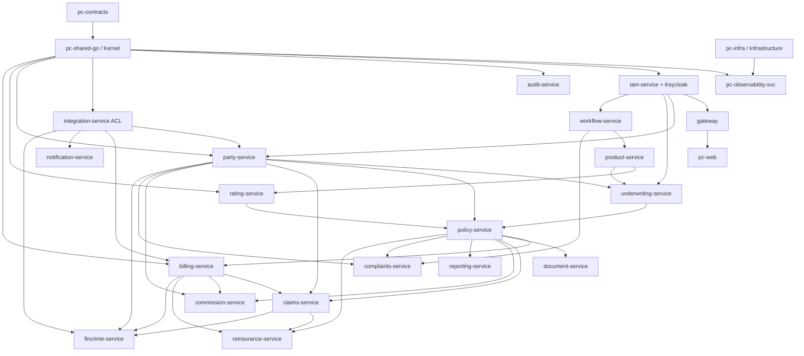

# Medhen Platform — Service Registry

**Document ID:** MDH-SVC-REG-001 · **Version:** 1.0 · **Date:** July 2026 · **Status:** Draft
**Companions:** [Capability Document](./Medhen-Platform-Capability-Document.md) · [PRD](./Medhen-Platform-PRD.md) · [Implementation Plan](./implementation_plan.md) (MDH-IMPL-001 — Active)

> This registry is the **execution source of truth** for build order, dependencies, priority, and phase of every Medhen service. The platform is **full multi-repo microservices from inception** (no monolith/modular-first stage — see [Cap doc §5.5](./Medhen-Platform-Capability-Document.md#55-microservices-from-inception)); each Bounded Context is an independently deployable service in its own repo with its own database, integrating only via published ports (gRPC/REST) and events (Kafka).

---

## Legend

| Field | Values |
|---|---|
| **Order** | Global recommended build sequence (dependency-driven) |
| **Wave** | Build wave (W0 platform → W4 insight) |
| **BC** | Bounded Context (`BC-MDH-01…20`); `—` = supporting repo, not a BC |
| **Tier** | `Tier-0` (regulatory/financial/hot-path), `Tier-1` (operationally critical), `Tier-2` (async/advisory), `Lib` (library/SDK) |
| **Priority** | `P0` = platform-critical / blocking · `P1` = core business · `P2` = later-phase |
| **Phase** | `0` Pilot MVP · `1` Motor production · `2` Life · `3` Commercial · `4` Specialty+AI |
| **Pilot** | `Y` in Phase 0 demo set · `~` partial/minimal in Phase 0 · `N` post-pilot |
| **Dep type** | `sync` (gRPC, hard runtime dep) · `evt` (Kafka event, async) · `lib` (compile-time) |

---

## Service Naming Convention

The platform is named **Medhen** (built for EIC). Its core is a **product-agnostic, reusable insurance substrate** shared by every line of business. Service names are **vendor-neutral** — they carry no customer brand — and end with the **`-svc`** suffix.

**Suffix convention (2026-07-06):** every runnable service repo ends in **`-svc`** (e.g., `pc-party-mgmt-svc`), *not* `-service`. Non-service repos keep their descriptive names (`pc-contracts`, `pc-shared-go`, `pc-infra`, `pc-gateway`, `pc-web`). Databases follow `pc_{context}_db` and event topics `pc.{domain}.{event}.v{n}` — these use the **bounded-context/domain token** (e.g., `party`), which is independent of the service repo name, so `pc-party-mgmt-svc` owns `pc_party_db` and emits `pc.party.*`.

| Prefix | Meaning | Reusable across insurers? | Examples |
|---|---|---|---|
| **`pc-`** | **Platform-Core** service — product-agnostic shared-substrate service within the Medhen platform, shared by all lines of business and reusable across deployments | Yes | `pc-party-mgmt-svc`, `pc-policy-svc`, `pc-billing-svc`, `pc-shared-go` |
| **`{xx}-`** | **Product-specific** service — logic unique to one line of business, beyond what the Kernel extension config covers | Yes (per LOB) | `mo-telematics-svc`, `li-medical-uw-svc` |

**Product (LOB) prefix codes** for `{xx}-` services:

| Code | LOB | Code | LOB |
|---|---|---|---|
| `mo` | Motor | `en` | Engineering |
| `li` | Life | `wc` | Workmen's Compensation |
| `pr` | Property / Fire | `bo` | Bonds & Guarantees |
| `ma` | Marine | `ah` | Accident & Health |
| `lb` | Liability | `tr` | Travel |

**Rules:**

1. Anything genuinely product-agnostic is `pc-` — this is the default and covers all 20 Bounded Contexts.
2. Most LOB specifics are **configuration/plugins** loaded by the Kernel (`pc-shared-go` / `BC-MDH-20`), **not** separate services. Create a `{xx}-` service only when a line of business needs bespoke runtime logic that does not fit the extension contract (e.g., motor telematics ingestion, life medical-underwriting integration).
3. `{xx}-` services depend on `pc-` services through the same published ports/events — never the reverse. Platform Core never depends on a product service.

> **Platform vs deployment.** The platform is **Medhen** (no de-branding — it is built for EIC). The `pc-` prefix marks the **product-agnostic Platform-Core (shared-substrate) services** within the Medhen platform; it does **not** denote a separate product of which Medhen is merely a deployment. Service names remain **vendor-neutral** so the same core is reusable across insurers: **service, database, and topic names carry no customer brand**, while deployment-specific values (Keycloak realm, `tenant_id`, document letterheads, policy-number prefix `EIC/…`) carry the customer identity. (Databases: `pc_{context}_db`; event topics: `pc.{domain}.{event}.v{n}`.)

---

## Master Service Registry (by build order)

| # | Service (repo) | BC | Tier | Priority | Phase | Pilot | Depends On |
|---|---|---|---|---|---|---|---|
| 1 | `pc-contracts` (contracts: protobuf/gRPC, Avro event schemas, OpenAPI) | — | Lib | P0 | 0 | Y | — |
| 2 | `pc-shared-go` (Kernel primitives: events, outbox, idempotency, i18n, ETB money, Ge'ez calendar, middleware) | BC-MDH-20 | Lib | P0 | 0 | Y | `pc-contracts` (lib) |
| 3 | `pc-infra` (Docker Compose, K8s, Kafka/PG/Redis/MinIO, Prometheus/Grafana/Jaeger = observability stack) | BC-MDH-19 | Lib | P0 | 0 | Y | — |
| 4 | `pc-observability-svc` (OTel Collector, Mimir tenant provisioning, Loki/Tempo config, Grafana dashboards + SLO rules) | BC-MDH-21 | Tier-1 | P0 | 0 | Y | infra (lib), shared-go (lib) |
| 5 | Keycloak + `pc-iam-svc` | BC-MDH-16 | Tier-0 | P0 | 0 | Y | shared-go (lib) |
| 6 | `pc-audit-svc` | BC-MDH-17 | Tier-0 | P0 | 0 | ~ | shared-go (lib); all services (evt) |
| 7 | `pc-integration-svc` (ACL: Telebirr/CBE/Amole, ERP, Fayda, SMS) | BC-MDH-18 | Tier-0 | P0 | 0 | Y | shared-go (lib) |
| 8 | `pc-gateway` (BFF, routing, rate-limit, token validation) | — | Tier-0 | P0 | 0 | Y | iam (sync) |
| 9 | `pc-party-mgmt-svc` | BC-MDH-01 | Tier-0 | P0 | 0 | Y | iam (sync), integration/Fayda (sync, mocked in pilot), audit (evt) |
| 10 | `pc-product-defn-svc` | BC-MDH-02 | Tier-1 | P1 | 0 | Y (seed) | shared-go (lib), workflow (evt, soft), audit (evt) |
| 11 | `pc-rating-calc-svc` | BC-MDH-04 | Tier-0 | P0 | 0 | Y | product (sync), shared-go (lib) |
| 12 | `pc-underwriting-svc` | BC-MDH-05 | Tier-1 | P1 | 0 (STP) | Y | product (sync), party (sync) |
| 13 | `pc-policy-svc` | BC-MDH-03 | Tier-0 | P0 | 0 | Y | party (sync), product (sync), rating (sync), underwriting (sync), billing (evt/saga) |
| 14 | `pc-billing-svc` | BC-MDH-07 | Tier-0 | P0 | 0 | Y | integration/payments (sync), policy (evt), shared-go (lib) |
| 15 | `pc-document-mgmt-svc` | BC-MDH-08 | Tier-1 | P1 | 0 | Y | product/templates (sync), policy·billing·claims (evt), shared-go/i18n (lib), MinIO |
| 16 | `pc-notification-svc` | BC-MDH-10 | Tier-2 | P1 | 0 | Y | integration/SMS (sync), all services (evt) |
| 17 | `pc-workflow-svc` | BC-MDH-09 | Tier-1 | P1 | 1 | ~ | iam (sync) |
| 18 | `pc-claims-svc` | BC-MDH-06 | Tier-0 | P0 | 0 (fast-track) | Y | policy (sync), party (sync), billing (evt/saga), fincrime (evt, soft) |
| 19 | `pc-commission-svc` | BC-MDH-15 | Tier-1 | P1 | 1 | N | party (sync), policy (evt), billing (evt) |
| 20 | `pc-reporting-svc` | BC-MDH-11 | Tier-1 | P1 | 1 | N | all services (evt, read-side) |
| 21 | `pc-complaints-svc` | BC-MDH-13 | Tier-1 | P1 | 1 | N | party (sync), policy·claims (sync), workflow (sync) |
| 22 | `pc-reinsurance-svc` | BC-MDH-12 | Tier-1 | P2 | 2 | N | policy (evt), claims (evt), billing (evt) |
| 23 | `pc-fincrime-svc` | BC-MDH-14 | Tier-0 | P1 | 2 (screening hook in 1) | N | party (sync), claims (evt), billing (evt), integration/lists (sync) |
| 24 | `pc-web` (Next.js — customer/agent/staff/admin portals) | — | Frontend | P0 | 0 | Y (incremental) | gateway (sync); consumes all pilot service APIs |

> **Note on service count.** 21 Bounded Contexts + 3 supporting repos (`pc-contracts`, `pc-gateway`, `pc-web`). `pc-shared-go` realizes the Kernel (BC-MDH-20); `pc-infra` hosts infrastructure definitions (BC-MDH-19); `pc-observability-svc` manages the observability stack (BC-MDH-21). The [Implementation Plan repo list](./implementation_plan.md#repository-list) currently enumerates the 12 business services + infra repos; this registry is the authoritative superset including the newer governance/conduct BCs (Complaints, Fin-Crime, Commission, IAM, Audit, Integration, Observability, Kernel).

---

## Dependency Graph



*(Arrows show "enables / is depended on by." Event dependencies are async via Kafka; sync dependencies are gRPC.)*

---

## Build Waves

| Wave | Theme | Services | Rationale |
|---|---|---|---|
| **W0 — Platform foundations** | Contracts, shared libs, observability, identity, audit, integration, edge | `contracts`, `shared-go`, `infra`, `observability`, `iam`, `audit`, `integration`, `gateway` | Everything else depends on these; must land first (critical path); observability needed for tracing all services |
| **W1 — Contract core** | Quote-to-issue | `party`, `product`, `rating`, `underwriting`, `policy` | The core insurance lifecycle; enables the buy journey |
| **W2 — Financial & servicing** | Money-in & documents | `billing`, `document`, `notification`, `workflow` | Payments, issuance documents, customer comms, approvals |
| **W3 — Claims & money-out** | Claims & distribution economics | `claims`, `commission` | Settlement journey; producer economics |
| **W4 — Risk & insight** | Portfolio, conduct, governance | `reporting`, `reinsurance`, `complaints`, `fincrime` | Read-side analytics, risk transfer, conduct, financial crime |
| **(continuous)** | Frontend | `web` | Built incrementally against each wave's APIs |

---

## Phase 0 — Pilot MVP Build Order (the demo subset)

The Phase 0 pilot builds **only the services the Motor buy→claim demo exercises**, in this dependency order. Full-platform services not listed here are deferred to Phase 1+.

| Step | Service | Pilot scope |
|---|---|---|
| 1 | `pc-contracts` | Contracts for pilot services + events |
| 2 | `pc-shared-go` | Events, outbox, idempotency, i18n (en/am), ETB money, Ge'ez calendar |
| 3 | `pc-infra` | Docker Compose (PG, Kafka, Redis, MinIO, Keycloak) + static definitions |
| 4 | `pc-observability-svc` | OTel Collector, Mimir/Loki/Tempo provisioning, Prometheus config, Grafana dashboards + SLO rules |
| 5 | `pc-iam-svc` + Keycloak | Basic auth + a few roles |
| 6 | `pc-audit-svc` | Basic immutable trail |
| 7 | `pc-integration-svc` | Telebirr sandbox + SMS (+ Fayda mock) |
| 8 | `pc-gateway` | Routing + token validation |
| 9 | `pc-party-mgmt-svc` | Register individual + basic KYC upload |
| 10 | `pc-product-defn-svc` | Seed one Motor product (config, no full lifecycle UI) |
| 11 | `pc-rating-calc-svc` | Motor premium + VAT/stamp duty |
| 12 | `pc-underwriting-svc` | Auto-accept STP |
| 13 | `pc-policy-svc` | Quote → bind → issue |
| 14 | `pc-billing-svc` | Telebirr sandbox payment + receipt (single premium) |
| 15 | `pc-document-mgmt-svc` | Schedule + COI + QR sticker, bilingual |
| 16 | `pc-notification-svc` | SMS/email on bind + settle |
| 17 | `pc-claims-svc` | Mobile FNOL → fast-track settlement |
| 18 | `pc-web` | Portal screens for the above (incremental) |

Aligned to milestones **M0** (steps 1–9 foundations + observability + party/product seed), **M1** (steps 10–16 buy journey), **M2** (step 17 + claim/story + deploy), **M3** (polish). See [PRD §34.1](./Medhen-Platform-PRD.md#341-phase-0--pilot-mvp-detail).

---

## Machine-Readable Registry (YAML)

```yaml
# Medhen service registry — execution truth. order = build sequence.
services:
  - id: proto,        repo: pc-contracts,               bc: null,       tier: lib,    priority: P0, phase: 0, pilot: true,  order: 1,  depends_on: []
  - id: kernel,       repo: pc-shared-go,           bc: BC-MDH-20,  tier: lib,    priority: P0, phase: 0, pilot: true,  order: 2,  depends_on: [proto]
  - id: infra,        repo: pc-infra,               bc: BC-MDH-19,  tier: lib,    priority: P0, phase: 0, pilot: true,  order: 3,  depends_on: []
  - id: observability, repo: pc-observability-svc,  bc: BC-MDH-21,  tier: 1,      priority: P0, phase: 0, pilot: true,  order: 4,  depends_on: [infra, kernel]
  - id: iam,          repo: pc-iam-svc,         bc: BC-MDH-16,  tier: 0,      priority: P0, phase: 0, pilot: true,  order: 5,  depends_on: [kernel]
  - id: audit,        repo: pc-audit-svc,       bc: BC-MDH-17,  tier: 0,      priority: P0, phase: 0, pilot: partial, order: 6, depends_on: [kernel]
  - id: integration,  repo: pc-integration-svc, bc: BC-MDH-18,  tier: 0,      priority: P0, phase: 0, pilot: true,  order: 7,  depends_on: [kernel]
  - id: gateway,      repo: pc-gateway,             bc: null,       tier: 0,      priority: P0, phase: 0, pilot: true,  order: 8,  depends_on: [iam]
  - id: party,        repo: pc-party-mgmt-svc,       bc: BC-MDH-01,  tier: 0,      priority: P0, phase: 0, pilot: true,  order: 9,  depends_on: [iam, integration, audit]
  - id: product,      repo: pc-product-defn-svc,     bc: BC-MDH-02,  tier: 1,      priority: P1, phase: 0, pilot: true,  order: 10, depends_on: [kernel]
  - id: rating,       repo: pc-rating-calc-svc,      bc: BC-MDH-04,  tier: 0,      priority: P0, phase: 0, pilot: true,  order: 11, depends_on: [product]
  - id: underwriting, repo: pc-underwriting-svc, bc: BC-MDH-05, tier: 1,      priority: P1, phase: 0, pilot: true,  order: 12, depends_on: [product, party]
  - id: policy,       repo: pc-policy-svc,      bc: BC-MDH-03,  tier: 0,      priority: P0, phase: 0, pilot: true,  order: 13, depends_on: [party, product, rating, underwriting, billing]
  - id: billing,      repo: pc-billing-svc,     bc: BC-MDH-07,  tier: 0,      priority: P0, phase: 0, pilot: true,  order: 14, depends_on: [integration, policy]
  - id: document,     repo: pc-document-mgmt-svc,    bc: BC-MDH-08,  tier: 1,      priority: P1, phase: 0, pilot: true,  order: 15, depends_on: [product, policy, kernel]
  - id: notification, repo: pc-notification-svc, bc: BC-MDH-10, tier: 2,      priority: P1, phase: 0, pilot: true,  order: 16, depends_on: [integration]
  - id: workflow,     repo: pc-workflow-svc,    bc: BC-MDH-09,  tier: 1,      priority: P1, phase: 1, pilot: partial, order: 17, depends_on: [iam]
  - id: claims,       repo: pc-claims-svc,      bc: BC-MDH-06,  tier: 0,      priority: P0, phase: 0, pilot: true,  order: 18, depends_on: [policy, party, billing]
  - id: commission,   repo: pc-commission-svc,  bc: BC-MDH-15,  tier: 1,      priority: P1, phase: 1, pilot: false, order: 19, depends_on: [party, policy, billing]
  - id: reporting,    repo: pc-reporting-svc,   bc: BC-MDH-11,  tier: 1,      priority: P1, phase: 1, pilot: false, order: 20, depends_on: [all-events]
  - id: complaints,   repo: pc-complaints-svc,  bc: BC-MDH-13,  tier: 1,      priority: P1, phase: 1, pilot: false, order: 21, depends_on: [party, policy, claims, workflow]
  - id: reinsurance,  repo: pc-reinsurance-svc, bc: BC-MDH-12,  tier: 1,      priority: P2, phase: 2, pilot: false, order: 22, depends_on: [policy, claims, billing]
  - id: fincrime,     repo: pc-fincrime-svc,    bc: BC-MDH-14,  tier: 0,      priority: P1, phase: 2, pilot: false, order: 23, depends_on: [party, claims, billing, integration]
  - id: web,          repo: pc-web,                 bc: null,       tier: frontend, priority: P0, phase: 0, pilot: true, order: 24, depends_on: [gateway]
```

---

*End of Service Registry v1.0. Maintained alongside the [Capability Document](./Medhen-Platform-Capability-Document.md) and [PRD](./Medhen-Platform-PRD.md); update on any BC/service addition without renumbering existing IDs.*
