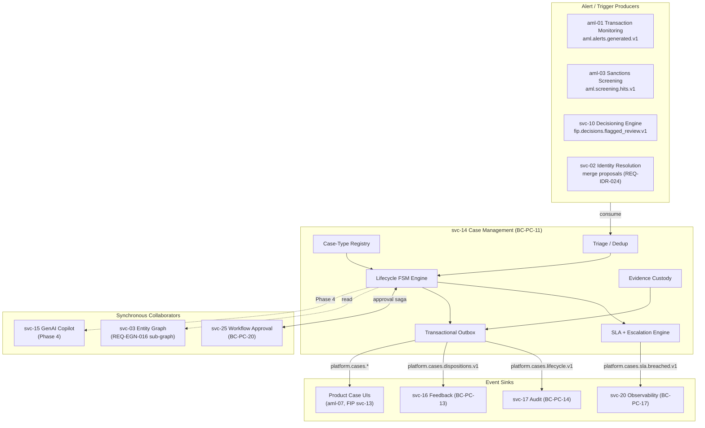
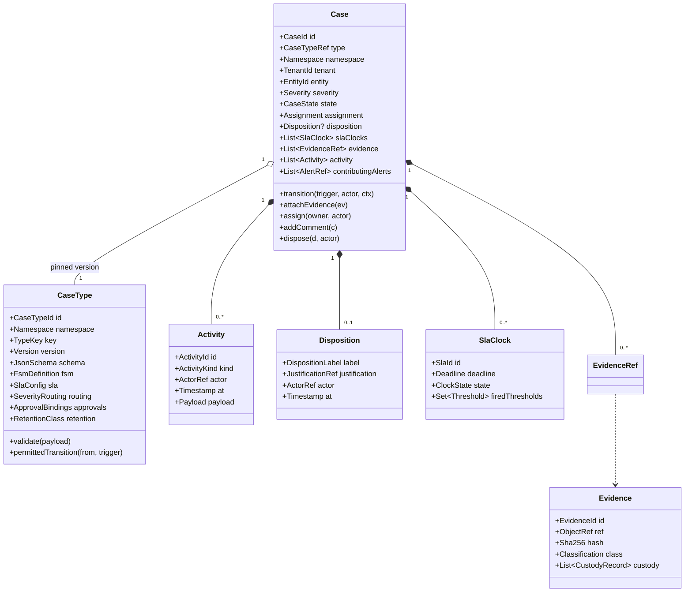
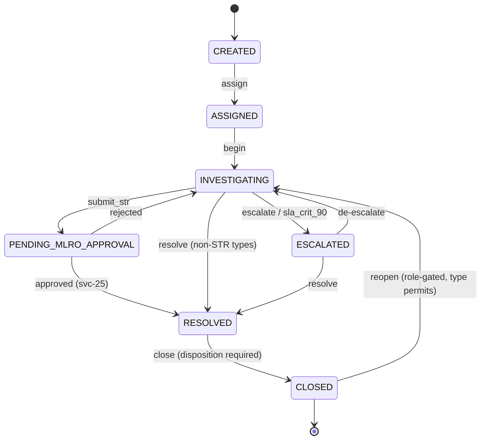
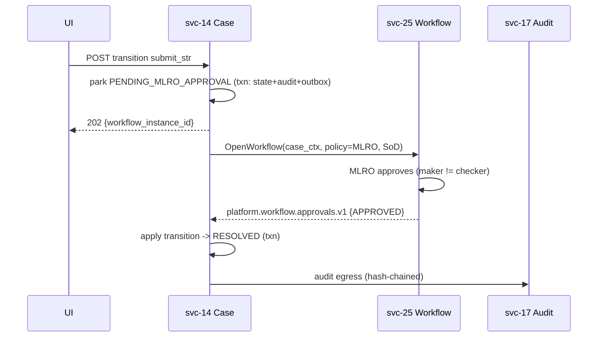
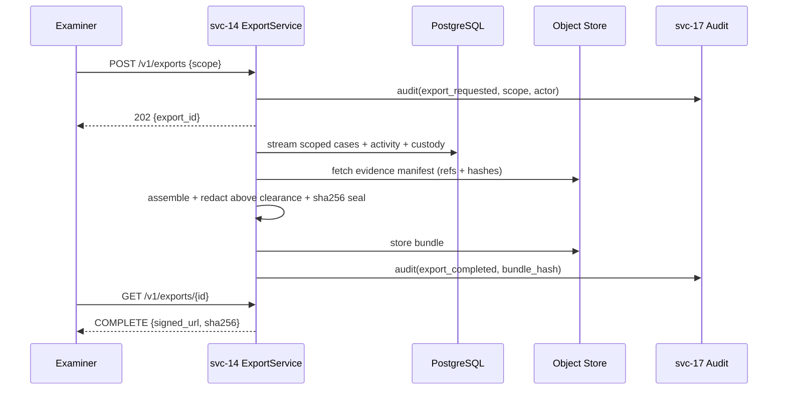
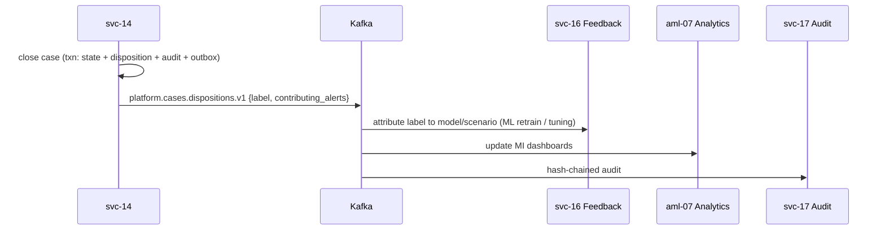
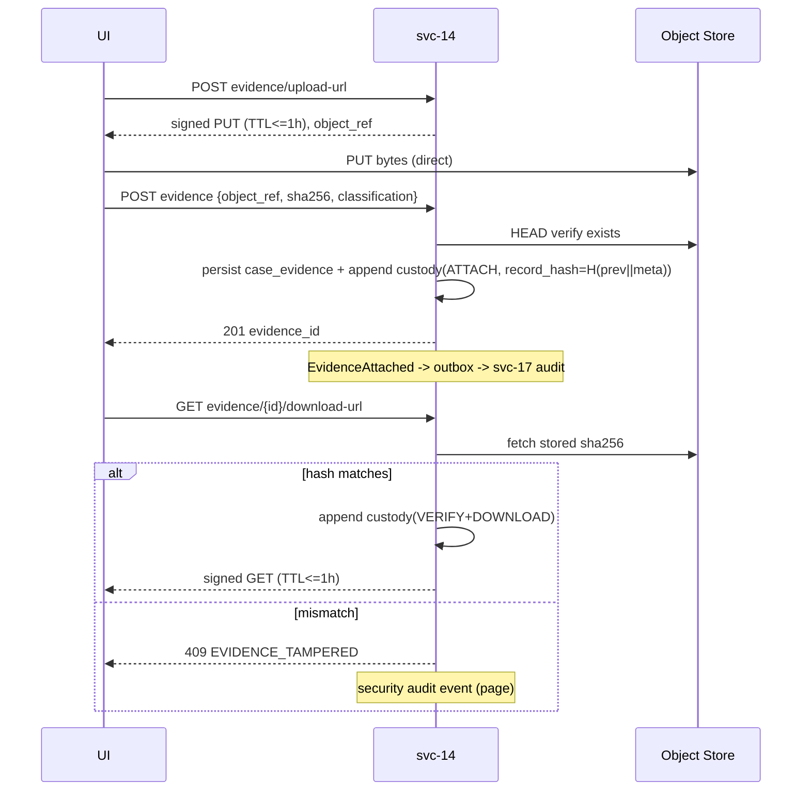

> [!IMPORTANT]
> **REFERENCE EXEMPLAR** — from InnoGuard (financial-crime domain). Referenced for STRUCTURE ONLY. Do not copy domain content. Supersede with this product's own reference SSD as soon as one is signed off.

# svc-14: Case Management Service Specification (v2)

| Field | Detail |
|:------|:-------|
| **Document ID** | IG-SVC-SPEC-PC-14-v2 |
| **Service ID** | `svc-14` |
| **Service Name** | Case & Investigation Management |
| **Bounded Context** | `BC-PC-11` — Case & Investigation Management |
| **Version** | 2.3 |
| **Status** | Signed-off Tier-1 |
| **Date** | 2026-07-04 |
| **Classification** | Internal — Confidential |
| **Tier** | Tier-1 (Tier-0 for AML — regulatory deadlines) |
| **Deploy Mode** | Microservice (`pc-case-investigation-mgmt-svc`) |
| **Target Repo** | `Platform Core/dev/pc-case-investigation-mgmt-svc` |
| **Slice** | `S-PC-01-G1` (gap G-1 closure: spec sign-off → build) |
| **Gap** | **G-1 — CRITICAL** (blocks AML Phase 1 GA and FIP Phase 1 GA) |
| **Supersedes** | [`svc-14-case-management-spec.md`](./svc-14-case-management-spec.md) (placeholder stub — no Tier-1 content) |
| **PRD Anchor** | [Platform Core PRD §17 BC-PC-11](../prd/InnoGuard-Platform-Core-PRD.md) (`REQ-CSM-*`) |
| **Capability Anchor** | [Capability Doc BC-PC-11](../capability/InnoGuard-Platform-Capability-Document.md#bc-pc-11--case--investigation-management-svc-14) |
| **Consumer PRDs** | [AML PRD §15 BC-AML-X1](../../../AML/docs/prd/InnoGuard-AML-PRD.md) (`REQ-TXM-*`, `REQ-CRA-*`, `REQ-SRM-*`, `REQ-SPS-*`, `REQ-UBR-*`, `REQ-RFG-*`) · [FIP PRD §12 BC-FIP-X1](../../../FIP/docs/prd/InnoGuard-FIP-PRD.md) (`REQ-INV-*`) |
| **Methodologies** | DDD · Hexagonal · EDA · CQRS-lite · Transactional Outbox · FSM-driven lifecycle · Saga (workflow approval) |
| **Companion Specs** | [`svc-25`](./svc-25-workflow-approval-spec.md) workflow approval · [`svc-17`](./svc-17-compliance-audit-spec.md) audit · [`svc-16`](./svc-16-feedback-loop-spec.md) feedback · [`svc-15`](./svc-15-genai-spec.md) GenAI copilot (Phase 4) · [`svc-03`](./svc-03-entity-graph-network-intelligence-spec.md) graph context · [`svc-02`](./svc-02-identity-resolution-spec-v2.md) entity backbone |

**Revision history**

| Version | Date | Summary |
|:---|:---|:---|
| 0.1 | 2026-05-22 | Placeholder stub — scope summary + authoring plan only (gap G-1 flagged CRITICAL) |
| 2.0 | 2026-06-08 | Full Tier-1 comprehensive spec — all 13 sections + Appendices A–G. Authored against PRD v2 §17 (`REQ-CSM-001…017`, `REQ-CSM-A1…A4`), Capability Doc BC-PC-11, AML PRD (6 case types, STR 24h SLA), FIP PRD (4 case types). FSM lifecycle, product-scoped case-type registry, evidence chain-of-custody, SLA escalation engine, XPI correlation, disposition→FBL, audit egress. Signed off for `S-PC-01-G1`. |
| 2.1 | 2026-06-29 | **Tier-1 parity hardening pass** to full `svc-06-v2` structural rigor. §1: Product-Context, Business-Context, Supported-Actors, Phase/MVP tables; Bounded-Context as 4-col table. §2: Configuration Reference, outbox DDL, CQRS-lite split, version pins. §3: traceability matrix gains BDD + Spec-§ columns and inline consumer REQs; reference sub-tables (3.1.2a FSM, 3.1.5a SLA, 3.1.13a event→topic). §4: event ordering/correlation, port contract signatures + transaction semantics, domain-service pre/post-conditions, UoW transaction-boundary matrix + optimistic-lock SQL, domain-exception taxonomy, hexagonal layer/project-structure/tech-mapping/testing-boundary tables. §5: consolidated endpoint table, gRPC SLA/consumer table, idempotency key-patterns + storage schema, versioning/deprecation policy, gRPC error mapping. §6: When/partition-count columns, audit topic, retention/compaction, registry config + evolution workflow, DLQ policy + replay. §7: +18 scenarios (degradation 52–58, edge 59–65, perf/SLO 66–69) → **69 total**. §8: PII/data-classification catalog. §9: timeout/circuit-breaker/retry matrix + dependency-health monitoring. §10: load-testing table, Tier/measurement SLO columns, regulatory mapping. §11: Golden-Signals metrics, PromQL, hierarchical trace spans, per-domain log fields, dashboard panels, burn-rate alerts. §12: 14 runbooks with copy-paste SQL/CLI. §13: sign-off stakeholder matrix. Appendices: per-type regulatory anchors (B), pipeline timing budgets (E), test-hook column + consumer rows (G). |

**Quality gates (v2.3, achieved):** §3 ≥ 640 lines · §4 ≥ 620 lines · document ≥ 4,500 lines · **90 positive functional requirements** + **23 negative requirements (`FR-CSM-NEG-*`)** as normative prose (213 SHALL · 39 SHALL NOT · 15 MUST NOT · graded SHOULD/MAY) with operands + inline error semantics + I/O + BDD acceptance refs · exhaustive typed field contracts (all endpoints §5.1c), Avro field dictionaries (all schemas §6.6f), and table column dictionaries (all tables §8.3.2) · ≥ 69 BDD scenarios (incl. per-case-type regulatory-critical, degradation, edge-case, performance/SLO) · all P0 `REQ-CSM-*` decomposed into `FR-CSM-*` and traceable in Appendix G (with test hooks) · **all 10 v1 case types fully defined** (FSM + JSON Schema + SLA + routing) in Appendix A (A.1–A.20) · AML `REQ-TXM-042`/`REQ-CRA-010`/`REQ-CRA-020`/`REQ-IDR-024` and FIP `REQ-INV-*` consumer anchors as first-class traceability rows. Depth parity with the deepest house specs (`svc-07-v2`/`svc-01-v2`): prose FRs, per-aggregate DDD treatment, entity/VO decision matrix, typed API/event/DDL field contracts, and the reference-service (`pc-rules-management-svc`) package layout.

**FSM note:** The base lifecycle is `CREATED → ASSIGNED → INVESTIGATING → ESCALATED → RESOLVED → CLOSED`; per-case-type FSMs specialise this canonical chain with additional gates (e.g., `PENDING_MLRO_APPROVAL` for STR). The canonical state/trigger vocabulary is §3.1.2a, the aggregate model is §4.4, and the consolidated transition matrix is Appendix F.

| 2.2 | 2026-07-02 | **Depth-hardening pass** to deepest-house-spec (`svc-07`/`svc-01`) rigor. **Phase 0 correctness:** renamed target repo/module to `pc-case-investigation-mgmt-svc` (was `pc-case-management-svc`); replaced §4.17 folder tree with the real reference-service (`pc-rules-management-svc`) DDD-building-block layout + module path. **§3:** all 90 FRs rewritten from terse 2-col tables into normative prose SHALL/MUST clusters (intent + atomic clauses + operands + inline errors + I/O + BDD acceptance); promoted the former §3.6 supplementary FRs into their home sections; §3.7 glossary → §3.6. **§4:** per-aggregate command tables with pre/post-conditions + invariants + persistence for `Case`/`CaseType`; new `Evidence` aggregate (§4.3a); Entities subsection (§4.5a) + Entity-vs-VO decision matrix (§4.5b); typed VO field table; enriched domain-service table. **§5:** typed field contracts for core commands (§5.1b). **§6:** field dictionary for the lifecycle event. **§8:** column dictionary for `"case"` (§8.3.1). Document ~4,350 lines. |

| 2.3 | 2026-07-02 | **Completeness pass** — closed the residual gaps from the v2.2 self-audit. (1) **Prohibitions/negative requirements:** new §3.2a catalog of **23 `FR-CSM-NEG-*`** explicit `SHALL NOT`/`MUST NOT` clauses (data integrity, approval/lifecycle, immutability/retention, evidence, tenancy/ABAC/privacy, triage/SLA/registry) + sharpened `MUST NOT` in §4/§6 → 39 SHALL NOT, 15 MUST NOT. (2) **Exhaustive field/column dictionaries:** typed field contracts for **all** REST endpoints (§5.1c), field dictionaries for **all** produced + consumed Avro schemas (§6.6f), column dictionaries for **all** tables (§8.3.2). (3) **Graded optionality:** `SHOULD`/`MAY` applied to notification delivery, replica reads, and search backing. ~4,520 lines. |
| 2.3 (amended) | 2026-07-04 | **Architect-review internal-consistency pass (F1–F14).** Resolved 14 cross-section contradictions; additive/clarifying, no new scope. **Rulings:** **F1** disposition gate is **CLOSED** — `disposition_required=true` ⇒ disposition MUST be set before `CLOSED`; `RESOLVED` is pre-terminal and does not require it; set-once/immutable once `CLOSED` (aligns §1.6→INV-CSM-5 per F12, §3.1.2a, FR-CSM-FSM-6, WT-1). **F3** read-only examination case types (e.g. `aml.regulatory_exam`) MAY go `INVESTIGATING → CLOSED` (skip `RESOLVED`); FR-CSM-FSM-1/REG-2 relaxed for examiner types (matches A.17 + App. F). **F10** OpenSearch search is **Phase 3** (fixed the lone §1.9 outlier). **F11** investigator collaboration (`REQ-CSM-014`, BDD-35/36) is **Phase 2**; search/export (`REQ-CSM-006/007`) stays Phase 1 (CAP-CSM-007 row annotated as split). **Alignments:** **F2** approval park state is `PENDING_*_APPROVAL` everywhere (`WAIT` was never an FSM state) — §1.9/§9/BDD-23/54 corrected. **F4** canonical event names `CaseDispositioned` + `SlaBreached` (matching the domain services + topics); §4.6 catalog realigned. **F5** added `LINKED` to the Avro `LifecycleKind` enum (triage emits `CaseLinked`). **F6** added `causation_id` as an Avro lifecycle field (was FR-required but schema-absent). **F7** §2.3 outbox DDL realigned to the authoritative §8.3 shape (`topic`/`partition_key`/`payload`/`headers`). **F8** case-type field is `retention` (enum type `retention_class`) — FR-CSM-REG-1 reconciled to the fixtures/§8.3/App. D. **F9** added `disposition_required` + `max_linked_alerts` columns to the §8.3 `case_type` DDL (+dictionary). **F12** §1.6 reworded to "immutable once `CLOSED`" (INV-CSM-5). **F13** Appendix G ranges updated (FSM-1..9, QUE-1..6, EVD-1..7, EXP-1..5). **F14** BDD-45 re-pointed to `FR-CSM-FSM-8`/`FR-CSM-TRG-5`/§5.7 (the phantom `FR-CSM-IDEM` removed). |

**Registry:** [`Shared/docs/roadmap/service-status.yaml`](../../../Shared/docs/roadmap/service-status.yaml) updated to `spec_version: "2.3"`, `spec_status: signed-off`.

---

## Document Structure Overview

1. **Service Overview**
2. **Technology Stack**
3. **Functional Requirements**
4. **Domain Model & Events (Tactical DDD)**
5. **API Specifications**
6. **Event Schemas & Contracts (Avro)**
7. **Behaviour-Driven Scenarios (BDD)**
8. **Data Ownership & Persistence**
9. **Integration & Dependency Contracts**
10. **Non-Functional Requirements & SLOs**
11. **Observability Specification**
12. **Operational Runbooks**
13. **Engineering Definition of Done (DoD)**

**Appendices:** [A Case-Type Catalog](#appendix-a--case-type-catalog-10-types) · [B AML/FIP Namespace Mapping](#appendix-b--amlfip-namespace--retention-mapping) · [C Cross-References](#appendix-c--document-cross-references) · [D Case-Type Schema JSON Schema](#appendix-d--case-type-registration-json-schema) · [E Evidence Chain-of-Custody Pipeline](#appendix-e--evidence-chain-of-custody-pipeline) · [F FSM Transition Matrix](#appendix-f--fsm-transition-matrix) · [G REQ-CSM Traceability Index](#appendix-g--req-csm-traceability-index)

---

## 1. Service Overview

### 1.1 Mission Statement

`svc-14` Case & Investigation Management (`BC-PC-11`) is the **product-agnostic case-management substrate** of InnoGuard Platform Core. It is the single shared framework on which every investigation across every product runs: AML cases (6 types), FIP fraud cases (4 types), KYC cases (future), and joint FRAML cases. No product builds its own case store, lifecycle engine, queue, SLA timer, or evidence vault — they register a **case type** with `svc-14` and consume the generic substrate through API and events.

The service owns five hard responsibilities that must be identical across products to remain regulator-defensible:

1. **Case lifecycle** — a finite-state machine per case type, specialised from the canonical chain `CREATED → ASSIGNED → INVESTIGATING → ESCALATED → RESOLVED → CLOSED`, with every transition guarded, timestamped, actor-attributed, and audited.
2. **Evidence chain of custody** — immutable, hash-recorded attachment of documents, screenshots, and decision traces with tamper detection, satisfying examination requirements under NBE supervision and FATF R.11/R.34.
3. **SLA tracking and escalation** — per-case-type deadline clocks (e.g., AML STR 24h, sanctions HIGH 4h) with multi-tier escalation at 50% / 75% / 90% of the deadline, the mechanism by which the platform guarantees the BO-4 STR-filing SLA.
4. **Workflow integration** — case-level approvals (STR sign-off, false-positive suppression, tier override, entity merge) routed through `BC-PC-20` Workflow Approval (`svc-25`) with separation-of-duties (SoD) and maker-checker enforced.
5. **Audit egress and disposition** — every case event published hash-chained to `BC-PC-14` Audit (`svc-17`), and a final disposition label (`TRUE_POSITIVE` / `FALSE_POSITIVE` / `INCONCLUSIVE`) emitted to `BC-PC-13` Feedback (`svc-16`) on closure to close the ML feedback loop.

> **Why this is a CRITICAL gap (G-1).** AML cannot file an STR or CTR, dispose a sanctions hit, or answer a regulator examination without a case; FIP cannot triage a fraud alert or feed a disposition back to its ML cycle without a case. `svc-14` is therefore on the critical path for **both** AML Phase 1 GA and FIP Phase 1 GA. It is Tier-1 platform-wide and **Tier-0 for AML** because STR deadlines are statutory (Proclamation 780/2013 art. 5(8)).

### 1.2 Product Context (Must-Include)

`svc-14` is a shared substrate: each product registers a namespaced set of **case types** and consumes the identical lifecycle, evidence, SLA, and audit machinery. The substrate is product-agnostic; only the case-type *definitions* (schema, FSM specialisation, SLA values, routing) are product-owned.

| Product | Namespace | Case types (v1) | Phase 1 obligation | Producers / consuming UI | Key REQs |
|:---|:---|:---|:---|:---|:---|
| **Platform** | Registry for all namespaces; shared substrate | — (engine, not types) | Lifecycle FSM, evidence custody, SLA engine, outbox, audit egress, maker-checker | all products | `REQ-CSM-*` |
| **AML** | `aml.*` | **6**: `aml.str_investigation`, `aml.ctr_review`, `aml.sanctions_hit`, `aml.pep_review`, `aml.ubo_verification`, `aml.regulatory_exam` | STR filing ≤ **24h** (Tier-0, Proc. 780/2013), sanctions HIGH disposition ≤ **4h**, examination export bundle | producers `aml-01` (alerts), `aml-03` (screening); UI `aml-07` | `REQ-TXM-042`, `REQ-CRA-010`/`020`, `REQ-SRM-*`, `REQ-IDR-024` |
| **FIP** | `fip.*` | **4**: `fip.fraud_investigation`, `fip.ato_investigation`, `fip.mule_network`, `fip.chargeback` | Fraud disposition → ML feedback loop; FRAML cross-product correlation (XPI) | producer `svc-10` (decisioning), `svc-03` (graph signal); UI FIP `svc-13` | `REQ-INV-*`, `REQ-EGN-016` |
| **KYC** (Phase 3+) | `kyc.*` — license flag `product.kyc.enabled` | additive (e.g. `kyc.onboarding_review`, `kyc.periodic_review`) | Additive namespace registration; existing `aml.*` / `fip.*` unaffected | planned | `REQ-LIC-*` (license gate), `CAP-CSM-009` |

**Fully-qualified case type naming convention:**

```
<namespace>.<type_key>

Examples:
  aml.str_investigation      ← AML STR, Tier-0, 24h SLA
  aml.sanctions_hit          ← real-time screening hit, HIGH 4h
  fip.fraud_investigation    ← FIP decisioning flagged_review
  fip.mule_network           ← graph/network signal
  kyc.periodic_review        ← Phase 3+, requires product.kyc.enabled
```

**Cross-namespace ABAC (`INV-CSM-8`):** An actor with `aml.*` grants SHALL NOT read, mutate, or be assigned `fip.*` cases (and vice versa) unless explicitly granted; cross-namespace actions are double-audited. Enforced via `svc-19` ABAC namespace policies. Case types are gated by product license (`product.aml.enabled`, `product.fip.enabled`, future `product.kyc.enabled`); an unlicensed namespace can neither register types nor create cases.

### 1.3 Business Context

| Aspect | Description |
|:-------|:------------|
| **Problem** | Financial-crime investigation is the regulator-facing endpoint of the platform: STRs must be filed within statutory deadlines, sanctions hits disposed in hours, and every action defensibly evidenced. Without a shared, governed case substrate each product would build divergent, non-auditable workflows — a regulatory and operational liability. |
| **Value** | One regulator-defensible case lifecycle across products; guaranteed SLA tracking (STR ≤24h, sanctions HIGH ≤4h); tamper-evident evidence chain of custody; immutable audit egress to `BC-PC-14`; disposition → ML feedback loop closure; per-product ABAC isolation; examination-ready export. |
| **Stakeholders** | AML analysts & MLRO, FIP fraud analysts, supervisors/approvers, regulatory examiners (read-only), internal audit, Platform engineering, audit (`svc-17`), feedback/ML (`svc-16`). |

### 1.4 Business Capabilities Delivered

| Capability (CAP) | Description | Primary REQ | Phase |
|:---|:---|:---|:---|
| `CAP-CSM-001` | Case lifecycle FSM (canonical 6-state chain, per-type specialisation, guarded transitions, audit) | `REQ-CSM-001`, `REQ-CSM-002`, `REQ-CSM-010` | 1 |
| `CAP-CSM-002` | Product-scoped case-type registry (schema + FSM + SLA per type; `fip.*` / `aml.*` namespaces; per-product ABAC) | `REQ-CSM-001`, `REQ-CSM-011` | 1 |
| `CAP-CSM-003` | Alert triage + dedup (consolidate related alerts into one case via correlation keys; window-based dedup) | `REQ-CSM-003`, `REQ-CSM-012` | 1 |
| `CAP-CSM-004` | Evidence chain of custody (signed-URL upload, hash record, tamper detection, immutable custody log) | `REQ-CSM-004` | 1 |
| `CAP-CSM-005` | Workflow integration via `BC-PC-20` (STR sign-off, FP suppression, tier override, merge approval) | `REQ-CSM-005` | 1 (interim maker-checker), 2 (full `svc-25`) |
| `CAP-CSM-006` | SLA tracking + multi-tier escalation (per-type deadlines; 50/75/90% thresholds; breach events) | `REQ-CSM-013` | 1 |
| `CAP-CSM-007` | Investigator collaboration + search/export (comments, mentions, activity feed, RBAC-scoped search, bulk export) | `REQ-CSM-006`, `REQ-CSM-007` (search/export, **Phase 1**); `REQ-CSM-014` (collaboration — comments/mentions/activity feed, **Phase 2**) | 1 (search/export) · 2 (collaboration) |
| `CAP-CSM-008` | Case events publication (`platform.cases.*` lifecycle events via outbox) | `REQ-CSM-008` | 1 |
| `CAP-CSM-009` | Multi-product case types (6 AML + 4 FIP at v1) | `REQ-CSM-009` | 1–2 |
| `CAP-CSM-010` | Cross-product case correlation (XPI — FRAML bundle-only) | `REQ-CSM-015` | 3 |
| `CAP-CSM-011` | Case-level disposition labels → `BC-PC-13` Feedback | `REQ-CSM-016` | 1 |
| `CAP-CSM-012` | Audit egress to `BC-PC-14` (hash-chained, retention class per product) | `REQ-CSM-017` | 1 |
| `CAP-CSM-A1` | GenAI investigation copilot integration (summarise, suggest actions, related cases) | `REQ-CSM-A1` | 4 |
| `CAP-CSM-A2` | ML-driven case auto-prioritisation (fraud score + AML risk + SLA pressure) | `REQ-CSM-A2` | 3 |
| `CAP-CSM-A3` | Investigator productivity analytics (time-to-disposition, FP rate per analyst) | `REQ-CSM-A3` | 3 |
| `CAP-CSM-A4` | Privacy-preserving cross-tenant cooperation (consortium) | `REQ-CSM-A4` | 4 |

### 1.5 In-Scope / Out-of-Scope Responsibilities

**In-Scope:**

* Generic case lifecycle and FSM engine; guarded, audited transitions
* Case-type registry, schema validation, and FSM specialisation validation
* Queue management and severity routing
* SLA clocks, pause/resume, and multi-tier escalation
* Evidence attachment, hashing, chain-of-custody, and tamper detection
* Comments / mentions / activity timeline
* Assignment and reassignment (single + bulk)
* Case-level approval orchestration via `svc-25`; maker-checker per case type
* Search, filter, reporting; bulk export for examination
* `platform.cases.*` event emission via transactional outbox
* Disposition labelling and emission to `BC-PC-13` Feedback
* Audit egress to `BC-PC-14`; retention class orchestration
* XPI cross-product (FRAML) correlation — bundle-only (Phase 3)

**Out-of-Scope:**

* Product-specific business logic (STR field validation lives in `aml-04`; fraud decisioning in `svc-10`)
* The workflow approval engine itself (`svc-25` / `BC-PC-20`)
* Alert generation (AML `aml-01`/`aml-03`, FIP `svc-10`)
* The audit ledger itself (`svc-17`)
* ML model training and scoring (`BC-PC-08`/`09`)
* The GenAI LLM gateway (`svc-15` — only the copilot surface integrated in Phase 4)
* The investigator web UI (product-owned; `svc-14` exposes API + events the UI renders)

### 1.6 Bounded Context Responsibilities (`BC-PC-11`)

`BC-PC-11` is the **sole owner** of the case domain. The following are owned exclusively by `svc-14` and may not be duplicated by any product:

| Owns | Exposes | Produces (via Outbox) | Invariants |
|:---|:---|:---|:---|
| `Case` aggregate & identity (`case_id`), lifecycle state, activity trail | REST command/query API + product UI backend | `platform.cases.lifecycle.v1` | A case is always in exactly one FSM state (`INV-CSM-1`) |
| `CaseType` registry (schema, FSM, SLA config, namespace) | Case-type registry API | `platform.cases.dispositions.v1` | Schema/FSM validated at registration; cases pin a type version (`INV-CSM-2`) |
| Evidence custody ledger & tamper-detection contract | gRPC read API (case, activity, context) | `platform.cases.evidence.v1` | Evidence is immutable; custody chain hash-linked (`INV-CSM-4`) |
| SLA clock semantics & escalation thresholds | Search / export API | `platform.cases.sla.breached.v1` | SLA escalation fires exactly-once per threshold (`INV-CSM-6`) |
| Canonical `platform.cases.*` event contracts (schema authority) | Triage/dedup consumer surface | `platform.cases.audit.v1` | No state change durable without co-committed audit row (`INV-CSM-3`) |
| Disposition vocabulary & feedback-emission contract | | | Disposition is set-once and **immutable once `CLOSED`** (`INV-CSM-5`); required before `CLOSED` when `disposition_required=true` (§3.1.2a, F1); cross-namespace double-audited (`INV-CSM-8`) |

Products own: case-type **definitions** they register (schema content, SLA values within platform-enforced bounds, FSM specialisation within platform-validated rules), their own UI, and their own upstream alert producers.

**Out of scope:** Product business logic (`aml-04`, `svc-10`), the workflow engine (`svc-25`), alert generation (`aml-01`/`svc-10`), the audit ledger (`svc-17`), ML scoring (`BC-PC-08`/`09`).

### 1.7 Context Map



### 1.8 Supported Actors and Service Consumers

| Actor / Consumer | Role | Interaction |
|:---|:---|:---|
| AML analyst | Investigate `aml.*` cases; draft STRs; dispose | REST command/query API (UI) |
| FIP fraud analyst | Investigate `fip.*` cases; dispose | REST command/query API (UI) |
| Senior analyst | Investigate + reassign within scope | REST API |
| Supervisor / team lead | Bulk reassign, override severity, manage queues | REST API |
| MLRO / approver | Approve STR filing, FP suppression, tier override | REST + MFA step-up via `svc-25` |
| Regulatory examiner | Read-only access + scoped export on `aml.regulatory_exam` | REST (read) + export bundle |
| Internal auditor | Read-only access to cases, activity, custody | REST (read) |
| Platform admin | Case-type registration, namespace onboarding | REST |
| `aml-01` / `aml-03` / `svc-10` | Alert/trigger producers | Kafka producers |
| `svc-25` Workflow Approval | Approval saga counterparty | gRPC + Kafka |
| `svc-03` Entity Graph | Sub-graph context provider | gRPC read |
| `svc-17` Audit | Audit egress sink | Kafka consumer |
| `svc-16` Feedback | Disposition label sink | Kafka consumer |
| `svc-19` IAM | AuthN/Z, namespace ABAC | OIDC + gRPC |
| `svc-20`/`svc-21` | Telemetry & dashboards | OTel + Prometheus |
| `svc-24` Idempotency SDK | Dedup on triage/commands | Embedded library |

### 1.9 Phase / MVP Status

| Phase | Slice | Scope |
|:---|:---|:---|
| **Phase 1** | `S-PC-01-G1` | Core FSM lifecycle, case-type registry (10 v1 types), triage/dedup, queues + severity routing, SLA clocks + escalation, evidence custody, interim maker-checker, search/filter, bulk export, `platform.cases.*` outbox, disposition → feedback, audit egress |
| **Phase 2** | G-3 | Full `svc-25` workflow saga (external approvals), optimistic-locking hardening, read-model projections at scale, investigator collaboration (comments/mentions/activity feed, `REQ-CSM-014`) |
| **Phase 3** | Enterprise | XPI cross-product (FRAML) correlation, **OpenSearch-backed search projection**, ML auto-prioritisation, investigator productivity analytics, KYC namespace (`kyc.*`), multi-tenant RLS hardening |
| **Phase 4** | Advanced | GenAI investigation copilot (`svc-15`), privacy-preserving cross-tenant consortium cooperation |

Introduced in **Phase 1** (`S-PC-01-G1`) as the case substrate on the critical path for both AML Phase 1 GA and FIP Phase 1 GA.

### 1.10 Deployment Stance

| Attribute | Value |
|:---|:---|
| Deploy mode | Microservice (`pc-case-investigation-mgmt-svc`) — extracted as a service from inception (not modular monolith) because it is consumed cross-product and carries Tier-0 AML obligations (see §1.11 ADR-PC-002) |
| Runtime | Go service (house standard, per `pc-telemetry-sdk` + `pc-idempotency-management-sdk` alignment) |
| Topology | Stateless API replicas (HPA) + leader-elected SLA scheduler + outbox relay sidecar |
| Data plane | PostgreSQL (case store, partitioned) · object store + signed URLs (evidence) · Kafka/Avro (events) |
| Multi-tenancy | Per-tenant row-level isolation + per-product ABAC; namespace-scoped case types (`aml.*`, `fip.*`) |
| Availability target | 99.95% (Tier-1); AML case types treated Tier-0 for regulatory-deadline paths |

### 1.11 Applicable ADRs

| ADR | Binding decision on svc-14 |
|:---|:---|
| [ADR-PC-001](../adrs/ADR-PC-001-architecture-style-ddd-hexagonal-eda.md) | DDD + hexagonal + EDA — `Case`/`CaseType` aggregates, ports/adapters, event-first emission |
| [ADR-PC-002](../adrs/ADR-PC-002-modular-before-microservices.md) | Microservice exception justified (cross-product + Tier-0) — see §1.10 |
| [ADR-PC-004](../adrs/ADR-PC-004-api-standards-grpc-rest.md) | REST for external/UI commands+queries; gRPC for internal read (case/context) |
| [ADR-PC-005](../adrs/ADR-PC-005-event-backbone-kafka-avro.md) | Kafka + Avro + Schema Registry for all `platform.cases.*` topics; BACKWARD compatibility |
| [ADR-PC-007](../adrs/ADR-PC-007-at-least-once-idempotency.md) | At-least-once consumption; dedup on `event_id` for triage/dedup and inbound alerts |
| [ADR-PC-008](../adrs/ADR-PC-008-outbox-pattern-mandatory.md) | Transactional outbox mandatory for every emitted case event — no direct broker publish |
| [ADR-PC-009](../adrs/ADR-PC-009-saga-interdiction-workflows.md) | Approval orchestration modelled as a saga over `svc-25`; case remains parked in its `PENDING_*_APPROVAL` state on saga failure (retry/escalate; never a non-FSM state) |
| [ADR-PC-015](../adrs/ADR-PC-015-security-zero-trust-mtls.md) | Zero-trust mTLS; OIDC + ABAC on every inbound/outbound port; fail-closed authz |
| [ADR-PC-016](../adrs/ADR-PC-016-observability-opentelemetry-slo.md) | OTel traces/metrics/logs via `pc-telemetry-sdk`; SLO burn-rate alerting |
| [ADR-PC-017](../adrs/ADR-PC-017-immutable-decision-audit-trace.md) | Hash-chained immutable audit on every case event and evidence attach |
| [ADR-PC-018](../adrs/ADR-PC-018-data-classification-retention-residency.md) | Retention class per product (AML 10-yr, FIP 7-yr); residency = in-country |

### 1.12 Dependencies

| Direction | Service | Contract | Coupling | Degraded behaviour |
|:---|:---|:---|:---|:---|
| Upstream (consume) | `aml-01` Transaction Monitoring | `aml.alerts.generated.v1` | async/event | Buffer; cases created on recovery |
| Upstream (consume) | `aml-03` Sanctions Screening | `aml.screening.hits.v1` | async/event | Buffer; Tier-0 — page on lag > 60s |
| Upstream (consume) | FIP `svc-10` Decisioning | `fip.decisions.flagged_review.v1` | async/event | Buffer |
| Upstream (consume) | `svc-02` Identity Resolution | merge-proposal trigger (`REQ-IDR-024`) | async/event | Buffer |
| Downstream (sync) | `svc-25` Workflow Approval | gRPC saga | **hard** for approvals | Case remains in its `PENDING_*_APPROVAL` state until the saga resolves (retry/escalate); no non-FSM park state |
| Downstream (sync, read) | `svc-03` Entity Graph | `REQ-EGN-016` sub-graph API | soft | Case opens without graph context; banner shown |
| Downstream (event) | `svc-17` Audit | `platform.cases.*` audit egress | **hard** (compliance) | Outbox backpressure; never drop |
| Downstream (event) | `svc-16` Feedback | `platform.cases.dispositions.v1` | soft | Outbox retry |
| Downstream (event) | `svc-20` Observability | `platform.cases.sla.breached.v1` + OTel | soft | Local buffer |
| Platform | `svc-19` IAM Orchestrator | OIDC tokens, ABAC policy | **hard** | Fail-closed on authz |
| Platform | `svc-24` Idempotency SDK | dedup keys | library | Embedded |

---

## 2. Technology Stack

### 2.0 Operations-Plane Architecture Narrative

`svc-14` sits on the **operations plane** — it is not on any sub-200ms hot path. Its latency budgets are interactive-UI-grade (case-API P95 ≤ 200 ms, queue load < 2 s for 1K cases) rather than decisioning-grade. This shapes every technology choice: a relational store optimised for rich query and strong transactional guarantees (case + audit must commit atomically), an object store for large evidence blobs accessed via short-TTL signed URLs (never proxied through the service), Kafka/Avro for durable lifecycle events, and a leader-elected scheduler for SLA clocks. The service is **write-then-publish** with a transactional outbox: no case state change is ever visible without its corresponding event and audit record being durably enqueued in the same database transaction.

### 2.1 Technology Selection

| Layer | Technology | Rationale | ADR |
|:---|:---|:---|:---|
| Language / runtime | **Go 1.26.x** | House standard; aligns with `pc-telemetry-sdk`, `pc-idempotency-management-sdk`; strong concurrency for SLA scheduler | — |
| API — external/UI | **REST/JSON over HTTP/2**, OpenAPI 3.1 | Browser + partner integration; multipart for evidence | [ADR-PC-004](../adrs/ADR-PC-004-api-standards-grpc-rest.md) |
| API — internal | **gRPC** (read-optimised) | Low-latency reads for cross-service context (graph UI, audit) | [ADR-PC-004](../adrs/ADR-PC-004-api-standards-grpc-rest.md) |
| Primary store | **PostgreSQL 18.x** | ACID case+audit co-commit; rich query/filter; partitioning by `created_month`; JSONB for per-type schema payloads | [ADR-PC-008](../adrs/ADR-PC-008-outbox-pattern-mandatory.md) |
| Schema validation | **JSON Schema (Draft 2020-12)** | Per-case-type field validation at create/update | — |
| Evidence store | **S3-compatible object store** (Ozone S3-G) + **signed URLs (TTL ≤ 1h)** | Large blobs out-of-band; service never streams bytes; hash recorded in PG | [ADR-PC-017](../adrs/ADR-PC-017-immutable-decision-audit-trace.md), [ADR-PC-018](../adrs/ADR-PC-018-data-classification-retention-residency.md) |
| Event backbone | **Kafka** + **Avro** + **Schema Registry** | Durable `platform.cases.*` topics; `BACKWARD` compat enforced | [ADR-PC-005](../adrs/ADR-PC-005-event-backbone-kafka-avro.md) |
| Outbox relay | **Transactional outbox** + Debezium-style relay | Exactly-once-effective publish; no dual-write | [ADR-PC-008](../adrs/ADR-PC-008-outbox-pattern-mandatory.md) |
| SLA scheduler | **Leader-elected Go scheduler** (timer wheel) + PG-backed durable timers | Survives restart; fires escalation within ≤ 60 s of threshold | — |
| Search / filter | **PostgreSQL GIN + trigram** (v1); pluggable OpenSearch projection (Phase 3) | Queue/search < 2 s at 1K cases; full-text later | — |
| Idempotency | **`pc-idempotency-management-sdk` (`svc-24`)** | Dedup of alert→case creation; safe retries | [ADR-PC-007](../adrs/ADR-PC-007-at-least-once-idempotency.md) |
| Observability | **OpenTelemetry** via `pc-telemetry-sdk` (slog-only logs, OTLP sidecar) | Traces/metrics/logs; SLO burn alerts | [ADR-PC-016](../adrs/ADR-PC-016-observability-opentelemetry-slo.md) |
| AuthN / AuthZ | **OIDC** (`svc-19`) + **ABAC** (product/role/tenant) + **mTLS** | Zero-trust; per-product namespace isolation | [ADR-PC-015](../adrs/ADR-PC-015-security-zero-trust-mtls.md) |
| Workflow | **`svc-25` Workflow Approval** (gRPC saga) | SoD / maker-checker / four-eyes | [ADR-PC-009](../adrs/ADR-PC-009-saga-interdiction-workflows.md) |
| Audit | **`svc-17` Compliance Audit** (hash-chained) | Immutable examination trail | [ADR-PC-017](../adrs/ADR-PC-017-immutable-decision-audit-trace.md) |

**Operations-plane data flow:** alert/trigger event → idempotent triage (dedup key) → case create/link (PG txn co-commits case row + audit row + outbox row) → outbox relay publishes `platform.cases.lifecycle.v1` + audit egress → SLA clock armed → UI reads via REST/gRPC. Evidence bytes never transit the service: client requests a signed PUT URL, uploads directly to object store, then registers the object hash with `svc-14`.

**Version pins** (align platform-wide; see [`config/default.yaml`](../../dev/pc-case-investigation-mgmt-svc/config/default.yaml)): Go 1.26.x, PostgreSQL 18.x, Kafka 4.2.x, Apicurio Schema Registry 3.2.x, Debezium 3.5.x, Avro 1.12.x, object store Apache Ozone S3-G, OpenSearch 2.x (Phase 3 projection).

### 2.2 Configuration Reference

Key tunable settings from [`config/default.yaml`](../../dev/pc-case-investigation-mgmt-svc/config/default.yaml). All knobs are platform-defaulted and per-tenant-overridable within platform-enforced bounds (§3.2 invariants).

| Key | Default | Purpose |
|:---|:---|:---|
| `case.max_linked_alerts` | `500` | Consolidation guard — max alerts dedup-linked to a single case before a new case is forced |
| `triage.dedup_window` | per case type (e.g. `24h` STR, `0` sanctions) | Correlation window for alert→case dedup; `0` disables consolidation (1 alert ⇒ 1 case) |
| `sla.escalation_thresholds` | `[0.50, 0.75, 0.90]` | Fractions of the deadline at which escalation tiers fire |
| `sla.scheduler_tick` | `30s` | Leader-elected scheduler poll cadence; escalation fires ≤ 60 s after threshold |
| `sla.max_pause_total` | `72h` | Cumulative SLA-pause ceiling per case (audited; over-cap requires supervisor) |
| `evidence.signed_url_ttl` | `1h` | TTL of signed PUT/GET URLs; bytes never proxied through the service |
| `evidence.max_object_size` | `100MB` | Per-object upload ceiling |
| `evidence.hash_algorithm` | `sha256` | Custody-chain and tamper-detection digest |
| `idempotency.ttl` | `24h` | Dedup-key retention for commands and inbound triage (`svc-24`) |
| `export.async_threshold_rows` | `1000` | Above this, export runs as an async sealed job (§9) |
| `export.max_bundle_rows` | `1_000_000` | Hard ceiling for a single examination export bundle |
| `search.default_page_size` | `50` | Cursor-paginated default |
| `search.max_page_size` | `200` | Cursor-paginated ceiling |
| `outbox.relay_poll_interval` | `200ms` | Outbox relay drain cadence; publish-lag SLO < 5 s P95 |
| `retention.classes` | `{aml: 10y, fip: 7y, kyc: 7y}` | Retention class fixed at case creation; never weakened (`INV-CSM-10`) |
| `residency.object_store_region` | in-country | Evidence + signed URLs scoped to in-country store (ADR-PC-018) |

### 2.3 Event Publishing (Outbox)

All mutating commands persist domain state **and** the outbox row in **one PostgreSQL transaction**; a relay (Debezium-style WAL tail) publishes to Kafka. No case event is ever published by a direct broker call from the application thread (`INV-CSM-3`, ADR-PC-008).

The **authoritative** outbox DDL is [§8.3](#83-postgresql-schema-full-ddl); the shape below is reproduced from it (do not diverge). `tenant_id` and the aggregate reference are carried inside `partition_key` (`{tenant_id}:{case_id}`) and the CloudEvents `headers`, not as separate columns:

```sql
CREATE TABLE outbox (
  id            bigserial PRIMARY KEY,
  topic         text NOT NULL,               -- e.g. platform.cases.lifecycle.v1
  partition_key text NOT NULL,               -- {tenant_id}:{case_id}
  payload       bytea NOT NULL,              -- Avro-encoded event body
  headers       jsonb NOT NULL,              -- CloudEvents v1.0 + W3C traceparent
  created_at    timestamptz NOT NULL DEFAULT now(),
  published_at  timestamptz                  -- null = pending
);
CREATE INDEX outbox_unpub_idx ON outbox (created_at) WHERE published_at IS NULL;
```

### 2.4 CQRS-lite Split

| Side | Path | Store | Consistency |
|:---|:---|:---|:---|
| **Write** | Commands (create, transition, assign, attach, dispose, approve) | PostgreSQL + outbox (single ACID txn) | Strong |
| **Read** | Case detail, activity timeline, gRPC context | PostgreSQL (read replicas Phase 2) | Read-your-writes on primary; reads SHOULD use a replica where available (eventual < 1 s) |
| **Read (projection)** | Queue view, reporting view, search | Materialised read models refreshed from outbox; search MAY be backed by OpenSearch (Phase 3) | Eventual; never diverge beyond publish-lag SLO (< 5 s) |

Projections (`queue_view`, `reporting_view`) are derived read models fed by `platform.cases.lifecycle.v1` / `platform.cases.sla.breached.v1` (see §8.3a). They are rebuildable from the outbox stream and hold no authoritative state.

### 2.5 Tier-1 Stance

Tier-1 operations plane — optimised for transactional integrity, regulator-defensible auditability, and rich investigative query, **not** for sub-millisecond throughput. Capacity target: 100K open cases per tenant, 10K case events/min sustained, 1M evidence objects/tenant/year. AML case-type paths are operated to Tier-0 reliability for statutory-deadline guarantees (sanctions-hit case creation and STR SLA clocks).

---

## 3. Functional Requirements

This section is the engineering-normative expansion of PRD §17 (`REQ-CSM-*`). Each PRD requirement is decomposed into one or more **functional requirements** (`FR-CSM-<AREA>-<n>`), each with explicit behaviour, inputs/outputs, error semantics, and acceptance criteria. The PRD acceptance criteria are preserved verbatim where they exist and refined where the PRD delegated detail to the spec ("Full DDD in svc-14 placeholder"). Appendix G is the reverse index (`REQ-CSM-*` → FR → BDD).

### 3.0 Requirement Traceability Map (P0)

Every PRD requirement maps forward to its functional area, the normative spec section(s), and the BDD scenario(s) that prove it. Consumer-side requirements (non-`CSM` REQs from the AML/FIP PRDs that bind `svc-14`) are first-class rows, not footnotes. Appendix G is the reverse index (REQ → FR → BDD → test hook).

| REQ ID | Requirement summary | CAP | Phase | Spec § | BDD |
|:---|:---|:---|:--:|:---|:---|
| `REQ-CSM-001` | Generic platform, per-type schemas registered by products | `CAP-CSM-002` | 1 | §3.1.1, §5.4 | CSM-BDD-01, 03 |
| `REQ-CSM-002` | FSM lifecycle per type, guards + audit | `CAP-CSM-001` | 1 | §3.1.2, §4.4 | CSM-BDD-05, 06, 07 |
| `REQ-CSM-003` | Queue mgmt, severity routing, SLA timers, assignment | `CAP-CSM-003`, `006` | 1 | §3.1.4, §3.1.5, §3.1.7 | CSM-BDD-12, 13 |
| `REQ-CSM-004` | Evidence via signed URLs, audit per attachment | `CAP-CSM-004` | 1 | §3.1.6, App E | CSM-BDD-18, 19, 20 |
| `REQ-CSM-005` | Workflow approval integration (`BC-PC-20`) | `CAP-CSM-005` | 1–2 | §3.1.9, §9.2 | CSM-BDD-21, 22, 23 |
| `REQ-CSM-006` | Search + filter + reporting, role/product scoped | `CAP-CSM-007` | 1 | §3.1.11, §5 | CSM-BDD-26 |
| `REQ-CSM-007` | Bulk export for examination | `CAP-CSM-007` | 1 | §3.1.12, §9.5a | CSM-BDD-27 |
| `REQ-CSM-008` | Emit `platform.cases.*` events | `CAP-CSM-008` | 1 | §3.1.13, §6 | CSM-BDD-28 |
| `REQ-CSM-009` | All 6 AML + 4 FIP case types | `CAP-CSM-009` | 1–2 | §3.1.16, App A | CSM-BDD-31, 39–43, 47–51 |
| `REQ-CSM-010` | Canonical states + audit on transition | `CAP-CSM-001` | 1 | §3.1.2, App F | CSM-BDD-05 |
| `REQ-CSM-011` | Namespace case types, per-product ABAC | `CAP-CSM-002` | 1 | §3.1.1, §3.3.2, §3.3.4 | CSM-BDD-30 |
| `REQ-CSM-012` | Consolidate related alerts via correlation keys | `CAP-CSM-003` | 1 | §3.1.3 | CSM-BDD-09, 10, 11 |
| `REQ-CSM-013` | Per-type SLA with 50/75/90% escalation | `CAP-CSM-006` | 1 | §3.1.5, §3.1.5a | CSM-BDD-14, 15, 16, 17 |
| `REQ-CSM-014` | Investigator collaboration | `CAP-CSM-007` | 2 | §3.1.8 | CSM-BDD-35, 36 |
| `REQ-CSM-015` | XPI FRAML correlation (bundle-only) | `CAP-CSM-010` | 3 | §3.1.15 | CSM-BDD-32, 33 |
| `REQ-CSM-016` | Disposition labels → `BC-PC-13` | `CAP-CSM-011` | 1 | §3.1.10, §6 | CSM-BDD-24, 25 |
| `REQ-CSM-017` | Audit egress to `BC-PC-14`, retention class | `CAP-CSM-012` | 1 | §3.1.14, §9.8.2 | CSM-BDD-29 |
| `REQ-CSM-A1` | GenAI copilot integration | `CAP-CSM-A1` | 4 | §3.1.17 | — (Phase 4) |
| `REQ-CSM-A2` | ML auto-prioritisation | `CAP-CSM-A2` | 3 | §3.1.17 | — (Phase 3) |
| `REQ-CSM-A3` | Investigator productivity analytics | `CAP-CSM-A3` | 3 | §3.1.17 | — (Phase 3) |
| `REQ-CSM-A4` | Cross-tenant consortium cooperation | `CAP-CSM-A4` | 4 | §3.1.17 | — (Phase 4) |
| `REQ-TXM-042` *(AML)* | Severity routing → `svc-14` queues; SLA starts at routing | `CAP-CSM-003`, `006` | 1 | §3.1.4 | CSM-BDD-12 |
| `REQ-CRA-010` *(AML)* | CDD/EDD + PEP review tasks as cases | `CAP-CSM-009` | 1 | §3.1.16 (A.4) | CSM-BDD-40 |
| `REQ-CRA-020` *(AML)* | Periodic-review (UBO) tasks auto-created as cases | `CAP-CSM-009` | 1 | §3.1.16 (A.5) | CSM-BDD-41 |
| `REQ-IDR-024` *(PC)* | Entity-merge proposal → case + approval | `CAP-CSM-005` | 1 | §3.1.9 | CSM-BDD-34 |
| `REQ-EGN-016` *(PC)* | Graph sub-graph for case UI context | `CAP-CSM-007` | 1 | §3.1.8, §9.4 | (soft; §9.4) |
| `REQ-INV-*` *(FIP)* | Fraud investigation case ops → ML feedback | `CAP-CSM-009`, `011` | 1 | §3.1.16 (A.7–A.10), §3.1.10 | CSM-BDD-31, WT-3 |

See Appendix B (namespace/retention mapping) and Appendix G (full reverse traceability index).

### 3.1 Functional Requirement Catalog

Each functional requirement below is a normative, individually-verifiable specification stated in RFC 2119 language (SHALL / MUST / SHOULD / MAY). FRs are grouped by capability area (`FR-CSM-<AREA>-<n>`) and phase. Every FR cluster closes with an **I/O** (inputs/outputs with types), an **Errors** line (domain error codes; full taxonomy §4.16 / §5.9), and an **Acceptance** line naming the proving BDD scenario(s) in §7. Concrete operands (limits, codes, TTLs, latencies, enum values) are stated inline; edge/failure semantics are consolidated in §3.5.

#### 3.1.1 Case-Type Registry (`FR-CSM-REG-*`) — `REQ-CSM-001`, `REQ-CSM-011`

The registry is the control surface by which a product declares a **case type** — the versioned template (schema + FSM + SLA + routing + approvals + retention) that all cases of that type are instantiated from. A `CaseType` is **immutable-versioned**: a registered version is never mutated in place; changes mint a new version, and every case pins the version it was created under so historical cases remain valid and reproducible under supervision.

- **FR-CSM-REG-1 — Registration & versioning API.**
  - The service SHALL expose `POST /v1/case-types` (register) and `PUT /v1/case-types/{namespace}/{type_key}` (publish new version) accepting a `CaseTypeDefinition` = `{ namespace, type_key, version, display_name, json_schema, fsm_definition, sla_config, severity_routing, approval_bindings, disposition_required, max_linked_alerts, retention }` (the `retention` value is drawn from the `retention_class` enum — §8.3, App. D; the field name is `retention` per F8).
  - On success the service SHALL assign a `case_type_id` (UUIDv7), set `status = ACTIVE`, and co-commit the registry row, an audit row, and an outbox event in one transaction.
  - The service SHALL treat registration as a mutating command honouring `Idempotency-Key` (§5.7); a replay with an identical body SHALL return the original result without minting a duplicate version.
- **FR-CSM-REG-2 — Definition validation.**
  - The service SHALL validate `json_schema` is a well-formed JSON Schema (Draft 2020-12); on failure it SHALL reject with `SCHEMA_INVALID` naming the offending keyword and JSON path.
  - The service SHALL validate `fsm_definition` is a well-formed FSM — exactly one `start` state, every transition `from`/`to` references a declared state, all terminal states reachable, no orphan (unreachable) states — and that the specialisation conforms to the canonical chain and vocabulary of §3.1.2a / Appendix F, **accepting the sanctioned examiner-type deviation** (`INVESTIGATING → CLOSED`, no `RESOLVED`) per `FR-CSM-FSM-1` (F3); on failure it SHALL reject with `FSM_INVALID` naming the offending state or transition.
  - The service SHALL reject a definition whose `approval_bindings` reference a trigger not present in `fsm_definition` with `FSM_INVALID`.
- **FR-CSM-REG-3 — Namespace & uniqueness.**
  - `namespace` SHALL be one of the **licensed** product namespaces (`aml`, `fip`, future `kyc`); an unlicensed namespace SHALL be rejected with `NAMESPACE_UNLICENSED`.
  - `type_key` SHALL match `^[a-z][a-z0-9_]{2,48}$` and SHALL be unique within its namespace; the fully-qualified case type is `<namespace>.<type_key>` (e.g. `aml.str_investigation`).
- **FR-CSM-REG-4 — Immutable versioning.**
  - Re-registering an existing `<namespace>.<type_key>` with a strictly higher integer `version` SHALL create a new ACTIVE version; the prior version SHALL remain valid for cases already created under it (which continue to validate and transition under their pinned version — `INV-CSM-2`).
  - The service SHALL reject a `version` that is not strictly greater than the current max for that key with `SCHEMA_INVALID` (`version must increase`).
- **FR-CSM-REG-5 — Deactivation & creation gating.**
  - The service SHALL support `POST /v1/case-types/{ns}/{key}/deactivate`; deactivation SHALL block **new** case creation but SHALL NOT affect open cases of that type, and SHALL be reversible by re-activation (both audited).
  - The service SHALL reject case creation for an unregistered type with `CASE_TYPE_NOT_FOUND` and for a deactivated type with `CASE_TYPE_DEACTIVATED`.
- **FR-CSM-REG-6 — Payload conformance at creation.**
  - On `CreateCase`, the service SHALL validate the supplied payload against the pinned version's `json_schema` and SHALL reject a non-conforming payload with `SCHEMA_VALIDATION_FAILED`, enumerating each violating field and its failing constraint.
- **FR-CSM-REG-7 — Authorization & audit.**
  - Registry mutations (register / version / deactivate / reactivate) SHALL be ABAC-gated: only a principal holding `case_type.register` for the target namespace may perform them; a denied caller SHALL receive `FORBIDDEN` and the denial SHALL be audited (`INV-CSM-8`).
  - Every registry mutation SHALL emit an audit record to `BC-PC-14` (`FR-CSM-AUD-1`).
- **FR-CSM-REG-8 — SLA bounds enforcement.**
  - The service SHALL enforce platform bounds on registrant-supplied SLA values: each `sla_config[].deadline_seconds` MUST be within `[300, 31_536_000]` (5 min – 365 d); escalation thresholds MUST be the platform-fixed `{50%, 75%, 90%, 100%}` set (registrants cannot redefine them).
  - A value outside bounds SHALL be rejected with `SLA_OUT_OF_BOUNDS` naming the offending `sla_id`.

**I/O.** Input: `CaseTypeDefinition` (JSON, Appendix D schema). Output: `{ case_type_id, namespace, type_key, version, status }`. **Errors:** `SCHEMA_INVALID`, `FSM_INVALID`, `NAMESPACE_UNLICENSED`, `SLA_OUT_OF_BOUNDS`, `FORBIDDEN`, `CASE_TYPE_NOT_FOUND`, `CASE_TYPE_DEACTIVATED`, `SCHEMA_VALIDATION_FAILED`. **Acceptance:** CSM-BDD-01 (register valid), CSM-BDD-02 (invalid FSM), CSM-BDD-03 (schema validation), CSM-BDD-04 (version pinning), CSM-BDD-46 (SLA out of bounds).

#### 3.1.2 Case Lifecycle FSM (`FR-CSM-FSM-*`) — `REQ-CSM-002`, `REQ-CSM-010`

The lifecycle FSM is the governance backbone of the service: it is the single mechanism through which a case changes state, and every change is guarded, role-checked, timestamped, actor-attributed, and audited. This is what makes the case trail regulator-defensible.

- **FR-CSM-FSM-1 — Canonical lifecycle & conservative specialisation.**
  - The canonical lifecycle SHALL be `CREATED → ASSIGNED → INVESTIGATING → ESCALATED → RESOLVED → CLOSED` (canonical states/triggers in §3.1.2a).
  - Each case type's FSM SHALL be a **conservative specialisation** of this chain: it MAY add intermediate states (e.g. `PENDING_MLRO_APPROVAL`, `PENDING_EXTERNAL_INFO`) and additional guarded edges, but it MUST preserve the canonical ordering, the single start state `CREATED`, and the terminal state `CLOSED`. Non-conforming FSMs are rejected at registration (`FR-CSM-REG-2`).
  - **Exception — examiner (read-only) types (F3):** a case type representing a read-only regulatory examination with no investigative *resolution* outcome (e.g. `aml.regulatory_exam`, App. A.17) MAY transition `INVESTIGATING → CLOSED` directly, **omitting `RESOLVED`**. This is the one sanctioned deviation from the canonical ordering; such types SHALL declare themselves examiner types at registration, are accepted by `FR-CSM-REG-2`, and are enumerated in Appendix F.
- **FR-CSM-FSM-2 — Transition definition & preconditions.**
  - Each transition SHALL be declared as `{ from, to, trigger, guard?, required_role?, requires_approval? }`.
  - A transition SHALL be permitted only when **all** of: (a) `from` equals the case's current state; (b) `guard` (if present) evaluates true against the case payload/context; and (c) the acting principal holds `required_role` for the case's namespace and tenant (ABAC).
- **FR-CSM-FSM-3 — Rejection & audit of illegal transitions.**
  - A transition violating `from`, `guard`, or `required_role` SHALL be rejected with `INVALID_TRANSITION` (HTTP 409 / gRPC FAILED_PRECONDITION) whose detail names the offending precondition (`from_state` / `guard` / `required_role`).
  - The rejection itself SHALL be recorded to the activity log and audited — an attempted illegal transition is a security-relevant event, not a silent no-op.
- **FR-CSM-FSM-4 — Effects of a successful transition.**
  - Every successful transition SHALL, in one database transaction, (a) advance `state` and bump `row_version`, (b) append a `case_activity(CASE_TRANSITIONED)` row `{ from, to, actor, timestamp, reason?, correlation_id }`, (c) arm/cancel/adjust SLA clocks per the target state, and (d) enqueue `platform.cases.lifecycle.v1` + the audit mirror to the outbox (`INV-CSM-3`).
- **FR-CSM-FSM-5 — Approval-gated transitions.**
  - A transition declared `requires_approval` SHALL suspend the case in an intermediate state (e.g. `PENDING_MLRO_APPROVAL`) and open a `svc-25` workflow (§3.1.9); no target transition SHALL be applied without a durable approval outcome (`INV-CSM-7`).
- **FR-CSM-FSM-6 — Disposition gate on close.**
  - The single disposition gate is `CLOSED` (F1). Where the case type declares `disposition_required = true`, a transition into `CLOSED` SHALL require a disposition (§3.1.10); a close without the required disposition SHALL be rejected with `INVALID_TRANSITION` (`disposition_required`). `RESOLVED` is **pre-terminal** and SHALL NOT itself require a disposition — a case type MAY capture the disposition earlier (e.g. at `RESOLVED` or at approval, as the STR/sanctions flows do), but it is *enforced* only at `CLOSED` and becomes immutable there (`INV-CSM-5`).
- **FR-CSM-FSM-7 — Re-open.**
  - Re-open SHALL be permitted only where the case type's FSM declares a `CLOSED → INVESTIGATING` edge; re-open SHALL be an audited, role-gated transition (typically supervisor/MLRO) and SHALL emit a superseding disposition linkage when re-dispositioned (`INV-CSM-5`).
- **FR-CSM-FSM-8 — Idempotent transition retry.**
  - A repeated transition command carrying the same `Idempotency-Key` that would produce no state change SHALL return the current state with `200` (not an error), so at-least-once clients and UI retries are safe.
- **FR-CSM-FSM-9 — System-triggered transitions.**
  - The FSM SHALL distinguish **system** triggers (`sla_crit_90`, `expire`) from actor triggers; system triggers SHALL bypass `required_role` but SHALL record the `system` actor and be audited. (Also stated in §3.6.)

**I/O.** Input: `{ trigger, reason?, actor_role }` + `Idempotency-Key`. Output: post-transition `CaseView` (`state`, `row_version`, armed `sla[]`), or `202` + `workflow_instance_id` when parked. **Errors:** `INVALID_TRANSITION`, `FORBIDDEN`, `APPROVAL_REQUIRED`, `CONFLICT` (optimistic lock). **Acceptance:** CSM-BDD-05 (valid+audited), 06 (invalid rejected), 07 (role denied), 08 (idempotent retry), 44 (reopen superseding).

##### 3.1.2a Canonical FSM States & Triggers (reference)

The canonical state set and triggers below are the platform-fixed vocabulary every case-type FSM specialises. Per-type FSMs add intermediate states (e.g. `PENDING_MLRO_APPROVAL`) but never remove or reorder these. The full per-state transition table is **Appendix F**; the Avro `state`/`trigger` enums in §6 are generated from this set.

| State | Kind | Entry trigger(s) | Permitted exits | SLA effect |
|:---|:---|:---|:---|:---|
| `CREATED` | initial | `create` (actor or triage) | `assign` | arms SLA clocks at routing |
| `ASSIGNED` | active | `assign` | `begin`, `reassign` | running |
| `INVESTIGATING` | active | `begin` | `escalate`, `submit_for_approval`, `resolve` | running |
| `PENDING_*_APPROVAL` | suspended | `submit_for_approval` | `approve`→next, `reject`→prior | running (not paused unless type opts in) |
| `PENDING_EXTERNAL_INFO` | stop | `await_info` | `resume` | **paused** (`FR-CSM-SLA-4`) |
| `ESCALATED` | active | `escalate`, `sla_crit_90` | `resolve` | running |
| `RESOLVED` | pre-terminal | `resolve` (disposition MAY be captured here; not required at this state) | `close`, `reopen` | stopped |
| `CLOSED` | terminal | `close` (disposition **required** here if `disposition_required=true` — the single gate, F1) | `reopen` (if type allows) | stopped; disposition immutable (`INV-CSM-5`) |

| Trigger | Origin | Role gate | Approval-gated |
|:---|:---|:---|:---|
| `create` / `link` | actor or triage | `case.create` | no |
| `assign` / `reassign` | actor | owner / supervisor | no |
| `begin` / `escalate` / `resolve` | actor | `required_role` per edge | no |
| `submit_for_approval` | actor | `required_role` | **yes** (`svc-25`) |
| `approve` / `reject` | approver | `≠ maker` (SoD) | n/a |
| `await_info` / `resume` | actor | owner | no |
| `sla_crit_90` / `expire` | system | system actor (bypasses `required_role`) | no |
| `reopen` | actor | supervisor / MLRO | no |

#### 3.1.3 Alert Triage & Dedup (`FR-CSM-TRG-*`) — `REQ-CSM-003`, `REQ-CSM-012`

Triage is the inbound edge of the service: it consumes product alert/trigger events and decides, per case type, whether to **create** a new case or **link** the alert into an existing open one. It is the source of most case volume and therefore the point where at-least-once delivery, deduplication, and consolidation must be exactly right — a bug here either drops investigations or floods analysts with duplicates.

- **FR-CSM-TRG-1 — Trigger consumption & create-or-link.**
  - The service SHALL consume the product alert/trigger topics `aml.alerts.generated.v1`, `aml.screening.hits.v1`, `fip.decisions.flagged_review.v1`, and `platform.identity.merge_proposed.v1`, translating each at the ACL boundary (§4.13) into a normalised `AlertEnvelope`.
  - For each `AlertEnvelope`, the service SHALL, per the target case type's policy, either **create** a new case or **link** the alert into an existing open, non-terminal case, and SHALL record which action it took.
- **FR-CSM-TRG-2 — Correlation-key linking.**
  - Linking SHALL be driven by a per-case-type **correlation key** composed from any of `{ entity_id, scenario_id, time_window, network_id, custom_field }`.
  - An alert whose correlation key matches an open, non-terminal case within the case type's `dedup_window` SHALL link to that case (appending provenance) rather than create a new one; if no such case exists, the service SHALL create one. A case type MAY set `dedup_window = 0` to disable consolidation (one alert ⇒ one case, e.g. `aml.sanctions_hit`).
- **FR-CSM-TRG-3 — Exact-duplicate suppression.**
  - The service SHALL suppress exact-duplicate triggers keyed on `dedupe_key = {producer}:{producer_event_id}` via `svc-24`; a suppressed trigger SHALL NOT mutate any case, SHALL be logged, and SHALL remain queryable for audit (parity with AML `REQ-TXM-041`).
- **FR-CSM-TRG-4 — Bounded consolidation.**
  - Consolidation SHALL be bounded by the case type's `max_linked_alerts` (default 500); when a correlated alert would exceed the bound, the service SHALL spawn a **new** correlated case and cross-link it to the original (`case_cross_link`, kind `CONSOLIDATION`) rather than exceed the bound.
- **FR-CSM-TRG-5 — Idempotency & at-least-once safety.**
  - Triage SHALL be idempotent and at-least-once safe: replaying the same producer event SHALL NOT create a duplicate case and SHALL return the prior `case_id` ([ADR-PC-007](../adrs/ADR-PC-007-at-least-once-idempotency.md), `INV-CSM-9`). A create-vs-link race on the same correlation key SHALL be resolved by a unique correlation index so exactly one case is created (EC-2).
- **FR-CSM-TRG-6 — Provenance retention.**
  - Each created/linked case SHALL retain provenance in `case_alert_link`: every contributing alert's `producer`, `alert_id`, and arrival timestamp, so the full set of triggers behind a case is reconstructable for examination and for disposition attribution (§3.1.10).
- **FR-CSM-TRG-7 — Unresolvable-target handling.**
  - An alert targeting an unregistered or deactivated case type SHALL be rejected (`CASE_TYPE_NOT_FOUND` / `CASE_TYPE_DEACTIVATED`), routed to the DLQ with an audited reason, and the producer notified (EC-1, §6.12).

**I/O.** Input: inbound Avro alert (→ `AlertEnvelope`). Output: `{ case_id, linked: bool }`; suppressed duplicates return the prior `case_id` with `suppressed: true`. **Errors (to DLQ):** `CASE_TYPE_NOT_FOUND`, `CASE_TYPE_DEACTIVATED`, schema-mismatch. **Acceptance:** CSM-BDD-09 (3 alerts → 1 case), 10 (duplicate suppressed), 11 (consolidation bound), 57 (lag buffers no loss), 64 (deactivated → DLQ). **PRD `REQ-CSM-012`:** given 3 related alerts within window, when triaged, then they appear under a single case.

#### 3.1.4 Queue Management & Severity Routing (`FR-CSM-QUE-*`) — `REQ-CSM-003`, `REQ-TXM-042`

Queues are how investigative work is distributed and prioritised. Routing a new case by severity into the right queue, and starting its SLA clock at that moment, is the mechanism that makes the statutory-deadline guarantees measurable.

- **FR-CSM-QUE-1 — Per-type queues & severity routing.**
  - The service SHALL maintain per-product, per-case-type **queues** and SHALL route each new case to a queue by its `severity` ∈ `{CRITICAL, HIGH, MEDIUM, LOW}` using the case type's `severity_routing` map.
- **FR-CSM-QUE-2 — Configurable routing (AML parity).**
  - Routing rules SHALL be configurable per case type and SHALL support the AML mapping (`REQ-TXM-042`): `CRITICAL → MLRO direct`, `HIGH → senior analyst`, `MEDIUM/LOW → analyst pool`. A missing/unknown severity SHALL route to the type's default (`LOW`) queue and log a warning.
- **FR-CSM-QUE-3 — Queue-read latency SLO.**
  - A queue read (list with filter/sort/paginate) SHALL return the first page of up to 50 cases for a 1,000-case queue in **< 2 s P95** (PRD NFR), served from the `queue_view` projection (§4.10, §8.3a).
- **FR-CSM-QUE-4 — SLA start at routing.**
  - The case's SLA clocks SHALL be armed at **routing time** (`REQ-TXM-042` "SLA timers start at routing"), so deadline accounting begins the moment the case is actionable.
- **FR-CSM-QUE-5 — Pull / push / rebalance.**
  - Queues SHALL support analyst manual pull (`claim next`), supervisor push (`assign`), and rebalancing; every assignment change SHALL be audited (§3.1.7).
- **FR-CSM-QUE-6 — WIP limits (optional).**
  - Queues SHALL support optional per-analyst WIP limits (max concurrent in-progress cases); a claim that would exceed the limit SHALL be blocked with a clear reason (`WIP_LIMIT_EXCEEDED`).

**I/O.** Input: queue read `{ queue_id, filter, sort, cursor, limit≤200 }` / `claim` / `assign`. Output: paginated `CaseView[]` + `next_page_token`. **Errors:** `FORBIDDEN`, `WIP_LIMIT_EXCEEDED`. **Acceptance:** CSM-BDD-12 (severity routing to MLRO), 13 (queue loads < 2 s), 67 (queue SLO at scale).

#### 3.1.5 SLA Tracking & Escalation (`FR-CSM-SLA-*`) — `REQ-CSM-013`

SLA tracking is the platform's guarantee that statutory and policy deadlines (STR filing ≤ 24h, sanctions HIGH ≤ 4h) are met or escalated before they breach. It is a durable, exactly-once timer subsystem — the correctness bar is that an escalation fires once, on time, and survives process restart and leader failover.

- **FR-CSM-SLA-1 — Per-type SLA clocks.**
  - Each case SHALL carry one or more SLA clocks defined by its case type (e.g. `time_to_file`, `time_to_dispose`), armed at routing (`FR-CSM-QUE-4`). Default deadlines include AML STR **24h** and sanctions HIGH **4h** (PRD); full per-type defaults are in Appendix A.
- **FR-CSM-SLA-2 — Threshold escalation.**
  - Each clock SHALL fire escalation at **50% / 75% / 90% / 100%** of its deadline; each threshold SHALL emit `platform.cases.sla.breached.v1` with `breach_level ∈ {WARN_50, WARN_75, CRIT_90, BREACHED_100}` (semantics in §3.1.5a) and notify the configured escalation target (§3.3.5).
- **FR-CSM-SLA-3 — Escalation latency SLO.**
  - Escalation (event + notification) SHALL fire within **≤ 60 s** of a threshold being crossed (PRD NFR; measured by `csm_sla_escalation_latency_seconds`).
- **FR-CSM-SLA-4 — Pause / resume.**
  - Clocks SHALL support pause/resume for states the case type marks as `stop_states` (e.g. `PENDING_EXTERNAL_INFO`); paused duration SHALL NOT count toward the deadline, the deadline SHALL be shifted by the paused interval on resume, and both pause and resume SHALL be audited. Cumulative pause SHALL be capped by `sla.max_pause_total` (default 72h), over which a supervisor override is required.
- **FR-CSM-SLA-5 — Auto-escalate at CRIT_90.**
  - At `CRIT_90` the case SHALL auto-transition to `ESCALATED` where the case type declares `auto_escalate_on_crit = true` (a system-triggered transition, `FR-CSM-FSM-9`).
- **FR-CSM-SLA-6 — Durable, exactly-once scheduler.**
  - The scheduler SHALL be durable and leader-elected: pending timers SHALL be persisted (`case_sla_clock`), survive process restart, and never double-fire — each `(case_id, clock_id, breach_level)` fires at most once (`INV-CSM-6`), including across forced leader failover.
- **FR-CSM-SLA-7 — Per-tenant overrides & business calendar.**
  - SLA configuration SHALL support per-tenant overrides within platform bounds, resolved via `BC-PC-21` policy (defaults codified in the PRD). A case type MAY opt into business-calendar deadline computation (per-tenant working hours/holidays), also policy-driven.

**I/O.** Input: case type `sla_config[]`; system clock ticks; `pause`/`resume` commands. Output: `platform.cases.sla.breached.v1` events; armed/paused clock state on `CaseView`. **Errors:** `SLA_PAUSE_CAP_EXCEEDED` (supervisor override required). **Acceptance:** CSM-BDD-14 (50/75/90 fire), 15 (auto-escalate CRIT_90), 16 (pause excludes wait), 17 (exactly-once across restart), 63 (paused threshold no-fire), 68 (escalation latency SLO).

##### 3.1.5a SLA Breach-Level Semantics (reference)

The breach-level enum below is emitted on `platform.cases.sla.breached.v1` (§6) and drives the notification model (§3.3.5) and the escalation alerts (§11). Thresholds are the platform-fixed `{50%, 75%, 90%, 100%}` set (`FR-CSM-REG-8`).

| `breach_level` | Threshold | Default action | Notify | Auto-transition |
|:---|:---|:---|:---|:---|
| `WARN_50` | 50% of deadline | informational nudge | owner | none |
| `WARN_75` | 75% of deadline | warning | owner | none |
| `CRIT_90` | 90% of deadline | critical alert | owner + supervisor (+ MLRO for AML Tier-0) | `→ ESCALATED` if `auto_escalate_on_crit` |
| `BREACHED_100` | 100% (deadline passed) | breach recorded; SLO burn | owner + supervisor + on-call page | none (case already escalated) |

Each `(case_id, clock_id, breach_level)` fires **exactly once** (`INV-CSM-6`); escalation latency ≤ 60 s after the threshold is crossed (`FR-CSM-SLA-3`).

#### 3.1.6 Evidence Chain of Custody (`FR-CSM-EVD-*`) — `REQ-CSM-004`

Evidence is the examination-facing heart of a case. It must be tamper-evident (a hash chain of custody), out-of-band (blobs never transit the service), and provably intact on every access. This is what satisfies FATF R.11/R.34 record-keeping under NBE supervision.

- **FR-CSM-EVD-1 — Signed-URL upload (bytes out-of-band).**
  - Evidence upload SHALL use signed object-store URLs: the service SHALL issue a signed `PUT` URL with **TTL ≤ 1h** (`evidence.signed_url_ttl`) and SHALL NOT proxy blob bytes through the service. Uploads SHALL be bounded by `evidence.max_object_size` (100 MB) and constrained to the case type's allowed content-types (`FR-CSM-EVD-7`).
- **FR-CSM-EVD-2 — Registration & first custody record.**
  - On registration of an uploaded object, the service SHALL first `HEAD`-verify the object exists (else `EVIDENCE_OBJECT_MISSING`, nothing written), then record `{ evidence_id, case_id, object_ref, sha256, size, content_type, classification, uploaded_by, uploaded_at }` and append the first immutable **custody record** (`ATTACH`) in one transaction with the outbox event.
- **FR-CSM-EVD-3 — Integrity-verified download.**
  - Download SHALL be integrity-verified: the service SHALL issue a signed `GET` URL only after confirming the stored object's live `sha256` equals the recorded hash. A mismatch SHALL raise `EVIDENCE_TAMPERED` (block the download), append a `VERIFY(fail)` custody record, and emit a **security** audit event that pages (`CsmEvidenceTamper`).
- **FR-CSM-EVD-4 — Append-only custody chain.**
  - Every attach / download / verify / relink SHALL append a custody record `{ actor, action, prev_hash, record_hash, occurred_at }` where `record_hash = SHA256(prev_hash ‖ evidence_id ‖ actor ‖ action ‖ occurred_at)` (Appendix E), and SHALL emit `platform.cases.evidence.v1`. Custody records are append-only (never updated or deleted before retention expiry — `INV-CSM-4`).
- **FR-CSM-EVD-5 — Retention & residency inheritance.**
  - Evidence SHALL inherit the case's retention class and residency; deletion SHALL be permitted only by the retention orchestrator (`svc-17`) after the class window (`INV-CSM-10`).
- **FR-CSM-EVD-6 — Decision traces as references.**
  - Decision traces (rule firings, ML SHAP, screening hits) referenced as evidence SHALL be stored as content-addressed references (hash) to the source audit record, **not copied**, preserving a single source of truth and avoiding PII duplication.
- **FR-CSM-EVD-7 — Per-type evidence constraints.**
  - The service SHALL enforce per-case-type evidence constraints (allowed content-types, max size) at `upload-url` issuance; a violating request SHALL be rejected before a URL is issued.

**I/O.** Input: `upload-url {content_type}` → `{ object_ref, put_url, expires_at }`; `register {object_ref, sha256, content_type, classification}` → `{ evidence_id }`; `download-url {evidence_id}` → signed GET. **Errors:** `EVIDENCE_OBJECT_MISSING`, `EVIDENCE_TAMPERED`, `FORBIDDEN`, evidence-constraint violation. **Acceptance:** CSM-BDD-18 (short-TTL URL), 19 (hash recorded), 20 (tamper on download), 62 (register without upload). **PRD `REQ-CSM-004`:** upload URL TTL ≤ 1h, hash recorded, tamper detection on download.

#### 3.1.7 Assignment & Reassignment (`FR-CSM-ASG-*`) — `REQ-CSM-003`

- **FR-CSM-ASG-1 — Ownership model.**
  - A case SHALL have exactly one **primary owner** and zero-or-more **collaborators**; assigning an owner to a `CREATED` case SHALL drive the `CREATED → ASSIGNED` transition.
- **FR-CSM-ASG-2 — Reassignment governance.**
  - Reassignment SHALL be role-gated (current owner or supervisor), SHALL require a reason where the case type declares `reassign_reason_required`, and SHALL be fully audited (`from_owner`, `to_owner`, `actor`, `reason`).
- **FR-CSM-ASG-3 — ABAC on assignee.**
  - A case MAY be assigned only to a principal holding read+work scope for the case's product/namespace and tenant; an out-of-scope assignee SHALL be rejected with `FORBIDDEN` (assignment unchanged, denial audited — EC-6).
- **FR-CSM-ASG-4 — Bulk reassignment.**
  - Bulk reassignment (e.g. analyst offboarding) SHALL be supported as a single audited operation over a filtered set, bounded by a configurable batch size; each moved case SHALL receive its own audit record.

**I/O.** Input: `{ to_owner, reason? }` or bulk `{ filter, to_owner, reason }`. Output: updated `assignment`. **Errors:** `FORBIDDEN`, `REASSIGN_REASON_REQUIRED`, `BATCH_TOO_LARGE`. **Acceptance:** CSM-BDD-37 (reason required+audited), 38 (bulk offboarding).

#### 3.1.8 Investigator Collaboration (`FR-CSM-COL-*`) — `REQ-CSM-006`, `REQ-CSM-014`, `REQ-EGN-016`

- **FR-CSM-COL-1 — Immutable threaded comments.**
  - The service SHALL support threaded comments on a case; a posted comment SHALL be immutable — an edit SHALL create a new versioned comment and retain the original for audit (`FR-CSM-COL` / `INV`-style immutability).
- **FR-CSM-COL-2 — @mentions & notification.**
  - Comments SHALL support `@mentions`; a mention SHALL record the notification intent in the activity feed and audit, and SHOULD notify the mentioned principal via the notification fan-out (§3.3.5). Notification dispatch is best-effort and SHALL NOT block the comment write.
- **FR-CSM-COL-3 — Unified activity feed.**
  - The service SHALL maintain a per-case activity feed interleaving state transitions, assignments, evidence events, comments, approvals, and SLA events in chronological order, served from the `activity_feed_view` projection.
- **FR-CSM-COL-4 — ABAC-scoped visibility.**
  - Comments and activity SHALL be ABAC-scoped; a principal without read scope SHALL NOT see the case or its feed.
- **FR-CSM-COL-5 — Watch & graph context.**
  - A principal MAY **watch** a case within scope (receive its notifications without ownership). The case surface SHALL be able to render entity sub-graph context via `svc-03` (`REQ-EGN-016`, gRPC read); on `svc-03` timeout the case opens without context (soft-fail, §9.4).

**I/O.** Input: `{ body, mentions[] }` / `watch`. Output: comment id; activity feed page. **Errors:** `FORBIDDEN`. **Acceptance:** CSM-BDD-35 (mention notifies+audits), 36 (edit preserves original), 56 (graph soft-fail). **PRD `REQ-CSM-014`:** a mention notifies the user and is audited.

#### 3.1.9 Approval Workflow Integration (`FR-CSM-WFA-*`) — `REQ-CSM-005`

Case-level approvals are the separation-of-duties control that makes disposition decisions defensible. They are modelled as a durable saga over `svc-25`, resilient to that service's absence, and never applied without a recorded outcome.

- **FR-CSM-WFA-1 — Approvals as a saga over svc-25.**
  - Case-level approvals (STR sign-off, FP suppression, tier override, entity-merge approval) SHALL be orchestrated through `BC-PC-20` Workflow Approval (`svc-25`) as a **saga** ([ADR-PC-009](../adrs/ADR-PC-009-saga-interdiction-workflows.md)).
- **FR-CSM-WFA-2 — Park / open / apply / revert.**
  - An approval-gated transition SHALL: (a) park the case in an intermediate state (`PENDING_*_APPROVAL`); (b) open a `svc-25` workflow instance with the case context via an outbox-buffered request; (c) on `APPROVED` apply the target transition; (d) on `REJECTED` revert to the prior state recording the rejection reason; (e) on `EXPIRED` revert, resume the SLA clock, and re-queue (EC-4).
- **FR-CSM-WFA-3 — Separation of duties.**
  - SoD SHALL be enforced: the approver MUST be distinct from the maker regardless of role; the required policy (single MLRO, four-eyes, MLRO+secondary) is configured per case type in `approval_bindings`.
- **FR-CSM-WFA-4 — Resilience to svc-25 outage.**
  - The saga SHALL be resilient to `svc-25` unavailability: the case remains in its `PENDING_*_APPROVAL` state (F2 — there is no separate `WAIT` state), the OpenWorkflow request is retried via the outbox, and **no** approval SHALL be applied without a durable `svc-25` outcome (`INV-CSM-7`). A stale outcome for an already-terminal case SHALL be ignored and audited (`STALE_APPROVAL_OUTCOME`, EC-3).
- **FR-CSM-WFA-5 — Phase-1 interim maker-checker.**
  - Where `svc-25` is not yet deployed, the service SHALL support a configurable **interim maker-checker** (two-principal in-service approval) gated by the same SoD rules, clearly flagged as interim and superseded on `svc-25` GA (parity with FIP interim maker-checker, AML MGV).

**I/O.** Input: approval-gated `transition`; inbound `platform.workflow.approvals.v1` `{outcome, approver, reason?}`. Output: parked `202 {workflow_instance_id}`, then applied/reverted state. **Errors:** `APPROVAL_REQUIRED`, `FORBIDDEN` (SoD), `STALE_APPROVAL_OUTCOME`. **Acceptance:** CSM-BDD-21 (STR sign-off+SoD), 22 (rejection reverts), 23 (svc-25 outage safe), 54 (park on outage), 60 (stale ignored), 61 (expired reverts). **PRD `REQ-CSM-005`:** approval runs via `svc-25`; SoD enforced.

#### 3.1.10 Disposition & Feedback (`FR-CSM-DIS-*`) — `REQ-CSM-016`

Disposition is the case's verdict and the signal that closes the platform's learning loop — a FIP fraud label feeds ML retraining; an AML label feeds scenario tuning. It is set-once and immutable, and it carries the provenance needed to attribute the label to the model or scenario that produced the alert.

- **FR-CSM-DIS-1 — Disposition capture.**
  - On closure (or resolution where the case type requires), the service SHALL capture a disposition ∈ `{TRUE_POSITIVE, FALSE_POSITIVE, INCONCLUSIVE}` with a justification (≥ the case type's `min_justification_chars`) and the disposing actor.
- **FR-CSM-DIS-2 — Feedback emission.**
  - The service SHALL emit `platform.cases.dispositions.v1` `{ case_id, case_type, entity_id, disposition, justification_ref, actor, contributing_alerts[] }` for `BC-PC-13` Feedback consumption, co-committed with the state change.
- **FR-CSM-DIS-3 — Immutability & supersession.**
  - A disposition SHALL be immutable once the case is `CLOSED` (`INV-CSM-5`); correcting it SHALL require an audited re-open (where the type permits), which emits a **superseding** disposition event linked to the prior via `supersedes`.
- **FR-CSM-DIS-4 — Attribution provenance.**
  - Disposition events SHALL preserve the contributing alert/decision IDs so feedback can attribute the label to the originating model/scenario (FIP ML retraining; AML scenario tuning). Justification text SHALL be a content-addressed reference, not raw narrative in the event.

**I/O.** Input: `{ label, justification }`. Output: `platform.cases.dispositions.v1`. **Errors:** `INVALID_TRANSITION` (disposition on non-eligible state), `FORBIDDEN`, disposition-immutable rejection. **Acceptance:** CSM-BDD-24 (emitted on closure), 25 (immutable after close), 44 (superseding on reopen).

#### 3.1.11 Search, Filter & Reporting (`FR-CSM-SCH-*`) — `REQ-CSM-006`

- **FR-CSM-SCH-1 — Search & filter surface.**
  - The service SHALL provide search/filter over `{ case_type, status[], severity, owner, entity_id, date_range, sla_state (OK/AT_RISK/BREACHED), disposition, free-text q }`, cursor-paginated and sortable (§5.10).
- **FR-CSM-SCH-2 — ABAC-scoped results.**
  - Every result set SHALL be ABAC-scoped to the caller's product, role, and tenant; out-of-scope cases SHALL never appear in results and SHALL NOT be counted in totals (`INV-CSM-8`).
- **FR-CSM-SCH-3 — Latency.**
  - Search first-page latency SHALL meet the queue NFR (< 2 s P95 at 1,000-case scale), served from `case_search_view` (PG GIN/trigram v1; OpenSearch Phase 3).
- **FR-CSM-SCH-4 — Reporting views.**
  - The service SHALL provide aggregate reporting (counts by status/severity/owner, SLA-breach rate, time-to-disposition), role/product-scoped, from `reporting_view`.
- **FR-CSM-SCH-5 — Saved searches.**
  - Saved searches/filters SHALL be persistable per principal and shareable within a team (scope-checked).

**I/O.** Input: `POST /v1/cases/search {filter, sort, cursor, limit≤200}`. Output: `CaseView[]` + `next_page_token`. **Errors:** `FORBIDDEN`. **Acceptance:** CSM-BDD-26 (ABAC-scoped search).

#### 3.1.12 Bulk Export for Examination (`FR-CSM-EXP-*`) — `REQ-CSM-007`

Examination export is the regulator-facing egress: a scoped, hash-sealed, chain-of-custody bundle an examiner can rely on (FATF R.26/R.34). It runs asynchronously to protect the online store and is itself an audited, ABAC-gated, residency-respecting action.

- **FR-CSM-EXP-1 — Scoped, sealed bundle.**
  - The service SHALL support bulk export scoped by `{ date_range, case_type?, entity_id? }`, producing a signed, `sha256`-sealed bundle containing case records + activity + evidence manifest (refs + hashes) + custody chain; the bundle manifest SHALL record any fields redacted above the requester's clearance.
- **FR-CSM-EXP-2 — Export latency SLO.**
  - A **1-year × 1-entity** scope SHALL complete with **P95 < 30 min** (PRD acceptance).
- **FR-CSM-EXP-3 — Async & audited.**
  - Export SHALL be asynchronous (request → job → notification + signed download URL); both `export_requested` (scope, actor) and `export_completed` (bundle hash) SHALL be audited.
- **FR-CSM-EXP-4 — ABAC, residency, quotas.**
  - Exports SHALL respect ABAC and residency; cross-namespace export SHALL require explicit examiner authority and be double-audited. Over-quota scopes SHALL be queued, chunked, and resumable rather than exhaust the store (EC-11, RB-14-08).
- **FR-CSM-EXP-5 — Formats.**
  - Export SHALL support a structured JSON manifest and an optional PDF report, both hash-sealed.

**I/O.** Input: `POST /v1/exports {scope}`. Output: `202 {export_id}` → on completion `{ signed_url, sha256 }`. **Errors:** `FORBIDDEN`, `429` (quota → queued). **Acceptance:** CSM-BDD-27 (export within SLO), 42 (examiner scoped export), 65 (over-quota chunked). **Examination use case:** an NBE/FIS examiner on a read-only `aml.regulatory_exam` case requests a scoped export; the bundle is hash-sealed for chain-of-custody.

#### 3.1.13 Case Events Publication (`FR-CSM-EVT-*`) — `REQ-CSM-008`

- **FR-CSM-EVT-1 — Lifecycle event emission.**
  - The service SHALL emit `platform.cases.lifecycle.v1` on created/linked, assigned/reassigned, transitioned, escalated, resolved, closed, reopened, commented, and cross-linked (event kinds in §6.3); dispositions, evidence, and SLA events go to their dedicated topics (§3.1.13a).
- **FR-CSM-EVT-2 — Transactional outbox only.**
  - All events SHALL be published via the transactional outbox ([ADR-PC-008](../adrs/ADR-PC-008-outbox-pattern-mandatory.md)) — the outbox row is committed in the **same** DB transaction as the state change; the service SHALL NOT perform a direct broker publish from the request path (`INV-CSM-3`).
- **FR-CSM-EVT-3 — Avro & BACKWARD compatibility.**
  - Events SHALL be Avro-encoded against the Schema Registry with `BACKWARD` compatibility enforced in CI; `svc-14` is the schema authority for the `platform.cases.*` family (§6).
- **FR-CSM-EVT-4 — At-least-once with idempotent keys.**
  - Publication SHALL be at-least-once; every event SHALL carry `event_id` (consumer dedup key), `correlation_id`, and `causation_id` (§4.6a). Per-case ordering SHALL be preserved by the `{tenant_id}:{case_id}` partition key.

**I/O.** Output: `platform.cases.*` Avro events via outbox → Kafka. **Errors:** none on the request path (publish is async post-commit; failures surface as outbox lag, §9.11). **Acceptance:** CSM-BDD-28 (atomic outbox publish).

##### 3.1.13a Case Event Types → Topics (reference)

Each domain event maps to the canonical topic below (routing is by event type; the outbox carries the destination `topic` directly per §2.3/§8.3 — there is no `aggregate_type` column, F7). The full Avro schemas, partition counts, and retention/compaction policy are §6; this is the authoritative event-type → topic index that §4.6 (domain events) and §6.1 (published topics) both resolve against.

| Domain event | `event_type` | Topic | Partition key | Primary consumers |
|:---|:---|:---|:---|:---|
| Case created / linked | `CaseCreated`, `CaseLinked` | `platform.cases.lifecycle.v1` | `{tenant_id}:{case_id}` | `svc-17`, UI, projections |
| State transitioned | `CaseTransitioned` | `platform.cases.lifecycle.v1` | `{tenant_id}:{case_id}` | `svc-17`, UI, projections |
| Assigned / reassigned | `CaseAssigned` | `platform.cases.lifecycle.v1` | `{tenant_id}:{case_id}` | `svc-17`, UI |
| Disposition set | `CaseDispositioned` | `platform.cases.dispositions.v1` | `{tenant_id}:{entity_id}` | `svc-16`, `svc-17` |
| Evidence attached / verified | `EvidenceAttached`, `EvidenceVerified` | `platform.cases.evidence.v1` | `{tenant_id}:{case_id}` | `svc-17` |
| SLA threshold crossed | `SlaBreached` | `platform.cases.sla.breached.v1` | `{tenant_id}:{case_id}` | `svc-20`, escalation, projections |
| Audit egress (mirror of all) | `CaseAudit` | `platform.cases.audit.v1` | `{tenant_id}:{case_id}` | `svc-17` |

#### 3.1.14 Audit Egress (`FR-CSM-AUD-*`) — `REQ-CSM-017`

- **FR-CSM-AUD-1 — Completeness.**
  - **Every** case event (lifecycle, evidence, assignment, comment, approval, disposition, export, registry mutation, and every rejected/denied attempt) SHALL be published as audit to `BC-PC-14` (`svc-17`), hash-chained ([ADR-PC-017](../adrs/ADR-PC-017-immutable-decision-audit-trace.md)) on the `platform.cases.audit.v1` topic, co-committed with the state change.
- **FR-CSM-AUD-2 — Retention class.**
  - Audit egress SHALL carry the case's product retention class (AML 10-yr, FIP 7-yr) per [ADR-PC-018](../adrs/ADR-PC-018-data-classification-retention-residency.md).
- **FR-CSM-AUD-3 — Hard dependency / never drop.**
  - Audit egress is a **hard** dependency: under audit-sink backpressure the service SHALL apply outbox backpressure and **degrade writes** rather than drop an audit record (§9.8.2). PII SHALL NOT appear in audit payloads — only IDs, hashes, and classification labels (§3.3.6).

**I/O.** Output: `platform.cases.audit.v1` (hash-chained) to `svc-17`. **Errors:** surfaces as `CsmAuditEgressFailing` (page) / write-degradation, not a request error. **Acceptance:** CSM-BDD-29 (every event audited), 53 (backpressure never drops).

#### 3.1.15 XPI Cross-Product Correlation (`FR-CSM-XPI-*`) — `REQ-CSM-015`

- **FR-CSM-XPI-1 — FRAML cross-linking.**
  - Where **both** AML and FIP are licensed (FRAML bundle), the service SHALL link a FIP fraud case and an AML investigation on the same `entity_id`/network and surface a `case_cross_link` (kind `XPI_FRAML`) in each product UI.
- **FR-CSM-XPI-2 — Bundle-only inertness.**
  - XPI SHALL be **bundle-only**: in single-product deployments the capability is inert and **no** cross-namespace data is materialised.
- **FR-CSM-XPI-3 — ABAC granularity / no leakage.**
  - Cross-links SHALL respect ABAC granularity: a principal sees only the linked-case fields they are authorised for; identifiers SHALL NOT leak across products beyond the agreed correlation surface (OQ-CSM-1 privacy review).

**I/O.** Output: `case_cross_link` rows + cross-link surface on `CaseView`. **Errors:** `FORBIDDEN`. **Acceptance:** CSM-BDD-32 (FRAML cross-link ABAC), 33 (inert single-product).

#### 3.1.16 Multi-Product Case Types (`FR-CSM-CTY-*`) — `REQ-CSM-009`

The service SHALL ship, at v1, all **10 case types** below, each with a registered FSM, schema, SLA, and severity routing. Full definitions in **Appendix A**.

**AML (`aml.*`) — 6 types** (Proclamation 780/2013; FIS Guidelines; FATF R.20):

| Type | Key | Trigger | Terminal output | Default SLA |
|:---|:---|:---|:---|:---|
| STR Investigation | `aml.str_investigation` | Analyst draft / TRUE_POSITIVE alert | STR filed to FIS (via `aml-06`) | file ≤ 24h |
| CTR Review | `aml.ctr_review` | Auto-generated threshold breach | Batch-filed CTR | confirm ≤ 24h |
| Sanctions Hit | `aml.sanctions_hit` | Real-time screening hit (`aml-03`) | Disposition; MLRO sign-off if TRUE | dispose HIGH ≤ 4h |
| PEP Review | `aml.pep_review` | PEP designation | EDD outcome | per tier |
| UBO Verification | `aml.ubo_verification` | Periodic / event-driven | Verified BO record | per tier |
| Regulatory Examination | `aml.regulatory_exam` | Examiner engagement | Read-only export bundle | n/a (read-only) |

**FIP (`fip.*`) — 4 types** (NBE / FATF / PCI):

| Type | Key | Trigger | Terminal output | Default SLA |
|:---|:---|:---|:---|:---|
| Fraud Investigation | `fip.fraud_investigation` | `flagged_review` decision (`svc-10`) | Disposition → ML feedback | dispose per severity |
| ATO Investigation | `fip.ato_investigation` | ATO detection signal | Disposition + remediation | dispose per severity |
| Mule Network | `fip.mule_network` | Network/graph signal (`svc-03`) | Network disposition | dispose per severity |
| Chargeback | `fip.chargeback` | Chargeback / friendly-fraud signal | Resolution | per policy |

- **FR-CSM-CTY-1 — Complete, valid definitions.**
  - Each of the 10 v1 types SHALL be registered with a complete `CaseTypeDefinition` and SHALL pass FSM/schema validation (`FR-CSM-REG-2`). Full definitions are in Appendix A (A.11–A.20).
- **FR-CSM-CTY-2 — Per-type BDD coverage.**
  - Each type SHALL have at least one BDD scenario covering create → terminal disposition (§7; CSM-BDD-31 exercises all 10).
- **FR-CSM-CTY-3 — Retention class binding.**
  - AML types SHALL carry `AML_10Y`; FIP types SHALL carry `FIP_7Y` (Appendix B), fixed at creation (`INV-CSM-10`).
- **FR-CSM-CTY-4 — Extensibility without code change.**
  - The catalog SHALL be extensible: KYC and joint FRAML types SHALL be addable by registration (data, not code) — no service redeploy.

**Acceptance:** CSM-BDD-31 (all 10 create-to-disposition), 39–43 & 47–51 (per-type regulatory paths).

#### 3.1.17 Advanced / Forward-Looking (`FR-CSM-ADV-*`) — `REQ-CSM-A1…A4`

These are forward-looking (Phase 3–4) requirements; they are specified now so the v1 architecture does not preclude them, but they are out of scope for the Phase-1 build.

- **FR-CSM-ADV-1 — GenAI investigation copilot (Phase 4).**
  - The service SHALL integrate the `BC-PC-12` GenAI copilot (`svc-15`) for case summarisation, suggested actions, and related-case retrieval, within the copilot latency budget; all copilot output SHALL be advisory (never auto-acts) and audited.
- **FR-CSM-ADV-2 — ML auto-prioritisation (Phase 3).**
  - The service SHALL support ML-driven queue auto-prioritisation ranking by a score combining fraud score + AML risk + SLA pressure, with the ranking rationale visible per case.
- **FR-CSM-ADV-3 — Productivity analytics (Phase 3).**
  - The service SHALL provide investigator productivity analytics (time-to-disposition, FP rate per analyst), role-scoped.
- **FR-CSM-ADV-4 — Consortium cooperation (Phase 4).**
  - The service SHALL support privacy-preserving cross-tenant cooperation (linkage without any identifier crossing a tenant boundary).

#### 3.1.18 Worked Behavioural Walkthroughs

These end-to-end walkthroughs pin the exact ordering of side effects for the highest-risk paths; they are the normative reference for implementation and for the BDD scenarios in §7.

**WT-1 — STR Investigation, suspicion → FIS filing (AML, Tier-0 SLA).**

1. A monitoring alert disposes `TRUE_POSITIVE`, or an analyst drafts an STR. `CreateCase(aml.str_investigation)` validates the payload against the pinned schema, sets `severity`, pins type version, fixes `retention = AML_10Y`, and routes to a queue by severity (`FR-CSM-QUE-2`). In one DB transaction: `case` row + `case_activity(CREATED)` + audit row + outbox `CaseCreated`.
2. The `time_to_file` SLA clock (24h) is armed at routing (`FR-CSM-QUE-4`). The scheduler registers durable timers for 50/75/90/100%.
3. `assign` → `ASSIGNED`; `begin` → `INVESTIGATING`. The analyst attaches evidence (signed-URL upload, hash registered, custody `ATTACH`), adds comments, and pulls graph context from `svc-03` (soft).
4. `submit_str` is approval-gated: the case parks in `PENDING_MLRO_APPROVAL`, a `svc-25` workflow opens with `MLRO_SIGNOFF` + SoD (maker ≠ MLRO). No state advances without an outcome.
5. On `APPROVED` (`platform.workflow.approvals.v1`), the case transitions to `RESOLVED`; the terminal STR action files to FIS via `aml-06`; on `close` a disposition is required and `platform.cases.dispositions.v1` is emitted.
6. If at any point 90% of the 24h deadline is crossed, `sla_crit_90` auto-escalates and pages AML on-call (Tier-0). Every step egresses hash-chained audit to `svc-17`.

**WT-2 — Sanctions Hit disposition (AML, real-time, Tier-0).**

1. `aml.screening.hits.v1` arrives. `TriageService` checks `svc-24` for `event_id`; if new, creates `aml.sanctions_hit` (`max_linked_alerts=1`, no consolidation). The `time_to_dispose` clock = 4h for HIGH.
2. The sanctions analyst investigates; on `confirm_true` the case parks for MLRO sign-off (SoD); on `clear_false` (guard `decision == FALSE_MATCH`) it resolves directly.
3. CRITICAL/HIGH creation latency is held to Tier-0 (`CsmSanctionsTriageLag` pages at >60 s P95). Disposition feeds both feedback and the entity risk re-score trigger (`REQ-CRA-021`).

**WT-3 — Fraud Investigation disposition → ML feedback (FIP).**

1. `fip.decisions.flagged_review.v1` arrives with `fraud_score` and `contributors[]` (rules/ML/graph). `TriageService` creates or links `fip.fraud_investigation` by correlation key; `contributors`/`transaction_refs` are stored as decision-trace evidence references (`FR-CSM-EVD-6`, not copied).
2. The analyst dispositions within target (FIP persona goal: close in < 10 min avg). On close, `platform.cases.dispositions.v1` carries the `contributing_alerts[]` so `svc-16` attributes the label to the originating model for retraining.
3. A `TRUE_POSITIVE` may also surface in the AML investigation on the same entity when FRAML is bundled (XPI, `FR-CSM-XPI-1`).

**WT-4 — Alert consolidation (triage).**

1. Three `aml.alerts.generated.v1` events for `entity=ent-7`, `scenario=structuring` arrive within the 24h window. The first creates a case; the second and third match the open case's correlation key and **link** (provenance appended), not create.
2. A duplicate of any of the three (same producer `event_id`) is suppressed via `svc-24` and logged queryably (`FR-CSM-TRG-3`, parity `REQ-TXM-041`). Beyond `max_linked_alerts`, a new correlated case spawns and cross-links (`FR-CSM-TRG-4`).

**WT-5 — SLA pause/resume.**

1. A case moves into a `stop_state` (e.g., `PENDING_EXTERNAL_INFO`). `SlaService.pause` records the pause start; the durable timer is suspended.
2. On resume, `paused_total` accrues the interval and the deadline is shifted by that amount; the pause and resume are both audited. Thresholds already fired are not re-evaluated; future thresholds re-arm against the shifted deadline.

**WT-6 — Evidence tamper on download.**

1. A `download-url` request triggers a fresh fetch of the stored object's `sha256`. If it differs from `case_evidence.sha256`, the request returns `409 EVIDENCE_TAMPERED`, the download is blocked, a custody `VERIFY(fail)` record is appended, and a security audit event pages (`CsmEvidenceTamper`).
2. Integrity is restored from the versioned bucket; the restored object's hash is re-verified against the record before downloads resume.

### 3.2 Business Rules & Invariants

| ID | Invariant |
|:---|:---|
| `INV-CSM-1` | A case is always in exactly one FSM state; state changes only via a defined, guarded, audited transition. |
| `INV-CSM-2` | A case payload always conforms to the `json_schema` of its pinned case-type version. |
| `INV-CSM-3` | No case state change is durable without its co-committed audit row and outbox event (atomic outbox). |
| `INV-CSM-4` | Evidence is immutable: an `evidence_id`'s `sha256` never changes; custody records are append-only. |
| `INV-CSM-5` | A `CLOSED` case's disposition is immutable (corrections require an audited re-open + superseding disposition). |
| `INV-CSM-6` | An SLA escalation threshold fires at most once per case per threshold (exactly-once escalation). |
| `INV-CSM-7` | No approval is applied to a case without a durable `svc-25` (or interim maker-checker) outcome satisfying SoD. |
| `INV-CSM-8` | Cross-namespace access (read/work/export) is denied unless explicitly granted by ABAC, and every denial is audited. |
| `INV-CSM-9` | Triage is idempotent: replaying a producer event never creates a duplicate case. |
| `INV-CSM-10` | A case's retention class and residency are fixed at creation by its product and never weakened. |

### 3.2a Prohibitions & Negative Requirements (`FR-CSM-NEG-*`)

Explicit prohibitions are first-class normative requirements: they state what the service **SHALL NOT** / **MUST NOT** do. `MUST NOT` marks an absolute safety/compliance boundary (a violation is a defect that fails the build/DoD); `SHALL NOT` marks a strong prohibition. Each is testable and complements a positive FR.

**Data integrity & eventing**

- **FR-CSM-NEG-1.** The service **MUST NOT** publish any case event by a direct broker call from the request/command path; every event **MUST** be written to the transactional outbox in the same transaction as the state change (no dual-write). (⇄ `FR-CSM-EVT-2`, `INV-CSM-3`)
- **FR-CSM-NEG-2.** The service **MUST NOT** commit a case state change without co-committing its activity row, audit row, and outbox event in the same transaction. (⇄ `INV-CSM-3`)
- **FR-CSM-NEG-3.** The service **SHALL NOT** serve queue, search, or reporting reads from the write aggregate; those reads **SHALL** be served from projections (§4.10). (⇄ `FR-CSM-SCH-3`)

**Approval & lifecycle**

- **FR-CSM-NEG-4.** The service **MUST NOT** apply an approval-gated transition without a durable `svc-25` (or interim maker-checker) outcome. (⇄ `FR-CSM-WFA-4`, `INV-CSM-7`)
- **FR-CSM-NEG-5.** An approver **SHALL NOT** be the maker of the same approval; the service **MUST NOT** accept a same-principal approval regardless of role (SoD). (⇄ `FR-CSM-WFA-3`)
- **FR-CSM-NEG-6.** The service **SHALL NOT** apply a stale approval outcome to a terminal or wrong-state case; it **SHALL** ignore and audit it. (⇄ EC-3)
- **FR-CSM-NEG-7.** The service **SHALL NOT** permit a transition that violates `from`, `guard`, or `required_role`, and **SHALL NOT** silently drop it — the rejection is audited. (⇄ `FR-CSM-FSM-3`)

**Immutability & retention**

- **FR-CSM-NEG-8.** The service **SHALL NOT** mutate a `CLOSED` case's disposition; corrections require an audited re-open + superseding disposition. (⇄ `INV-CSM-5`)
- **FR-CSM-NEG-9.** The service **SHALL NOT** alter an evidence object's recorded `sha256`, and **SHALL NOT** update or delete a custody record. (⇄ `INV-CSM-4`)
- **FR-CSM-NEG-10.** The service **SHALL NOT** hard-delete a case, evidence object, or audit record within its retention window; deletion is performed only by the retention orchestrator (`svc-17`) after the window. (⇄ `FR-CSM-EVD-5`, `INV-CSM-10`)
- **FR-CSM-NEG-11.** A case's retention class and residency **SHALL NOT** be weakened after creation. (⇄ `INV-CSM-10`)

**Evidence handling**

- **FR-CSM-NEG-12.** The service **SHALL NOT** proxy or stream evidence blob bytes through itself; bytes flow client↔object-store via signed URLs only. (⇄ `FR-CSM-EVD-1`)
- **FR-CSM-NEG-13.** The service **SHALL NOT** issue an evidence download URL when the stored object's live hash does not match the recorded hash. (⇄ `FR-CSM-EVD-3`)

**Tenancy, ABAC & privacy**

- **FR-CSM-NEG-14.** The service **MUST NOT** fail open: an ABAC evaluation error **MUST** deny and audit. (⇄ `FR-CSM-FSM-2`, `INV-CSM-8`)
- **FR-CSM-NEG-15.** The service **SHALL NOT** return, mutate, assign, or export a case outside the caller's authorised `{product, namespace, tenant}` scope, and **SHALL NOT** count out-of-scope rows in totals. (⇄ `FR-CSM-SCH-2`, `INV-CSM-8`)
- **FR-CSM-NEG-16.** XPI **SHALL NOT** leak identifiers across products beyond the agreed correlation surface, and **SHALL NOT** materialise any cross-namespace data in single-product deployments. (⇄ `FR-CSM-XPI-2/3`)
- **FR-CSM-NEG-17.** An examiner (read-only) role **SHALL NOT** transition, assign, attach to, or otherwise mutate a product case. (⇄ §3.3.4)
- **FR-CSM-NEG-18.** The service **MUST NOT** emit PII or raw investigation narrative in events, logs, or metrics — only IDs, hashes, and classification labels; justification/narrative is carried by content-addressed reference. (⇄ §3.3.6, `FR-CSM-DIS-4`)

**Triage, SLA & registry**

- **FR-CSM-NEG-19.** Triage **MUST NOT** create a duplicate case on replay of the same producer event. (⇄ `INV-CSM-9`)
- **FR-CSM-NEG-20.** The service **SHALL NOT** consolidate beyond `max_linked_alerts` into one case; it spawns a new correlated case instead. (⇄ `FR-CSM-TRG-4`)
- **FR-CSM-NEG-21.** An SLA escalation threshold **SHALL NOT** fire more than once per `(case, clock, level)`, and paused time **SHALL NOT** count toward a deadline. (⇄ `INV-CSM-6`, `FR-CSM-SLA-4`)
- **FR-CSM-NEG-22.** The registry **SHALL NOT** mutate a published case-type version in place, **SHALL NOT** accept a non-increasing version, and **SHALL NOT** register an invalid FSM/schema or out-of-bounds SLA. (⇄ `FR-CSM-REG-2/4/8`)
- **FR-CSM-NEG-23.** The service **SHALL NOT** create a case for an unregistered, deactivated, or unlicensed case type. (⇄ `FR-CSM-REG-3/5`)

### 3.3 Cross-Cutting Requirements

#### 3.3.1 Licensing & Tenancy

- Case types are gated by product license (`product.aml.enabled`, `product.fip.enabled`, future `product.kyc.enabled`); an unlicensed namespace cannot register types or create cases.
- XPI (`REQ-CSM-015`) activates only under a FRAML bundle license.
- All data is tenant-isolated at row level with per-product ABAC overlay (`REQ-CSM-011`).

#### 3.3.2 Security & ABAC

- Every port enforces OIDC + mTLS ([ADR-PC-015](../adrs/ADR-PC-015-security-zero-trust-mtls.md)); authorization is ABAC on `{ product, namespace, role, tenant, case_type }`.
- Fail-closed: an authz evaluation error denies access and audits.
- Examiner roles (AML Examiner / read-only) are constrained to read + scoped export; they cannot transition or attach.

#### 3.3.3 Degradation & Resilience

- Approval (`svc-25`) down → cases remain in their `PENDING_*_APPROVAL` state; no approvals lost (§9.8.3).
- Audit sink (`svc-17`) down → outbox backpressure; writes degrade, audit never dropped (§9.8.2).
- Object store down → evidence upload/download unavailable; case work continues; banner shown (§9.8.4).
- Graph (`svc-03`) down → case opens without graph context; soft-fail banner (§9.8.5).

#### 3.3.4 RBAC / Permission Matrix

ABAC decisions evaluate `{ product, namespace, tenant, role, case_type, action }`. The base role→permission matrix (per namespace; tenant scoping always applied):

| Action \ Role | Analyst | Senior Analyst | Supervisor | MLRO / Approver | Examiner (RO) | Auditor (RO) | Platform Admin |
|:---|:--:|:--:|:--:|:--:|:--:|:--:|:--:|
| Create case | ✔ | ✔ | ✔ | ✔ | — | — | — |
| Read case (in scope) | ✔ | ✔ | ✔ | ✔ | ✔ | ✔ | ✔ |
| Transition (non-approval) | ✔ | ✔ | ✔ | ✔ | — | — | — |
| Assign / claim | ✔ | ✔ | ✔ | ✔ | — | — | — |
| Reassign (others') | — | — | ✔ | ✔ | — | — | — |
| Bulk reassign | — | — | ✔ | ✔ | — | — | — |
| Attach / download evidence | ✔ | ✔ | ✔ | ✔ | download | download | — |
| Comment / mention | ✔ | ✔ | ✔ | ✔ | — | — | — |
| Approve (STR / FP / override) | — | — | — | ✔ | — | — | — |
| Set disposition | ✔ | ✔ | ✔ | ✔ | — | — | — |
| Reopen | — | — | ✔ | ✔ | — | — | — |
| Search / report | ✔ | ✔ | ✔ | ✔ | scoped | ✔ | — |
| Bulk export | — | — | ✔ | ✔ | ✔ | ✔ | — |
| Register / version case type | — | — | — | — | — | — | ✔ |

Notes: (1) SoD forbids the maker of an approval-gated transition from also approving it, regardless of role. (2) Examiner is strictly read + scoped export on `aml.regulatory_exam` and may not mutate product cases. (3) Cross-namespace actions require an explicit grant and are double-audited (`INV-CSM-8`).

#### 3.3.5 Notification Model

| Trigger | Recipients | Channel | Audited |
|:---|:---|:---|:---|
| Case assigned | new owner | in-app + email digest | ✔ |
| @mention | mentioned principal | in-app + email | ✔ |
| SLA `WARN_50/75` | owner | in-app | ✔ |
| SLA `CRIT_90`/`BREACHED` | owner + supervisor (+ MLRO for AML Tier-0) | in-app + page | ✔ |
| Approval requested | approver pool (`svc-25`) | workflow + in-app | ✔ |
| Approval outcome | maker | in-app | ✔ |
| Cross-link created (XPI) | both case owners | in-app | ✔ |

The service **SHOULD** deliver each notification through its configured channel(s), but delivery is best-effort: a failed notification **SHALL NOT** block a state change, and the *intent to notify* **SHALL** always be recorded in the activity feed and audit. Recipients **MAY** additionally `watch` a case to receive its notifications without ownership (`FR-CSM-COL-5`).

#### 3.3.6 Data Classification Handling

- Every case payload field and every evidence object carries a classification (`PUBLIC` / `INTERNAL` / `CONFIDENTIAL` / `RESTRICTED`) per [ADR-PC-018](../adrs/ADR-PC-018-data-classification-retention-residency.md).
- `RESTRICTED` evidence (e.g., identity documents) requires elevated scope to download and is always logged with the downloading principal.
- PII is never emitted in events or logs — only IDs, hashes, and classification labels (§11.3). Disposition events carry references, not raw narrative.
- Export bundles redact fields above the requester's clearance and record the redaction in the bundle manifest.

### 3.4 Acceptance Criteria Summary

| REQ | Acceptance (normative) |
|:---|:---|
| `REQ-CSM-001` | A registered case type enforces schema validation on case creation. |
| `REQ-CSM-002`/`010` | Invalid transitions are rejected and audited; each entered state records timestamp + actor. |
| `REQ-CSM-003` | 1K-case queue loads < 2 s; SLA breaches escalate per policy; assignment/reassignment audited. |
| `REQ-CSM-004` | Evidence URL TTL ≤ 1h; hash recorded; tamper detected on download. |
| `REQ-CSM-005` | Case approval runs via `svc-25`; SoD enforced. |
| `REQ-CSM-006` | Search results scoped to role/product/RBAC. |
| `REQ-CSM-007` | 1-yr × 1-entity export P95 < 30 min. |
| `REQ-CSM-008` | Any lifecycle event publishes on commit. |
| `REQ-CSM-009` | All 10 types onboarded with FSM + schema + SLA, each tested. |
| `REQ-CSM-011` | Unauthorised cross-namespace access denied + audited. |
| `REQ-CSM-012` | 3 related alerts in window → single case. |
| `REQ-CSM-013` | SLA thresholds fire escalation notifications. |
| `REQ-CSM-014` | Mention notifies user + audit recorded. |
| `REQ-CSM-015` | FRAML bundle correlation surfaces linked cases respecting ABAC. |
| `REQ-CSM-016` | Closure disposition publishes a disposition event. |
| `REQ-CSM-017` | Every case event publishes hash-chained audit. |

### 3.5 Edge Cases & Failure Semantics

| # | Edge case | Defined behaviour |
|:---|:---|:---|
| EC-1 | Alert arrives for a deactivated case type | Reject triage with `CASE_TYPE_DEACTIVATED`; route to a dead-letter queue with audit; alert producer notified |
| EC-2 | Two correlated alerts race to create the same case | Idempotent triage + unique correlation index: one creates, the other links; no duplicate (`INV-CSM-9`) |
| EC-3 | Approval outcome arrives for an already-closed case | Ignore + audit `STALE_APPROVAL_OUTCOME`; never mutate a terminal case |
| EC-4 | Approval `EXPIRED` from `svc-25` | Revert to prior state, re-queue, notify maker; SLA clock resumes |
| EC-5 | Evidence registered but object never uploaded | `register` does a `HEAD` existence check; missing object → `EVIDENCE_OBJECT_MISSING`, no custody record written |
| EC-6 | Reassign to a principal lacking scope | `FORBIDDEN`; assignment unchanged; denial audited |
| EC-7 | SLA threshold crossed while case paused | No fire while paused; on resume, re-evaluate against shifted deadline |
| EC-8 | Concurrent transitions on the same case | Optimistic lock; loser `CONFLICT`, re-reads, retries against new state |
| EC-9 | Disposition attempted on a type with `disposition_required=false` at resolve | Allowed but optional; closure still records a disposition if provided |
| EC-10 | XPI correlation when one product later un-licensed | Existing cross-links become read-only/inert; no new links; no data deletion within retention |
| EC-11 | Export scope exceeds quota | `429`/queued; large scopes chunked and resumable (RB-14-08) |
| EC-12 | Clock skew between scheduler nodes | Single leader owns timers; PG `now()` is the authority; NTP-monitored |

### 3.6 Ubiquitous Language Glossary

| Term | Definition |
|:---|:---|
| **Case** | The aggregate root: a unit of investigation with lifecycle, evidence, activity, SLA, and disposition. |
| **Case Type** | A product-registered template (`<namespace>.<type_key>`) defining schema, FSM, SLA, routing, approvals. |
| **Disposition** | Final outcome label: `TRUE_POSITIVE` / `FALSE_POSITIVE` / `INCONCLUSIVE`, fed to feedback. |
| **Evidence** | An immutable, hash-recorded artefact attached to a case with a chain-of-custody record. |
| **Custody record** | An append-only entry tracking who handled an evidence object, when, and how (attach/download/relink). |
| **Triage** | Consuming an alert and deciding create-vs-link based on a correlation key. |
| **Correlation key** | The per-type composite key (`entity + scenario + window + …`) used to consolidate alerts. |
| **SLA clock** | A durable timer on a case deadline, escalating at 50/75/90/100%. |
| **Escalation** | Notifying an elevated target and/or auto-transitioning when an SLA threshold is crossed. |
| **Maker-checker** | SoD control requiring a different principal to approve than the one who initiated. |
| **XPI** | Cross-Product Intelligence — FRAML-bundle linkage of AML and FIP cases on a shared entity. |
| **Namespace** | Product scope of a case type (`aml`, `fip`, future `kyc`). |
| **Retention class** | Product-bound data lifetime (AML 10-yr, FIP 7-yr) governing audit/evidence deletion. |

---

## 4. Domain Model & Events (Tactical DDD)

This section is the tactical DDD model for `BC-PC-11`. It defines the aggregates, entities, value objects, domain events, repositories, domain services, and invariant enforcement points. It is the engineering source of truth for the persistence model (§8) and the API/event contracts (§5/§6).

### 4.1 Aggregate Overview



There are **two aggregate roots**: `Case` (transactional consistency boundary for one investigation) and `CaseType` (the registered template, an independently versioned aggregate referenced by `Case`). `Evidence` is an aggregate referenced by content-addressed `EvidenceRef` from a `Case`; its custody chain is internally consistent but evidence is uploaded out-of-band and registered, so it is modelled as its own small aggregate to avoid bloating the `Case` transaction.

### 4.2 Aggregate: `Case` (Root)

**Identity:** `case_id` (UUIDv7, time-ordered). **Consistency boundary:** all of a case's lifecycle state, assignment, SLA clocks, activity, disposition, and evidence *references* mutate within a single transaction.

| Attribute | Type | Notes |
|:---|:---|:---|
| `id` | `CaseId` | UUIDv7 |
| `type` | `CaseTypeRef` | `{ namespace, type_key, version }` — pinned at creation |
| `namespace` | `Namespace` | `aml` / `fip` / `kyc` |
| `tenant` | `TenantId` | row-level isolation key |
| `entity` | `EntityId` | resolved platform entity (`svc-02`); nullable for examiner cases |
| `severity` | `Severity` | `CRITICAL`/`HIGH`/`MEDIUM`/`LOW` |
| `state` | `CaseState` | current FSM state |
| `assignment` | `Assignment` | primary owner + collaborators |
| `payload` | `CaseTypePayload` (JSONB) | type-specific fields, schema-validated |
| `slaClocks` | `[SlaClock]` | active deadline clocks |
| `evidence` | `[EvidenceRef]` | content-addressed references |
| `activity` | `[Activity]` | append-only timeline |
| `contributingAlerts` | `[AlertRef]` | provenance from triage |
| `disposition` | `Disposition?` | set on resolution/closure |
| `correlationKey` | `CorrelationKey` | dedup/link key |
| `retention` | `RetentionClass` | fixed at creation |
| `createdAt`/`updatedAt` | `Timestamp` | |
| `version` | `int` | optimistic concurrency |

**Command methods (with pre/post-conditions):**

| Command | Preconditions | Effects / post-conditions | Emits |
|:---|:---|:---|:---|
| `transition(trigger, actor, ctx)` | `from` = current state; `guard` true; actor holds `required_role` | applies target state (or parks if approval-gated); appends `Activity(CASE_TRANSITIONED)`; arms/cancels SLA clocks; bumps `version` | `CaseTransitioned` (+ audit) |
| `assign(owner, actor)` / `reassign(from,to,reason,actor)` | actor is owner/supervisor; assignee in scope; reason if required | sets `assignment`; `CREATED→ASSIGNED` on first assign | `CaseAssigned`/`CaseReassigned` |
| `linkAlert(alertRef)` | correlation-key match; `count < max_linked_alerts` | appends provenance to `contributingAlerts` | (activity) |
| `attachEvidence(evRef, actor)` | evidence registered & hash-verified; actor in scope | appends `EvidenceRef`; custody `ATTACH` | `EvidenceAttached` |
| `addComment(c)` / `mention(p)` | actor in scope | appends `Activity`; records mention intent | `CommentPosted` |
| `dispose(label, justification, actor)` | state resolve/close-eligible; not already disposed | sets immutable `Disposition` | `CaseDispositioned` |
| `pauseSla(slaId, reason)` / `resumeSla(slaId)` | clock exists & RUNNING/PAUSED; pause-cap not exceeded | suspends/resumes clock; shifts deadline on resume | (activity + audit) |

**Invariants (aggregate-local; global set §3.2).** (a) exactly one FSM `state` at all times (`INV-CSM-1`); (b) `payload` conforms to the pinned `CaseType` version schema (`INV-CSM-2`); (c) `disposition` set-once and immutable once `CLOSED` (`INV-CSM-5`); (d) `retention` and residency fixed at creation, never weakened (`INV-CSM-10`); (e) `contributingAlerts` size ≤ `max_linked_alerts`; (f) every state change co-commits an activity row, audit row, and outbox event (`INV-CSM-3`).

**Consistency & concurrency.** The `Case` is the transactional consistency boundary: lifecycle state, assignment, SLA clocks, activity, disposition, and evidence *references* mutate atomically in one transaction. Concurrency is optimistic via `row_version`; the losing writer receives `CONFLICT` and re-reads (§4.12). Evidence *blobs* and the audit ledger are separate aggregates, reached only by content-addressed reference / outbox — never co-mutated inline.

**Persistence.** Root + disposition columns on `"case"` (range-partitioned by `created_month`); collections in child tables (`case_activity`, `case_evidence`, `case_sla_clock`, `case_alert_link`) loaded lazily; reconstituted eagerly for command handling (root + SLA + disposition), never for reads (projections serve reads — §4.10). Full mapping §4.14, DDL §8.3.

### 4.3 Aggregate: `CaseType`

**Identity:** `case_type_id`; natural key `(namespace, type_key, version)`. **Immutability:** a published version is frozen; changes mint a new version. Cases pin the version they were created under, so a `CaseType` is effectively an independently-versioned, referenced aggregate — never mutated after publication.

| Attribute | Type | Notes |
|:---|:---|:---|
| `id` | `CaseTypeId` | UUIDv7 |
| `namespace` / `type_key` / `version` | natural key | `<namespace>.<type_key>` @ integer version |
| `displayName` | string | |
| `schema` | `JsonSchema` | Draft 2020-12 |
| `fsm` | `FsmDefinition` | states + transitions (§4.4) |
| `sla` | `SlaConfig` | clocks + deadlines + thresholds |
| `routing` | `SeverityRouting` | severity → queue mapping |
| `approvals` | `ApprovalBindings` | which transitions require which approval policy |
| `retention` | `RetentionClass` | product-bound |
| `status` | enum `ACTIVE`/`DEACTIVATED` | deactivation blocks new cases only |

**Command methods.** `validate(payload)`, `permittedTransition(from, trigger)`, `slaClocksForCreate()`, `routeQueue(severity)`, `approvalPolicyFor(transition)`, `deactivate()/reactivate()`.

**Invariants.** (a) `(namespace, type_key, version)` unique; (b) `version` strictly increasing per key; (c) a published version is immutable — no in-place mutation; (d) `fsm` is a valid conservative specialisation of the canonical chain (§3.1.2a); (e) SLA values within platform bounds (`FR-CSM-REG-8`).

**Lifecycle & persistence.** `ACTIVE → DEACTIVATED` (reversible); a new version is an **insert**, not a migration. Stored in `case_type` (JSONB columns for `json_schema`/`fsm`/`sla`/`routing`/`approvals`); read-cache-eligible (registry reads are non-transactional). Reference definitions Appendix A.11–A.20; JSON Schema Appendix D.

### 4.3a Aggregate: `Evidence`

**Identity:** `evidence_id` (UUIDv7). **Why a separate aggregate:** evidence blobs are uploaded out-of-band and are large; modelling `Evidence` as its own small aggregate (referenced from `Case` by content-addressed `EvidenceRef`) keeps the `Case` transaction bounded and lets custody append independently of case mutation.

| Attribute | Type | Notes |
|:---|:---|:---|
| `id` | `EvidenceId` | UUIDv7 |
| `caseId` | `CaseId` | owning case |
| `objectRef` | `ObjectRef` | object-store key (bytes never in PG) |
| `sha256` | `Sha256` | integrity oracle; immutable |
| `contentType` / `size` | string / int64 | constrained per case type |
| `classification` | `Classification` | `PUBLIC…RESTRICTED` (§8.5c) |
| `custody` | `[CustodyRecord]` (entity) | append-only hash chain |
| `uploadedBy` / `uploadedAt` | `ActorRef` / `Timestamp` | first custody record |

**Command methods.** `register(objectRef, sha256, class, actor)` (pre: object exists via `HEAD`; else `EvidenceObjectMissingError`), `appendCustody(action, actor)`, `verify()` (recompute stored hash vs recorded; mismatch → `EvidenceTamperedError` + `TAMPER_DETECTED` custody).

**Invariants.** (a) `sha256` never changes once set (`INV-CSM-4`); (b) custody is strictly append-only and hash-linked (`record_hash = SHA256(prev_hash ‖ …)`, Appendix E); (c) evidence inherits the owning case's retention/residency; (d) deletion only by `svc-17` retention after the window.

**Persistence.** `case_evidence` (metadata) + `evidence_custody` (append-only chain) + object store (blobs). Never loaded into the `Case` transaction; reached via `EvidenceRef`.

### 4.4 FSM Definition

The canonical FSM and a representative specialisation (STR Investigation):



**FSM rules.** (1) Exactly one start (`CREATED`), one canonical terminal (`CLOSED`). (2) Approval-gated edges (`PENDING_*`) suspend until a `svc-25` outcome. (3) `sla_crit_90` is a system trigger (not actor-driven) that may auto-transition to `ESCALATED`. (4) `reopen` exists only where the type declares it. The full per-type matrix is **Appendix F**.

### 4.5 Value Objects

Value objects are immutable, identity-less, and compared by value. Each is validated at construction (a VO can never exist in an invalid state).

| Value object | Fields (name : type) | Invariants / construction rules | Used by |
|:---|:---|:---|:---|
| `CaseTypeRef` | `namespace:Namespace, type_key:string, version:int` | references an ACTIVE or historical `CaseType`; version pinned at case creation | `Case` |
| `Severity` | enum `CRITICAL\|HIGH\|MEDIUM\|LOW` | total order (CRITICAL > … > LOW) drives routing/priority | `Case`, routing |
| `CaseState` | enum (canonical §3.1.2a + type-extended) | MUST be a member of the pinned type's FSM state set | `Case` |
| `Assignment` | `primary:ActorRef, collaborators:[ActorRef]` | exactly ≤ 1 primary; primary holds work scope; no duplicate collaborators | `Case` |
| `Disposition` | `label:DispositionLabel, justification_ref:string, actor:ActorRef, at:Timestamp` | `label` ∈ {TP,FP,INCONCLUSIVE}; `justification_ref` non-empty; frozen once case `CLOSED` | `Case` |
| `EvidenceRef` | `evidence_id:EvidenceId, sha256:Sha256` | content-addressed; `sha256` matches the `Evidence` aggregate | `Case` |
| `CorrelationKey` | composite (`entity_id`/`scenario_id`/`window`/`network_id`/`custom`) | deterministic from the type's configured fields; stable for dedup | triage, `Case` |
| `RetentionClass` | enum `AML_10Y\|FIP_7Y\|KYC_7Y` | set at creation; monotonic — never weakened | `Case`, `Evidence` |
| `Classification` | enum `PUBLIC\|INTERNAL\|CONFIDENTIAL\|RESTRICTED` | drives evidence access + export redaction (§8.5c) | `Evidence`, payload fields |
| `BreachLevel` | enum `WARN_50\|WARN_75\|CRIT_90\|BREACHED_100` | platform-fixed set; maps to thresholds (§3.1.5a) | `SlaClock`, events |
| `Sha256` | 64-hex string | lowercase hex, length 64 | `Evidence`, custody |
| `AlertRef` | `producer:string, alert_id:string, arrived_at:Timestamp` | immutable provenance tuple | `Case` |

#### 4.5a Entities (within aggregates)

Entities have identity and a lifecycle **within** their aggregate boundary (they are not aggregate roots). The following were previously modelled loosely as value objects but are entities by DDD criteria (identity + lifecycle), and live in `internal/domain/entities/`.

| Entity | Parent aggregate | Identity | Key attributes | Lifecycle / invariants |
|:---|:---|:---|:---|:---|
| `Activity` | `Case` | `activity_id` | `kind, actor, from_state?, to_state?, payload, correlation_id, occurred_at` | append-only; immutable once written; ordered per case |
| `SlaClock` | `Case` | `(case_id, sla_id)` | `deadline, clock_state (RUNNING/PAUSED/DONE), paused_total, fired_levels[]` | mutable state (pause/resume/fire); each `(sla_id, level)` fires ≤ once (`INV-CSM-6`) |
| `CustodyRecord` | `Evidence` | `custody_seq` | `actor, action (ATTACH/DOWNLOAD/VERIFY/RELINK), prev_hash, record_hash, occurred_at` | append-only; hash-linked to predecessor (`INV-CSM-4`) |

#### 4.5b Entity vs Value Object Decision Matrix

Every domain concept was classified against the DDD criteria (does it have identity? does it change over its life? is it compared by identity or by value?).

| Candidate | Has identity? | Mutates? | Verdict | Rationale |
|:---|:---:|:---:|:---|:---|
| `Case` | yes | yes | **Aggregate root** | transactional consistency boundary for an investigation |
| `CaseType` | yes | no (versioned) | **Aggregate root** | independently versioned, referenced by cases |
| `Evidence` | yes | append-only | **Aggregate root** | uploaded out-of-band; separate txn from `Case` |
| `Activity` | yes | no (append-only) | **Entity** | has `activity_id`, ordered lifecycle within `Case` |
| `SlaClock` | yes | yes | **Entity** | keyed `(case_id, sla_id)`; state changes (pause/fire) |
| `CustodyRecord` | yes | no (append-only) | **Entity** | keyed `custody_seq`; position in hash chain matters |
| `Disposition` | no | no | **Value object** | a verdict value; equality by value; frozen on close |
| `Assignment` | no | replaced wholesale | **Value object** | replaced, not mutated in place |
| `Severity`/`CaseState`/`RetentionClass`/`BreachLevel`/`Classification` | no | no | **Value object** | enumerated values |
| `CorrelationKey`/`EvidenceRef`/`AlertRef`/`Sha256` | no | no | **Value object** | derived/immutable tuples compared by value |

### 4.6 Domain Events (Internal → Outbox)

| Domain event | Raised by | Outbox topic |
|:---|:---|:---|
| `CaseCreated` | triage / `CreateCase` | `platform.cases.lifecycle.v1` |
| `CaseAssigned` / `CaseReassigned` | `assign`/`reassign` | `platform.cases.lifecycle.v1` |
| `CaseTransitioned` | `transition` | `platform.cases.lifecycle.v1` |
| `CaseEscalated` | SLA `CRIT_90` / `escalate` | `platform.cases.lifecycle.v1` + `…sla.breached.v1` |
| `CaseResolved` / `CaseClosed` | terminal transition | `platform.cases.lifecycle.v1` |
| `CaseReopened` | `reopen` | `platform.cases.lifecycle.v1` |
| `EvidenceAttached` / `EvidenceVerified` | `attachEvidence` / download verify | `platform.cases.evidence.v1` |
| `CommentPosted` / `Mentioned` | `addComment`/`mention` | `platform.cases.lifecycle.v1` (activity) |
| `SlaBreached` | scheduler | `platform.cases.sla.breached.v1` |
| `CaseDispositioned` | `dispose` | `platform.cases.dispositions.v1` |
| `CaseExported` | export job | audit-only |
| `CaseTypeRegistered` / `…Versioned` / `…Deactivated` | registry | audit-only |
| `CasesCrossLinked` | XPI | `platform.cases.lifecycle.v1` (link) |

Every domain event is also mirrored to the audit egress (`FR-CSM-AUD-1`).

**Internal domain-event payloads** (pre-Avro, app-internal shape):

| Event | Key fields |
|:---|:---|
| `CaseCreated` | `case_id, type_ref, tenant, entity, severity, queue, correlation_key, contributing_alerts[], retention` |
| `CaseTransitioned` | `case_id, from, to, trigger, actor, reason?, guard_result, correlation_id` |
| `CaseAssigned/Reassigned` | `case_id, from_owner?, to_owner, actor, reason?` |
| `EvidenceAttached` | `case_id, evidence_id, sha256, classification, actor, custody_seq` |
| `SlaBreached` | `case_id, sla_id, level, deadline, escalation_target` |
| `CaseDispositioned` | `case_id, label, justification_ref, actor, contributing_alerts[], supersedes?` |
| `CasesCrossLinked` | `case_id_a, case_id_b, link_kind` |
| `CaseTypeRegistered` | `case_type_id, namespace, type_key, version, actor` |

These are translated to the Avro contracts in §6 by the outbox serializer; the internal shape may carry additional debug context that is not published externally.

**Example internal payload** (`CaseTransitioned`, app-internal, pre-Avro):

```json
{
  "case_id": "018f3a2c-7b41-7e90-9c2a-2b1d4e5f6a7b",
  "type_ref": { "namespace": "aml", "type_key": "str_investigation", "version": 3 },
  "tenant_id": "bank-001",
  "from": "INVESTIGATING",
  "to": "PENDING_MLRO_APPROVAL",
  "trigger": "submit_for_approval",
  "actor": { "id": "analyst-42", "roles": ["aml_analyst"] },
  "guard_result": "pass",
  "reason": null,
  "correlation_id": "018f3a2c-7b41-7e90-aaaa-000000000001",
  "causation_id": "018f3a2c-7b41-7e90-bbbb-000000000000",
  "occurred_at": "2026-06-29T08:14:22.115Z"
}
```

#### 4.6a Event Ordering, Correlation & Causation (reference)

| Guarantee | Scope | Mechanism |
|:---|:---|:---|
| Total order per case | one `case_id` | partition key `{tenant_id}:{case_id}` → single partition; all of a case's lifecycle events are strictly ordered |
| No cross-case ordering | across cases | intentional — different cases are independent; consumers must not assume global order |
| Causal chain | per command → events | every emitted event carries `causation_id` (the command/event that caused it) and `correlation_id` (the originating business transaction, e.g. the triage that opened the case) |
| Exactly-once effect | per consumer | at-least-once delivery + idempotent consumption on `event_id` (ADR-PC-007) |
| Audit mirror order | per case | the `platform.cases.audit.v1` mirror preserves the same per-case order as the lifecycle topic |

`correlation_id` is minted at the originating boundary (triage of an inbound alert, or the first REST command of a manual case) and propagated unchanged through every downstream event and audit record; `causation_id` is the immediate parent. Together they let `svc-17`/`svc-20` reconstruct the full investigation trace. The W3C `traceparent` rides in the CloudEvents headers (§6.7) for distributed tracing.

### 4.7 Repositories & Ports (Hexagonal)

**Inbound ports (driving):**

| Port | Operations |
|:---|:---|
| `CaseCommandPort` (REST/gRPC) | create, transition, assign, reassign, attachEvidence, comment, dispose, reopen |
| `CaseQueryPort` (REST/gRPC) | get, list/search, queue read, activity feed, reporting |
| `CaseTypeRegistryPort` (REST) | register, version, deactivate, list |
| `ExportPort` (REST) | requestExport, getExportStatus |
| `AlertConsumerPort` (Kafka) | onAlert (triage) |
| `ApprovalCallbackPort` (Kafka) | onApprovalOutcome |

**Outbound ports (driven):**

| Port | Adapter |
|:---|:---|
| `CaseRepository` | PostgreSQL |
| `CaseTypeRepository` | PostgreSQL |
| `EvidenceRepository` + `ObjectStoreGateway` | PG + S3-compatible signed URLs |
| `OutboxPublisher` | PG outbox → Kafka relay |
| `WorkflowGateway` | gRPC → `svc-25` |
| `AuditGateway` | outbox → `svc-17` |
| `FeedbackGateway` | outbox → `svc-16` |
| `GraphGateway` | gRPC → `svc-03` (read) |
| `IamGateway` | OIDC/ABAC → `svc-19` |
| `SlaScheduler` | leader-elected timer wheel + PG |

#### 4.7a Outbound Port Contracts (signatures & transaction semantics)

The driven ports below are the only way the domain touches infrastructure. Each is a hand-written fake in `internal/application/testfakes/` for tests (per project testing rules). Transaction notes state whether the call participates in the aggregate's unit of work (UoW) or runs outside it.

| Port | Key methods | Transaction semantics |
|:---|:---|:---|
| `CaseRepository` | `Load(ctx, caseID) (*Case, error)` · `Save(ctx, c *Case, events []DomainEvent) error` | **Participates in UoW.** `Save` co-commits the `case` row, `case_activity` rows, audit row, and outbox rows in **one** txn; enforces optimistic lock on `row_version` (0 rows updated → `ErrConflict`) |
| `CaseTypeRepository` | `GetActive(ctx, ns, key) (*CaseType, error)` · `GetVersion(ctx, ref) (*CaseType, error)` · `Register(ctx, ct *CaseType) error` | `Register` is its own txn (+ audit + outbox); reads are non-transactional, cache-eligible |
| `EvidenceRepository` | `Register(ctx, e *Evidence) error` · `AppendCustody(ctx, rec CustodyRecord) error` · `Get(ctx, id) (*Evidence, error)` | `AppendCustody` is append-only (no UPDATE); custody hash chain enforced; separate aggregate, separate txn from `Case` |
| `ObjectStoreGateway` | `PresignPut(ctx, key, ttl) (URL, error)` · `PresignGet(ctx, key, ttl) (URL, error)` · `Head(ctx, key) (meta, error)` | **Outside UoW** (no DB); bytes never proxied; `Head` used for existence + hash check |
| `OutboxPublisher` | `Enqueue(tx, rows []OutboxRow) error` | **Must** be called with the same `tx` as the aggregate `Save`; relay drains post-commit |
| `WorkflowGateway` | `OpenInstance(ctx, req) (WorkflowID, error)` · (consumes `onApprovalOutcome`) | Outside UoW; request itself enqueued via outbox so it survives `svc-25` outage (`FR-CSM-WFA-4`) |
| `AuditGateway` | (via `OutboxPublisher`, topic `…audit.v1`) | Co-committed in UoW; **hard** — never dropped (`INV-CSM-3`) |
| `FeedbackGateway` | (via `OutboxPublisher`, topic `…dispositions.v1`) | Co-committed in UoW; soft consumer |
| `GraphGateway` | `SubGraph(ctx, entityID) (Graph, error)` | Outside UoW; read-only; soft-fail on timeout (§9.4) |
| `IamGateway` | `Authorize(ctx, principal, action, resource) error` | Outside UoW; **fail-closed** before any domain mutation |
| `SlaScheduler` | `Arm(ctx, caseID, clocks) error` · `Cancel(ctx, caseID) error` · `Pause/Resume(...)` | Durable PG-backed timers; leader-elected; survives restart; never double-fires |

### 4.8 Domain Services

Domain/application services hold stateless orchestration that does not belong to a single aggregate. Signatures are in §4.11; pre/post-conditions in §4.8a.

| Service | Responsibility | Key operations | Emits / effects |
|:---|:---|:---|:---|
| `TriageService` | create-vs-link decision from correlation key; dedup via `svc-24`; provenance capture | `OnAlert(AlertEnvelope)` | `CaseCreated`/`CaseLinked`; DLQ on unresolvable |
| `LifecycleService` | FSM evaluation, guard/role checks, approval-saga orchestration | `Transition`, `ApplyApprovalOutcome` | `CaseTransitioned`; opens `svc-25` workflow |
| `SlaService` | clock arm/cancel/pause/resume; threshold scheduling; escalation dispatch | `Arm`, `Pause`, `Resume`, `OnThreshold` | `SlaBreached`; auto-`ESCALATED` |
| `EvidenceService` | signed-URL issuance, hash verification, custody-chain maintenance | `IssueUploadURL`, `RegisterEvidence`, `IssueDownloadURL` | `EvidenceAttached`/`EvidenceVerified`; security audit on tamper |
| `RoutingService` | severity → queue resolution; rebalancing | `RouteQueue`, `Rebalance` | queue assignment (activity) |
| `DispositionService` | disposition capture + feedback emission | `Dispose` | `CaseDispositioned` → `svc-16` |
| `ExportService` | async examination bundle assembly + hash sealing | `RequestExport`, `GetExport` | export job; audit request/complete |
| `AbacService` | per-port authorization on `{product, namespace, role, tenant, case_type}` | `Authorize` | `FORBIDDEN` + audit on deny (fail-closed) |
| `XpiCorrelationService` | FRAML cross-product linkage (bundle-only) | `Correlate` | `case_cross_link` (XPI_FRAML) |

#### 4.8a Domain Service Pre/Post-Conditions

The contracts below are the normative spec for the highest-risk operations; the BDD scenarios in §7 assert these post-conditions, not merely "no error".

| Operation | Preconditions | Post-conditions (observable effects) |
|:---|:---|:---|
| `TriageService.OnAlert` | valid `AlertEnvelope`; ABAC ok; `event_id` not seen (`svc-24`) | exactly one of: new `Case` (CREATED + activity + audit + outbox) **or** alert linked to an existing open case (provenance appended); on replay → no-op returning the prior `case_id` |
| `LifecycleService.Transition` | case loaded at `row_version`; `from` matches; `guard` true; actor holds `required_role` | state advanced (or parked if approval-gated); `Activity(CASE_TRANSITIONED)` appended; SLA clocks armed/cancelled; `CaseTransitioned` + audit co-committed; on any failed precondition → no mutation + audited rejection |
| `LifecycleService.ApplyApprovalOutcome` | a durable `svc-25` outcome for a case currently parked in the matching `PENDING_*` state | `APPROVED` → target transition applied; `REJECTED` → revert to prior state with reason; stale/terminal case → ignored + `STALE_APPROVAL_OUTCOME` audited |
| `SlaService.OnThreshold` | armed clock; threshold not already fired; clock not paused | `(case_id, clock_id, level)` recorded once; `SlaBreached` emitted; escalation target notified; `CRIT_90` may auto-`ESCALATED`; idempotent under redelivery |
| `EvidenceService.RegisterEvidence` | object exists in store (`Head` ok); ABAC ok | `Evidence` + first custody record persisted; `EvidenceAttached` emitted; missing object → `EVIDENCE_OBJECT_MISSING`, nothing written |
| `EvidenceService.IssueDownloadURL` | evidence exists; ABAC ok (classification scope) | stored `sha256` re-verified == recorded; match → signed GET URL + custody `DOWNLOAD`; mismatch → `EVIDENCE_TAMPERED`, blocked, custody `VERIFY(fail)`, security audit |
| `DispositionService.Dispose` | case in `RESOLVED`/`CLOSED`-eligible state; not already disposed | immutable `Disposition` set; `CaseDispositioned` emitted to feedback with `contributing_alerts[]` |
| `AbacService.Authorize` | principal + action + resource | returns nil (allow) or `FORBIDDEN`; **every deny is audited**; evaluation error ⇒ deny (fail-closed) |

### 4.9 Invariant Enforcement Points

| Invariant (§3.2) | Enforced at |
|:---|:---|
| `INV-CSM-1` (single guarded state) | `LifecycleService.transition` (DB `CHECK` + app guard) |
| `INV-CSM-2` (schema conformance) | `CaseType.validate` on create/update |
| `INV-CSM-3` (atomic outbox) | single DB txn: case row + audit row + outbox row |
| `INV-CSM-4` (evidence immutable) | `EvidenceService` (no UPDATE on hash; append-only custody) |
| `INV-CSM-5` (disposition immutable) | DB constraint on `CLOSED`; re-open creates superseding record |
| `INV-CSM-6` (exactly-once escalation) | `SlaClock.firedThresholds` + scheduler dedup |
| `INV-CSM-7` (no approval without outcome) | `LifecycleService` saga; outcome required before apply |
| `INV-CSM-8` (ABAC deny + audit) | `AbacService` fail-closed |
| `INV-CSM-9` (idempotent triage) | `svc-24` idempotency key on producer `event_id` |
| `INV-CSM-10` (retention fixed) | set at create; immutable column |

### 4.10 Read Models (CQRS-lite Projections)

Writes flow through aggregates; reads are served from projections kept in sync via the same outbox stream the aggregates emit. This keeps queue/search/reporting fast without coupling them to the write path.

| Projection | Source events | Serves | Backing (v1 → Phase 3) |
|:---|:---|:---|:---|
| `queue_view` | `CaseCreated`, `CaseAssigned`, `CaseTransitioned`, `SlaBreached` | severity-routed queues, SLA-at-risk | PG partial indexes → OpenSearch |
| `case_search_view` | all lifecycle + disposition | filter/full-text search | PG GIN/trigram → OpenSearch |
| `activity_feed_view` | all activity events | per-case timeline | PG (`case_activity`) |
| `reporting_view` | lifecycle + disposition + SLA | counts, SLA-breach rate, time-to-disposition | PG materialised view (refreshed) → OLAP |
| `xpi_link_view` | `CasesCrossLinked` | cross-product link surface (bundle-only) | PG |

**Consistency.** Projections are eventually consistent but lag is bounded by the outbox publish SLO (< 5 s); a read-your-writes hint is available on the command response (returns the post-write `case` view directly from the write store for the acting user).

### 4.11 Domain Service Contracts (signatures)

```go
// LifecycleService — FSM evaluation + approval saga orchestration
Transition(ctx, caseID, trigger, actor, reason) (CaseView, error)   // INVALID_TRANSITION/FORBIDDEN/APPROVAL_REQUIRED
ApplyApprovalOutcome(ctx, caseID, outcome) error                    // from platform.workflow.approvals.v1

// TriageService — create-vs-link + dedup
OnAlert(ctx, alert AlertEnvelope) (caseID string, linked bool, err error)

// SlaService — durable clocks + escalation
Arm(ctx, caseID, slaConfig) error
Pause(ctx, caseID, slaID, reason) error
Resume(ctx, caseID, slaID) error
OnThreshold(ctx, caseID, slaID, level) error                       // exactly-once per (case,sla,level)

// EvidenceService — signed URLs + custody
IssueUploadURL(ctx, caseID, contentType) (UploadGrant, error)      // TTL <= 1h
RegisterEvidence(ctx, caseID, ref ObjectRef, sha256, classification) (EvidenceID, error)
IssueDownloadURL(ctx, evidenceID) (string, error)                  // verifies hash; EVIDENCE_TAMPERED on mismatch

// DispositionService
Dispose(ctx, caseID, label, justification, actor) error            // emits dispositions.v1

// AbacService — fail-closed authorization
Authorize(ctx, principal, action, resource CaseResource) error     // FORBIDDEN + audit on deny

// ExportService — async examination bundle
RequestExport(ctx, scope ExportScope) (ExportID, error)
GetExport(ctx, exportID) (ExportStatus, error)                      // COMPLETE -> signed bundle URL + sha256

// XpiCorrelationService — FRAML bundle-only
Correlate(ctx, caseID) ([]CrossLink, error)
```

### 4.12 Concurrency & Consistency Model

| Concern | Mechanism |
|:---|:---|
| Intra-aggregate writes | single DB txn; `row_version` optimistic lock; loser gets `CONFLICT` |
| Outbox atomicity | event + audit + state co-committed; relay publishes post-commit |
| Triage idempotency | producer `event_id` key in `idempotency_key` (`svc-24`) |
| SLA exactly-once | `fired_levels[]` on `case_sla_clock` + scheduler dedup |
| Approval saga | parked state is durable; outcome required before apply; compensating revert on reject/expire |
| Cross-aggregate (Case↔Evidence) | content-addressed reference; evidence registered before reference persists |

**Unit-of-Work transaction boundaries.** Each command commits exactly the rows below in a single PostgreSQL transaction; everything else is outbox-driven and eventually consistent.

| Use case | Rows co-committed in one txn | Eventually-consistent effects |
|:---|:---|:---|
| Create / link case (triage) | `case` (or provenance row) + `case_activity` + `case_sla_clock` + `outbox(lifecycle, audit)` + `idempotency_key` | projections, audit ingest, SLA arming side-effects |
| Transition (non-approval) | `case` (state, `row_version`) + `case_activity` + `outbox(lifecycle, audit)` | projections, escalation notifications |
| Submit for approval | `case` (→ `PENDING_*`) + `case_activity` + `outbox(workflow_request, audit)` | `svc-25` instance opens (async) |
| Apply approval outcome | `case` (state) + `case_activity` + `outbox(lifecycle, audit)` | projections |
| Attach evidence | `case_evidence` + `evidence_custody` + `outbox(evidence, audit)` | (object already in store) |
| Dispose | `case` (disposition) + `case_activity` + `outbox(dispositions, audit)` | `svc-16` label ingest |

Across aggregates (`Case` ↔ `Evidence`, `Case` ↔ `CaseType`) consistency is eventual, but the *publish* is atomic with the state change so no event is ever lost (`INV-CSM-3`).

> **Prohibitions (⇄ §3.2a).** A command **MUST NOT** dual-write (mutate state and separately call the broker) — state + audit + outbox co-commit or the whole transaction rolls back (`FR-CSM-NEG-1/2`). A command **MUST NOT** span two aggregates in one transaction; cross-aggregate effects are outbox-driven. The domain layer **MUST NOT** import infrastructure (`internal/domain` has no SQL/pgx/kafka — §4.17).

**Optimistic concurrency pattern.** Every `Case` write is guarded by `row_version`; zero rows updated means a concurrent writer won and the loser re-reads:

```sql
UPDATE "case"
   SET state = $new_state,
       row_version = row_version + 1,
       updated_at = NOW()
 WHERE case_id = $id
   AND row_version = $expected_version;   -- 0 rows ⇒ ErrConflict (HTTP 409 / gRPC ABORTED)
```

### 4.13 Anti-Corruption Layer (Inbound Alerts)

Inbound producer events (`aml.*`, `fip.*`) are **translated** at the boundary into the case domain's ubiquitous language — they never leak producer-specific shapes into the aggregate. The ACL maps each producer schema to a normalised `AlertEnvelope`:

```
AlertEnvelope {
  source_producer   // "aml-01" | "aml-03" | "fip-svc-10" | "svc-02"
  source_event_id   // idempotency key
  tenant_id, entity_id
  target_case_type  // resolved by routing rules per producer
  severity          // normalised to CRITICAL/HIGH/MEDIUM/LOW
  correlation_inputs// fields feeding the case type's correlation key
  decision_refs[]   // contributors/transaction_refs/hit_id -> evidence references
  occurred_at
}
```

`TriageService` consumes only `AlertEnvelope`; producer schema changes are absorbed in the ACL mapper, isolating the domain. This satisfies [ADR-PC-014](../adrs/ADR-PC-014-external-integrations-acl.md)'s ACL principle at the case boundary.

### 4.14 Aggregate ↔ Persistence Mapping

| Aggregate element | Table(s) | Load strategy |
|:---|:---|:---|
| `Case` root + payload + state | `"case"` | by `case_id` (PK) |
| `Activity[]` | `case_activity` | lazy, paginated on read |
| `EvidenceRef[]` | `case_evidence` (+ `evidence_custody`) | lazy summary; custody on demand |
| `SlaClock[]` | `case_sla_clock` | eager (small, hot) |
| `AlertRef[]` (provenance) | `case_alert_link` | lazy |
| `Disposition` | columns on `"case"` | eager |
| cross-links | `case_cross_link` | lazy (XPI) |

The aggregate is reconstituted eagerly for command handling (root + SLA + disposition) and lazily for large collections; the read side uses projections (§4.10), never the aggregate.

### 4.15 Tactical-DDD Notes

- **Aggregate sizing.** `Case` holds evidence *references* (not blobs) and activity (append-only) to keep the transactional aggregate bounded; large evidence and long histories are paginated on read.
- **Eventual vs strong consistency.** Within a `Case`: strong. Across `Case`↔`Evidence` and `Case`↔audit/feedback: outbox-driven eventual, but the *publish* is atomic with the state change so no event is lost.
- **CQRS-lite.** Writes go through aggregates; queue/search/reporting are served from read-optimised projections (GIN indexes v1; OpenSearch projection Phase 3) kept in sync via the same outbox.

### 4.16 Domain Exception Taxonomy

Domain exceptions are raised in `internal/domain`/`internal/application` and mapped to transport codes at the edge (§5.9 HTTP/gRPC). The domain never imports HTTP; the mapping is one-way at the adapter.

| Domain exception | Raised by | Trigger | HTTP | gRPC | Retry? |
|:---|:---|:---|:---:|:---|:---|
| `CaseTypeNotFoundError` | registry | unregistered/deactivated type on create | 404/409 | NOT_FOUND/FAILED_PRECONDITION | no |
| `SchemaValidationError` | `CaseType.validate` | payload violates pinned schema | 422 | INVALID_ARGUMENT | no |
| `InvalidTransitionError` | `LifecycleService` | `from`/guard/role precondition fails | 409 | FAILED_PRECONDITION | no |
| `ForbiddenError` | `AbacService` | ABAC deny / cross-namespace | 403 | PERMISSION_DENIED | no |
| `ConflictError` | `CaseRepository.Save` | optimistic-lock loser | 409 | ABORTED | **yes** (re-read) |
| `ApprovalRequiredError` | `LifecycleService` | approval-gated edge without outcome | 409 | FAILED_PRECONDITION | no (await outcome) |
| `StaleApprovalOutcomeError` | `LifecycleService` | outcome for terminal/wrong-state case | 200 (ignored) + audit | OK + audit | no |
| `EvidenceTamperedError` | `EvidenceService` | stored hash ≠ recorded hash | 409 | DATA_LOSS | no (security) |
| `EvidenceObjectMissingError` | `EvidenceService` | register before upload completed | 422 | FAILED_PRECONDITION | yes (after upload) |
| `SlaOutOfBoundsError` | registry | SLA value outside platform bounds | 422 | INVALID_ARGUMENT | no |
| `ConsolidationBoundError` | `TriageService` | `max_linked_alerts` exceeded | (internal — spawns new case) | — | n/a |
| `IdempotencyConflictError` | `svc-24` adapter | same key, different body | 422 | INVALID_ARGUMENT | no |

### 4.17 Hexagonal Layers & Project Structure

Module path `github.com/InnoGuard-Platform/pc-case-investigation-mgmt-svc` (Go 1.26). Strict hexagonal layering per [ADR-PC-001](../adrs/ADR-PC-001-architecture-style-ddd-hexagonal-eda.md): `internal/domain` imports nothing else; no SQL/pgx/kafka outside `internal/infrastructure`; API handlers call application services, never repositories. The package layout mirrors the reference service `pc-rules-management-svc` exactly — subdivided by **DDD building block**, not by aggregate name.

| Layer | Location | Contents | May import |
|:---|:---|:---|:---|
| Domain | `internal/domain/{aggregates,entities,valueobjects,events,errors,services,repositories}` | aggregates (§4.2–4.4), entities (§4.5a), value objects (§4.5), domain events (§4.6), domain errors (§4.16), pure domain services, **repository port interfaces** | (nothing) |
| Application | `internal/application/{commands,queries,dtos,ports,services,testfakes}` | command/query handlers, DTOs, **outbound port interfaces** (gateways, §4.7), application/domain services (§4.8), hand-written fakes | domain |
| API | `internal/api/{rest,grpc}` | REST (OpenAPI) + gRPC handlers, DTO mapping, error mapping (§5.9) | application |
| Infrastructure | `internal/infrastructure/{persistence,messaging,adapters,clients,idempotency,objectstore,workers}` | pgx repositories, Kafka outbox relay + consumers, external-service adapters, `svc-24` idempotency, object-store gateway, SLA scheduler worker | application + domain (port impls) |

```
pc-case-investigation-mgmt-svc/                 # module github.com/InnoGuard-Platform/pc-case-investigation-mgmt-svc
├── cmd/
│   ├── pc-case-investigation-mgmt-svc/         # main; DI wiring of adapters → ports
│   └── seed/                                    # case-type seed loader
├── internal/
│   ├── domain/
│   │   ├── aggregates/          # Case, CaseType, Evidence roots (§4.2–4.4)
│   │   ├── entities/            # Activity, SlaClock, CustodyRecord (§4.5a)
│   │   ├── valueobjects/        # CaseState, Severity, Disposition, CorrelationKey … (§4.5)
│   │   ├── events/              # domain events (§4.6)
│   │   ├── errors/              # domain exception taxonomy (§4.16)
│   │   ├── services/            # pure domain services (FSM eval, custody hashing)
│   │   └── repositories/        # repository port interfaces (Case/CaseType/Evidence)
│   ├── application/
│   │   ├── commands/            # create, transition, assign, dispose, attach handlers
│   │   ├── queries/             # get, search, queue, activity, reporting handlers
│   │   ├── dtos/                # command/query DTOs
│   │   ├── ports/               # outbound gateway interfaces (§4.7: Workflow, Audit, Graph, Iam, ObjectStore, Outbox, SlaScheduler)
│   │   ├── services/            # Triage, Lifecycle, Sla, Evidence, Disposition, Export, Abac, Xpi
│   │   └── testfakes/           # hand-written fakes for every outbound port
│   ├── api/
│   │   ├── rest/                # OpenAPI handlers + DTO/error mapping
│   │   └── grpc/               # gRPC read handlers
│   ├── infrastructure/
│   │   ├── persistence/         # pgx repositories, outbox writer, projections
│   │   ├── messaging/           # Kafka outbox relay + alert/approval consumers, DLQ
│   │   ├── adapters/            # generic adapter glue
│   │   ├── clients/             # svc-25, svc-03, svc-19 clients
│   │   ├── idempotency/         # svc-24 idempotency adapter
│   │   ├── objectstore/         # signed-URL gateway (Ozone S3-G)
│   │   └── workers/             # leader-elected SLA scheduler, partition maintenance
│   ├── config/                  # typed config loader
│   └── testsupport/             # integration test harness (testcontainers)
├── migrations/                  # forward-only SQL (§8)
├── schemas/
│   ├── avro/platform/           # platform.cases.* Avro (§6)
│   └── proto/platform/          # gRPC protos (§5.6)
├── seeds/                       # 10 v1 case-type definitions (Appendix A)
├── config/                      # default.yaml (§2.2)
├── docker/{postgres,kafka,debezium,observability/{otel-collector,tempo,mimir,loki,grafana}}
├── scripts/                     # coverage-check.sh, replay-dlq, partition-maintain
└── docs/{quality,qa,observability}
```

**Domain concept → technology mapping:**

| Domain concept | Technology |
|:---|:---|
| `Case` / `CaseType` / `Disposition` | PostgreSQL (`case`, `case_type`, columns on `case`) |
| `Activity` timeline | PostgreSQL `case_activity` (partitioned) |
| `Evidence` + custody chain | PostgreSQL `case_evidence` / `evidence_custody` + object store (blobs) |
| `SlaClock` | PostgreSQL `case_sla_clock` + leader-elected scheduler |
| Domain events / outbox | PostgreSQL `outbox` → Debezium-style relay → Kafka/Avro |
| Read models (queue/search/report) | PG projections (GIN/trigram) → OpenSearch (Phase 3) |
| Authorization | OIDC + ABAC via `svc-19` |

**Testing boundaries** (per project testing rules — `go test -race`, `rapid`, hand-written fakes, `testcontainers`):

| Layer | What to test | Doubles |
|:---|:---|:---|
| Domain | FSM transition legality, invariants, custody-chain hashing, SLA threshold math | none (pure) |
| Application | service orchestration, saga, idempotent triage, pre/post-conditions (§4.8a) | hand-written fakes in `testfakes/` |
| API | request/response, authz mapping, error mapping (§5.9), idempotency header | fakes |
| Infrastructure | repository SQL, outbox atomicity, migration chain, schema-contract test | `testcontainers` (PG, Kafka) |
| Property-based | FSM (no illegal transition reachable), SLA exactly-once, custody chain integrity | `pgregory.net/rapid` |

---

## 5. API Specifications

### 5.0 API Categories Overview

| Category | Protocol | Consumers | Auth |
|:---|:---|:---|:---|
| Case command (create/transition/assign/dispose/evidence/comment) | REST/JSON | Product UIs, integration partners | OIDC + ABAC + mTLS |
| Case query (get/search/queue/activity/reporting) | REST + gRPC | UIs (REST), internal services (gRPC) | OIDC + ABAC + mTLS |
| Case-type registry | REST/JSON | Product platform admins | OIDC + `case_type.register` |
| Export | REST/JSON (async) | Examiners, compliance | OIDC + export scope |
| Health & observability | REST | Platform, k8s | mTLS / internal |

**API design principles:** RESTful resource design; idempotent commands via `Idempotency-Key`; cursor pagination; RFC 9457 problem+json errors; OpenAPI 3.1 contract is the source of truth; gRPC for low-latency internal reads only.

### 5.1 REST — Case Lifecycle

```
POST   /v1/cases                              # create (or idempotent link)
GET    /v1/cases/{case_id}                    # fetch one
POST   /v1/cases/{case_id}/transitions        # apply FSM transition
POST   /v1/cases/{case_id}/assignment         # assign / reassign
POST   /v1/cases/{case_id}/disposition        # set disposition (resolve/close)
POST   /v1/cases/{case_id}/comments           # post comment (+ @mentions)
GET    /v1/cases/{case_id}/activity           # activity feed (paged)
POST   /v1/cases/{case_id}/reopen             # reopen (if type permits)
```

**`POST /v1/cases`** — request:
```json
{
  "case_type": "aml.sanctions_hit",
  "tenant_id": "t-001",
  "entity_id": "ent-7f3a",
  "severity": "HIGH",
  "payload": { "screening_hit_id": "hit-92", "list": "OFAC-SDN", "score": 0.94 },
  "contributing_alerts": ["aml-03:evt-551"],
  "correlation_hint": { "entity_id": "ent-7f3a", "scenario_id": "sanctions" }
}
```
Response `201`:
```json
{
  "case_id": "01HF...7Q",
  "case_type": "aml.sanctions_hit",
  "version_pinned": 3,
  "state": "CREATED",
  "severity": "HIGH",
  "queue": "aml.sanctions.senior",
  "sla": [{ "sla_id": "dispose", "deadline": "2026-06-08T13:00:00Z" }],
  "created_at": "2026-06-08T09:00:00Z"
}
```
Behaviour: idempotent on `Idempotency-Key`; if `correlation_hint` matches an open case, returns `200` with the linked case (`linked: true`).

**`POST /v1/cases/{id}/transitions`** — request `{ "trigger": "submit_str", "reason": "...", "actor_role": "analyst" }`. Responses: `200` (applied), `202` (parked pending approval — returns `workflow_instance_id`), `409` (`INVALID_TRANSITION` with failing precondition), `403` (role).

**`POST /v1/cases/{id}/disposition`** — `{ "label": "TRUE_POSITIVE", "justification": "…(≥N chars)" }` → emits `platform.cases.dispositions.v1`.

#### 5.1a REST Endpoint Reference (consolidated)

The authoritative per-endpoint contract (the OpenAPI 3.1 document at `/v1/openapi.json` is the source of truth; this table is its human index). Status codes list success + the principal domain errors (full taxonomy §5.9). "Events" lists outbox topics emitted on success.

| Endpoint / method | Purpose | Domain mapping | Status codes | Events emitted | Security (role) |
|:---|:---|:---|:---|:---|:---|
| `POST /v1/cases` | Create or idempotently link a case | `TriageService.OnAlert` / `CreateCase` | 201, 200 (linked), 422, 403, 409 | `…lifecycle.v1` (`CaseCreated`/`CaseLinked`), `…audit.v1` | `case.create` |
| `GET /v1/cases/{id}` | Fetch one case | `CaseQueryPort.Get` | 200, 403, 404 | — | read scope |
| `POST /v1/cases/{id}/transitions` | Apply FSM transition | `LifecycleService.Transition` | 200, 202 (parked), 409, 403 | `…lifecycle.v1` (`CaseTransitioned`), `…audit.v1` | `required_role` per edge |
| `POST /v1/cases/{id}/assignment` | Assign / reassign | `Case.assign`/`reassign` | 200, 403, 409 | `…lifecycle.v1` (`CaseAssigned`), `…audit.v1` | owner / supervisor |
| `POST /v1/cases/{id}/disposition` | Set disposition | `DispositionService.Dispose` | 200, 409, 403 | `…dispositions.v1`, `…audit.v1` | work scope |
| `POST /v1/cases/{id}/comments` | Comment + @mention | `Case.addComment` | 201, 403 | `…lifecycle.v1` (activity), `…audit.v1` | work scope |
| `GET /v1/cases/{id}/activity` | Activity feed (paged) | `activity_feed_view` | 200, 403 | — | read scope |
| `POST /v1/cases/{id}/reopen` | Reopen terminal case | `LifecycleService.Transition(reopen)` | 200, 409, 403 | `…lifecycle.v1`, `…audit.v1` | supervisor / MLRO |
| `POST /v1/cases/{id}/evidence/upload-url` | Issue signed PUT URL | `EvidenceService.IssueUploadURL` | 200, 403, 422 | — | work scope |
| `POST /v1/cases/{id}/evidence` | Register uploaded object | `EvidenceService.RegisterEvidence` | 201, 422, 403 | `…evidence.v1`, `…audit.v1` | work scope |
| `GET /v1/evidence/{id}/download-url` | Issue signed GET URL (hash-verified) | `EvidenceService.IssueDownloadURL` | 200, 409 (tampered), 403 | `…evidence.v1` (`EvidenceVerified`), `…audit.v1` | classification scope |
| `POST /v1/cases/search` | Filter/search | `case_search_view` | 200, 403 | — | read scope |
| `GET /v1/queues/{id}/cases` | Severity-routed queue | `queue_view` | 200, 403 | — | read scope |
| `POST /v1/case-types` / `PUT …/{ns}/{key}` | Register / version type | `CaseTypeRegistryPort` | 201, 422, 403, 409 | `…audit.v1` | `case_type.register` |
| `POST /v1/exports` | Async examination export | `ExportService.RequestExport` | 202, 403, 429 | `…audit.v1` | export scope |

#### 5.1b Typed field contracts (core commands)

The OpenAPI 3.1 document at `/v1/openapi.json` is the source of truth; the tables below pin the field-level contract for the highest-risk commands (type, required?, constraints). Common headers on all mutating calls: `Authorization: Bearer <OIDC>`, `Idempotency-Key: <uuid>` (§5.7), `X-Tenant-Id`.

**`POST /v1/cases` — request**

| Field | Type | Req? | Constraints |
|:---|:---|:--:|:---|
| `case_type` | string | ✔ | `<namespace>.<type_key>`; must be ACTIVE |
| `tenant_id` | string | ✔ | must match token tenant |
| `entity_id` | string | ✖ | resolved entity (`svc-02`); nullable for examiner cases |
| `severity` | enum | ✔ | `CRITICAL\|HIGH\|MEDIUM\|LOW` |
| `payload` | object | ✔ | validated against the pinned type `json_schema` |
| `contributing_alerts` | string[] | ✖ | `"{producer}:{event_id}"` provenance |
| `correlation_hint` | object | ✖ | fields feeding the type's correlation key (enables link-vs-create) |

**`POST /v1/cases` — response `201` (created) / `200` (linked)**

| Field | Type | Notes |
|:---|:---|:---|
| `case_id` | string(UUIDv7) | |
| `case_type` / `version_pinned` | string / int | pinned type version |
| `state` | enum | initial `CREATED` |
| `severity` / `queue` | enum / string | routed queue |
| `sla` | `[{sla_id, deadline}]` | armed clocks |
| `linked` | bool | `true` when the request linked to an existing case |
| `created_at` | timestamp | RFC3339 |

**`POST /v1/cases/{id}/transitions` — request**

| Field | Type | Req? | Constraints |
|:---|:---|:--:|:---|
| `trigger` | string | ✔ | must be a declared trigger for the case type |
| `reason` | string | cond. | required for reason-gated edges (e.g. reassign, reject) |
| `actor_role` | string | ✔ | must satisfy the edge `required_role` |
| `expected_version` | int | ✖ | optimistic-lock hint; `409 CONFLICT` on mismatch |

Response `200` post-transition `CaseView`, or `202 { workflow_instance_id }` when parked pending approval. Errors: `INVALID_TRANSITION` (with `failing_precondition`), `FORBIDDEN`, `APPROVAL_REQUIRED`, `CONFLICT`.

**`POST /v1/cases/{id}/disposition` — request**

| Field | Type | Req? | Constraints |
|:---|:---|:--:|:---|
| `label` | enum | ✔ | `TRUE_POSITIVE\|FALSE_POSITIVE\|INCONCLUSIVE` |
| `justification` | string | ✔ | ≥ type `min_justification_chars`; stored as content-addressed ref |

Emits `platform.cases.dispositions.v1`. Errors: `INVALID_TRANSITION` (not in a disposition-eligible state), disposition-immutable rejection, `FORBIDDEN`.

**`POST /v1/cases/{id}/evidence` (register) — request**

| Field | Type | Req? | Constraints |
|:---|:---|:--:|:---|
| `object_ref` | string | ✔ | key returned by `upload-url`; must exist (`HEAD`) |
| `sha256` | string(64 hex) | ✔ | recorded as integrity oracle |
| `content_type` | string | ✔ | must be in the type's allowed set |
| `classification` | enum | ✔ | `PUBLIC…RESTRICTED` |

Emits `platform.cases.evidence.v1` (`ATTACHED`). Errors: `EVIDENCE_OBJECT_MISSING`, evidence-constraint violation, `FORBIDDEN`.

#### 5.1c Typed field contracts (remaining endpoints)

**`POST /v1/cases/{id}/assignment`** — request `{ to_owner:string(req), collaborators:string[]?, reason:string(cond) }`; `reason` required where the type sets `reassign_reason_required`. Response `200` `{ assignment:{primary, collaborators[]} }`. Errors `FORBIDDEN`, `REASSIGN_REASON_REQUIRED`. Bulk variant `POST /v1/cases/assignment:bulk` `{ filter, to_owner, reason }` → `202 { moved_count }`; errors `BATCH_TOO_LARGE`.

**`POST /v1/cases/{id}/comments`** — request `{ body:string(req, ≤10k), mentions:string[]? }`. Response `201` `{ comment_id, version }`. Emits `…lifecycle.v1` (activity) + `…audit.v1`. Errors `FORBIDDEN`.

**`POST /v1/cases/{id}/reopen`** — request `{ reason:string(req) }`. Pre: type FSM declares `CLOSED→INVESTIGATING`; role supervisor/MLRO. Response `200` post-transition `CaseView`. Errors `INVALID_TRANSITION`, `FORBIDDEN`.

**`POST /v1/cases/{id}/evidence/upload-url`** — request `{ content_type:string(req), size_bytes:int(req) }`. Pre: content-type/size within type constraints. Response `200` `{ object_ref, put_url, expires_at }` (TTL ≤ 1h). Errors `FORBIDDEN`, evidence-constraint violation.

**`GET /v1/evidence/{id}/download-url`** — no body. Response `200` `{ get_url, expires_at }` after live-hash re-verify. Errors `EVIDENCE_TAMPERED` (409), `FORBIDDEN` (classification scope). Emits `…evidence.v1` (`VERIFIED`) + `…audit.v1`.

**`GET /v1/evidence/{id}/custody`** — response `200` `{ chain:[{ custody_seq, actor, action, prev_hash, record_hash, occurred_at }] }`. Errors `FORBIDDEN`.

**`GET /v1/cases/{id}/evidence`** — response `200` `{ evidence:[{ evidence_id, sha256, content_type, classification, size_bytes, uploaded_by, uploaded_at, custody_summary }], next_page_token }`. Errors `FORBIDDEN`.

**`POST /v1/cases/search`** — request `{ filter:{ case_type?, status[]?, severity?, owner?, entity_id?, date_range?, sla_state?, disposition?, q? }, sort?:[{field,dir}], cursor?, limit:int(≤200, default 50) }`. Response `200` `{ cases:CaseView[], next_page_token, total(in-scope only) }`. Errors `FORBIDDEN`.

**`GET /v1/queues/{queue_id}/cases`** — query `?cursor=&limit=50&sla_state=`. Response `200` `{ cases:CaseView[], next_page_token }` (< 2 s P95 @1K). **`POST /v1/cases/{id}/claim`** — body none → `200` (claimed) / `409 WIP_LIMIT_EXCEEDED`.

**`POST /v1/case-types`** / **`PUT /v1/case-types/{ns}/{key}`** — request = `CaseTypeDefinition` (Appendix D). Response `201`/`200` `{ case_type_id, namespace, type_key, version, status }`. Errors `SCHEMA_INVALID`, `FSM_INVALID`, `NAMESPACE_UNLICENSED`, `SLA_OUT_OF_BOUNDS`, `FORBIDDEN`. **`POST …/deactivate`** → `200 { status:DEACTIVATED }`. **`GET /v1/case-types[/{ns}/{key}/{ver}]`** → definition(s), ABAC-scoped.

**`POST /v1/exports`** — request `{ scope:{ date_range, case_type?, entity_id? }, format?:enum(JSON|PDF) }`. Response `202 { export_id }`. **`GET /v1/exports/{id}`** → `{ status:enum(PENDING|RUNNING|COMPLETE|FAILED), signed_url?, sha256?, expires_at? }`. Errors `FORBIDDEN`, `429` (quota → queued).

**Health:** `GET /healthz` → `200 {status:"ok"}` (liveness); `GET /readyz` → `200/503 { status, dependencies:{ db, kafka, object_store, svc25 } }` (readiness); `GET /metrics` → Prometheus/OTLP exposition. No auth on `/healthz`/`/metrics` (cluster-internal); `/readyz` reports dependency detail.

### 5.2 REST — Evidence

```
POST   /v1/cases/{case_id}/evidence/upload-url   # request signed PUT URL (TTL ≤ 1h)
POST   /v1/cases/{case_id}/evidence              # register uploaded object (hash)
GET    /v1/cases/{case_id}/evidence              # list with custody summary
GET    /v1/evidence/{evidence_id}/download-url    # signed GET URL (post hash-verify)
GET    /v1/evidence/{evidence_id}/custody         # full custody chain
```
`upload-url` response: `{ "object_ref": "...", "put_url": "https://...", "expires_at": "..." }`. `register` request: `{ "object_ref": "...", "sha256": "...", "content_type": "...", "classification": "RESTRICTED" }`. Download verifies stored hash before issuing the URL; mismatch → `409 EVIDENCE_TAMPERED` + security audit.

### 5.3 REST — Queues, Search, Reporting

```
GET    /v1/queues/{queue_id}/cases     # severity-routed queue (paged, <2s @1K)
POST   /v1/cases/search                # filter: type/status/severity/owner/entity/date/sla/disposition/text
GET    /v1/reports/case-stats          # aggregate counts, SLA-breach rate, TTD
POST   /v1/cases/{case_id}/claim       # pull next / claim
```

### 5.4 REST — Case-Type Registry

```
POST   /v1/case-types                  # register
PUT    /v1/case-types/{ns}/{key}       # publish new version
POST   /v1/case-types/{ns}/{key}/deactivate
GET    /v1/case-types                  # list (ABAC-scoped to namespace)
GET    /v1/case-types/{ns}/{key}/{ver} # fetch a version
```
Body schema = `CaseTypeDefinition` (Appendix D JSON Schema). Validation errors → `422` with field list.

### 5.5 REST — Export (Async)

```
POST   /v1/exports                     # { scope: {date_range, case_type?, entity_id?} }
GET    /v1/exports/{export_id}         # status; on COMPLETE → signed bundle URL + sha256
```
Async job; `202` on accept; completion notified; bundle hash-sealed (FATF R.26/R.34). P95 < 30 min for 1-yr × 1-entity.

### 5.6 gRPC (Internal Read)

```protobuf
service CaseRead {
  rpc GetCase(GetCaseRequest) returns (CaseView);
  rpc ListCases(ListCasesRequest) returns (CaseList);
  rpc GetActivity(GetActivityRequest) returns (ActivityFeed);
  rpc GetCaseContext(CaseContextRequest) returns (CaseContext); // for graph/audit joins
}
```
```protobuf
message GetCaseRequest { string case_id = 1; }
message CaseView {
  string case_id = 1;
  string case_type = 2;
  string namespace = 3;
  string tenant_id = 4;
  string entity_id = 5;
  string severity = 6;
  string state = 7;
  string primary_owner = 8;
  google.protobuf.Struct payload = 9;
  repeated SlaView sla = 10;
  string disposition = 11;
  google.protobuf.Timestamp created_at = 12;
  google.protobuf.Timestamp updated_at = 13;
  int64 row_version = 14;
}
message SlaView { string sla_id = 1; google.protobuf.Timestamp deadline = 2; string state = 3; repeated string fired_levels = 4; }
message ListCasesRequest {
  string tenant_id = 1; string namespace = 2; string case_type = 3;
  repeated string states = 4; string severity = 5; string owner = 6;
  string entity_id = 7; string page_token = 8; int32 page_size = 9;
}
message CaseList { repeated CaseView cases = 1; string next_page_token = 2; int32 total = 3; }
message CaseContext { CaseView case = 1; repeated string contributing_alerts = 2; repeated EvidenceMeta evidence = 3; }
message EvidenceMeta { string evidence_id = 1; string sha256 = 2; string classification = 3; }
```

gRPC is read-only, mTLS, ABAC-propagated; used by internal services needing low-latency case context (e.g., audit join, graph UI assembly).

#### 5.6a gRPC Method Reference (SLA & consumers)

| RPC | Purpose | Request → Response | SLA (P95) | Consumers |
|:---|:---|:---|:---|:---|
| `GetCase` | Single case by id | `GetCaseRequest` → `CaseView` | ≤ 50 ms | UI BFF, audit join |
| `ListCases` | Paged list (cursor) | `ListCasesRequest` → `CaseList` | ≤ 150 ms | UI BFF, reporting |
| `GetActivity` | Activity feed | `GetActivityRequest` → `ActivityFeed` | ≤ 100 ms | UI BFF |
| `GetCaseContext` | Case + alerts + evidence meta for joins | `CaseContextRequest` → `CaseContext` | ≤ 80 ms | `svc-17` audit join, graph UI assembly |

All gRPC reads are served from the read store/projections (never the write aggregate); pagination is cursor-based via `page_token` (mirrors §5.10).

### 5.10 Pagination, Filtering & Sorting Contract

- **Pagination** is cursor-based: responses carry an opaque `next_page_token`; `page_size` defaults to 50, max 200. Offset pagination is not supported (avoids deep-scan regressions on large partitions).
- **Filtering** is an AND of field predicates: `case_type`, `status[]`, `severity`, `owner`, `entity_id`, `date_range` (`created_at` / `updated_at`), `sla_state` (`OK`/`AT_RISK`/`BREACHED`), `disposition`, free-text `q`.
- **Sorting** supports `created_at`, `updated_at`, `severity`, `sla_deadline` (asc/desc); default is `severity desc, sla_deadline asc` so the most urgent work surfaces first.
- **ABAC** is applied as an implicit predicate on every query: the caller's authorised `{namespace, tenant, product, role}` scope is intersected with the requested filter; out-of-scope rows are never returned and never counted in `total`.

### 5.11 Rate Limiting & Quotas

- Per-principal and per-tenant token-bucket limits on mutating endpoints; `429` with `Retry-After` on breach.
- Export is quota-limited per tenant (concurrent jobs) to protect the object store and PG read replicas.
- Bulk operations (bulk reassign) are bounded by a configurable batch size; oversized requests get `422`.

### 5.7 Idempotency Contract

- All mutating REST calls accept `Idempotency-Key` (UUID). The service stores key→result for a 24h window via `pc-idempotency-management-sdk` (`svc-24`).
- A replayed key with identical request returns the original result (`200`/`201`) without re-executing side effects.
- A replayed key with a *different* body returns `409 IDEMPOTENCY_KEY_REUSED`.
- Alert-driven triage uses the producer `event_id` as the idempotency key ([ADR-PC-007](../adrs/ADR-PC-007-at-least-once-idempotency.md)) — guarantees `INV-CSM-9`.

**Idempotency key patterns & TTL:**

| Operation | Key | TTL |
|:---|:---|:---|
| Create case (REST) | client `Idempotency-Key` (UUID) | 24h |
| Transition (non-approval) | `{case_id}:{trigger}:{Idempotency-Key}` | 1h |
| Apply approval outcome (consume) | `{workflow_id}:{outcome}` | 24h |
| Triage (inbound alert) | `{producer}:{event_id}` | 24h |
| Evidence register | `{case_id}:{object_ref}:{sha256}` | 24h |

**Storage** (provided by `pc-idempotency-management-sdk` / `svc-24`; co-committed in the command's UoW):

```sql
CREATE TABLE idempotency_key (
  key          VARCHAR(255) PRIMARY KEY,
  tenant_id    VARCHAR(64)  NOT NULL,
  request_hash CHAR(64)     NOT NULL,      -- sha256 of canonical request body
  response     JSONB        NOT NULL,      -- cached result for replay
  status       SMALLINT     NOT NULL,      -- HTTP status to replay
  created_at   TIMESTAMPTZ  NOT NULL DEFAULT NOW(),
  expires_at   TIMESTAMPTZ  NOT NULL
);
CREATE INDEX idx_idempotency_expiry ON idempotency_key (expires_at);
```

A replay with a matching `request_hash` returns the cached `response`/`status`; a mismatch returns `409 IDEMPOTENCY_KEY_REUSED`.

### 5.12 API Versioning & Deprecation Policy

- **REST** is versioned in the path (`/v1/...`). Additive, backward-compatible changes (new optional fields, new endpoints, new enum *symbols* appended) ship within `v1`. A breaking change mints `/v2`; `v1` and `v2` run in parallel for the deprecation window.
- **gRPC** follows protobuf evolution rules: fields are append-only, never renumbered or repurposed; breaking changes mint a new service version. `buf breaking` runs in CI against the published descriptor.
- **Events** evolve under Schema Registry `BACKWARD` compatibility (§6.8); a breaking event change mints a new topic suffix (`.v2`).
- **Deprecation window:** a minimum **90 days** notice. Deprecated REST operations carry `Deprecation` + `Sunset` headers and are flagged `deprecated: true` in OpenAPI; the changelog and `service-status.yaml` record the sunset date. No consumer is cut over until contract tests (§9.6) confirm migration.

### 5.8 Health & Observability APIs

```
GET /healthz     # liveness
GET /readyz      # readiness (DB, Kafka, object store, svc-25 reachability)
GET /metrics     # Prometheus/OTLP scrape
```

### 5.9 Error Model

RFC 9457 `application/problem+json`:
```json
{ "type": "https://errors.innoguard.io/case/invalid-transition",
  "title": "Invalid transition",
  "status": 409,
  "detail": "trigger 'close' not permitted from state 'INVESTIGATING'",
  "case_id": "01HF...7Q",
  "failing_precondition": "from_state" }
```

| Code | HTTP | gRPC | Meaning |
|:---|:---|:---|:---|
| `CASE_TYPE_NOT_FOUND` | 404 | NOT_FOUND | Unregistered type |
| `CASE_TYPE_DEACTIVATED` | 409 | FAILED_PRECONDITION | Type deactivated |
| `SCHEMA_VALIDATION_FAILED` | 422 | INVALID_ARGUMENT | Payload violates type schema |
| `INVALID_TRANSITION` | 409 | FAILED_PRECONDITION | FSM precondition failed |
| `APPROVAL_REQUIRED` | 202 | FAILED_PRECONDITION | Parked pending `svc-25` |
| `EVIDENCE_TAMPERED` | 409 | DATA_LOSS | Hash mismatch on download |
| `FORBIDDEN` | 403 | PERMISSION_DENIED | ABAC denied (audited) |
| `IDEMPOTENCY_KEY_REUSED` | 409 | INVALID_ARGUMENT | Key reused with different body |
| `CONFLICT` | 409 | ABORTED | Optimistic concurrency clash |
| `SLA_OUT_OF_BOUNDS` | 422 | INVALID_ARGUMENT | Registry SLA outside platform bounds |
| `NAMESPACE_UNLICENSED` | 403 | PERMISSION_DENIED | Product not licensed |

---

## 6. Event Schemas & Contracts (Avro)

`svc-14` is the **schema authority** for the `platform.cases.*` topic family. All schemas are registered in Schema Registry with `BACKWARD` compatibility ([ADR-PC-005](../adrs/ADR-PC-005-event-backbone-kafka-avro.md)) and published via transactional outbox ([ADR-PC-008](../adrs/ADR-PC-008-outbox-pattern-mandatory.md)).

> **Prohibitions (⇄ §3.2a).** The service **MUST NOT** publish to a broker directly from the request path (outbox only, no dual-write — `FR-CSM-NEG-1`). Event payloads **MUST NOT** carry PII or raw narrative — only IDs, hashes, and classification labels (`FR-CSM-NEG-18`). A breaking schema change **MUST NOT** be shipped within `v1`; it mints a new topic suffix (§6.11).

### 6.1 Produced Topics

| Topic | When published | Partition key | Partitions | Compatibility | Consumers |
|:---|:---|:---|:--:|:---|:---|
| `platform.cases.lifecycle.v1` | on every create/link/assign/transition/escalate/resolve/close/reopen/comment/cross-link | `{tenant_id}:{case_id}` | 24 | BACKWARD | `svc-17` audit, product analytics (`aml-07`, FIP `svc-13`), `svc-20`, projections |
| `platform.cases.evidence.v1` | on evidence attach / verify / relink | `{tenant_id}:{case_id}` | 12 | BACKWARD | `svc-17` audit |
| `platform.cases.dispositions.v1` | on disposition set at resolve/close (or superseding re-open) | `{tenant_id}:{entity_id}` | 12 | BACKWARD | `svc-16` feedback, `aml-07`, `svc-17` |
| `platform.cases.sla.breached.v1` | on each SLA threshold crossed (50/75/90/100%) | `{tenant_id}:{case_id}` | 12 | BACKWARD | `svc-20` ops/escalation, projections |
| `platform.cases.audit.v1` | mirror of every case event (hard, compliance) | `{tenant_id}:{case_id}` | 24 | BACKWARD | `svc-17` audit (immutable trail) |

Partition counts are sized for 10K case events/min sustained with headroom; per-case ordering is guaranteed because all of a case's events share one partition (§4.6a). Counts are operationally tunable; increasing them re-buckets the keyspace and is a planned maintenance action, not an online change.

### 6.2 Consumed Topics

| Topic | Producer | Action |
|:---|:---|:---|
| `aml.alerts.generated.v1` | `aml-01` | create / link case (triage) |
| `aml.screening.hits.v1` | `aml-03` | create Sanctions Hit case (Tier-0) |
| `fip.decisions.flagged_review.v1` | FIP `svc-10` | create Fraud Investigation case |
| `platform.workflow.approvals.v1` | `svc-25` (`BC-PC-20`) | apply approval outcome to parked case |
| `platform.identity.merge_proposed.v1` | `svc-02` | open entity-merge case (`REQ-IDR-024`) |

### 6.3 Avro — `platform.cases.lifecycle.v1`

```json
{
  "type": "record",
  "name": "CaseLifecycleEvent",
  "namespace": "io.innoguard.platform.cases.v1",
  "fields": [
    { "name": "event_id", "type": "string" },
    { "name": "case_id", "type": "string" },
    { "name": "case_type", "type": "string" },
    { "name": "namespace", "type": "string" },
    { "name": "tenant_id", "type": "string" },
    { "name": "entity_id", "type": ["null", "string"], "default": null },
    { "name": "severity", "type": { "type": "enum", "name": "Severity",
        "symbols": ["CRITICAL", "HIGH", "MEDIUM", "LOW"] } },
    { "name": "event_kind", "type": { "type": "enum", "name": "LifecycleKind",
        "symbols": ["CREATED","LINKED","ASSIGNED","REASSIGNED","TRANSITIONED","ESCALATED",
                    "RESOLVED","CLOSED","REOPENED","COMMENTED","CROSS_LINKED"] } },
    { "name": "from_state", "type": ["null", "string"], "default": null },
    { "name": "to_state", "type": ["null", "string"], "default": null },
    { "name": "actor", "type": "string" },
    { "name": "reason", "type": ["null", "string"], "default": null },
    { "name": "occurred_at", "type": { "type": "long", "logicalType": "timestamp-micros" } },
    { "name": "correlation_id", "type": "string" },
    { "name": "causation_id", "type": "string" },
    { "name": "schema_version", "type": "int", "default": 1 }
  ]
}
```

**Example payload** (`platform.cases.lifecycle.v1`):

```json
{
  "event_id": "018f3a2c-7b41-7e90-9c2a-2b1d4e5f6a7b",
  "case_id": "018f3a2c-7b41-7e90-aaaa-2b1d4e5f6a7b",
  "case_type": "aml.str_investigation",
  "namespace": "aml",
  "tenant_id": "bank-001",
  "entity_id": "ent-7f3a",
  "severity": "HIGH",
  "event_kind": "TRANSITIONED",
  "from_state": "INVESTIGATING",
  "to_state": "PENDING_MLRO_APPROVAL",
  "actor": "analyst-42",
  "reason": null,
  "occurred_at": 1782547862115000,
  "correlation_id": "018f3a2c-7b41-7e90-aaaa-000000000001",
  "causation_id": "018f3a2c-7b41-7e90-bbbb-000000000000",
  "schema_version": 1
}
```

**Field dictionary** (`CaseLifecycleEvent`) — meaning, nullability, and data classification of each field (no PII leaves the boundary; §3.3.6):

| Field | Type | Null? | Class | Meaning |
|:---|:---|:--:|:---|:---|
| `event_id` | string(UUID) | no | INTERNAL | consumer dedup key (`INV-CSM-9`) |
| `case_id` | string(UUIDv7) | no | INTERNAL | aggregate id; partition component |
| `case_type` | string | no | INTERNAL | `<namespace>.<type_key>` |
| `namespace` | string | no | INTERNAL | `aml`/`fip`/`kyc` |
| `tenant_id` | string | no | INTERNAL | isolation key; partition component |
| `entity_id` | ["null",string] | yes | INTERNAL | pseudonymous entity ref (raw PII lives in `svc-02`, not here) |
| `severity` | enum Severity | no | INTERNAL | routing/priority |
| `event_kind` | enum LifecycleKind | no | INTERNAL | CREATED/TRANSITIONED/… |
| `from_state`/`to_state` | ["null",string] | yes | INTERNAL | null on non-transition kinds |
| `actor` | string | no | INTERNAL | principal id or `system` |
| `reason` | ["null",string] | yes | INTERNAL | reference/label, never free-text PII |
| `occurred_at` | long(ts-micros) | no | INTERNAL | event-time |
| `correlation_id` | string | no | INTERNAL | originating-transaction trace |
| `causation_id` | string | no | INTERNAL | immediate parent command/event id (`FR-CSM-EVT-4`, §4.6a) |
| `schema_version` | int | no | INTERNAL | in-payload schema version |

The same conventions (IDs/hashes/labels only; no raw narrative) apply to the disposition, evidence, and SLA schemas below.

### 6.4 Avro — `platform.cases.evidence.v1`

Carries an `event_kind` enum so attach, verify (download integrity check), and relink share one topic (mirrors the multi-kind `lifecycle.v1` pattern).

```json
{
  "type": "record",
  "name": "CaseEvidenceEvent",
  "namespace": "io.innoguard.platform.cases.v1",
  "fields": [
    { "name": "event_id", "type": "string" },
    { "name": "case_id", "type": "string" },
    { "name": "tenant_id", "type": "string" },
    { "name": "evidence_id", "type": "string" },
    { "name": "event_kind", "type": { "type": "enum", "name": "EvidenceKind",
        "symbols": ["ATTACHED", "VERIFIED", "RELINKED", "TAMPER_DETECTED"] } },
    { "name": "sha256", "type": "string" },
    { "name": "content_type", "type": "string" },
    { "name": "classification", "type": "string" },
    { "name": "actor", "type": "string" },
    { "name": "occurred_at", "type": { "type": "long", "logicalType": "timestamp-micros" } },
    { "name": "custody_seq", "type": "long" }
  ]
}
```

### 6.5 Avro — `platform.cases.dispositions.v1`

```json
{
  "type": "record",
  "name": "CaseDispositionEvent",
  "namespace": "io.innoguard.platform.cases.v1",
  "fields": [
    { "name": "event_id", "type": "string" },
    { "name": "case_id", "type": "string" },
    { "name": "case_type", "type": "string" },
    { "name": "entity_id", "type": ["null", "string"], "default": null },
    { "name": "disposition", "type": { "type": "enum", "name": "Disposition",
        "symbols": ["TRUE_POSITIVE", "FALSE_POSITIVE", "INCONCLUSIVE"] } },
    { "name": "justification_ref", "type": "string" },
    { "name": "actor", "type": "string" },
    { "name": "contributing_alerts", "type": { "type": "array", "items": "string" }, "default": [] },
    { "name": "supersedes", "type": ["null", "string"], "default": null },
    { "name": "occurred_at", "type": { "type": "long", "logicalType": "timestamp-micros" } }
  ]
}
```

### 6.6 Avro — `platform.cases.sla.breached.v1`

```json
{
  "type": "record",
  "name": "CaseSlaBreachEvent",
  "namespace": "io.innoguard.platform.cases.v1",
  "fields": [
    { "name": "event_id", "type": "string" },
    { "name": "case_id", "type": "string" },
    { "name": "sla_id", "type": "string" },
    { "name": "breach_level", "type": { "type": "enum", "name": "BreachLevel",
        "symbols": ["WARN_50", "WARN_75", "CRIT_90", "BREACHED_100"] } },
    { "name": "deadline", "type": { "type": "long", "logicalType": "timestamp-micros" } },
    { "name": "escalation_target", "type": "string" },
    { "name": "occurred_at", "type": { "type": "long", "logicalType": "timestamp-micros" } }
  ]
}
```

### 6.6a Consumed Avro — `aml.screening.hits.v1` (inbound, Tier-0)

```json
{
  "type": "record",
  "name": "ScreeningHitEvent",
  "namespace": "io.innoguard.aml.screening.v1",
  "fields": [
    { "name": "event_id", "type": "string" },
    { "name": "tenant_id", "type": "string" },
    { "name": "entity_id", "type": "string" },
    { "name": "screening_hit_id", "type": "string" },
    { "name": "list", "type": "string" },
    { "name": "matched_name", "type": "string" },
    { "name": "score", "type": "double" },
    { "name": "severity", "type": "string" },
    { "name": "occurred_at", "type": { "type": "long", "logicalType": "timestamp-micros" } }
  ]
}
```
Mapped to `aml.sanctions_hit` create via `TriageService`; `event_id` is the idempotency key.

### 6.6b Consumed Avro — `aml.alerts.generated.v1` (inbound)

```json
{
  "type": "record",
  "name": "AmlAlertGeneratedEvent",
  "namespace": "io.innoguard.aml.alerts.v1",
  "fields": [
    { "name": "event_id", "type": "string" },
    { "name": "tenant_id", "type": "string" },
    { "name": "entity_id", "type": "string" },
    { "name": "alert_id", "type": "string" },
    { "name": "scenario_id", "type": "string" },
    { "name": "severity", "type": "string" },
    { "name": "dedupe_key", "type": "string" },
    { "name": "window", "type": "string" },
    { "name": "occurred_at", "type": { "type": "long", "logicalType": "timestamp-micros" } }
  ]
}
```
`dedupe_key` (`entity_id + scenario_id + window`) drives correlation/consolidation (`FR-CSM-TRG-2`), parity with AML `REQ-TXM-041`.

### 6.6c Consumed Avro — `fip.decisions.flagged_review.v1` (inbound)

```json
{
  "type": "record",
  "name": "FipFlaggedReviewEvent",
  "namespace": "io.innoguard.fip.decisions.v1",
  "fields": [
    { "name": "event_id", "type": "string" },
    { "name": "tenant_id", "type": "string" },
    { "name": "entity_id", "type": "string" },
    { "name": "decision_id", "type": "string" },
    { "name": "fraud_score", "type": "double" },
    { "name": "contributors", "type": { "type": "array", "items": "string" }, "default": [] },
    { "name": "transaction_refs", "type": { "type": "array", "items": "string" }, "default": [] },
    { "name": "severity", "type": "string" },
    { "name": "occurred_at", "type": { "type": "long", "logicalType": "timestamp-micros" } }
  ]
}
```
Mapped to `fip.fraud_investigation`; `contributors` (rules/ML/graph) and `transaction_refs` are carried into the case as decision-trace evidence references (`FR-CSM-EVD-6`).

### 6.6d Consumed Avro — `platform.workflow.approvals.v1` (inbound)

```json
{
  "type": "record",
  "name": "WorkflowApprovalOutcome",
  "namespace": "io.innoguard.platform.workflow.v1",
  "fields": [
    { "name": "event_id", "type": "string" },
    { "name": "workflow_instance_id", "type": "string" },
    { "name": "case_id", "type": "string" },
    { "name": "outcome", "type": { "type": "enum", "name": "ApprovalOutcome",
        "symbols": ["APPROVED", "REJECTED", "EXPIRED"] } },
    { "name": "approver", "type": "string" },
    { "name": "reason", "type": ["null", "string"], "default": null },
    { "name": "occurred_at", "type": { "type": "long", "logicalType": "timestamp-micros" } }
  ]
}
```
Applied to the parked case by `LifecycleService` (`FR-CSM-WFA-2`); `EXPIRED` reverts to the prior state and re-queues.

### 6.6e Consumed Avro — `platform.identity.merge_proposed.v1` (inbound)

```json
{
  "type": "record",
  "name": "IdentityMergeProposed",
  "namespace": "io.innoguard.platform.identity.v1",
  "fields": [
    { "name": "event_id", "type": "string" },
    { "name": "tenant_id", "type": "string" },
    { "name": "proposal_id", "type": "string" },
    { "name": "primary_entity_id", "type": "string" },
    { "name": "merge_candidate_ids", "type": { "type": "array", "items": "string" } },
    { "name": "confidence", "type": "double" },
    { "name": "occurred_at", "type": { "type": "long", "logicalType": "timestamp-micros" } }
  ]
}
```
Opens an entity-merge case routed through `svc-25` before any merge applies (`REQ-IDR-024`).

### 6.6f Field Dictionaries — remaining produced & consumed schemas

Meaning, nullability, and data classification per field (lifecycle dictionary is in §6.3). No field carries PII or raw narrative (`FR-CSM-NEG-18`) — references and hashes only.

**`platform.cases.evidence.v1` (`CaseEvidenceEvent`)**

| Field | Type | Null | Class | Meaning |
|:---|:---|:--:|:---|:---|
| `event_id`/`case_id`/`tenant_id` | string | no | INTERNAL | dedup key / aggregate / partition |
| `evidence_id` | string(UUIDv7) | no | INTERNAL | evidence aggregate id |
| `event_kind` | enum | no | INTERNAL | `ATTACHED\|VERIFIED\|RELINKED\|TAMPER_DETECTED` |
| `sha256` | string(64) | no | INTERNAL | integrity oracle |
| `content_type`/`classification` | string/enum | no | INTERNAL | MIME; `PUBLIC…RESTRICTED` |
| `actor` | string | no | INTERNAL | principal or `system` |
| `custody_seq` | long | no | INTERNAL | position in custody chain |
| `occurred_at` | long(ts-micros) | no | INTERNAL | event-time |

**`platform.cases.dispositions.v1` (`CaseDispositionEvent`)**

| Field | Type | Null | Class | Meaning |
|:---|:---|:--:|:---|:---|
| `event_id`/`case_id`/`case_type` | string | no | INTERNAL | dedup / aggregate / type |
| `entity_id` | ["null",string] | yes | INTERNAL | pseudonymous ref; partition component |
| `disposition` | enum | no | INTERNAL | `TRUE_POSITIVE\|FALSE_POSITIVE\|INCONCLUSIVE` |
| `justification_ref` | string | no | INTERNAL | content-addressed ref (not raw text) |
| `actor` | string | no | INTERNAL | disposing principal |
| `contributing_alerts` | array<string> | no | INTERNAL | attribution provenance for feedback |
| `supersedes` | ["null",string] | yes | INTERNAL | prior disposition on re-open |
| `occurred_at` | long(ts-micros) | no | INTERNAL | event-time |

**`platform.cases.sla.breached.v1` (`CaseSlaBreachEvent`)**

| Field | Type | Null | Class | Meaning |
|:---|:---|:--:|:---|:---|
| `event_id`/`case_id` | string | no | INTERNAL | dedup / aggregate |
| `sla_id` | string | no | INTERNAL | which clock (e.g. `time_to_file`) |
| `breach_level` | enum | no | INTERNAL | `WARN_50\|WARN_75\|CRIT_90\|BREACHED_100` |
| `deadline` | long(ts-micros) | no | INTERNAL | absolute deadline |
| `escalation_target` | string | no | INTERNAL | queue/role notified |
| `occurred_at` | long(ts-micros) | no | INTERNAL | threshold-cross time |

**`platform.cases.audit.v1` (`CaseAuditEvent`)** — mirror of every case event; carries `{ event_id, case_id, tenant_id, action, actor, prev_hash, record_hash, retention_class, occurred_at }`, all INTERNAL, hash-chained (ADR-PC-017); never PII.

**Consumed (inbound) schemas** (`aml.screening.hits.v1`, `aml.alerts.generated.v1`, `fip.decisions.flagged_review.v1`, `platform.workflow.approvals.v1`, `platform.identity.merge_proposed.v1`) are **external contracts** owned by their producers; `svc-14` treats them as read-only and maps them at the ACL boundary (§4.13) into the internal `AlertEnvelope` / `WorkflowApprovalOutcome`. Their key fields and dedup keys are documented at §6.6a–§6.6e; `event_id` is the dedup key on every one (`FR-CSM-NEG-19`). A producer-side schema change is absorbed in the ACL mapper — it never reaches the domain.

### 6.7 Event Metadata Standards

- Every event carries `event_id` (UUID, idempotency key for consumers), `correlation_id` (trace propagation), and `occurred_at` (timestamp-micros, event-time).
- Partitioning preserves per-case ordering (`case_id`) except dispositions, partitioned by `entity_id` to co-locate an entity's feedback signal.
- Headers carry `tenant_id`, `namespace`, `schema_version`, and W3C `traceparent`.

### 6.8 Schema Evolution Rules

- Only `BACKWARD`-compatible changes (add optional field with default, add enum symbol at tail) within `v1`.
- Breaking changes mint a new topic suffix (`…v2`) with dual-publish during migration.
- Enum `symbols` are append-only; renames are forbidden.
- Schema changes require CODEOWNERS review from the `svc-14` team (schema authority).

### 6.9 Idempotent Consumption

Consumers (audit, feedback, analytics) MUST dedup on `event_id` ([ADR-PC-007](../adrs/ADR-PC-007-at-least-once-idempotency.md)). `svc-14`'s own consumption of producer topics dedups on the producer `event_id` to guarantee `INV-CSM-9`.

### 6.10 Retention & Compaction Policy

| Topic | Retention | Compaction | Rationale |
|:---|:---|:---|:---|
| `platform.cases.lifecycle.v1` | 30 days | none (append-only log) | downstream projections + audit already persist; broker is a transport, not the SoR |
| `platform.cases.evidence.v1` | 30 days | none | custody is the SoR in PG; topic carries notifications |
| `platform.cases.dispositions.v1` | 90 days | none | feedback/ML consumers may replay a quarter of labels |
| `platform.cases.sla.breached.v1` | 14 days | none | operational/escalation signal; short-lived |
| `platform.cases.audit.v1` | 7 days (broker) | none | `svc-17` is the immutable SoR; broker retention only covers consumer lag/replay |
| `platform.cases.dlq.v1` | 30 days | none | failed messages held for inspection + replay (§6.12) |

The case store (PostgreSQL, partitioned, 7/10-yr retention class) and `svc-17` are the systems of record; Kafka retention only needs to cover consumer lag, replay, and projection rebuild windows — never the regulatory retention period.

### 6.11 Schema Registry Configuration & Evolution Workflow

| Setting | Value |
|:---|:---|
| Registry | Apicurio 3.2.x (Confluent-compatible API) |
| Compatibility level | `BACKWARD` (per topic-value subject) |
| Subject naming | `{topic-name}-value` (e.g. `platform.cases.lifecycle.v1-value`) |
| Serialization | Avro binary + schema id header (wire format) |
| Schema caching | client-side, refreshed on cache miss; ids immutable |
| CI gate | schema diff checked for `BACKWARD` before publish; breaking diff fails the build |

**Evolution workflow:** (1) propose schema change on a feature branch; (2) CI runs registry `BACKWARD` check + `buf`-equivalent diff; (3) CODEOWNERS (`svc-14` team — schema authority) review; (4) on merge, the schema is registered and the new id propagates; breaking changes instead mint a `.v2` topic with dual-publish during migration (§5.12).

### 6.12 Dead-Letter Queue (DLQ) Policy & Replay

Inbound consumption (triage of `aml.*`/`fip.*`, approval outcomes, merge proposals) is at-least-once; messages that cannot be processed after the retry budget are routed to a DLQ rather than blocking the partition.

| Failure type | Route | Payload preserved |
|:---|:---|:---|
| Deserialization / schema mismatch | `platform.cases.dlq.v1` | raw bytes + headers + error |
| Unresolvable case type (deactivated/unlicensed) | `platform.cases.dlq.v1` | normalised `AlertEnvelope` + reason (`EC-1`) |
| Transient downstream (PG/audit) after retries | retry with backoff, then DLQ | full message |
| Poison message (repeated panic) | `platform.cases.dlq.v1` after N attempts | full message + stack ref |

**Replay procedure** (runbook RB-14-07): (1) inspect DLQ with `kafka-console-consumer` on `platform.cases.dlq.v1`; (2) classify (transient vs. permanent); (3) for transient, fix the dependency and run `make replay-dlq TOPIC=platform.cases.dlq.v1` which re-publishes to the source topic; (4) replay is **idempotent** — re-processing dedups on the original producer `event_id`, so no duplicate cases are created (`INV-CSM-9`); (5) permanent failures (deactivated type) are acknowledged with an audited disposition and the producer is notified.

---

## 7. Behaviour-Driven Scenarios (BDD)

69 Gherkin scenarios covering lifecycle, registry, triage, SLA, evidence, approval, disposition, search/export, events/audit, ABAC, XPI, all 10 case types, **degradation/resilience (§7.14)**, **edge cases (§7.15)**, and **performance/SLO (§7.16)**. Each scenario maps to one or more `REQ-CSM-*` / `FR-CSM-*` (Appendix G). Scenarios assert observable effects (audit rows, emitted events, state) — never merely "no error".

### 7.1 Case-Type Registry

```gherkin
Scenario: CSM-BDD-01 Register a valid case type (REQ-CSM-001)
  Given a principal with case_type.register for namespace "aml"
  When they register "aml.str_investigation" v1 with a valid schema, FSM and SLA
  Then the type is ACTIVE and a CaseTypeRegistered audit event is emitted

Scenario: CSM-BDD-02 Reject an invalid FSM (FR-CSM-REG-2)
  Given a registration whose FSM has an orphan state with no inbound transition
  When the type is submitted
  Then registration is rejected with FSM_INVALID naming the orphan state

Scenario: CSM-BDD-03 Schema validation on case creation (REQ-CSM-001)
  Given "aml.str_investigation" requires field "subject_account"
  When a case is created without "subject_account"
  Then creation fails with SCHEMA_VALIDATION_FAILED listing "subject_account"

Scenario: CSM-BDD-04 Versioning pins existing cases (FR-CSM-REG-4)
  Given an open case created under "fip.fraud_investigation" v1
  When v2 of the type is published with an added required field
  Then the open case still validates and operates under v1
```

### 7.2 Lifecycle FSM

```gherkin
Scenario: CSM-BDD-05 Valid transition is applied and audited (REQ-CSM-002, REQ-CSM-010)
  Given a case in state ASSIGNED
  When the owner triggers "begin"
  Then the case is INVESTIGATING with from/to/actor/timestamp recorded
  And platform.cases.lifecycle.v1 is emitted

Scenario: CSM-BDD-06 Invalid transition is rejected and audited (REQ-CSM-002)
  Given a case in state INVESTIGATING
  When "close" is attempted (no RESOLVED step)
  Then it is rejected with INVALID_TRANSITION and the rejection is audited

Scenario: CSM-BDD-07 Role-gated transition denied (FR-CSM-FSM-2)
  Given a case requiring MLRO for "approve_str"
  When an analyst attempts "approve_str"
  Then it is rejected with 403 FORBIDDEN and audited

Scenario: CSM-BDD-08 Idempotent transition retry (FR-CSM-FSM-8)
  Given a case already INVESTIGATING
  When "begin" is retried with the same Idempotency-Key
  Then the response is 200 with state INVESTIGATING and no duplicate activity
```

### 7.3 Triage & Dedup

```gherkin
Scenario: CSM-BDD-09 Three related alerts consolidate into one case (REQ-CSM-012)
  Given correlation key entity_id+scenario within a 24h window
  When 3 alerts for ent-7 / scenario "structuring" arrive within 1h
  Then a single case exists with all 3 alert IDs as provenance

Scenario: CSM-BDD-10 Duplicate trigger is suppressed (FR-CSM-TRG-3)
  Given an alert event already processed
  When the identical producer event_id is replayed
  Then no new case is created and the suppression is logged and queryable

Scenario: CSM-BDD-11 Consolidation bound spawns a correlated case (FR-CSM-TRG-4)
  Given a case at max_linked_alerts (500)
  When a 501st correlated alert arrives
  Then a new correlated case is created and cross-linked to the original
```

### 7.4 Queue & Routing

```gherkin
Scenario: CSM-BDD-12 Severity routing to MLRO (REQ-CSM-003, REQ-TXM-042)
  Given AML routing maps CRITICAL -> MLRO direct
  When a CRITICAL case is created
  Then it is routed to the MLRO queue and its SLA clock starts at routing

Scenario: CSM-BDD-13 Queue loads within SLO (REQ-CSM-003)
  Given a queue with 1000 open cases
  When an analyst opens the queue
  Then the first page returns in under 2 seconds
```

### 7.5 SLA & Escalation

```gherkin
Scenario: CSM-BDD-14 Escalation fires at 50/75/90 percent (REQ-CSM-013)
  Given an STR case with a 24h deadline
  When elapsed time crosses 12h, 18h and 21.6h
  Then WARN_50, WARN_75 and CRIT_90 events fire, each within 60s of the threshold

Scenario: CSM-BDD-15 Auto-escalate at CRIT_90 (FR-CSM-SLA-5)
  Given a sanctions_hit type with auto_escalate_on_crit=true
  When the 90% threshold is crossed
  Then the case auto-transitions to ESCALATED

Scenario: CSM-BDD-16 SLA pause excludes waiting time (FR-CSM-SLA-4)
  Given a case in PENDING_EXTERNAL_INFO (a stopped state)
  When 6h elapse then the case resumes
  Then those 6h do not count toward the deadline and the pause is audited

Scenario: CSM-BDD-17 Escalation fires exactly once per threshold (INV-CSM-6)
  Given the scheduler restarts after WARN_50 fired
  When the scheduler recovers
  Then WARN_50 is not re-fired and pending thresholds still fire on time
```

### 7.6 Evidence Chain of Custody

```gherkin
Scenario: CSM-BDD-18 Signed upload URL has short TTL (REQ-CSM-004)
  When an analyst requests an evidence upload URL
  Then a signed PUT URL is returned with TTL <= 1 hour

Scenario: CSM-BDD-19 Hash recorded on registration (REQ-CSM-004)
  Given an object uploaded to the store
  When it is registered with its sha256
  Then the hash and a custody record are persisted and EvidenceAttached is emitted

Scenario: CSM-BDD-20 Tamper detected on download (REQ-CSM-004)
  Given an evidence object whose stored bytes were altered
  When a download URL is requested
  Then the request fails with EVIDENCE_TAMPERED and a security audit event fires
```

### 7.7 Approval Workflow

```gherkin
Scenario: CSM-BDD-21 STR sign-off via svc-25 with SoD (REQ-CSM-005)
  Given an STR case submitted by analyst A
  When "submit_str" parks the case PENDING_MLRO_APPROVAL
  Then a svc-25 workflow opens, MLRO M (M != A) approves, and the case moves to RESOLVED

Scenario: CSM-BDD-22 Rejection reverts state (FR-CSM-WFA-2)
  Given a parked PENDING_MLRO_APPROVAL case
  When the approver rejects with a reason
  Then the case returns to INVESTIGATING with the rejection reason recorded

Scenario: CSM-BDD-23 Approval safe under svc-25 outage (FR-CSM-WFA-4)
  Given svc-25 is unavailable
  When an approval-gated transition is requested
  Then the case remains in its PENDING_*_APPROVAL state and the workflow request retries via outbox with no approval applied
```

### 7.8 Disposition & Feedback

```gherkin
Scenario: CSM-BDD-24 Disposition emitted on closure (REQ-CSM-016)
  Given a RESOLVED fraud_investigation case
  When it is closed with disposition TRUE_POSITIVE and justification
  Then platform.cases.dispositions.v1 is emitted with contributing alert IDs

Scenario: CSM-BDD-25 Disposition immutable after close (INV-CSM-5)
  Given a CLOSED case with a disposition
  When an actor tries to change the disposition without re-opening
  Then the change is rejected
```

### 7.9 Search, Reporting, Export

```gherkin
Scenario: CSM-BDD-26 Search is ABAC-scoped (REQ-CSM-006)
  Given an AML analyst searches across all cases
  When results return
  Then only aml.* cases within the analyst's tenant/role are visible

Scenario: CSM-BDD-27 Examination export within SLO (REQ-CSM-007)
  Given a 1-year x 1-entity export scope
  When the export job runs
  Then a hash-sealed bundle is produced with P95 under 30 minutes and the export is audited
```

### 7.10 Events, Audit, ABAC

```gherkin
Scenario: CSM-BDD-28 Atomic outbox publish (REQ-CSM-008, INV-CSM-3)
  Given a transition commits
  When the DB transaction succeeds
  Then the lifecycle event and audit row were committed in the same transaction

Scenario: CSM-BDD-29 Every event audited hash-chained (REQ-CSM-017)
  Given any case event
  When it is committed
  Then a hash-chained audit record is published to svc-17 with the product retention class

Scenario: CSM-BDD-30 Cross-namespace access denied (REQ-CSM-011)
  Given a FIP analyst with no AML scope
  When they request an aml.* case
  Then access is denied with 403 and the denial is audited
```

### 7.11 Case-Type Coverage & XPI

```gherkin
Scenario: CSM-BDD-31 All ten case types create-to-disposition (REQ-CSM-009)
  Given the 10 registered types (6 AML + 4 FIP)
  When a case of each is driven from CREATED to a terminal disposition
  Then each completes with its FSM, schema and SLA enforced

Scenario: CSM-BDD-32 FRAML cross-link respects ABAC (REQ-CSM-015)
  Given AML and FIP are both licensed and share entity ent-9
  When a FIP fraud case and an AML investigation exist on ent-9
  Then each surfaces a cross-link and only ABAC-authorised fields are visible

Scenario: CSM-BDD-33 XPI inert in single-product deployment (FR-CSM-XPI-2)
  Given only FIP is licensed
  When fraud and (absent) AML cases are evaluated for correlation
  Then no cross-namespace data is materialised

Scenario: CSM-BDD-34 Entity-merge proposal opens a case (REQ-IDR-024)
  Given svc-02 proposes an entity merge
  When platform.identity.merge_proposed.v1 is consumed
  Then a merge case opens and routes through svc-25 approval before applying
```

### 7.12 Collaboration, Assignment & Per-Type Coverage

```gherkin
Scenario: CSM-BDD-35 Mention notifies and audits (REQ-CSM-014)
  Given an analyst posts a comment mentioning @reviewer
  When the comment is saved
  Then @reviewer is notified and the mention is recorded in the activity feed and audited

Scenario: CSM-BDD-36 Comment edit preserves the original (FR-CSM-COL-1)
  Given a posted comment
  When the author edits it
  Then a new versioned comment is stored and the original is retained for audit

Scenario: CSM-BDD-37 Reassignment requires reason and is audited (FR-CSM-ASG-2)
  Given a case type with reassign_reason_required
  When a supervisor reassigns the case without a reason
  Then the reassignment is rejected; with a reason it succeeds and records from/to/actor/reason

Scenario: CSM-BDD-38 Bulk reassignment on analyst offboarding (FR-CSM-ASG-4)
  Given 40 open cases owned by a departing analyst
  When a supervisor bulk-reassigns the filtered set
  Then all are reassigned in one audited operation within the batch bound

Scenario: CSM-BDD-39 CTR Review auto-generates and batch-files (Appendix A.2)
  Given a cash transaction breaching the CTR threshold
  When the case auto-generates
  Then it routes for analyst confirmation and on confirm is marked for batch filing

Scenario: CSM-BDD-40 PEP Review requires MLRO to close EDD (Appendix A.4, REQ-CRA-010)
  Given an aml.pep_review case in EDD
  When an analyst attempts to close without MLRO approval
  Then closure is blocked until MLRO approval is recorded

Scenario: CSM-BDD-41 UBO periodic review task auto-created (Appendix A.5, REQ-CRA-020)
  Given a HIGH-tier customer with a UBO review due in 30 days
  When the scheduler runs
  Then an aml.ubo_verification case is auto-created with the tier SLA and 50/75/90% escalation

Scenario: CSM-BDD-42 Examiner is read-only with scoped export (Appendix A.6)
  Given an aml.regulatory_exam case assigned to an examiner
  When the examiner attempts to transition a product case
  Then it is denied; a scoped, hash-sealed export is permitted and audited

Scenario: CSM-BDD-43 Mule network consolidates many alerts (Appendix A.9)
  Given multiple alerts sharing network_id within window
  When triaged
  Then they consolidate under one fip.mule_network case with the network graph snapshot referenced

Scenario: CSM-BDD-44 Reopen is role-gated and superseding (FR-CSM-FSM-7, INV-CSM-5)
  Given a CLOSED case whose type permits reopen
  When a supervisor reopens it and re-dispositions
  Then a superseding disposition event links to the prior disposition

Scenario: CSM-BDD-45 Idempotency key reuse with different body (FR-CSM-FSM-8, FR-CSM-TRG-5; §5.7)
  Given a create request with Idempotency-Key K
  When a different create body is sent with the same key K
  Then the response is 409 IDEMPOTENCY_KEY_REUSED

Scenario: CSM-BDD-46 Registry SLA out of bounds rejected (FR-CSM-REG-8)
  Given a case-type registration with a 2-minute deadline
  When submitted
  Then registration fails with SLA_OUT_OF_BOUNDS (min 5 minutes)
```

### 7.13 Per-Case-Type Regulatory-Critical Paths

These cover the statutory / Tier-0 paths that must never regress; they are the regulator-defensibility backbone of the 10-type catalog.

```gherkin
Scenario: CSM-BDD-47 Sanctions TRUE match requires MLRO sign-off within 4h (Tier-0, A.3/A.12)
  Given a real-time aml.sanctions_hit case at HIGH with a 4h time_to_dispose SLA
  When the sanctions analyst sets decision TRUE_MATCH and triggers confirm_true
  Then the case parks PENDING_MLRO_APPROVAL, an svc-25 MLRO sign-off runs (SoD),
       and on approval it RESOLVES with the disposition and audit recorded
  And if 90% of the 4h deadline is crossed first, it auto-escalates and pages AML on-call

Scenario: CSM-BDD-48 Sanctions FALSE match clears without MLRO (guard path, A.12)
  Given an aml.sanctions_hit case under investigation
  When the analyst sets decision FALSE_MATCH and triggers clear_false
  Then the guard (decision == FALSE_MATCH) passes and the case RESOLVES directly
  And a TRUE-match attempt on the same guard is rejected as INVALID_TRANSITION

Scenario: CSM-BDD-49 STR filed to FIS within the 24h statutory SLA (BO-4, A.1)
  Given an MLRO-approved aml.str_investigation case
  When the terminal filing action submits to FIS via aml-06 and the case closes
  Then the FIS reference is recorded on the case, the time_to_file SLA is met (<= 24h),
       a disposition event is emitted, and the full trail is hash-chained to svc-17

Scenario: CSM-BDD-50 ATO CRITICAL fast-track with remediation gate (A.8)
  Given a CRITICAL fip.ato_investigation routed to the fasttrack queue (1h SLA)
  When the analyst records remediation_actions and resolves
  Then remediation is captured before RESOLVED, the disposition feeds svc-16,
       and breaching the 1h deadline escalates to a senior analyst

Scenario: CSM-BDD-51 Chargeback represented within scheme deadline (A.10)
  Given a fip.chargeback case with a time_to_represent SLA
  When the analyst assembles the evidence_pack and sets outcome REPRESENTED before the deadline
  Then the case RESOLVES with the outcome recorded
  And a missed deadline escalates and is flagged in reporting
```

### 7.14 Degradation & Resilience

These pin the observable behaviour when a dependency is impaired (§9.8). The invariant under all of them: **no case state change is durable without its co-committed audit row**, and audit is never dropped.

```gherkin
Scenario: CSM-BDD-52 PostgreSQL unavailable fails closed (§9.8.1)
  Given the primary PostgreSQL is unreachable
  When any mutating case command is attempted
  Then it fails with 503, no partial state is written, and /readyz reports unhealthy
  And reads are served from a replica where available

Scenario: CSM-BDD-53 Audit sink backpressure never drops audit (§9.8.2, INV-CSM-3)
  Given svc-17 audit ingestion is failing
  When case mutations continue
  Then the outbox applies backpressure and writes degrade rather than drop an audit record
  And an Audit egress alert pages immediately

Scenario: CSM-BDD-54 svc-25 outage parks approvals (§9.8.3, FR-CSM-WFA-4)
  Given svc-25 Workflow Approval is unavailable
  When an approval-gated transition is requested
  Then the case remains in its PENDING_*_APPROVAL state, the request buffers via outbox, and no approval is applied
  And on svc-25 recovery the buffered request is delivered exactly once

Scenario: CSM-BDD-55 Object store down lets case work continue (§9.8.4)
  Given the evidence object store is unavailable
  When an analyst works the case
  Then lifecycle transitions still succeed, evidence upload/download is unavailable with a banner,
       and upload retries succeed on recovery

Scenario: CSM-BDD-56 Entity graph timeout soft-fails (§9.8.5)
  Given svc-03 Entity Graph does not respond within the read timeout
  When a case is opened
  Then the case opens without graph context and a soft-fail banner is shown
  And no case mutation is blocked

Scenario: CSM-BDD-57 Triage consumer lag buffers, never loses alerts (§9.8.6)
  Given inbound alert consumption is lagging
  When the backlog drains
  Then every buffered alert produces exactly one create-or-link with no duplicates (INV-CSM-9)

Scenario: CSM-BDD-58 IAM unavailable fails closed (§9.8.8)
  Given svc-19 IAM is unreachable and no valid cached token applies
  When a request arrives
  Then access is denied (fail-closed) and the denial is audited
```

### 7.15 Edge Cases

These map to the failure semantics in §3.5 (EC-1…EC-12).

```gherkin
Scenario: CSM-BDD-59 Concurrent transitions resolve via optimistic lock (EC-8)
  Given two actors load the same case at row_version N
  When both submit a transition
  Then one commits at row_version N+1 and the other gets 409 CONFLICT, re-reads, and retries

Scenario: CSM-BDD-60 Stale approval outcome is ignored (EC-3)
  Given a case already CLOSED
  When a svc-25 approval outcome for it arrives
  Then it is ignored, STALE_APPROVAL_OUTCOME is audited, and the terminal case is not mutated

Scenario: CSM-BDD-61 Approval EXPIRED reverts and re-queues (EC-4)
  Given a parked PENDING_*_APPROVAL case
  When svc-25 returns EXPIRED
  Then the case reverts to the prior state, the SLA clock resumes, and the maker is notified

Scenario: CSM-BDD-62 Evidence registered without upload is rejected (EC-5)
  Given an evidence registration whose object was never uploaded
  When register is called
  Then a HEAD existence check fails with EVIDENCE_OBJECT_MISSING and no custody record is written

Scenario: CSM-BDD-63 SLA threshold crossed while paused does not fire (EC-7)
  Given a case paused in a stop_state
  When a threshold time is crossed during the pause
  Then no escalation fires; on resume the threshold re-evaluates against the shifted deadline

Scenario: CSM-BDD-64 Alert for a deactivated case type is dead-lettered (EC-1)
  Given case type "aml.legacy_x" is deactivated
  When an alert targeting it is triaged
  Then triage is rejected with CASE_TYPE_DEACTIVATED, routed to the DLQ with audit, and the producer is notified

Scenario: CSM-BDD-65 Export beyond quota is queued, chunked, resumable (EC-11)
  Given an export scope exceeding the per-tenant quota
  When the export is requested
  Then it is accepted as a queued, chunked, resumable job (429/202) without exhausting the store
```

### 7.16 Performance / SLO

These BDD-validate the §10 SLOs so they cannot silently regress.

```gherkin
Scenario: CSM-BDD-66 Case command API meets latency SLO
  Given nominal load
  When case create/transition commands are issued
  Then the command API P95 latency is <= 200 ms

Scenario: CSM-BDD-67 Queue loads within SLO at scale
  Given a queue of 1000 open cases
  When the first page is requested
  Then it returns in < 2 s (P95)

Scenario: CSM-BDD-68 SLA escalation latency within SLO
  Given an armed SLA clock
  When a threshold is crossed
  Then the escalation event and notification fire within 60 s of the threshold

Scenario: CSM-BDD-69 Examination export within SLO
  Given a 1-year x 1-entity export scope
  When the job runs
  Then a hash-sealed bundle completes with P95 < 30 min
```

---

## 8. Data Ownership & Persistence

### 8.1 Ownership

`svc-14` is the **sole writer** of the case domain tables. No other service writes to these tables; consumers read via API/events only. Evidence blobs live in the object store (owned operationally by `svc-14`'s namespace); the audit ledger is owned by `svc-17` and `svc-14` only egresses to it.

### 8.2 Logical Data Model

| Table | Grain | Owner |
|:---|:---|:---|
| `case` | one row per case | svc-14 |
| `case_type` | one row per `(namespace, type_key, version)` | svc-14 |
| `case_activity` | append-only; one row per activity event | svc-14 |
| `case_evidence` | one row per evidence reference on a case | svc-14 |
| `evidence_custody` | append-only hash-chained custody records | svc-14 |
| `case_sla_clock` | one row per active SLA clock | svc-14 |
| `case_alert_link` | provenance: case ↔ contributing alert | svc-14 |
| `case_cross_link` | XPI links between cases | svc-14 |
| `outbox` | transactional outbox | svc-14 |
| `idempotency_key` | dedup store (`svc-24` SDK) | svc-14 |

### 8.3 DDL (PostgreSQL 18)

```sql
CREATE TYPE case_state AS ENUM (
  'CREATED','ASSIGNED','INVESTIGATING','ESCALATED','RESOLVED','CLOSED',
  'PENDING_MLRO_APPROVAL','PENDING_APPROVAL','PENDING_EXTERNAL_INFO');
CREATE TYPE severity AS ENUM ('CRITICAL','HIGH','MEDIUM','LOW');
CREATE TYPE disposition_label AS ENUM ('TRUE_POSITIVE','FALSE_POSITIVE','INCONCLUSIVE');
CREATE TYPE retention_class AS ENUM ('AML_10Y','FIP_7Y','KYC_7Y');

CREATE TABLE case_type (
  case_type_id   uuid PRIMARY KEY DEFAULT gen_random_uuid(),
  namespace      text NOT NULL,
  type_key       text NOT NULL,
  version        int  NOT NULL,
  display_name   text NOT NULL,
  json_schema    jsonb NOT NULL,
  fsm_definition jsonb NOT NULL,
  sla_config     jsonb NOT NULL,
  severity_routing jsonb NOT NULL,
  approval_bindings jsonb NOT NULL,
  disposition_required boolean NOT NULL DEFAULT true,   -- F9: gates disposition-at-CLOSE (FR-CSM-FSM-6, FR-CSM-REG-1)
  max_linked_alerts integer NOT NULL DEFAULT 0,         -- F9: triage link cap (FR-CSM-TRG-4); 0 = unbounded
  retention      retention_class NOT NULL,
  status         text NOT NULL DEFAULT 'ACTIVE',
  created_at     timestamptz NOT NULL DEFAULT now(),
  UNIQUE (namespace, type_key, version)
);

CREATE TABLE "case" (
  case_id        uuid PRIMARY KEY DEFAULT gen_random_uuid(),  -- UUIDv7 app-assigned
  namespace      text NOT NULL,
  type_key       text NOT NULL,
  type_version   int  NOT NULL,
  tenant_id      text NOT NULL,
  entity_id      text,
  severity       severity NOT NULL,
  state          case_state NOT NULL DEFAULT 'CREATED',
  primary_owner  text,
  payload        jsonb NOT NULL,
  correlation_key text NOT NULL,
  retention      retention_class NOT NULL,
  disposition    disposition_label,
  disposition_justification_ref text,
  disposition_at timestamptz,
  row_version    int NOT NULL DEFAULT 0,           -- optimistic concurrency
  created_month  date GENERATED ALWAYS AS (date_trunc('month', created_at)::date) STORED,
  created_at     timestamptz NOT NULL DEFAULT now(),
  updated_at     timestamptz NOT NULL DEFAULT now(),
  FOREIGN KEY (namespace, type_key, type_version)
    REFERENCES case_type (namespace, type_key, version),
  CONSTRAINT disposition_only_when_closed
    CHECK (disposition IS NULL OR state IN ('RESOLVED','CLOSED'))
) PARTITION BY RANGE (created_month);

CREATE INDEX case_queue_idx ON "case" (tenant_id, namespace, type_key, severity, state);
CREATE INDEX case_owner_idx ON "case" (primary_owner) WHERE state <> 'CLOSED';
CREATE INDEX case_entity_idx ON "case" (entity_id);
CREATE INDEX case_corr_idx  ON "case" (correlation_key) WHERE state <> 'CLOSED';
CREATE INDEX case_payload_gin ON "case" USING gin (payload jsonb_path_ops);

CREATE TABLE case_activity (
  activity_id  uuid PRIMARY KEY DEFAULT gen_random_uuid(),
  case_id      uuid NOT NULL,
  kind         text NOT NULL,   -- TRANSITION|ASSIGN|COMMENT|EVIDENCE|APPROVAL|SLA|DISPOSITION
  actor        text NOT NULL,
  from_state   case_state,
  to_state     case_state,
  payload      jsonb,
  correlation_id text NOT NULL,
  occurred_at  timestamptz NOT NULL DEFAULT now()
);
CREATE INDEX activity_case_idx ON case_activity (case_id, occurred_at);

CREATE TABLE case_evidence (
  evidence_id  uuid PRIMARY KEY DEFAULT gen_random_uuid(),
  case_id      uuid NOT NULL,
  object_ref   text NOT NULL,
  sha256       char(64) NOT NULL,
  content_type text NOT NULL,
  classification text NOT NULL,
  size_bytes   bigint NOT NULL,
  uploaded_by  text NOT NULL,
  uploaded_at  timestamptz NOT NULL DEFAULT now()
);
CREATE UNIQUE INDEX evidence_obj_idx ON case_evidence (case_id, sha256);

CREATE TABLE evidence_custody (        -- append-only hash chain
  custody_seq  bigserial PRIMARY KEY,
  evidence_id  uuid NOT NULL,
  actor        text NOT NULL,
  action       text NOT NULL,          -- ATTACH|DOWNLOAD|RELINK|VERIFY
  prev_hash    char(64),
  record_hash  char(64) NOT NULL,
  occurred_at  timestamptz NOT NULL DEFAULT now()
);

CREATE TABLE case_sla_clock (
  sla_id        text NOT NULL,
  case_id       uuid NOT NULL,
  deadline      timestamptz NOT NULL,
  clock_state   text NOT NULL DEFAULT 'RUNNING',  -- RUNNING|PAUSED|DONE
  paused_total  interval NOT NULL DEFAULT '0',
  fired_levels  text[] NOT NULL DEFAULT '{}',
  PRIMARY KEY (case_id, sla_id)
);

CREATE TABLE case_alert_link (
  case_id    uuid NOT NULL,
  producer   text NOT NULL,
  alert_id   text NOT NULL,
  arrived_at timestamptz NOT NULL DEFAULT now(),
  PRIMARY KEY (case_id, producer, alert_id)
);

CREATE TABLE case_cross_link (
  case_id_a uuid NOT NULL, case_id_b uuid NOT NULL,
  link_kind text NOT NULL,  -- XPI_FRAML | CONSOLIDATION
  created_at timestamptz NOT NULL DEFAULT now(),
  PRIMARY KEY (case_id_a, case_id_b)
);

CREATE TABLE outbox (
  id bigserial PRIMARY KEY,
  topic text NOT NULL, partition_key text NOT NULL,
  payload bytea NOT NULL, headers jsonb NOT NULL,
  created_at timestamptz NOT NULL DEFAULT now(),
  published_at timestamptz
);
CREATE INDEX outbox_unpub_idx ON outbox (created_at) WHERE published_at IS NULL;
```

#### 8.3.1 Column dictionary — `"case"` (core table)

| Column | Type | Null | Key / index | Meaning |
|:---|:---|:--:|:---|:---|
| `case_id` | uuid | no | PK | UUIDv7, app-assigned (time-ordered) |
| `namespace` / `type_key` / `type_version` | text / text / int | no | FK → `case_type` | pinned case-type reference (`INV-CSM-2`) |
| `tenant_id` | text | no | `case_queue_idx` | row-level isolation key |
| `entity_id` | text | yes | `case_entity_idx` | resolved entity (`svc-02`); null for examiner cases |
| `severity` | `severity` enum | no | `case_queue_idx` | routing/priority |
| `state` | `case_state` enum | no | `case_queue_idx` | current FSM state (`INV-CSM-1`) |
| `primary_owner` | text | yes | `case_owner_idx` (partial) | assignee; indexed only where `state <> CLOSED` |
| `payload` | jsonb | no | `case_payload_gin` | type-specific fields; schema-validated |
| `correlation_key` | text | no | `case_corr_idx` (partial) | dedup/link key; unique among open cases |
| `retention` | `retention_class` enum | no | — | fixed at creation, never weakened (`INV-CSM-10`) |
| `disposition` | `disposition_label` enum | yes | CHECK | only when `state ∈ {RESOLVED,CLOSED}` (`INV-CSM-5`) |
| `disposition_justification_ref` | text | yes | — | content-addressed ref (no raw narrative) |
| `disposition_at` | timestamptz | yes | — | set-once on disposition |
| `row_version` | int | no | — | optimistic-lock guard (§4.12) |
| `created_month` | date (generated) | no | PARTITION KEY | `date_trunc('month', created_at)` — range partition |
| `created_at` / `updated_at` | timestamptz | no | — | audit timestamps |

Child tables (`case_activity`, `case_evidence`, `evidence_custody`, `case_sla_clock`, `case_alert_link`, `case_cross_link`) follow the same conventions — every table is tenant-scoped or reachable only via a tenant-scoped `case_id`, and all classification/PII handling follows §8.5c.

#### 8.3.2 Column dictionary — supporting tables

| Table.column | Type | Null | Key/index | Meaning |
|:---|:---|:--:|:---|:---|
| `case_type.case_type_id` | uuid | no | PK | type aggregate id |
| `case_type.(namespace,type_key,version)` | text/text/int | no | UNIQUE | natural key; version strictly increasing |
| `case_type.json_schema`/`fsm_definition`/`sla_config`/`severity_routing`/`approval_bindings` | jsonb | no | — | definition parts (validated at registration) |
| `case_type.disposition_required` | boolean | no | default true | gates the disposition-at-`CLOSED` requirement (`FR-CSM-FSM-6`, F1/F9) |
| `case_type.max_linked_alerts` | integer | no | default 0 | triage alert-link cap (`FR-CSM-TRG-4`, F9); `0` = unbounded |
| `case_type.retention` | `retention_class` enum | no | — | product retention class (F8) |
| `case_type.status` | text | no | — | `ACTIVE`/`DEACTIVATED` |
| `case_activity.activity_id` | uuid | no | PK | entity id |
| `case_activity.case_id` | uuid | no | `activity_case_idx` | owning case (tenant-scoped via case) |
| `case_activity.kind` | text | no | — | `TRANSITION\|ASSIGN\|COMMENT\|EVIDENCE\|APPROVAL\|SLA\|DISPOSITION` |
| `case_activity.actor`/`from_state`/`to_state`/`payload`/`correlation_id`/`occurred_at` | text/enum/enum/jsonb/text/tstz | mixed | — | append-only; immutable |
| `case_evidence.evidence_id` | uuid | no | PK | evidence aggregate id |
| `case_evidence.case_id` | uuid | no | `evidence_obj_idx` | owning case |
| `case_evidence.object_ref` | text | no | — | object-store key (bytes not in PG) |
| `case_evidence.sha256` | char(64) | no | UNIQUE(case_id,sha256) | integrity oracle; immutable |
| `case_evidence.content_type`/`classification`/`size_bytes`/`uploaded_by`/`uploaded_at` | text/text/bigint/text/tstz | no | — | metadata; classification drives access |
| `evidence_custody.custody_seq` | bigserial | no | PK | chain position (entity id) |
| `evidence_custody.evidence_id` | uuid | no | — | owning evidence |
| `evidence_custody.action` | text | no | — | `ATTACH\|DOWNLOAD\|RELINK\|VERIFY` |
| `evidence_custody.prev_hash`/`record_hash` | char(64) | prev nullable | — | hash chain (`record=SHA256(prev‖…)`); append-only |
| `case_sla_clock.(case_id,sla_id)` | uuid/text | no | PK | one clock per case per sla |
| `case_sla_clock.deadline` | tstz | no | — | absolute deadline (shifted on resume) |
| `case_sla_clock.clock_state` | text | no | — | `RUNNING\|PAUSED\|DONE` |
| `case_sla_clock.paused_total` | interval | no | — | accumulated paused time (cap §2.2) |
| `case_sla_clock.fired_levels` | text[] | no | — | thresholds already fired (exactly-once, `INV-CSM-6`) |
| `case_alert_link.(case_id,producer,alert_id)` | uuid/text/text | no | PK | provenance; dedup surface |
| `case_alert_link.arrived_at` | tstz | no | — | trigger arrival time |
| `case_cross_link.(case_id_a,case_id_b)` | uuid/uuid | no | PK | XPI/consolidation link |
| `case_cross_link.link_kind` | text | no | — | `XPI_FRAML\|CONSOLIDATION` |
| `outbox.id` | bigserial | no | PK | relay ordering |
| `outbox.topic`/`partition_key` | text | no | — | destination + `{tenant}:{case}` key |
| `outbox.payload` | bytea | no | — | Avro-encoded body |
| `outbox.headers` | jsonb | no | — | CloudEvents + `traceparent` |
| `outbox.published_at` | tstz | yes | `outbox_unpub_idx` (partial) | null = pending |
| `idempotency_key.key` | varchar(255) | no | PK | `{producer}:{event_id}` / client key |
| `idempotency_key.request_hash` | char(64) | no | — | canonical-body hash (reuse → 409) |
| `idempotency_key.response`/`status` | jsonb/smallint | no | — | cached replay result |
| `idempotency_key.expires_at` | tstz | no | `idx_idempotency_expiry` | TTL (§5.7) |

Every table above is tenant-scoped directly or via a tenant-scoped `case_id`/`evidence_id` (`FR-CSM-NEG-15`); no table stores raw PII (§8.5c).

### 8.3a Read-Model Projection Tables

```sql
-- queue_view: denormalised for fast severity-routed reads (refreshed from outbox)
CREATE TABLE queue_view (
  case_id      uuid PRIMARY KEY,
  tenant_id    text NOT NULL,
  queue_id     text NOT NULL,
  namespace    text NOT NULL,
  case_type    text NOT NULL,
  severity     severity NOT NULL,
  state        case_state NOT NULL,
  primary_owner text,
  sla_state    text NOT NULL DEFAULT 'OK',     -- OK|AT_RISK|BREACHED
  nearest_deadline timestamptz,
  updated_at   timestamptz NOT NULL
);
CREATE INDEX queue_view_idx ON queue_view (tenant_id, queue_id, severity, nearest_deadline)
  WHERE state <> 'CLOSED';

-- reporting_view: materialised aggregates, refreshed on schedule
CREATE MATERIALIZED VIEW reporting_view AS
SELECT tenant_id, namespace, case_type, state, severity,
       count(*) AS n,
       count(*) FILTER (WHERE sla_breached) AS breached,
       percentile_cont(0.5) WITHIN GROUP (ORDER BY ttd_seconds) AS p50_ttd
FROM case_metrics_base
GROUP BY tenant_id, namespace, case_type, state, severity;
```

Projections are updated by the same outbox consumer that publishes to Kafka, so they never diverge from the write store beyond the publish-lag SLO (< 5 s).

### 8.4 Partitioning & Scale

- `"case"` is range-partitioned by `created_month`; `case_activity` is partitioned likewise. Monthly partitions are created ahead by a maintenance job and detached/archived after the retention window.
- Hot indexes are partial (`WHERE state <> 'CLOSED'`) so open-case queries stay fast even as closed volume grows into the millions.
- Target: 100K open cases/tenant served with queue P95 < 2 s via `case_queue_idx`.

### 8.5 Retention & Residency

| Product | Retention class | Window | Driver |
|:---|:---|:---|:---|
| AML | `AML_10Y` | 10 years | Proclamation 780/2013; FIS Guidelines |
| FIP | `FIP_7Y` | 7 years | NBE / PCI |
| KYC (future) | `KYC_7Y` | 7 years | NBE CDD |

- Retention class is fixed at case creation (`INV-CSM-10`) and propagates to evidence and audit egress ([ADR-PC-018](../adrs/ADR-PC-018-data-classification-retention-residency.md)).
- Deletion is orchestrated only by the retention process (via `svc-17`) after the window; `svc-14` never hard-deletes within the window.
- **Residency:** all case data, evidence, and audit are stored in-country; signed URLs are scoped to the in-country object store.

### 8.5a Capacity & Sizing Math

| Quantity | Assumption | Result |
|:---|:---|:---|
| Open cases / tenant | target | 100K |
| Avg case row (incl. JSONB payload) | ~4 KB | 400 MB open / tenant |
| Activity rows / case (lifetime) | ~30 | 3M activity rows / 100K cases |
| Activity row | ~1 KB | ~3 GB / tenant / 100K cases |
| Case events / min sustained | target | 10K → ~14.4M / day |
| Evidence objects / tenant / yr | target | 1M (object store, not PG) |
| Retention (AML) | 10 yr | drives partition count: 120 monthly partitions |

Open-case working set stays in PG buffer cache; closed cases age into cold partitions and (after the retention window) are archived/detached. The hot path touches only partial indexes scoped to `state <> 'CLOSED'`.

### 8.5b Schema Migration Strategy

- All DDL changes are forward-only, expand-then-contract: add nullable column → backfill → switch reads → drop old, never a blocking `ALTER` on a hot partition.
- `case_type` definitions are data, not DDL: a new case-type version is an insert, requiring no migration.
- Event/topic changes follow §6.8 (`BACKWARD`-only within `v1`; new suffix for breaking).
- Migrations run online; partition maintenance (create-ahead, detach-archive) is a scheduled job with its own runbook (RB-14-13).

### 8.5c PII & Data Classification

Every persisted field carries (or inherits) a classification per [ADR-PC-018](../adrs/ADR-PC-018-data-classification-retention-residency.md). PII never appears in events or logs — only IDs, hashes, and classification labels (§11.3); events carry references, not raw narrative.

| Field / location | Classification | Handling |
|:---|:---|:---|
| `case.payload` (type-specific) | `CONFIDENTIAL`–`RESTRICTED` (per field) | encrypted at rest; never in events/logs; redacted above clearance on export |
| `case.entity_id` | `INTERNAL` (pseudonymous ref) | resolved via `svc-02`; raw PII lives in entity store, not here |
| `case_evidence` blobs | `CONFIDENTIAL`–`RESTRICTED` | object store only; signed-URL access; `RESTRICTED` needs elevated scope + logged download |
| `case_evidence.sha256` / custody | `INTERNAL` | integrity oracle; safe to emit |
| `case_activity.payload` | `INTERNAL`–`CONFIDENTIAL` | structured; no free-text PII; mentions store principal IDs |
| `disposition_justification_ref` | reference only | the justification text is content-addressed in evidence, not stored inline |
| Audit egress / events | IDs + hashes + labels only | no raw PII leaves the service boundary |

Encryption at rest is provided by the platform storage layer (transparent PG + object-store encryption); column-level crypto is reserved for `RESTRICTED` fields where the threat model requires it.

### 8.6 Backup & Recovery

- PITR via WAL archiving; RPO ≤ 5 min, RTO ≤ 30 min (Tier-1).
- Object store: versioned buckets + cross-AZ replication; evidence hashes in PG are the integrity oracle for restore verification.
- Outbox is replayable: unpublished rows re-drive on relay restart (idempotent consumers).

---

## 9. Integration & Dependency Contracts

### 9.1 Integration Map

| Peer | Service | Direction | Mode | Contract | Criticality |
|:---|:---|:---|:---|:---|:---|
| Transaction Monitoring | `aml-01` | inbound | event | `aml.alerts.generated.v1` | high |
| Sanctions Screening | `aml-03` | inbound | event | `aml.screening.hits.v1` | **Tier-0** |
| Decisioning | FIP `svc-10` | inbound | event | `fip.decisions.flagged_review.v1` | high |
| Identity Resolution | `svc-02` | inbound | event | `platform.identity.merge_proposed.v1` | medium |
| Workflow Approval | `svc-25` | outbound | gRPC saga | approval request/outcome | **hard** |
| Entity Graph | `svc-03` | outbound | gRPC (read) | `REQ-EGN-016` sub-graph | soft |
| Audit | `svc-17` | outbound | event | `platform.cases.*` egress | **hard** |
| Feedback | `svc-16` | outbound | event | `platform.cases.dispositions.v1` | soft |
| GenAI Copilot | `svc-15` | outbound | gRPC | summarise/suggest (Phase 4) | soft |
| Observability | `svc-20` | outbound | OTLP/event | metrics + `…sla.breached.v1` | soft |
| IAM | `svc-19` | outbound | OIDC/gRPC | token + ABAC | **hard** |
| Idempotency | `svc-24` | embedded | library | dedup keys | hard |

### 9.2 Approval Saga (svc-25)



On `REJECTED`, `svc-14` reverts to `INVESTIGATING` and records the rejection. If `svc-25` is unreachable, the OpenWorkflow request is buffered in the outbox; the case stays parked; nothing is applied without a durable outcome (`INV-CSM-7`).

### 9.3 Triage Ingestion

```mermaid
sequenceDiagram
    participant K as Kafka
    participant CAS as svc-14 TriageService
    participant IDM as svc-24 Idempotency
    K->>CAS: aml.screening.hits.v1 {event_id, entity, hit}
    CAS->>IDM: seen(event_id)?
    alt new
      CAS->>CAS: resolve correlation key; create-or-link (txn: case+audit+outbox)
    else duplicate
      CAS->>CAS: log suppression (queryable); no new case
    end
```

### 9.4 Graph Context (svc-03, read)

The case UI requests entity sub-graph context via `svc-14`'s gRPC `GetCaseContext`, which fans out to `svc-03` `REQ-EGN-016`. On `svc-03` timeout/outage, the case opens without graph context and a soft-fail banner is surfaced; this never blocks case work.

### 9.5 Disposition → Feedback (svc-16)

On closure, `platform.cases.dispositions.v1` is emitted with contributing alert/decision IDs so `svc-16` can attribute the label to the originating FIP model or AML scenario, closing the learning loop (FIP ML retraining; AML scenario tuning).

### 9.5a Examination Export (async)



### 9.5b Disposition → Feedback fan-out



### 9.6 Contract Testing

- Consumer-driven contract tests (Pact-style) for every produced topic against `svc-17`, `svc-16`, `aml-07`, `svc-20`.
- Schema-Registry CI gate enforces `BACKWARD` compatibility before publish.
- gRPC contracts (`svc-25`, `svc-03`) verified via buf breaking-change checks.

### 9.7 Versioning & Compatibility

- REST: URL-versioned (`/v1`); additive changes only within a major.
- Events: topic-suffix versioned (`…v1`); dual-publish on breaking change.
- gRPC: proto package versioned; buf-gated.

### 9.8 Degradation Behaviour

| # | Dependency down | Behaviour |
|:---|:---|:---|
| 9.8.1 | **PostgreSQL** | Writes fail-closed; reads from replica where safe; page immediately (Tier-1 core store) |
| 9.8.2 | **Audit sink (`svc-17`)** | Outbox backpressure; if outbox depth breaches limit, **degrade writes** (reject new mutations) rather than drop audit — compliance hard rule |
| 9.8.3 | **Workflow (`svc-25`)** | Approval-gated transitions remain in their `PENDING_*_APPROVAL` state; requests buffered; no approval applied; non-approval work continues |
| 9.8.4 | **Object store** | Evidence upload/download unavailable; case lifecycle work continues; banner shown; uploads retried |
| 9.8.5 | **Entity graph (`svc-03`)** | Case opens without graph context; soft-fail banner |
| 9.8.6 | **Kafka (consume)** | Triage pauses; alerts buffered at broker; cases created on recovery (at-least-once, idempotent) |
| 9.8.7 | **Kafka (produce/outbox)** | State changes still commit (outbox durable); relay drains on recovery |
| 9.8.8 | **IAM (`svc-19`)** | Fail-closed: deny + audit; cached short-TTL tokens honoured within validity |
| 9.8.9 | **Feedback (`svc-16`)** | Disposition events buffered in outbox; retried; no case-work impact |

### 9.9 Idempotency & Exactly-Once Effects

All inbound event handlers and mutating APIs are idempotent (`svc-24`). Outbound publication is at-least-once with consumer-side dedup on `event_id`. The combination yields exactly-once *effects* across the integration surface ([ADR-PC-007](../adrs/ADR-PC-007-at-least-once-idempotency.md), [ADR-PC-008](../adrs/ADR-PC-008-outbox-pattern-mandatory.md)). Per-operation idempotency key patterns and TTLs are specified in §5.7.

### 9.10 Timeout / Circuit Breaker / Retry Policy

Every synchronous dependency call is bounded by a timeout and a circuit breaker; the failure action realises the degradation behaviour in §9.8. Defaults are config-overridable (§2.2).

| Dependency | Connect | Request | Retries | Circuit breaker → action |
|:---|:---|:---|:---|:---|
| PostgreSQL (primary) | 5 s | 10 s (statement) | 1 (transient only) | 3 failures / 30 s → open 60 s; **fail-closed** writes, 503 (§9.8.1) |
| PostgreSQL (read replica) | 5 s | 5 s | 1 | fall back to primary read |
| `svc-25` Workflow (gRPC) | 5 s | 30 s | 1 | open → **remain in `PENDING_*_APPROVAL`**, buffer request via outbox (§9.8.3) |
| `svc-03` Entity Graph (gRPC) | 5 s | 1 s (read) | 1 | open → **soft-fail**, open case without context (§9.8.5) |
| `svc-19` IAM (OIDC/gRPC) | 5 s | 100 ms | 0 | open → **fail-closed** deny + audit; honour cached JWKS ≤ 15 m (§9.8.8) |
| Object store (signed-URL ops) | 5 s | 10 s | 3 (exponential) | open on 5 consecutive 5xx → evidence unavailable banner (§9.8.4) |
| Kafka produce (outbox relay) | — | — | relay-managed | lag alert only; state already committed (§9.8.7) |
| Kafka consume (triage) | — | — | at-least-once + DLQ after N | pause + buffer; DLQ poison (§6.12, §9.8.6) |
| `svc-24` Idempotency | embedded | — | n/a | library; PG-backed |

### 9.11 Dependency Health Monitoring

Per-peer health is surfaced to `svc-20` and gates `/readyz`. Alerts route to the runbooks in §12.

| Metric | Alert threshold | Runbook |
|:---|:---|:---|
| `csm_outbox_pending_total` (by topic) | > 1000 for 5 min | RB-14-01 |
| `csm_outbox_publish_lag_seconds` (P95) | > 5 s | RB-14-01 |
| `csm_audit_egress_lag_seconds` | > 30 s | RB-14-02 (page) |
| `csm_workflow_park_total` (growth) | > 100 / 10 min | RB-14-03 |
| `csm_workflow_request_age_seconds` (P95) | > 5 min | RB-14-03 |
| `csm_triage_consumer_lag` | > 10 s | RB-14-05 |
| `csm_sanctions_triage_lag_seconds` (P95) | > 60 s (Tier-0) | RB-14-09 (page) |
| `csm_dlq_depth_total` | > 0 (sustained) | RB-14-07 |
| `csm_grpc_iam_errors_total` | > 10 / min | RB-14-14 |
| `csm_objectstore_errors_total` | > 5 consecutive | RB-14-04 |
| `csm_sla_scheduler_leader` | no leader for 30 s | RB-14-06 |
| `csm_db_pool_in_use_ratio` | > 0.8 sustained | RB-14-10 |

---

## 10. Non-Functional Requirements & SLOs

### 10.1 Performance SLOs

| SLO | Target | Tier | Measurement | Source |
|:---|:---|:---|:---|:---|
| Case creation API P95 | ≤ 200 ms | 1 | `csm_command_duration_seconds` histogram (server-side) | PRD §17.3 |
| Case read (get) P95 | ≤ 100 ms | 1 | `csm_query_duration_seconds` (REST + gRPC `GetCase`) | derived |
| Queue/search first page (1K cases) | < 2 s | 1 | `csm_query_duration_seconds{op="queue"}` at 1K-case fixture | PRD §17.3 |
| SLA breach escalation latency | ≤ 60 s after threshold | 0 (AML) | `csm_sla_escalation_latency_seconds` (threshold→event) | PRD §17.3 |
| Case-event publish lag (commit → broker) | < 5 s | 1 | `csm_outbox_publish_lag_seconds` P95 | Capability Doc |
| Sanctions-hit case creation lag | ≤ 60 s P95 | 0 | `csm_sanctions_triage_lag_seconds` | Tier-0 (AML) |
| Examination export (1-yr × 1-entity) P95 | < 30 min | 1 | `csm_export_duration_seconds` | PRD `REQ-CSM-007` |
| Evidence signed-URL issuance P95 | ≤ 150 ms | 1 | `csm_evidence_url_duration_seconds` | derived |

### 10.2 Availability & Reliability

| Dimension | Target |
|:---|:---|
| Service availability | 99.95% (Tier-1) |
| AML regulatory-deadline paths (sanctions-hit create, STR SLA) | Tier-0 reliability |
| RPO | ≤ 5 min |
| RTO | ≤ 30 min |
| Durability (audit/evidence) | no loss (outbox + hash chain) |

### 10.3 Scalability

| Dimension | Target |
|:---|:---|
| Open cases / tenant | 100K |
| Case events / min (sustained) | 10K |
| Evidence objects / tenant / year | 1M |
| Horizontal scaling | stateless API replicas (HPA on RPS + p95); single leader SLA scheduler |

### 10.3a Load Testing Requirements

Pre-GA and per-release, the following load profiles MUST pass against a production-shaped fixture (100K open cases/tenant, partitioned store); results are recorded in the release evidence.

| Scenario | Tool | Workload | Pass criteria |
|:---|:---|:---|:---|
| Command throughput | k6 | 500 RPS mixed create/transition for 15 min | P95 ≤ 200 ms; error rate < 0.1%; no outbox lag > 5 s |
| Queue read at scale | k6 | 200 RPS queue/search against 1K-case queues | first page P95 < 2 s |
| Triage burst | Kafka producer harness | 10K alerts/min sustained 10 min | zero duplicate cases; consumer lag drains < 30 s after burst |
| SLA scheduler fan-out | integration (`testcontainers`) | 100K armed clocks, threshold storm | every threshold fires once, ≤ 60 s; no double-fire across forced leader failover |
| Export under load | k6 | 20 concurrent 1-yr×1-entity exports | each P95 < 30 min; no PG replica saturation > 80% |
| Soak | k6 | 50 RPS for 24 h | no memory growth, no connection leak, SLOs held |

### 10.4 Security NFRs

- mTLS on all transport; OIDC + ABAC on all ports; fail-closed authz ([ADR-PC-015](../adrs/ADR-PC-015-security-zero-trust-mtls.md)).
- Per-product namespace isolation; per-tenant row isolation; cross-namespace access explicit + audited.
- Evidence classification-aware; signed-URL TTL ≤ 1h; tamper detection mandatory.
- Secrets via OpenBao + ESO; no static credentials.

### 10.5 Compliance NFRs

| Requirement | Mechanism |
|:---|:---|
| Immutable audit trail | hash-chained egress to `svc-17` ([ADR-PC-017](../adrs/ADR-PC-017-immutable-decision-audit-trace.md)) |
| Retention (AML 10-yr / FIP 7-yr) | retention class fixed at creation ([ADR-PC-018](../adrs/ADR-PC-018-data-classification-retention-residency.md)) |
| Data residency | in-country store + signed URLs |
| Separation of duties | maker-checker via `svc-25` |
| Examination readiness | scoped, hash-sealed export < 30 min (FATF R.26/R.34) |

### 10.6 Maintainability & Operability

- 13-section spec is the source of truth; OpenAPI 3.1 + Avro schemas are generated/validated in CI.
- Runbooks (§12) for every degraded dependency.
- Feature-flagged rollout per case type; new types onboard via registration without redeploy.

### 10.7 Accessibility / Localisation (API surface)

- All user-facing strings (queue names, activity labels) are localisation-keyed; Amharic + English supported at the product UI layer (`svc-14` returns keys + values).

### 10.8 SLO Error Budget & Burn

- Availability error budget: 0.05% / 30-day window. Burn-rate alerts at 2%/h (fast) and 5%/6h (slow) per [ADR-PC-016](../adrs/ADR-PC-016-observability-opentelemetry-slo.md).
- Latency SLO (case API P95 ≤ 200 ms) tracked as a rolling 28-day SLI; page on multi-window burn.

### 10.9 Regulatory & Standards Mapping

| Standard / obligation | Requirement on svc-14 | Realised by |
|:---|:---|:---|
| **Proclamation 780/2013** art. 5(8) | STR filing within statutory deadline | `aml.str_investigation` 24h SLA clock + escalation (§3.1.5, A.1); Tier-0 |
| **FIS Guidelines** (Ethiopia) | CTR/STR records, MLRO sign-off | maker-checker via `svc-25` (§3.1.9); CTR type (A.2) |
| **NBE supervision** | examination readiness, retention | hash-sealed export (§3.1.12); 10-yr retention (§8.5) |
| **FATF R.11 / R.34** | record-keeping, beneficial ownership | evidence chain-of-custody (§3.1.6); UBO type (A.5) |
| **FATF R.20** | suspicious transaction reporting | STR lifecycle + disposition → feedback (§3.1.10) |
| **FATF R.26 / R.34** | regulator access, audit trail | examiner read-only + scoped export (§3.1.12, A.6); immutable audit (§3.1.14) |
| **Sanctions regimes** (OFAC/UN/EU lists) | timely sanctions-hit disposition | `aml.sanctions_hit` 4h SLA + MLRO sign-off (A.3) |
| **PCI DSS** (FIP) | secure handling of payment-fraud data | classification + RESTRICTED handling (§3.3.6, §8.5c) |
| **Data residency** | in-country storage | in-country store + scoped signed URLs ([ADR-PC-018](../adrs/ADR-PC-018-data-classification-retention-residency.md)) |

---

## 11. Observability Specification

All telemetry flows through `pc-telemetry-sdk` (OpenTelemetry; slog-only structured logs; OTLP sidecar) per [ADR-PC-016](../adrs/ADR-PC-016-observability-opentelemetry-slo.md). Metrics are organised by the four **Golden Signals** (latency, traffic, errors, saturation); the names below are canonical and are the same names referenced in the SLO table (§10.1) and dependency-health monitoring (§9.11).

### 11.1 Metrics

#### 11.1.1 Latency (histograms)

| Metric | Labels | Purpose |
|:---|:---|:---|
| `csm_command_duration_seconds` | `op`, `namespace` | command API SLO (P95 ≤ 200 ms) |
| `csm_query_duration_seconds` | `op` (`get`/`queue`/`search`) | read SLO (get ≤ 100 ms; queue < 2 s) |
| `csm_sla_escalation_latency_seconds` | `level` | escalation SLO (≤ 60 s after threshold) |
| `csm_outbox_publish_lag_seconds` | `topic` | event publish lag (< 5 s) |
| `csm_sanctions_triage_lag_seconds` | — | Tier-0 sanctions-hit create lag (≤ 60 s) |
| `csm_workflow_request_age_seconds` | `case_type` | `svc-25` approval wait |
| `csm_evidence_url_duration_seconds` | `op` (`put`/`get`) | signed-URL issuance (≤ 150 ms) |
| `csm_export_duration_seconds` | `scope_kind` | export SLO (< 30 min) |

#### 11.1.2 Traffic (counters)

| Metric | Labels | Purpose |
|:---|:---|:---|
| `csm_case_created_total` | `namespace`, `case_type`, `severity` | case volume |
| `csm_transition_total` | `case_type`, `from`, `to`, `result` | FSM throughput/health |
| `csm_triage_total` | `result` (`create`/`link`/`suppress`) | triage activity + dedup ratio |
| `csm_sla_threshold_fired_total` | `case_type`, `level` | escalation activity |
| `csm_evidence_attached_total` | `classification` | evidence volume |
| `csm_export_total` | `scope_kind` | examination activity |

#### 11.1.3 Errors (counters)

| Metric | Labels | Purpose |
|:---|:---|:---|
| `csm_invalid_transition_total` | `case_type`, `trigger` | misuse/bugs |
| `csm_conflict_total` | `op` | optimistic-lock contention |
| `csm_abac_denied_total` | `namespace`, `op` | authz/security signal |
| `csm_audit_egress_failures_total` | — | **compliance** signal (alert > 0) |
| `csm_evidence_tamper_total` | — | **security** signal (alert > 0) |
| `csm_grpc_iam_errors_total` | — | IAM dependency errors |
| `csm_objectstore_errors_total` | — | evidence store errors |

#### 11.1.4 Saturation (gauges)

| Metric | Labels | Purpose |
|:---|:---|:---|
| `csm_open_cases` | `tenant_id`, `queue` | working-set size |
| `csm_outbox_pending_total` | `topic` | publish backlog / backpressure |
| `csm_triage_consumer_lag` | `topic` | inbound consumption lag |
| `csm_dlq_depth_total` | `source_topic` | dead-letter backlog |
| `csm_workflow_park_total` | `case_type` | cases currently held in a `PENDING_*_APPROVAL` state awaiting `svc-25` |
| `csm_sla_scheduler_leader` | — | 1 if this replica holds the SLA leader lease |
| `csm_db_pool_in_use_ratio` | — | PG connection-pool saturation |

**PromQL example** — case command API P95 (the §10.1 SLO):

```promql
# P95 command latency
histogram_quantile(0.95,
  sum(rate(csm_command_duration_seconds_bucket[5m])) by (le))
```

### 11.2 Tracing

W3C `traceparent` is propagated from the inbound API/event boundary through the aggregate, outbox, and downstream gRPC (`svc-25`, `svc-03`); `correlation_id`/`causation_id` (§4.6a) ride alongside. Trace exemplars are linked to the latency histograms for fast P95 drill-down.

Span hierarchy (a manual case transition that opens an approval):

```
rest.request (POST /v1/cases/{id}/transitions)
├── auth.abac.authorize            → svc-19
├── case.transition                 (application service)
│   ├── casetype.permitted_transition
│   ├── domain.guard.evaluate
│   ├── postgres.tx                  (UoW)
│   │   ├── case.update (optimistic lock)
│   │   ├── case_activity.insert
│   │   └── outbox.insert (lifecycle + audit)
│   └── approval.saga.open          → svc-25 (gRPC, if approval-gated)
└── response.encode
```

Inbound triage and SLA escalation are their own root spans: `triage.consume` (→ `idempotency.check` → `case.create_or_link` → `postgres.tx`) and `sla.escalate` (→ `postgres.tx` → `outbox.insert` → `notify`).

### 11.3 Logging

Structured `slog` only; PII is never logged — only IDs, hashes, and classification labels. Every record carries the mandatory fields; domain operations add their own.

**Mandatory fields (every record):**

| Field | Example |
|:---|:---|
| `timestamp` | RFC3339 micros |
| `level` | `INFO`/`WARN`/`ERROR`/`DEBUG` |
| `service` / `version` | `pc-case-investigation-mgmt-svc` / `2.1` |
| `trace_id` / `span_id` | W3C |
| `tenant_id` / `namespace` | `bank-001` / `aml` |
| `correlation_id` | originating-transaction id |
| `actor` | principal id (or `system`) |

**Domain-specific fields:**

| Operation | Added fields |
|:---|:---|
| Lifecycle transition | `case_id`, `case_type`, `from_state`, `to_state`, `trigger`, `guard_result` |
| Triage | `producer`, `source_event_id`, `decision` (`create`/`link`/`suppress`), `correlation_key` |
| Evidence | `case_id`, `evidence_id`, `sha256`, `classification`, `custody_action` |
| Approval saga | `case_id`, `workflow_instance_id`, `outcome` |
| SLA | `case_id`, `sla_id`, `breach_level`, `deadline` |
| ABAC deny | `op`, `resource_namespace`, `decision=DENY`, `reason` |

**Log levels:** `ERROR` (failed mutation / audit egress failure), `WARN` (degraded dependency, SLA breach, ABAC deny), `INFO` (lifecycle transition, disposition), `DEBUG` (guard evaluation).

### 11.4 Dashboards

| Dashboard | Panels |
|:---|:---|
| **Case Ops** | open cases by queue/severity · case age distribution · SLA-at-risk heatmap · create-vs-link ratio · cases created/day |
| **SLO** | command P95 vs budget · queue-load P95 · escalation latency P95 · publish-lag P95 · error-budget burn (fast/slow) |
| **Workflow** | parked cases (`csm_workflow_park_total`) · approval wait P95 · `svc-25` reachability · rejections/expiries |
| **Compliance** | audit egress success · evidence tamper events · export activity · retention-class coverage |
| **Triage** | inbound consumer lag · dedup suppressions · consolidation-bound hits · DLQ depth |
| **Tier-0 (AML)** | sanctions-hit triage lag · STR SLA burn · MLRO sign-off latency |

### 11.5 Alerting Rules

```yaml
# Escalation latency SLO breach
- alert: CsmEscalationLatencyHigh
  expr: histogram_quantile(0.95, sum(rate(csm_sla_escalation_latency_seconds_bucket[5m])) by (le)) > 60
  for: 5m
  labels: { severity: page }
  annotations: { runbook: RB-14-09 }

# Audit egress failing (compliance — page immediately)
- alert: CsmAuditEgressFailing
  expr: increase(csm_audit_egress_failures_total[5m]) > 0
  for: 0m
  labels: { severity: page }
  annotations: { runbook: RB-14-02 }

# Evidence tamper detected (security)
- alert: CsmEvidenceTamper
  expr: increase(csm_evidence_tamper_total[5m]) > 0
  for: 0m
  labels: { severity: page }
  annotations: { runbook: RB-14-04 }

# Outbox backpressure (publish lag / compliance risk)
- alert: CsmOutboxBacklog
  expr: max(csm_outbox_pending_total) > 1000
  for: 10m
  labels: { severity: ticket }
  annotations: { runbook: RB-14-01 }

# Sanctions-hit case creation lag (Tier-0)
- alert: CsmSanctionsTriageLag
  expr: histogram_quantile(0.95, sum(rate(csm_sanctions_triage_lag_seconds_bucket[5m])) by (le)) > 60
  for: 2m
  labels: { severity: page }
  annotations: { runbook: RB-14-09 }

# SLA scheduler has no leader
- alert: CsmSlaSchedulerNoLeader
  expr: max(csm_sla_scheduler_leader) < 1
  for: 30s
  labels: { severity: page }
  annotations: { runbook: RB-14-06 }

# Multi-window SLO burn (fast)
- alert: CsmErrorBudgetBurnFast
  expr: |
    (1 - (sum(rate(csm_command_duration_seconds_count{result="ok"}[1h]))
          / sum(rate(csm_command_duration_seconds_count[1h])))) > 0.02
  for: 5m
  labels: { severity: page }
```

### 11.6 SLO Definitions

| SLI | SLO | Window | Burn-rate alert |
|:---|:---|:---|:---|
| case-API availability | 99.95% | 30d | 2%/h fast · 5%/6h slow |
| case-API P95 latency | ≤ 200 ms | 28d rolling | multi-window |
| escalation latency P95 | ≤ 60 s | 28d rolling | page on breach |
| event publish lag P95 | ≤ 5 s | 28d rolling | ticket |
| audit egress success | 100% (no drop) | continuous | page on any failure |

---

## 12. Operational Runbooks

Each runbook: trigger → diagnosis → mitigation → verification → escalation. Diagnostic commands are copy-paste-ready; every operator action is itself audited. Runbook IDs are referenced from the alerting rules (§11.5) and dependency-health table (§9.11).

### RB-14-01 Outbox backlog / publish lag

- **Trigger:** `CsmOutboxBacklog` (`csm_outbox_pending_total > 1000`) or `csm_outbox_publish_lag_seconds` P95 > 5 s.
- **Diagnosis:**
  ```sql
  -- pending rows by topic
  SELECT topic, count(*) , min(created_at)
  FROM outbox WHERE published_at IS NULL GROUP BY topic ORDER BY 2 DESC;
  ```
  ```bash
  # relay / CDC slot health
  psql -c "SELECT slot_name, active, pg_size_pretty(pg_wal_lsn_diff(pg_current_wal_lsn(), restart_lsn)) AS lag FROM pg_replication_slots WHERE slot_name LIKE '%cases%';"
  kubectl logs deploy/pc-case-investigation-mgmt-svc -c outbox-relay --tail=200
  ```
- **Mitigation:** verify Kafka brokers reachable; restart the relay (`kubectl rollout restart deploy/pc-case-investigation-mgmt-svc`); unpublished rows re-drive idempotently on restart. Do **not** manually set `published_at`.
- **Verify:** pending count drains; lag back < 5 s.
- **Escalate:** platform on-call if backlog > 10 min; this is upstream of audit (RB-14-02).

### RB-14-02 Audit egress failing (compliance — page)

- **Trigger:** `CsmAuditEgressFailing` (`csm_audit_egress_failures_total > 0`) or `csm_audit_egress_lag_seconds > 30`.
- **Diagnosis:** confirm `svc-17` health; inspect relay logs for schema/auth errors on `platform.cases.audit.v1`.
  ```bash
  kubectl exec deploy/pc-case-investigation-mgmt-svc -- curl -s localhost:8080/readyz | jq '.dependencies.audit'
  kafka-consumer-groups --bootstrap-server $KAFKA --describe --group svc-17-cases-audit
  ```
- **Mitigation:** the outbox **retains** (never drops) audit; if `csm_outbox_pending_total` approaches the limit the service auto-degrades writes (§9.8.2) — communicate write-degradation to product owners. Fix `svc-17`/schema, then let the relay drain.
- **Verify:** failures flat; lag drains; no audit gap.
- **Escalate:** **compliance on-call immediately** if any audit gap > 15 min (regulatory).

### RB-14-03 Workflow approval backlog (svc-25 down)

- **Trigger:** rising `csm_workflow_park_total`; `csm_workflow_request_age_seconds` P95 > 5 min.
- **Diagnosis:** verify `svc-25` reachability; check buffered OpenWorkflow requests in outbox (`topic = 'platform.workflow.requests.v1'`).
- **Mitigation:** confirm cases are **parked** (not failed); on prolonged outage enable Phase-1 interim maker-checker if configured (still SoD-enforced); never bypass SoD.
- **Verify:** on recovery, buffered requests drain; parked cases resolve.
- **Escalate:** MLRO if STR sign-offs blocked beyond SLA.

### RB-14-04 Evidence store outage / tamper alert

- **Trigger:** `CsmEvidenceTamper` (page) or `csm_objectstore_errors_total` sustained.
- **Diagnosis (tamper):**
  ```sql
  SELECT e.evidence_id, e.case_id, e.sha256, c.action, c.record_hash, c.occurred_at
  FROM case_evidence e JOIN evidence_custody c USING (evidence_id)
  WHERE e.evidence_id = :id ORDER BY c.custody_seq;
  ```
  Compare the live object hash to `case_evidence.sha256`; identify the object + uploader.
- **Mitigation (tamper):** downloads are already auto-blocked; open a security case; preserve the custody chain; notify compliance + security. **(outage):** case work continues without evidence; uploads retry; banner shown.
- **Verify:** integrity restored from the versioned bucket; hash re-verified before downloads resume.
- **Escalate:** **security on-call immediately** for any tamper event.

### RB-14-05 Triage lag / duplicate cases

- **Trigger:** `csm_triage_consumer_lag > 10 s`, or duplicate-case reports.
- **Diagnosis:**
  ```bash
  kafka-consumer-groups --bootstrap-server $KAFKA --describe --group svc-14-triage
  ```
  Verify `svc-24` idempotency store health; inspect correlation-key config for the affected type.
- **Mitigation:** scale consumers (HPA / partition rebalance); if duplicates were created during an idempotency-store outage, run `make consolidate-duplicates ENTITY=<id>` to fold them and re-emit corrected lifecycle events.
- **Verify:** lag drains; create-vs-link ratio normalises.
- **Escalate:** AML on-call for sanctions-hit lag → RB-14-09 (Tier-0).

### RB-14-06 SLA scheduler stalled / no leader

- **Trigger:** `CsmSlaSchedulerNoLeader` (`csm_sla_scheduler_leader < 1` for 30 s) or `CsmEscalationLatencyHigh`.
- **Diagnosis:** confirm exactly one leader holds the lease; check for clock skew (NTP); compare timer-wheel state to durable timers:
  ```sql
  SELECT case_id, sla_id, deadline, clock_state, fired_levels
  FROM case_sla_clock WHERE clock_state = 'RUNNING' AND deadline < now() ORDER BY deadline LIMIT 50;
  ```
- **Mitigation:** force leader re-election (`kubectl delete lease pc-case-sla-scheduler`); the new leader rehydrates pending timers from `case_sla_clock`; already-fired `fired_levels` are not re-fired (`INV-CSM-6`).
- **Verify:** overdue thresholds fire within 60 s; no double-fire.
- **Escalate:** AML on-call if STR/sanctions deadlines at risk (Tier-0).

### RB-14-07 DLQ inspection & replay

- **Trigger:** `csm_dlq_depth_total > 0` sustained.
- **Diagnosis:**
  ```bash
  kafka-console-consumer --bootstrap-server $KAFKA --topic platform.cases.dlq.v1 \
    --from-beginning --property print.headers=true --max-messages 20
  ```
  Classify each: transient (PG/audit) vs. permanent (deactivated/unlicensed type, schema mismatch).
- **Mitigation:** fix the dependency for transient failures, then `make replay-dlq TOPIC=platform.cases.dlq.v1` — replay is idempotent (dedup on producer `event_id`, `INV-CSM-9`), so no duplicate cases. For permanent failures, acknowledge with an audited disposition and notify the producer (EC-1).
- **Verify:** DLQ depth → 0; no duplicate cases created.

### RB-14-08 Examination export slow / failing

- **Trigger:** `csm_export_duration_seconds` P95 > 30 min, or export job failure (also reached from EC-11).
- **Diagnosis:** check export worker health, scope size, object-store throughput, PG replica saturation.
- **Mitigation:** chunk the scope; retry the failed job (idempotent, resumable); for very large scopes schedule off-peak.
- **Verify:** hash-sealed bundle produced; export audited.
- **Escalate:** compliance if an examiner deadline is at risk.

### RB-14-09 Sanctions / STR Tier-0 deadline at risk

- **Trigger:** `CsmSanctionsTriageLag` (page), or STR SLA burn nearing breach.
- **Diagnosis:** check sanctions triage lag, SLA clock state, and MLRO sign-off latency for affected cases:
  ```sql
  SELECT case_id, severity, state, (deadline - now()) AS remaining
  FROM "case" JOIN case_sla_clock USING (case_id)
  WHERE namespace='aml' AND type_key IN ('sanctions_hit','str_investigation')
    AND clock_state='RUNNING' AND deadline - now() < interval '2 hours'
  ORDER BY remaining;
  ```
- **Mitigation:** prioritise affected cases to MLRO; verify escalation fired; if triage lag, apply RB-14-05.
- **Verify:** deadlines met or escalated; no statutory breach.
- **Escalate:** **MLRO + compliance immediately** — statutory (Proc. 780/2013).

### RB-14-10 PostgreSQL unavailable

- **Trigger:** `/readyz` failing; write errors; `csm_db_pool_in_use_ratio` saturated.
- **Diagnosis:** primary health, replication lag, connection saturation (`SELECT * FROM pg_stat_activity WHERE state='active';`).
- **Mitigation:** fail over to standby (PITR/standby promote); reads from replica where safe; writes fail-closed until primary restored.
- **Verify:** readiness green; outbox drains backlog (RB-14-01).
- **Escalate:** platform DBA on-call immediately (Tier-1 core store).

### RB-14-11 Queue/search latency regression

- **Trigger:** `csm_query_duration_seconds{op="queue"}` P95 > 2 s.
- **Diagnosis:** check PG plan for `case_queue_idx` usage; partition bloat; missing recent partition; vacuum/analyze status.
- **Mitigation:** ensure ahead-of-time partition exists (RB-14-13); `ANALYZE "case";` add/repair partial indexes; if sustained, accelerate OpenSearch projection (Phase 3).
- **Verify:** P95 back under 2 s.

### RB-14-12 Case-type registration failure

- **Trigger:** product reports `FSM_INVALID` / `SCHEMA_INVALID` on registration.
- **Diagnosis:** validate the submitted FSM (start/terminal/orphans) and JSON Schema; confirm namespace license and SLA bounds.
- **Mitigation:** return precise validation errors; no partial registration is persisted.
- **Verify:** corrected definition registers ACTIVE.

### RB-14-13 Partition maintenance

- **Trigger:** scheduled job, or missing-partition error / `RB-14-11` diagnosis.
- **Diagnosis:** confirm next month's partition exists for `"case"` and `case_activity`:
  ```sql
  SELECT inhrelid::regclass FROM pg_inherits
  WHERE inhparent IN ('"case"'::regclass,'case_activity'::regclass) ORDER BY 1;
  ```
- **Mitigation:** create-ahead the upcoming partition; detach + archive partitions past the retention window (`make partition-maintain`). All forward-only, online (§8.5b).
- **Verify:** current + next partitions present; archived partitions removed from hot path.

### RB-14-14 IAM (svc-19) unavailable / authz failing

- **Trigger:** `csm_grpc_iam_errors_total > 10/min`.
- **Diagnosis:** verify `svc-19` reachability and JWKS freshness; check cached-token validity window.
- **Mitigation:** the service **fails closed** — denies + audits; valid short-TTL cached tokens are honoured within their validity (§9.8.8). Do not relax authz.
- **Verify:** on recovery, denials cease; cached-token reliance ends.
- **Escalate:** platform on-call; security if denials suggest a policy-propagation fault.

---

## 13. Engineering Definition of Done (DoD)

### 13.1 Spec Sign-off Gate (`S-PC-01-G1`)

This spec is **Signed-off Tier-1** when all of the following hold (this document satisfies them):

- [x] All 13 sections authored to Tier-1 depth; §3 ≈ 640 lines (90 positive FRs + 23 `FR-CSM-NEG-*` prohibitions); §4 ≈ 620 lines; document ≈ 4,520 lines (depth parity with `svc-07-v2`/`svc-01-v2`); 213 SHALL · 39 SHALL NOT · 15 MUST NOT.
- [x] Every P0 `REQ-CSM-*` decomposed into `FR-CSM-*` with acceptance criteria and traced in Appendix G.
- [x] 69 BDD scenarios (incl. degradation §7.14, edge cases §7.15, performance/SLO §7.16); every case type and every P0 requirement covered.
- [x] All 10 v1 case types **fully defined** (FSM + JSON Schema + SLA + routing) in Appendix A (A.1–A.20).
- [x] Avro schemas for all produced topics; consumed topics enumerated (§6).
- [x] DDL + partitioning + retention/residency (§8).
- [x] Degradation behaviour for every dependency (§9.8); runbook per failure (§12).
- [x] NFR/SLOs aligned to PRD §17.3 and Capability Doc (§10).
- [x] Consumer anchors present: AML `REQ-TXM-042`/`REQ-CRA-*`/`REQ-IDR-024`, FIP `REQ-INV-*` (Appendix B/G).
- [x] Registry updated: `service-status.yaml` `spec_version: 2.3`, `spec_status: signed-off`.

### 13.2 Implementation DoD (`S-PC-01-G1` build — downstream)

A build increment is Done when:

- [ ] OpenAPI 3.1 contract generated from §5 and validated in CI (`spectral`/`openapi-generator validate`).
- [ ] Avro schemas registered; `BACKWARD` compatibility verified in CI for all §6 topics.
- [ ] All `INV-CSM-*` enforced at the points named in §4.9 (unit + integration tests).
- [ ] Transactional outbox proven atomic (chaos test: crash between state write and publish → no lost/duplicated event).
- [ ] SLA scheduler exactly-once verified across leader failover (restart test = `CSM-BDD-17`).
- [ ] Evidence tamper detection verified end-to-end (`CSM-BDD-20`).
- [ ] Approval saga verified incl. `svc-25` outage (`CSM-BDD-23`); SoD enforced (`CSM-BDD-21`).
- [ ] All 69 BDD scenarios automated and green.
- [ ] Performance: case-API P95 ≤ 200 ms, queue < 2 s @ 1K, escalation ≤ 60 s, export < 30 min — load-tested.
- [ ] ABAC fail-closed verified incl. cross-namespace denial + audit (`CSM-BDD-30`).
- [ ] Observability: all §11 metrics emitted; dashboards + alerts deployed.
- [ ] Runbooks (§12) rehearsed in game-day.
- [ ] Security review (mTLS, OIDC, ABAC, signed-URL TTL, secrets via OpenBao) passed.
- [ ] All 10 case types registered and `CSM-BDD-31` green.

### 13.3 Test Strategy Alignment

Per the platform test initiative: rapid-check property tests for FSM guard/transition invariants; hand-written fakes for `svc-25`/`svc-17`/`svc-03`/object-store; testcontainers for PostgreSQL + Kafka integration; gremlins/chaos for outbox atomicity and scheduler failover.

### 13.4 Exit Criteria for Gap G-1

G-1 is closed when this spec is signed off (this document) **and** the implementation DoD (§13.2) is met for the 10 v1 case types, unblocking AML Phase 1 GA and FIP Phase 1 GA.

### 13.5 Sign-off Stakeholder Matrix

Spec sign-off (`S-PC-01-G1`) requires the named owners to accept their slice of the contract; build sign-off (the layer → `main` PR) is the Architect's per IG-ARP-001.

| Area | Owner | Sign-off scope | Status |
|:---|:---|:---|:---|
| Platform architecture | Platform Architect | DDD/hexagonal, ADR conformance, cross-service contracts | ✅ spec |
| Platform PM | Platform PM | scope vs PRD §17, phase plan, capability coverage | ✅ spec |
| AML engineering | AML lead | 6 AML case types, STR/sanctions Tier-0 paths, consumer REQs | ✅ spec |
| FIP engineering | FIP lead | 4 FIP case types, decisioning triage, ML feedback loop | ✅ spec |
| Security | Security lead | mTLS/OIDC/ABAC, fail-closed, evidence custody, signed-URL TTL | ✅ spec |
| Compliance / MLRO | MLRO | maker-checker/SoD, retention, audit egress, examination export | ✅ spec |
| SRE / Platform on-call | SRE lead | SLOs, runbooks (§12), dependency-health monitoring, DR | ✅ spec |
| Data / DBA | DBA | DDL, partitioning, migration strategy, capacity | ✅ spec |

(✅ spec = spec contract accepted; build sign-off is recorded per layer on the layer → `main` PR with tag `<layer>-signed-off`.)

---

## Appendix A — Case-Type Catalog (10 Types)

Each type ships at v1 with FSM, key schema fields, SLA, severity routing, approval bindings, and retention. FSMs specialise the canonical chain (§4.4).

### A.1 AML — `aml.str_investigation` (STR Investigation)

- **Trigger:** analyst draft or `TRUE_POSITIVE` monitoring disposition. **Retention:** `AML_10Y`.
- **FSM:** `CREATED → ASSIGNED → INVESTIGATING → PENDING_MLRO_APPROVAL → RESOLVED → CLOSED` (reopen permitted).
- **Schema (key fields):** `subject_account`, `subject_entity`, `suspicion_grounds`, `typology_refs[]`, `transaction_refs[]`, `narrative`.
- **SLA:** `time_to_file` = **24h** (BO-4; stretch 4h); escalation 50/75/90%; `auto_escalate_on_crit=true`.
- **Approval:** `submit_str` requires MLRO sign-off via `svc-25` (SoD; maker ≠ MLRO). **Disposition required** at close.
- **Regulatory:** Proclamation 780/2013 art. 5(8); FIS Guidelines; FATF R.20. Terminal action files to FIS via `aml-06`.

### A.2 AML — `aml.ctr_review` (CTR Review)

- **Trigger:** auto-generated threshold breach (cash transaction report). **Retention:** `AML_10Y`.
- **FSM:** `CREATED → ASSIGNED → INVESTIGATING → RESOLVED → CLOSED` (analyst confirmation; batch-filed).
- **Schema:** `transaction_ref`, `amount`, `currency`, `threshold_rule`, `confirmation`.
- **SLA:** `time_to_confirm` = 24h; standard escalation.
- **Approval:** none by default (batch confirmation); maker-checker optional per tenant policy.

### A.3 AML — `aml.sanctions_hit` (Sanctions Hit) — **Tier-0**

- **Trigger:** real-time screening hit (`aml-03` / `aml.screening.hits.v1`). **Retention:** `AML_10Y`.
- **FSM:** `CREATED → ASSIGNED → INVESTIGATING → PENDING_MLRO_APPROVAL(if TRUE) → RESOLVED → CLOSED`.
- **Schema:** `screening_hit_id`, `list`, `matched_name`, `score`, `subject_entity`, `decision`.
- **SLA:** `time_to_dispose` HIGH = **4h** (PRD); CRITICAL paths Tier-0; `auto_escalate_on_crit=true`.
- **Approval:** MLRO sign-off required when disposition = TRUE. **Disposition required.**
- **Regulatory:** Proclamation 780/2013; FATF R.6/R.7.

### A.4 AML — `aml.pep_review` (PEP Review)

- **Trigger:** PEP designation event. **Retention:** `AML_10Y`.
- **FSM:** `CREATED → ASSIGNED → INVESTIGATING → PENDING_APPROVAL(EDD) → RESOLVED → CLOSED`.
- **Schema:** `pep_entity`, `pep_category`, `edd_checklist`, `source_of_wealth`, `risk_rationale`.
- **SLA:** per risk tier (HIGH quarterly cadence; event-driven within tier deadline); escalation 50/75/90%.
- **Approval:** EDD outcome requires MLRO approval (`REQ-CRA-010` linkage). **Disposition required.**

### A.5 AML — `aml.ubo_verification` (UBO Verification)

- **Trigger:** periodic schedule (`REQ-CRA-020`) or event-driven (ownership change). **Retention:** `AML_10Y`.
- **FSM:** `CREATED → ASSIGNED → INVESTIGATING → RESOLVED → CLOSED`.
- **Schema:** `legal_entity`, `beneficial_owners[]`, `ownership_chain`, `verification_evidence[]`.
- **SLA:** per tier review deadline; review tasks auto-created 30 days before due (`REQ-CRA-020`).
- **Regulatory:** Proclamation 1237/2021 (beneficial ownership transparency); FATF R.24/R.25.

### A.6 AML — `aml.regulatory_exam` (Regulatory Examination) — read-only

- **Trigger:** NBE/FIS examiner engagement. **Retention:** `AML_10Y`.
- **FSM:** `CREATED → ASSIGNED → INVESTIGATING(read-only) → CLOSED` (no disposition; examiner cannot transition product cases).
- **Schema:** `examiner_id`, `exam_scope`, `requested_artifacts[]`.
- **Capability:** scoped, hash-sealed export (§3.1.12); examiner role is read + export only.
- **Regulatory:** FIS examination; FATF R.26/R.34.

### A.7 FIP — `fip.fraud_investigation` (Fraud Investigation)

- **Trigger:** `fip.decisions.flagged_review.v1` (`svc-10`). **Retention:** `FIP_7Y`.
- **FSM:** `CREATED → ASSIGNED → INVESTIGATING → ESCALATED? → RESOLVED → CLOSED` (reopen permitted).
- **Schema:** `decision_id`, `fraud_score`, `contributors[]` (rules/ML/graph), `transaction_refs[]`.
- **SLA:** `time_to_dispose` per severity; escalation 50/75/90%.
- **Disposition required** → `platform.cases.dispositions.v1` feeds `svc-16` ML retraining (analyst goal: close in < 10 min avg, FIP persona).

### A.8 FIP — `fip.ato_investigation` (Account Takeover)

- **Trigger:** ATO detection signal (`svc-10`). **Retention:** `FIP_7Y`.
- **FSM:** canonical + remediation gate.
- **Schema:** `account_id`, `ato_signals[]`, `device_refs[]`, `remediation_actions[]`.
- **SLA:** per severity (ATO typically HIGH/CRITICAL fast-track).
- **Disposition required.**

### A.9 FIP — `fip.mule_network` (Mule Network)

- **Trigger:** network/graph signal (`svc-03` precomputed). **Retention:** `FIP_7Y`.
- **FSM:** canonical; supports consolidation of many alerts into one network case.
- **Schema:** `network_id`, `member_entities[]`, `graph_snapshot_ref`, `typology`.
- **Triage:** correlation key includes `network_id` (consolidation `FR-CSM-TRG-2`).
- **Disposition required** (network-level).

### A.10 FIP — `fip.chargeback` (Chargeback / Friendly Fraud)

- **Trigger:** chargeback / friendly-fraud signal. **Retention:** `FIP_7Y`.
- **FSM:** `CREATED → ASSIGNED → INVESTIGATING → RESOLVED → CLOSED`.
- **Schema:** `chargeback_id`, `merchant`, `dispute_reason`, `evidence_pack[]`, `outcome`.
- **SLA:** per card-scheme deadline policy.

### A.11 Reference `CaseTypeDefinition` — `aml.str_investigation` (complete)

```json
{
  "namespace": "aml",
  "type_key": "str_investigation",
  "version": 1,
  "display_name": "STR Investigation",
  "retention": "AML_10Y",
  "disposition_required": true,
  "max_linked_alerts": 100,
  "json_schema": {
    "$schema": "https://json-schema.org/draft/2020-12/schema",
    "type": "object",
    "required": ["subject_entity", "suspicion_grounds", "narrative"],
    "properties": {
      "subject_entity":   { "type": "string" },
      "subject_account":  { "type": "string" },
      "suspicion_grounds":{ "type": "string", "minLength": 20 },
      "typology_refs":    { "type": "array", "items": { "type": "string" } },
      "transaction_refs": { "type": "array", "items": { "type": "string" } },
      "narrative":        { "type": "string", "minLength": 50 },
      "fis_reference":    { "type": "string" }
    }
  },
  "fsm_definition": {
    "start": "CREATED",
    "states": ["CREATED","ASSIGNED","INVESTIGATING","PENDING_MLRO_APPROVAL",
               "RESOLVED","CLOSED"],
    "transitions": [
      { "from": "CREATED", "to": "ASSIGNED", "trigger": "assign", "required_role": "aml.supervisor" },
      { "from": "ASSIGNED", "to": "INVESTIGATING", "trigger": "begin", "required_role": "aml.analyst" },
      { "from": "INVESTIGATING", "to": "PENDING_MLRO_APPROVAL", "trigger": "submit_str",
        "required_role": "aml.analyst", "requires_approval": true },
      { "from": "PENDING_MLRO_APPROVAL", "to": "RESOLVED", "trigger": "approved" },
      { "from": "PENDING_MLRO_APPROVAL", "to": "INVESTIGATING", "trigger": "rejected" },
      { "from": "RESOLVED", "to": "CLOSED", "trigger": "close", "required_role": "aml.analyst" },
      { "from": "CLOSED", "to": "INVESTIGATING", "trigger": "reopen", "required_role": "aml.mlro" }
    ]
  },
  "sla_config": [
    { "sla_id": "time_to_file", "deadline_seconds": 86400, "auto_escalate_on_crit": true,
      "stop_states": ["PENDING_EXTERNAL_INFO"] }
  ],
  "severity_routing": {
    "CRITICAL": "aml.str.mlro",
    "HIGH":     "aml.str.senior",
    "MEDIUM":   "aml.str.pool",
    "LOW":      "aml.str.pool"
  },
  "approval_bindings": {
    "submit_str": { "policy": "MLRO_SIGNOFF", "sod": true, "min_approvers": 1, "approver_role": "aml.mlro" }
  }
}
```

### A.12 Reference `CaseTypeDefinition` — `aml.sanctions_hit` (complete, Tier-0)

```json
{
  "namespace": "aml",
  "type_key": "sanctions_hit",
  "version": 1,
  "display_name": "Sanctions Hit",
  "retention": "AML_10Y",
  "disposition_required": true,
  "max_linked_alerts": 1,
  "json_schema": {
    "$schema": "https://json-schema.org/draft/2020-12/schema",
    "type": "object",
    "required": ["screening_hit_id", "list", "matched_name", "subject_entity"],
    "properties": {
      "screening_hit_id": { "type": "string" },
      "list":             { "type": "string" },
      "matched_name":     { "type": "string" },
      "score":            { "type": "number", "minimum": 0, "maximum": 1 },
      "subject_entity":   { "type": "string" },
      "decision":         { "enum": ["TRUE_MATCH", "FALSE_MATCH", "INCONCLUSIVE"] }
    }
  },
  "fsm_definition": {
    "start": "CREATED",
    "states": ["CREATED","ASSIGNED","INVESTIGATING","PENDING_MLRO_APPROVAL",
               "ESCALATED","RESOLVED","CLOSED"],
    "transitions": [
      { "from": "CREATED", "to": "ASSIGNED", "trigger": "assign", "required_role": "aml.supervisor" },
      { "from": "ASSIGNED", "to": "INVESTIGATING", "trigger": "begin", "required_role": "aml.sanctions_analyst" },
      { "from": "INVESTIGATING", "to": "ESCALATED", "trigger": "sla_crit_90" },
      { "from": "INVESTIGATING", "to": "PENDING_MLRO_APPROVAL", "trigger": "confirm_true",
        "requires_approval": true, "required_role": "aml.sanctions_analyst" },
      { "from": "INVESTIGATING", "to": "RESOLVED", "trigger": "clear_false",
        "guard": "decision == FALSE_MATCH", "required_role": "aml.sanctions_analyst" },
      { "from": "PENDING_MLRO_APPROVAL", "to": "RESOLVED", "trigger": "approved" },
      { "from": "ESCALATED", "to": "RESOLVED", "trigger": "resolve", "required_role": "aml.mlro" },
      { "from": "RESOLVED", "to": "CLOSED", "trigger": "close", "required_role": "aml.sanctions_analyst" }
    ]
  },
  "sla_config": [
    { "sla_id": "time_to_dispose", "deadline_seconds": 14400, "auto_escalate_on_crit": true }
  ],
  "severity_routing": {
    "CRITICAL": "aml.sanctions.mlro",
    "HIGH":     "aml.sanctions.senior",
    "MEDIUM":   "aml.sanctions.pool",
    "LOW":      "aml.sanctions.pool"
  },
  "approval_bindings": {
    "confirm_true": { "policy": "MLRO_SIGNOFF", "sod": true, "min_approvers": 1, "approver_role": "aml.mlro" }
  }
}
```

### A.13 Reference `CaseTypeDefinition` — `fip.fraud_investigation` (complete)

```json
{
  "namespace": "fip",
  "type_key": "fraud_investigation",
  "version": 1,
  "display_name": "Fraud Investigation",
  "retention": "FIP_7Y",
  "disposition_required": true,
  "max_linked_alerts": 500,
  "json_schema": {
    "$schema": "https://json-schema.org/draft/2020-12/schema",
    "type": "object",
    "required": ["decision_id", "fraud_score"],
    "properties": {
      "decision_id":      { "type": "string" },
      "fraud_score":      { "type": "number", "minimum": 0, "maximum": 1 },
      "contributors":     { "type": "array", "items": { "type": "string" } },
      "transaction_refs": { "type": "array", "items": { "type": "string" } },
      "remediation":      { "type": "string" }
    }
  },
  "fsm_definition": {
    "start": "CREATED",
    "states": ["CREATED","ASSIGNED","INVESTIGATING","ESCALATED","RESOLVED","CLOSED"],
    "transitions": [
      { "from": "CREATED", "to": "ASSIGNED", "trigger": "assign", "required_role": "fip.supervisor" },
      { "from": "ASSIGNED", "to": "INVESTIGATING", "trigger": "begin", "required_role": "fip.analyst" },
      { "from": "INVESTIGATING", "to": "ESCALATED", "trigger": "escalate", "required_role": "fip.analyst" },
      { "from": "INVESTIGATING", "to": "RESOLVED", "trigger": "resolve", "required_role": "fip.analyst" },
      { "from": "ESCALATED", "to": "RESOLVED", "trigger": "resolve", "required_role": "fip.senior_analyst" },
      { "from": "RESOLVED", "to": "CLOSED", "trigger": "close", "required_role": "fip.analyst" },
      { "from": "CLOSED", "to": "INVESTIGATING", "trigger": "reopen", "required_role": "fip.supervisor" }
    ]
  },
  "sla_config": [
    { "sla_id": "time_to_dispose_critical", "deadline_seconds": 3600 },
    { "sla_id": "time_to_dispose_default",  "deadline_seconds": 86400 }
  ],
  "severity_routing": {
    "CRITICAL": "fip.fraud.fasttrack",
    "HIGH":     "fip.fraud.senior",
    "MEDIUM":   "fip.fraud.pool",
    "LOW":      "fip.fraud.pool"
  },
  "approval_bindings": {}
}
```

### A.14 Reference `CaseTypeDefinition` — `aml.ctr_review` (complete)

```json
{
  "namespace": "aml", "type_key": "ctr_review", "version": 1,
  "display_name": "CTR Review", "retention": "AML_10Y",
  "disposition_required": false, "max_linked_alerts": 50,
  "json_schema": {
    "$schema": "https://json-schema.org/draft/2020-12/schema",
    "type": "object",
    "required": ["transaction_ref", "amount", "currency", "threshold_rule"],
    "properties": {
      "transaction_ref": { "type": "string" },
      "amount":          { "type": "number", "minimum": 0 },
      "currency":        { "type": "string" },
      "threshold_rule":  { "type": "string" },
      "confirmation":    { "enum": ["CONFIRMED", "REJECTED"] },
      "batch_id":        { "type": "string" }
    }
  },
  "fsm_definition": {
    "start": "CREATED",
    "states": ["CREATED","ASSIGNED","INVESTIGATING","RESOLVED","CLOSED"],
    "transitions": [
      { "from": "CREATED", "to": "ASSIGNED", "trigger": "assign", "required_role": "aml.supervisor" },
      { "from": "ASSIGNED", "to": "INVESTIGATING", "trigger": "begin", "required_role": "aml.analyst" },
      { "from": "INVESTIGATING", "to": "RESOLVED", "trigger": "confirm", "required_role": "aml.analyst" },
      { "from": "RESOLVED", "to": "CLOSED", "trigger": "batch_file", "required_role": "aml.analyst" }
    ]
  },
  "sla_config": [ { "sla_id": "time_to_confirm", "deadline_seconds": 86400 } ],
  "severity_routing": { "CRITICAL": "aml.ctr.senior", "HIGH": "aml.ctr.pool",
                        "MEDIUM": "aml.ctr.pool", "LOW": "aml.ctr.pool" },
  "approval_bindings": {}
}
```

### A.15 Reference `CaseTypeDefinition` — `aml.pep_review` (complete)

```json
{
  "namespace": "aml", "type_key": "pep_review", "version": 1,
  "display_name": "PEP Review", "retention": "AML_10Y",
  "disposition_required": true, "max_linked_alerts": 10,
  "json_schema": {
    "$schema": "https://json-schema.org/draft/2020-12/schema",
    "type": "object",
    "required": ["pep_entity", "pep_category"],
    "properties": {
      "pep_entity":      { "type": "string" },
      "pep_category":    { "enum": ["DOMESTIC", "FOREIGN", "INTERNATIONAL_ORG", "RCA"] },
      "edd_checklist":   { "type": "array", "items": { "type": "string" } },
      "source_of_wealth":{ "type": "string" },
      "risk_rationale":  { "type": "string", "minLength": 20 }
    }
  },
  "fsm_definition": {
    "start": "CREATED",
    "states": ["CREATED","ASSIGNED","INVESTIGATING","PENDING_APPROVAL","RESOLVED","CLOSED"],
    "transitions": [
      { "from": "CREATED", "to": "ASSIGNED", "trigger": "assign", "required_role": "aml.supervisor" },
      { "from": "ASSIGNED", "to": "INVESTIGATING", "trigger": "begin", "required_role": "aml.analyst" },
      { "from": "INVESTIGATING", "to": "PENDING_APPROVAL", "trigger": "submit_edd",
        "requires_approval": true, "required_role": "aml.analyst" },
      { "from": "PENDING_APPROVAL", "to": "RESOLVED", "trigger": "approved" },
      { "from": "PENDING_APPROVAL", "to": "INVESTIGATING", "trigger": "rejected" },
      { "from": "RESOLVED", "to": "CLOSED", "trigger": "close", "required_role": "aml.analyst" }
    ]
  },
  "sla_config": [ { "sla_id": "time_to_complete_edd", "deadline_seconds": 604800,
                    "auto_escalate_on_crit": true } ],
  "severity_routing": { "CRITICAL": "aml.pep.mlro", "HIGH": "aml.pep.senior",
                        "MEDIUM": "aml.pep.pool", "LOW": "aml.pep.pool" },
  "approval_bindings": {
    "submit_edd": { "policy": "MLRO_SIGNOFF", "sod": true, "min_approvers": 1, "approver_role": "aml.mlro" }
  }
}
```

### A.16 Reference `CaseTypeDefinition` — `aml.ubo_verification` (complete)

```json
{
  "namespace": "aml", "type_key": "ubo_verification", "version": 1,
  "display_name": "UBO Verification", "retention": "AML_10Y",
  "disposition_required": true, "max_linked_alerts": 5,
  "json_schema": {
    "$schema": "https://json-schema.org/draft/2020-12/schema",
    "type": "object",
    "required": ["legal_entity", "beneficial_owners"],
    "properties": {
      "legal_entity":     { "type": "string" },
      "beneficial_owners":{ "type": "array", "items": { "type": "string" }, "minItems": 1 },
      "ownership_chain":  { "type": "string" },
      "verification_evidence": { "type": "array", "items": { "type": "string" } }
    }
  },
  "fsm_definition": {
    "start": "CREATED",
    "states": ["CREATED","ASSIGNED","INVESTIGATING","RESOLVED","CLOSED"],
    "transitions": [
      { "from": "CREATED", "to": "ASSIGNED", "trigger": "assign", "required_role": "aml.supervisor" },
      { "from": "ASSIGNED", "to": "INVESTIGATING", "trigger": "begin", "required_role": "aml.analyst" },
      { "from": "INVESTIGATING", "to": "RESOLVED", "trigger": "verify", "required_role": "aml.analyst" },
      { "from": "RESOLVED", "to": "CLOSED", "trigger": "close", "required_role": "aml.analyst" }
    ]
  },
  "sla_config": [ { "sla_id": "time_to_verify", "deadline_seconds": 2592000,
                    "auto_escalate_on_crit": true } ],
  "severity_routing": { "CRITICAL": "aml.ubo.senior", "HIGH": "aml.ubo.pool",
                        "MEDIUM": "aml.ubo.pool", "LOW": "aml.ubo.pool" },
  "approval_bindings": {}
}
```

### A.17 Reference `CaseTypeDefinition` — `aml.regulatory_exam` (complete, read-only)

```json
{
  "namespace": "aml", "type_key": "regulatory_exam", "version": 1,
  "display_name": "Regulatory Examination", "retention": "AML_10Y",
  "disposition_required": false, "max_linked_alerts": 0,
  "json_schema": {
    "$schema": "https://json-schema.org/draft/2020-12/schema",
    "type": "object",
    "required": ["examiner_id", "exam_scope"],
    "properties": {
      "examiner_id":        { "type": "string" },
      "exam_scope":         { "type": "string" },
      "requested_artifacts":{ "type": "array", "items": { "type": "string" } }
    }
  },
  "fsm_definition": {
    "start": "CREATED",
    "states": ["CREATED","ASSIGNED","INVESTIGATING","CLOSED"],
    "transitions": [
      { "from": "CREATED", "to": "ASSIGNED", "trigger": "assign", "required_role": "aml.supervisor" },
      { "from": "ASSIGNED", "to": "INVESTIGATING", "trigger": "begin", "required_role": "aml.examiner" },
      { "from": "INVESTIGATING", "to": "CLOSED", "trigger": "conclude", "required_role": "aml.supervisor" }
    ]
  },
  "sla_config": [],
  "severity_routing": { "CRITICAL": "aml.exam.queue", "HIGH": "aml.exam.queue",
                        "MEDIUM": "aml.exam.queue", "LOW": "aml.exam.queue" },
  "approval_bindings": {}
}
```

### A.18 Reference `CaseTypeDefinition` — `fip.ato_investigation` (complete)

```json
{
  "namespace": "fip", "type_key": "ato_investigation", "version": 1,
  "display_name": "Account Takeover Investigation", "retention": "FIP_7Y",
  "disposition_required": true, "max_linked_alerts": 100,
  "json_schema": {
    "$schema": "https://json-schema.org/draft/2020-12/schema",
    "type": "object",
    "required": ["account_id", "ato_signals"],
    "properties": {
      "account_id":          { "type": "string" },
      "ato_signals":         { "type": "array", "items": { "type": "string" }, "minItems": 1 },
      "device_refs":         { "type": "array", "items": { "type": "string" } },
      "remediation_actions": { "type": "array", "items": { "type": "string" } }
    }
  },
  "fsm_definition": {
    "start": "CREATED",
    "states": ["CREATED","ASSIGNED","INVESTIGATING","ESCALATED","RESOLVED","CLOSED"],
    "transitions": [
      { "from": "CREATED", "to": "ASSIGNED", "trigger": "assign", "required_role": "fip.supervisor" },
      { "from": "ASSIGNED", "to": "INVESTIGATING", "trigger": "begin", "required_role": "fip.analyst" },
      { "from": "INVESTIGATING", "to": "ESCALATED", "trigger": "escalate", "required_role": "fip.analyst" },
      { "from": "INVESTIGATING", "to": "RESOLVED", "trigger": "resolve", "required_role": "fip.analyst" },
      { "from": "ESCALATED", "to": "RESOLVED", "trigger": "resolve", "required_role": "fip.senior_analyst" },
      { "from": "RESOLVED", "to": "CLOSED", "trigger": "close", "required_role": "fip.analyst" }
    ]
  },
  "sla_config": [ { "sla_id": "time_to_dispose", "deadline_seconds": 3600,
                    "auto_escalate_on_crit": true } ],
  "severity_routing": { "CRITICAL": "fip.ato.fasttrack", "HIGH": "fip.ato.senior",
                        "MEDIUM": "fip.ato.pool", "LOW": "fip.ato.pool" },
  "approval_bindings": {}
}
```

### A.19 Reference `CaseTypeDefinition` — `fip.mule_network` (complete)

```json
{
  "namespace": "fip", "type_key": "mule_network", "version": 1,
  "display_name": "Mule Network Investigation", "retention": "FIP_7Y",
  "disposition_required": true, "max_linked_alerts": 1000,
  "json_schema": {
    "$schema": "https://json-schema.org/draft/2020-12/schema",
    "type": "object",
    "required": ["network_id", "member_entities"],
    "properties": {
      "network_id":       { "type": "string" },
      "member_entities":  { "type": "array", "items": { "type": "string" }, "minItems": 2 },
      "graph_snapshot_ref": { "type": "string" },
      "typology":         { "type": "string" }
    }
  },
  "fsm_definition": {
    "start": "CREATED",
    "states": ["CREATED","ASSIGNED","INVESTIGATING","ESCALATED","RESOLVED","CLOSED"],
    "transitions": [
      { "from": "CREATED", "to": "ASSIGNED", "trigger": "assign", "required_role": "fip.supervisor" },
      { "from": "ASSIGNED", "to": "INVESTIGATING", "trigger": "begin", "required_role": "fip.analyst" },
      { "from": "INVESTIGATING", "to": "ESCALATED", "trigger": "escalate", "required_role": "fip.analyst" },
      { "from": "INVESTIGATING", "to": "RESOLVED", "trigger": "resolve", "required_role": "fip.senior_analyst" },
      { "from": "ESCALATED", "to": "RESOLVED", "trigger": "resolve", "required_role": "fip.senior_analyst" },
      { "from": "RESOLVED", "to": "CLOSED", "trigger": "close", "required_role": "fip.analyst" }
    ]
  },
  "sla_config": [ { "sla_id": "time_to_dispose", "deadline_seconds": 86400 } ],
  "severity_routing": { "CRITICAL": "fip.mule.senior", "HIGH": "fip.mule.senior",
                        "MEDIUM": "fip.mule.pool", "LOW": "fip.mule.pool" },
  "approval_bindings": {}
}
```

### A.20 Reference `CaseTypeDefinition` — `fip.chargeback` (complete)

```json
{
  "namespace": "fip", "type_key": "chargeback", "version": 1,
  "display_name": "Chargeback / Friendly Fraud", "retention": "FIP_7Y",
  "disposition_required": true, "max_linked_alerts": 20,
  "json_schema": {
    "$schema": "https://json-schema.org/draft/2020-12/schema",
    "type": "object",
    "required": ["chargeback_id", "merchant", "dispute_reason"],
    "properties": {
      "chargeback_id": { "type": "string" },
      "merchant":      { "type": "string" },
      "dispute_reason":{ "type": "string" },
      "evidence_pack": { "type": "array", "items": { "type": "string" } },
      "outcome":       { "enum": ["REPRESENTED", "ACCEPTED", "PENDING"] }
    }
  },
  "fsm_definition": {
    "start": "CREATED",
    "states": ["CREATED","ASSIGNED","INVESTIGATING","RESOLVED","CLOSED"],
    "transitions": [
      { "from": "CREATED", "to": "ASSIGNED", "trigger": "assign", "required_role": "fip.supervisor" },
      { "from": "ASSIGNED", "to": "INVESTIGATING", "trigger": "begin", "required_role": "fip.analyst" },
      { "from": "INVESTIGATING", "to": "RESOLVED", "trigger": "resolve", "required_role": "fip.analyst" },
      { "from": "RESOLVED", "to": "CLOSED", "trigger": "close", "required_role": "fip.analyst" }
    ]
  },
  "sla_config": [ { "sla_id": "time_to_represent", "deadline_seconds": 1209600 } ],
  "severity_routing": { "CRITICAL": "fip.cb.senior", "HIGH": "fip.cb.pool",
                        "MEDIUM": "fip.cb.pool", "LOW": "fip.cb.pool" },
  "approval_bindings": {}
}
```

> All 10 v1 case types are now fully defined (A.1–A.20). These definitions are also version-controlled alongside the service in `pc-case-investigation-mgmt-svc/casetypes/` and are loaded via the registry API (§5.4) at bootstrap; `CSM-BDD-31` exercises all 10 end-to-end.

---

## Appendix B — AML/FIP Namespace & Retention Mapping

| Namespace | Product | License flag | Case types | Retention | Audit class |
|:---|:---|:---|:---|:---|:---|
| `aml.*` | InnoGuard AML | `product.aml.enabled` | 6 (A.1–A.6) | `AML_10Y` | `AML` |
| `fip.*` | InnoGuard FIP | `product.fip.enabled` | 4 (A.7–A.10) | `FIP_7Y` | `FIP_FRAUD` |
| `kyc.*` | KYC (future) | `product.kyc.enabled` | (registered later) | `KYC_7Y` | `KYC` |

**Per-case-type regulatory anchors** (see §10.9 for the platform-wide standards mapping):

| Case type | Primary regulatory anchor | FATF |
|:---|:---|:---|
| `aml.str_investigation` | Proclamation 780/2013 art. 5(8); FIS Guidelines | R.20 |
| `aml.ctr_review` | FIS cash-threshold reporting | R.20 |
| `aml.sanctions_hit` | UN/OFAC/EU sanctions; Proc. 780/2013 | R.6, R.7 |
| `aml.pep_review` | CDD/EDD obligations (`REQ-CRA-010`) | R.12, R.22 |
| `aml.ubo_verification` | Proclamation 1237/2021 (beneficial ownership) | R.24, R.25 |
| `aml.regulatory_exam` | NBE/FIS examination | R.26, R.34 |
| `fip.fraud_investigation` | NBE fraud directives; PCI DSS | — |
| `fip.ato_investigation` | NBE consumer-protection; PCI DSS | — |
| `fip.mule_network` | NBE fraud directives | R.30 (overlap) |
| `fip.chargeback` | Card-scheme rules (Visa/Mastercard); PCI DSS | — |

**Consumer-side requirement anchors:**

| Consumer REQ | Source | svc-14 obligation |
|:---|:---|:---|
| `REQ-TXM-042` | AML PRD | severity routing into `svc-14` queues; SLA starts at routing |
| `REQ-TXM-041` | AML PRD | dedup parity (suppress duplicate triggers, queryable) |
| `REQ-CRA-010` | AML PRD | CDD/EDD tasks as cases; EDD requires MLRO approval to close |
| `REQ-CRA-020` | AML PRD | periodic-review tasks auto-created 30d before due; 50/75/90% escalation |
| `REQ-IDR-024` | Platform PRD | entity-merge proposal → case + `svc-25` approval before apply |
| `REQ-EGN-016` | Platform PRD | graph sub-graph for case UI (read) |
| `REQ-INV-*` | FIP PRD | fraud investigation case ops (`BC-FIP-X1`) |

---

## Appendix C — Document Cross-References

| Artefact | Location |
|:---|:---|
| Platform PRD §17 BC-PC-11 | [`InnoGuard-Platform-Core-PRD.md`](../prd/InnoGuard-Platform-Core-PRD.md) |
| Capability Doc BC-PC-11 | [`InnoGuard-Platform-Capability-Document.md`](../capability/InnoGuard-Platform-Capability-Document.md) |
| AML PRD (BC-AML-X1) | [`InnoGuard-AML-PRD.md`](../../../AML/docs/prd/InnoGuard-AML-PRD.md) |
| FIP PRD (BC-FIP-X1) | [`InnoGuard-FIP-PRD.md`](../../../FIP/docs/prd/InnoGuard-FIP-PRD.md) |
| Workflow Approval | [`svc-25-workflow-approval-spec.md`](./svc-25-workflow-approval-spec.md) |
| Compliance Audit | [`svc-17-compliance-audit-spec.md`](./svc-17-compliance-audit-spec.md) |
| Feedback Loop | [`svc-16-feedback-loop-spec.md`](./svc-16-feedback-loop-spec.md) |
| Entity Graph | [`svc-03-entity-graph-network-intelligence-spec.md`](./svc-03-entity-graph-network-intelligence-spec.md) |
| ADRs | [`../adrs/`](../adrs/) (PC-001/002/004/005/007/008/009/015/016/017/018) |
| Registry | [`service-status.yaml`](../../../Shared/docs/roadmap/service-status.yaml) |

---

## Appendix D — Case-Type Registration JSON Schema

```json
{
  "$schema": "https://json-schema.org/draft/2020-12/schema",
  "$id": "https://schemas.innoguard.io/case-type-definition.json",
  "type": "object",
  "required": ["namespace", "type_key", "version", "display_name",
               "json_schema", "fsm_definition", "sla_config",
               "severity_routing", "retention"],
  "properties": {
    "namespace":   { "enum": ["aml", "fip", "kyc"] },
    "type_key":    { "type": "string", "pattern": "^[a-z][a-z0-9_]{2,48}$" },
    "version":     { "type": "integer", "minimum": 1 },
    "display_name":{ "type": "string", "minLength": 3 },
    "json_schema": { "type": "object" },
    "fsm_definition": {
      "type": "object",
      "required": ["start", "states", "transitions"],
      "properties": {
        "start":  { "type": "string" },
        "states": { "type": "array", "items": { "type": "string" }, "minItems": 2 },
        "transitions": {
          "type": "array",
          "items": {
            "type": "object",
            "required": ["from", "to", "trigger"],
            "properties": {
              "from": { "type": "string" }, "to": { "type": "string" },
              "trigger": { "type": "string" },
              "guard": { "type": "string" },
              "required_role": { "type": "string" },
              "requires_approval": { "type": "boolean", "default": false }
            }
          }
        }
      }
    },
    "sla_config": {
      "type": "array",
      "items": {
        "type": "object",
        "required": ["sla_id", "deadline_seconds"],
        "properties": {
          "sla_id": { "type": "string" },
          "deadline_seconds": { "type": "integer", "minimum": 300, "maximum": 31536000 },
          "auto_escalate_on_crit": { "type": "boolean", "default": false },
          "stop_states": { "type": "array", "items": { "type": "string" } }
        }
      }
    },
    "severity_routing": {
      "type": "object",
      "additionalProperties": { "type": "string" },
      "description": "severity -> queue_id (CRITICAL/HIGH/MEDIUM/LOW)"
    },
    "approval_bindings": { "type": "object" },
    "disposition_required": { "type": "boolean", "default": false },
    "max_linked_alerts": { "type": "integer", "default": 500 },
    "retention": { "enum": ["AML_10Y", "FIP_7Y", "KYC_7Y"] }
  }
}
```

---

## Appendix E — Evidence Chain-of-Custody Pipeline



**Custody hash chain:** `record_hash = SHA256(prev_hash || evidence_id || actor || action || occurred_at)`; the chain is append-only and tamper-evident; verification recomputes the chain on export.

**Pipeline stage timing budgets** (drive the §9.10 timeouts and the §10.1 `evidence_url` SLO):

| Stage | Budget (P95) | Failure code |
|:---|:---|:---|
| Issue signed PUT URL | ≤ 150 ms | `OBJECT_STORE_UNAVAILABLE` |
| Client direct upload (out-of-band) | n/a (client↔store) | — |
| `HEAD` existence + size check | ≤ 200 ms | `EVIDENCE_OBJECT_MISSING` |
| Persist `case_evidence` + custody (UoW) | ≤ 50 ms | `CONFLICT` / DB error |
| Outbox enqueue (evidence + audit) | ≤ 20 ms | (in UoW) |
| Issue signed GET URL (incl. hash re-verify) | ≤ 150 ms | `EVIDENCE_TAMPERED` |

Total attach P95 ≤ ~400 ms server-side (excluding the client↔store byte transfer, which never transits `svc-14`).

---

## Appendix F — FSM Transition Matrix

Canonical transitions (✔ permitted; A = approval-gated; S = system trigger; R = role-gated; — not permitted):

| From \ To | ASSIGNED | INVESTIGATING | ESCALATED | PENDING_APPROVAL | RESOLVED | CLOSED | INVESTIGATING (reopen) |
|:---|:--:|:--:|:--:|:--:|:--:|:--:|:--:|
| **CREATED** | ✔R | — | — | — | — | — | — |
| **ASSIGNED** | ✔R (reassign) | ✔R | — | — | — | — | — |
| **INVESTIGATING** | — | — | ✔R / S(sla_crit_90) | A | ✔R | — | — |
| **ESCALATED** | — | ✔R (de-escalate) | — | A | ✔R | — | — |
| **PENDING_APPROVAL** | — | ✔ (rejected) | — | — | ✔ (approved) | — | — |
| **RESOLVED** | — | — | — | — | — | ✔R (disposition req.) | — |
| **CLOSED** | — | — | — | — | — | — | ✔R (type permits) |

Per-type specialisations (e.g., `aml.str_investigation` uses `PENDING_MLRO_APPROVAL`; `aml.regulatory_exam` omits RESOLVED/disposition) are validated against this matrix at registration (`FR-CSM-REG-2`).

---

## Appendix G — REQ-CSM Traceability Index

| REQ | FR(s) | API/Event | BDD | Test hook | Status |
|:---|:---|:---|:---|:---|:---|
| `REQ-CSM-001` | REG-1..8, CTY-1 | §5.1/§5.4 | 01,03,04 | `TestRegisterCaseType`, `TestSchemaValidation` | ✔ |
| `REQ-CSM-002` | FSM-1..9 | §5.1 | 05,06,07,08 | `TestTransition*`, FSM property test | ✔ |
| `REQ-CSM-003` | QUE-1..6, ASG-1..4, SLA-1..7 | §5.1/§5.3 | 12,13,14 | `TestRouting`, `TestQueueLoad` | ✔ |
| `REQ-CSM-004` | EVD-1..7 | §5.2 | 18,19,20 | `TestEvidenceCustody`, `TestTamperDetect` | ✔ |
| `REQ-CSM-005` | WFA-1..5 | §5.1 + §6.2 | 21,22,23 | `TestApprovalSaga`, `TestSoD` | ✔ |
| `REQ-CSM-006` | SCH-1..4, COL-1..4 | §5.3 | 26 | `TestSearchAbacScope` | ✔ |
| `REQ-CSM-007` | EXP-1..5 | §5.5 | 27 | `TestExportSeal` | ✔ |
| `REQ-CSM-008` | EVT-1..4 | §6.1 | 28 | `TestOutboxAtomic` (chaos) | ✔ |
| `REQ-CSM-009` | CTY-1..4 | Appendix A | 31,39,40,41,42,43,47,48,49,50,51 | `TestAllCaseTypesE2E` | ✔ |
| `REQ-CSM-010` | FSM-1,4 | §5.1 | 05 | `TestTransitionAudited` | ✔ |
| `REQ-CSM-011` | REG-3, §3.3.2, §3.3.4 | ABAC | 30 | `TestCrossNamespaceDeny` | ✔ |
| `REQ-CSM-012` | TRG-1..6 | §6.2 | 09,10,11 | `TestTriageConsolidate`, `TestDedup` | ✔ |
| `REQ-CSM-013` | SLA-1..7 | §6.6 / §3.1.5a | 14,15,16,17,47,50,51 | `TestSlaExactlyOnce` (failover) | ✔ |
| `REQ-CSM-014` | COL-1..5 | §5.1 | 35,36 | `TestMentionNotify` | ✔ |
| `REQ-CSM-015` | XPI-1..3 | §4.6 | 32,33 | `TestXpiAbac`, `TestXpiInert` | ✔ |
| `REQ-CSM-016` | DIS-1..4 | §6.5 | 24,25 | `TestDispositionImmutable` | ✔ |
| `REQ-CSM-017` | AUD-1..3 | §6.1 (`…audit.v1`) | 29,53 | `TestAuditHashChain`, `TestAuditBackpressure` | ✔ |
| `REQ-CSM-A1` | ADV-1 | §9.1 (Phase 4) | — | — | planned |
| `REQ-CSM-A2` | ADV-2 | — (Phase 3) | — | — | planned |
| `REQ-CSM-A3` | ADV-3 | §11.4 (Phase 3) | — | — | planned |
| `REQ-CSM-A4` | ADV-4 | — (Phase 4) | — | — | planned |
| `REQ-IDR-024` | WFA-1..2 | §6.2 | 34 | `TestMergeProposalCase` | ✔ |
| `REQ-TXM-042` | QUE-1..4 | §5.3 | 12 | `TestSeverityRouting` | ✔ |
| `REQ-CRA-010` | CTY (A.4) | §5.4 | 40 | `TestPepEddApproval` | ✔ |
| `REQ-CRA-020` | CTY (A.5) | §5.4 | 41 | `TestUboPeriodicReview` | ✔ |
| `REQ-EGN-016` | COL, §9.4 | gRPC | (soft) | `TestGraphSoftFail` | ✔ |
| `REQ-INV-*` | CTY (A.7–A.10), DIS | Appendix A | 31, WT-3 | `TestFipFraudFeedback` | ✔ |

**Non-functional / resilience coverage** (BDD §7.14–7.16): degradation 52–58, edge cases 59–65, performance/SLO 66–69 — exercised by `testcontainers` integration + chaos (outbox atomicity, scheduler failover) and k6 load (§10.3a).

> **End of svc-14 Case Management Specification v2.0.** Engineering source of truth for `S-PC-01-G1` sign-off (gap G-1 closure) and downstream implementation (Tier-1; Tier-0 for AML regulatory-deadline paths).
