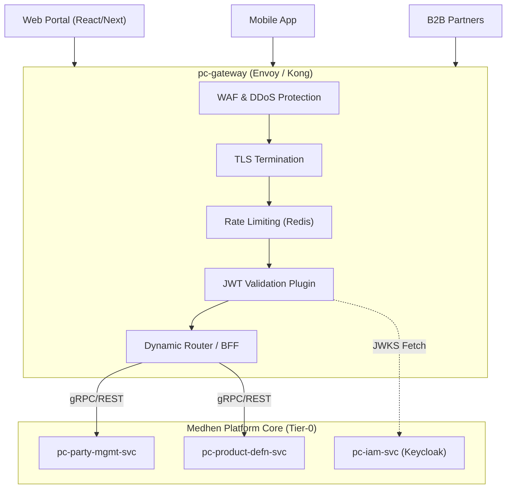

# pc-gateway: API Gateway & BFF Specification (v1)

| Field | Detail |
|:------|:-------|
| **Document ID** | MDH-INFRA-SPEC-GW-01-v1 |
| **Component ID** | `pc-gateway` |
| **Component Name** | Platform API Gateway & BFF |
| **Bounded Context** | `Platform-Infra` — Edge Routing & Integration |
| **Version** | 1.0 |
| **Status** | Draft |
| **Date** | 2026-07-17 |
| **Classification** | Internal — Confidential |
| **Tier** | Tier-0 |
| **Deploy Mode** | Stateless Proxy / Ingress Controller |
| **Target Repo** | `Platform Core/dev/infra/pc-gateway` |
| **Phase** | Phase 1 (Core MVP) |
| **Methodologies** | BFF (Backend for Frontend), API Gateway, Zero-Trust |

**Revision history**

| Version | Date | Summary |
|:---|:---|:---|
| 1.0 | 2026-07-17 | Initial Tier-0 specification for the Platform Gateway. Covers routing, rate-limiting, JWT validation, and BFF aggregation. Includes technology recommendations. |

---

## Document Structure Overview

1. **Gateway Overview & Mission**
2. **Implementation Recommendation (Kong vs. Envoy vs. KrakenD)**
3. **Architecture & Topology**
4. **Functional Requirements (Routing, BFF, Rate Limit, Auth)**
5. **Token Validation & Identity Integration**
6. **Rate Limiting & Traffic Shaping**
7. **BFF Aggregation Patterns**
8. **Non-Functional Requirements & SLOs**
9. **Observability Specification**
10. **Engineering Definition of Done (DoD)**

---

## 1. Gateway Overview & Mission

### 1.1 Mission Statement

`pc-gateway` acts as the single entry point (Front Door) for all external and cross-domain traffic entering the Medhen Platform. It abstracts the underlying microservice topology (e.g., `pc-party-mgmt-svc`, `pc-product-defn-svc`) from the clients (Web Portals, Mobile Apps, 3rd Party Integrators). 

Its primary responsibilities are strict perimeter security (Zero-Trust), traffic shaping, routing, and providing Backend-For-Frontend (BFF) capabilities to reduce chattiness between clients and internal services.

### 1.2 Business Context

| Aspect | Description |
|:-------|:------------|
| **Problem Space** | Clients needing to communicate with multiple microservices face issues with CORS, multiple authentications, chatty network calls, and tight coupling to internal service names and versions. |
| **Value Delivered** | Centralized cross-cutting concerns: JWT validation, rate limiting, distributed tracing initiation, and request aggregation (BFF). Secures the platform while simplifying client integration. |

---

## 2. Implementation Recommendation

Given your past experience with **Kong API Gateway** and the requirement for a **Tier-0, industry-standard, enterprise-grade, and future-proof** architecture, here is the technical assessment and final recommendation.

### 2.1 Evaluated Candidates

1. **Kong Gateway (3.x DB-less Mode)**
   - *Pros:* High familiarity from your previous platforms. Extremely rich plugin ecosystem. DB-less declarative configuration (via decK) aligns well with GitOps.
   - *Cons:* Lua-based (requires OpenResty knowledge for custom plugins), though WASM/Go plugins are now supported, they carry overhead. 
2. **Envoy Proxy (via Envoy Gateway / Gloo Edge)**
   - *Pros:* **The undisputed industry standard for cloud-native proxies.** Native gRPC support (crucial for your Go/gRPC backend). Deep integration with Kubernetes and service meshes (Istio). Unmatched performance and future-proofing.
   - *Cons:* Steeper learning curve for raw Envoy configuration (mitigated by using Envoy Gateway API or Gloo Edge).
3. **KrakenD**
   - *Pros:* Pure Go implementation. Specifically designed from the ground up for **BFF and API aggregation**. Incredibly fast and stateless.
   - *Cons:* Less focus on traditional edge-routing complex plugins compared to Kong; primarily focused on aggregation.

### 2.2 Final Recommendation: Envoy Proxy (Envoy Gateway)

**Recommendation:** I strongly recommend migrating from Kong to **Envoy Proxy (via the Kubernetes Gateway API or a wrapper like Gloo Edge)** for the Medhen Platform. 

**Why?**
- **gRPC Dominance:** Your internal services (`pc-party-mgmt-svc`, etc.) rely heavily on gRPC. Envoy was built by Lyft specifically to proxy gRPC and HTTP/2 seamlessly, including gRPC-Web translation out-of-the-box.
- **Future-Proofing:** Envoy is the engine behind modern service meshes (Istio) and cloud infrastructure. Adopting it at the edge makes transitioning to a zero-trust service mesh later trivial.
- **WASM Extensibility:** If custom logic is needed (e.g., specific Fayda integration headers), Envoy allows writing WebAssembly plugins in Go.

*Alternative (Safe Bet):* If the team's operational maturity heavily favors Kong, **Kong 3.x in DB-less mode** using Go-based plugins is a perfectly acceptable Tier-0 alternative.

---

## 3. Architecture & Topology

### 3.1 Perimeter Topology

---

## 4. Functional Requirements

### 4.1 Routing (`FR-GW-RT-*`)
- **FR-GW-RT-1 — Path-Based Routing:** The gateway SHALL route traffic to backend services based on URL prefixes (e.g., `/api/v1/party/*` -> `pc-party-mgmt-svc`).
- **FR-GW-RT-2 — Protocol Translation:** The gateway SHALL support REST to gRPC translation for external clients that cannot speak gRPC natively.
- **FR-GW-RT-3 — Header Manipulation:** The gateway SHALL inject distributed tracing headers (W3C Trace Context) and strip sensitive external headers before forwarding to internal services.

### 4.2 Backend-For-Frontend (BFF) (`FR-GW-BFF-*`)
- **FR-GW-BFF-1 — Payload Aggregation:** The gateway SHALL provide endpoints that fan-out requests to multiple underlying services (e.g., fetching User Profile from `pc-party-mgmt-svc` and Roles from `pc-iam-svc`) and aggregate them into a single JSON response for the frontend.
- **FR-GW-BFF-2 — Field Filtering:** Support GraphQL-like field selection or hardcoded response pruning to minimize payload sizes for mobile clients.
- **FR-GW-BFF-3 — Real-Time Streaming:** The gateway SHALL support Server-Sent Events (SSE) by keeping long-lived HTTP connections open (with appropriate idle timeouts) to push real-time updates from backend services to the UI without requiring WebSockets.

### 4.3 Resilience (`FR-GW-RES-*`)
- **FR-GW-RES-1 — Circuit Breaking:** Implement circuit breakers to prevent cascading failures if a backend service (e.g., `pc-product-defn-svc`) becomes unresponsive.
- **FR-GW-RES-2 — Retries & Timeouts:** Apply strict P99 timeouts (e.g., 2000ms) and idempotent retry logic for safe HTTP GET/gRPC read operations.

---

## 5. Token Validation & Identity Integration

The gateway is the enforcement point for authentication. Services behind the gateway trust the identity headers injected by the gateway.

### 5.1 Validation Flow
1. **Request Reception:** Client sends HTTP request with `Authorization: Bearer <JWT>`.
2. **Local Validation:** The gateway validates the JWT signature using the JWKS (JSON Web Key Set) cached from `pc-iam-svc` (Keycloak). **No synchronous call to IAM is made per request.**
3. **Claim Extraction:** The gateway extracts standard claims (`sub`, `iss`, `aud`, `exp`) and custom claims (e.g., `medhen_roles`, `party_id`).
4. **Header Injection:** If valid, the gateway strips the `Authorization` header (optional, to prevent token leakage) and injects `X-User-ID`, `X-Party-ID`, and `X-User-Roles` headers to the downstream microservices.

### 5.2 Error Handling
- Missing/Invalid Token: Returns `401 Unauthorized`.
- Expired Token: Returns `401 Unauthorized` with an error code signaling the client to refresh.
- Insufficient Scopes (if gateway does basic AuthZ): Returns `403 Forbidden`.

---

## 6. Rate Limiting & Traffic Shaping

### 6.1 Rate Limiting Tiers
The gateway relies on a low-latency Redis cluster to maintain distributed counters using the sliding window algorithm.

| Client Tier | Limit | Scope | Action on Breach |
|:---|:---|:---|:---|
| **Anonymous / Unauthenticated** | 10 req/sec | Per IP Address | `429 Too Many Requests` |
| **Standard User (Web/App)** | 50 req/sec | Per `sub` (User ID) | `429 Too Many Requests` |
| **B2B API Partner** | 500 req/sec | Per Client ID / API Key | `429 Too Many Requests` |
| **Internal Microservices** | Unlimited | Service Mesh | N/A |

### 6.2 DDoS Mitigation
A global connection limit and request size limit (e.g., max 5MB payload, excluding specific file upload routes to MinIO) MUST be enforced at the gateway layer to prevent volumetric attacks.

---

## 7. Non-Functional Requirements & SLOs

### 7.1 Performance SLOs
- **Throughput:** Must support > 10,000 Requests Per Second (RPS) per node.
- **Latency Overhead:** The gateway proxy overhead (including JWT validation and Rate Limiting) MUST NOT exceed **5ms at P95** and **15ms at P99**.
- **Availability:** Target 99.999% uptime (Five Nines). The gateway must run in highly available clusters (min 3 replicas) spread across availability zones.

### 7.2 Scalability
- **Statelessness:** The gateway instances MUST be completely stateless. All state (Rate Limits) must be externalized to Redis. Configurations must be loaded declaratively via Kubernetes ConfigMaps/CRDs.
- **HPA:** Horizontal Pod Autoscaling based on CPU utilization (target 60%) and custom RPS metrics.

---

## 8. Observability Specification

The gateway is the critical ingestion point for telemetry.

### 8.1 Distributed Tracing
- The gateway MUST generate a `trace-id` and `span-id` for every incoming request that lacks one.
- It MUST propagate the `b3` or `traceparent` (W3C) headers to downstream services.
- Spans must be exported to the centralized OpenTelemetry Collector.

### 8.2 Metrics (Prometheus)
Key metrics to expose (Standard RED metrics):
- `gateway_requests_total{route, status_code, method}`
- `gateway_request_duration_seconds{route, method}`
- `gateway_rate_limit_hits_total{client_tier}`
- `gateway_auth_failures_total{reason}`

---

## 9. Operational Runbooks

### 9.1 Configuration Updates (GitOps)
No manual API calls to configure the gateway are permitted.
- **Envoy/Gloo:** Routes are defined as `HTTPRoute` or `VirtualService` Kubernetes CRDs.
- **Kong:** Routes are defined in `kong.yaml` and applied via `decK` in the CI/CD pipeline.

### 9.2 Redis Failure Fallback
If the Redis cluster used for rate limiting becomes unavailable, the gateway MUST "fail open" (allow traffic) to ensure business continuity, falling back to local memory token buckets with a higher tolerance until Redis recovers.
