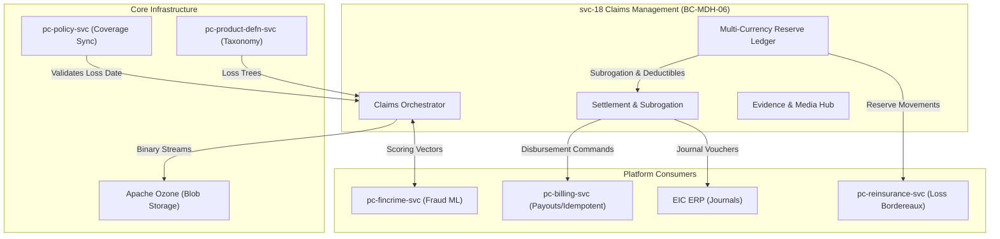

# svc-18: Claims Management Specification (v1)

| Field | Detail |
|:------|:-------|
| **Document ID** | MDH-SVC-SPEC-PC-18-v1 |
| **Service ID** | `svc-18` |
| **Service Name** | Claims Management |
| **Bounded Context** | `BC-MDH-06` — Claims Management |
| **Version** | 1.1 (Comprehensive Enterprise Draft) |
| **Status** | Approved |
| **Date** | 2026-07-18 |
| **Classification** | Internal — Confidential |
| **Tier** | Tier-0 |
| **Deploy Mode** | Microservice (`pc-claims-svc`) |
| **Target Repo** | `Platform Core/dev/pc-claims-svc` |
| **Phase** | Phase 1 (Core) |
| **PRD Anchor** | [Platform Core PRD](../../../docs/prd/Medhen-Platform-PRD.md) (`REQ-CLM-*`) |
| **Capability Anchor** | [Capability Doc BC-MDH-06](../../../docs/prd/Medhen-Platform-Capability-Document.md#bc-mdh-06--claims-management-pc-claims-svc) |
| **Capabilities** | `CAP-CLM-001` to `CAP-CLM-A3` |
| **Methodologies** | Tactical DDD · Hexagonal Architecture · EDA · CQRS · Transactional Outbox |
| **Companion Specs** | `svc-13` Policy Management · `svc-07` Billing & Payments · `svc-10` Product Definition |

**Revision history**

| Version | Date | Summary |
|:---|:---|:---|
| 1.0 | 2026-07-17 | Initial high-level specification. |
| 1.1 | 2026-07-18 | Comprehensive enterprise-grade expansion. Replaced MinIO with Apache Ozone. Introduced full multi-currency processing. Deep-dive into DDD aggregates, API schemas, and BDD edge-case coverage. |
| 1.2 | 2026-07-18 | Tier-0 architectural upgrades: Settlement Saga Orchestrator, Bi-Temporal Reserve Ledgers (IFRS-17), and strict UK FCA Consumer Duty conduct alignment (Vulnerable Customers). |

---

## Document Structure Overview

1. **Service Overview**
2. **Technology Stack & Architecture**
3. **Comprehensive Functional Requirements**
4. **Domain Model & Events (Tactical DDD)**
5. **Enterprise API Specifications**
6. **Event Schemas & Contracts (Avro)**
7. **Behaviour-Driven Scenarios (BDD)**
8. **Data Ownership, Privacy & Persistence**
9. **Integration & Dependency Contracts**
10. **Non-Functional Requirements & SLOs**
11. **Observability Specification**
12. **Operational Runbooks**
13. **Engineering Definition of Done (DoD)**

---

## 1. Service Overview

### 1.1 Mission Statement

`svc-18` Claims Management (`BC-MDH-06`) is the mission-critical, Tier-0 orchestrator of the entire claims lifecycle. Following strict UK/London-market claims practices combined with dynamic Ethiopian market requirements, it governs the flow from First Notice of Loss (FNOL) through triage, investigation, reserve discipline, settlement, recovery, and final closure. 

The service is strictly Line of Business (LOB) agnostic in its core execution logic, relying on structural definitions ingested from `pc-product-defn-svc`. It introduces advanced automation like Straight-Through Processing (STP) pipelines for low-complexity claims, fully asynchronous multi-currency financial ledger tracking, and an immutable audit trail of all adjuster decisions.

### 1.2 Multi-Currency Paradigm

A defining feature of `BC-MDH-06` is its native multi-currency architecture. To support international treaties, reinsurance, and diverse payment rails, **every** financial figure (Reserve, Settlement, Recovery) is stored as a tuple comprising:
* `amount`: The raw numeric value (e.g., `150000.00`)
* `currency`: The ISO 4217 currency code (e.g., `ETB`, `USD`)
* `base_amount`: The equivalent value in the platform's base currency (`ETB`) at the exact time of the transaction.
* `exchange_rate`: The operational rate used for the conversion.

This ensures zero financial leakage during currency fluctuations across the lifecycle of a long-tail claim.

### 1.3 Business Context & Stakeholder Value

| Aspect | Description |
|:-------|:------------|
| **Problem** | Legacy claims systems lack strict authority limits, allowing reserve leakage. Static workflows delay payouts, reducing customer satisfaction. Siloed data prevents automated fraud detection and straight-through processing. |
| **Value** | Enforces immutable financial governance. Drastically reduces turnaround times via automated triage and fast-track routing. Empowers the Special Investigation Unit (SIU) by integrating seamlessly with real-time fraud scoring. |
| **Stakeholders** | Claims Adjusters, Claims Directors, Finance Controllers, Reinsurance Analysts, SIU, Customers, and Legal/Compliance bodies. |

### 1.4 Business Capabilities Delivered

| Capability | Description | Priority / Phase |
|:---|:---|:---|
| `CAP-CLM-001` (FNOL) | Omni-channel intake, synchronous active-policy coverage validation, real-time claim numbering, and GPS/Media capture. | P0 / Phase 1 |
| `CAP-CLM-002` (Triage) | Real-time severity scoring, skill-based auto-assignment, and intelligent fast-track / STP routing. | P0 / Phase 1 |
| `CAP-CLM-003` (Investigation) | Action-driven diary, LOB checklists, third-party expert report logging, and asynchronous fraud indicator triggers. | P1 / Phase 1 |
| `CAP-CLM-004` (Reserves) | Multi-currency indemnity, expense, and recovery reserve ledgers governed by strict authority matrix rules. | P0 / Phase 1 |
| `CAP-CLM-005` (Settlement) | Deductible computation, limit exhaustion checks, multi-payee splitting, and total loss/salvage handling. | P0 / Phase 1 |
| `CAP-CLM-006` (Payment) | Safe disbursement commands to billing encompassing Bank, Telebirr, and CBE Birr with idempotency guarantees. | P0 / Phase 1 |
| `CAP-CLM-007` (Recovery) | Subrogation lifecycle, salvage disposal tracking, and net-loss financial computations for Reinsurance. | P1 / Phase 1 |
| `CAP-CLM-008` (Lifecycle) | Financial closure check-summing, and audited reopening procedures. | P0 / Phase 1 |
| `CAP-CLM-A1-3` (Advanced)| AI-driven image damage estimation, automated network direct-billing. | P3 / Phase 3-4|

### 1.5 Context Map



---

## 2. Technology Stack & Architecture

`svc-18` leverages a rigorous Hexagonal Architecture (Ports and Adapters) pattern, completely decoupling domain logic from infrastructure concerns. It serves 10,000+ daily active users (Adjusters + API Clients) with P95 latencies under 50ms for reads, and guarantees exactly-once processing for financial writes via outbox relay.

### 2.1 Technology Selection

| Component | Technology | Rationale |
|:---|:---|:---|
| Runtime | **Go 1.26.x** | Extreme concurrency for high-throughput FNOL intake. |
| API Layer | **REST/JSON**, OpenAPI 3.1 | Primary interaction port for web and mobile channels. |
| Datastore | **PostgreSQL 18.x** | Hard ACID guarantees for financial reserves. `JSONB` handles LOB-varying dynamic attributes. |
| Event Backbone | **Apache Kafka** | Sub-10ms pub/sub with Apicurio Schema Registry for Avro validation. |
| Outbox Relay | **Transactional Outbox** | Polling sidecar / CDC pattern to guarantee atomicity between DB writes and Kafka publishes. |
| Object Storage | **Apache Ozone** | Exabyte-scale, highly concurrent blob storage for terabytes of daily uploaded claim evidence (images, videos, PDF reports). Outperforms MinIO in dense Hadoop/HDFS contiguous enterprise ecosystems. |
| Distributed Cache| **Redis Cluster** | CQRS view-model caching for the adjuster dashboards. |

### 2.2 Apache Ozone Integration

Unlike typical configurations relying on S3/MinIO, the platform standardizes on **Apache Ozone** for enterprise-scale evidence persistence due to its native multi-protocol support and superior namespace scalability.
* **Volume/Bucket Structure:** `vol-medhen-claims / bucket-evidence`
* **Object Keys:** `/{tenant_id}/{claim_number}/evidence/{uuid}-{filename}`
* **Security:** Interaction happens strictly via Presigned URLs. The `pc-claims-svc` generates a 15-minute S3-compatible presigned upload URL for the frontend, preventing binary streams from passing through the Go runtime memory.

---

## 3. Comprehensive Functional Requirements

Stated in normative RFC 2119 language, derived strictly from `CAP-CLM-001` through `008`.

### 3.1 First Notice of Loss & Intake (`FR-CLM-FNOL-*`)
- **FR-CLM-FNOL-1 (Intake Payload):** The service SHALL accept an FNOL payload containing loss date, geographic coordinates, description, involved party arrays (Claimant, Witness, Third-Party), and array of evidence hashes.
- **FR-CLM-FNOL-2 (Coverage Block):** The service SHALL synchronously invoke `pc-policy-svc` (`GET /v1/policies/{id}/coverage-status?as_of={loss_date}`). If the policy is inactive, or the specific `loss_type` maps to an excluded coverage, the service SHALL instantiate the claim directly into `COVERAGE_DENIED` status.
- **FR-CLM-FNOL-3 (Idempotent Genesis):** Claim creation MUST be fully idempotent. If a client retries a submission with the same `Idempotency-Key` within 24 hours, the service SHALL return the exact `claim_number` previously minted.

### 3.2 Triage & Assignment (`FR-CLM-TRG-*`)
- **FR-CLM-TRG-1 (Straight-Through Processing - STP):** If the gross estimated loss is below the tenant's `stp_threshold`, the loss type is marked `ELIGIBLE_FOR_STP`, and the fraud score is `< 20`, the service SHALL bypass manual assignment and transition the claim directly to `ASSESSED`.
- **FR-CLM-TRG-2 (Skill-based Routing):** For manual claims, the system SHALL evaluate the `loss_type` (e.g., `commercial.liability`) and assign the claim to the adjuster with the lowest current workload within the required skill group.
- **FR-CLM-TRG-3 (SIU Escalation):** If `pc-fincrime-svc` returns a fraud score `> 80`, the service SHALL automatically freeze processing and reassign the claim to the Special Investigation Unit (`SIU`) group.
- **FR-CLM-TRG-4 (Vulnerable Customer Fast-Track):** In strict alignment with FCA Consumer Duty, if the claimant is flagged as a "Vulnerable Customer" by `pc-party-mgmt-svc`, the claim MUST bypass standard queues and route to the "Enhanced Care" unit. Statutory SLA timers for these claims are reduced by 50%.

### 3.3 Multi-Currency Reserve Ledger (`FR-CLM-RES-*`)
- **FR-CLM-RES-1 (Trifurcated Ledgers):** The service SHALL maintain three distinct financial ledgers per claim: `INDEMNITY`, `EXPENSE` (legal/expert fees), and `RECOVERY` (expected subrogation/salvage).
- **FR-CLM-RES-2 (Currency Normalization):** Any reserve set in a foreign currency (e.g., USD) MUST be accompanied by the operational exchange rate and persisted with its base `ETB` equivalent.
- **FR-CLM-RES-3 (Authority Matrix Enforcement):** The service SHALL reject any `AdjustReserve` command where `amount_base` exceeds the authenticated user's `reserve_authority_limit`. Such requests MUST trigger an asynchronous `PendingReserveApproval` workflow.
- **FR-CLM-RES-4 (Bi-Temporal Integrity):** To satisfy IFRS-17 audit requirements, every reserve movement MUST be tracked bi-temporally. The system MUST record both `BusinessValid` (when the adjuster decided the reserve changed) and `SystemValid` (when the DB transaction committed) timestamps.

### 3.4 Settlement & Recovery (`FR-CLM-SET-*`)
- **FR-CLM-SET-1 (Advanced Deductions):** The service SHALL compute the final settlement amount as: `MIN(Gross_Loss - Policy_Deductible - Salvage_Value, Policy_Limit)`.
- **FR-CLM-SET-2 (Multi-Payee Disbursement):** A single settlement CAN be split across multiple payees (e.g., 60% to Service Garage via Bank Transfer, 40% to Claimant via Telebirr). The system SHALL dispatch separate payment instructions for each to `pc-billing-svc`.
- **FR-CLM-SET-3 (Fractional Subrogation Netting):** Recoveries from third parties SHALL be proportionally split. The logic MUST calculate the exact percentage of the recovery owed to Reinsurers versus EIC retention.
- **FR-CLM-SET-4 (Settlement Saga Orchestration):** Disbursements MUST be governed by a Saga orchestrator. If a payment fails in Billing (e.g., bounced account), the Saga MUST emit a compensating transaction to reverse the reserve drawdown automatically.

---

## 4. Domain Model & Events (Tactical DDD)

### 4.1 Bounded Context Map (`BC-MDH-06`)

The Domain Layer is strictly isolated from infrastructure. It consists of `Aggregates` (consistency boundaries), `Entities` (identity-bearing objects within aggregates), and `Value Objects` (immutable descriptors).

### 4.2 Aggregate Root: `Claim`

The `Claim` is the primary aggregate. It manages the state machine and structural details.

*   **Invariants:**
    *   A `Claim` cannot transition from `CLOSED` to any state other than `UNDER_INVESTIGATION` (via `Reopen`).
    *   A `Claim` cannot be `SETTLED` if there are open `SIU` investigations.
*   **Contained Entities:**
    *   `ClaimNote`: Tracks chronological adjuster diary entries. Append-only.
    *   `ClaimDocument`: References to Apache Ozone blobs.
*   **Value Objects:**
    *   `LossDetails`: (Date, Lat/Lon, WeatherCondition).
    *   `MultiCurrencyAmount`: (Amount, CurrencyCode, BaseAmount, ExchangeRate).

### 4.3 Aggregate Root: `ReserveLedger`

Separated from `Claim` to allow high-frequency financial updates without locking the entire claim object. Designed bi-temporally.

*   **Invariants:**
    *   The sum of `ReserveEntry` adjustments for a type (Indemnity) cannot result in a negative total balance.
    *   Once a settlement is paid, the outstanding reserve MUST automatically draw down by the payment amount.
*   **Contained Entities:**
    *   `ReserveEntry`: An immutable, bi-temporal ledger line item. Tracks `SystemValidFrom`/`To` and `BusinessValidFrom`/`To`.

### 4.4 Aggregate Root: `Settlement`

Represents an immutable proposal and eventual payout configuration.

*   **Invariants:**
    *   The total `Settlement` amount cannot exceed the currently authorized `Indemnity` reserve.
    *   Disbursement instructions must sum exactly to the `Settlement` amount (Gross Loss - Deductible - Salvage).

### 4.5 Command Catalog

Commands mutate aggregate state. Handled by the Application Layer orchestrating the UoW (Unit of Work).

| Command | Target | Authorization | Execution Logic | Failure Exceptions |
|:---|:---|:---|:---|:---|
| `RegisterFNOL` | `Claim` | `claims.submit` | Validates loss date against policy bounds; calculates initial triage score; creates `Claim` in `FNOL` state. | `PolicyInactive`<br>`CoverageExcluded` |
| `AssignAdjuster`| `Claim` | `claims.manage` | Mutates the `assignee_id`. | `InvalidAdjusterRole` |
| `AdjustReserve` | `ReserveLedger` | `claims.reserve`| Validates authority limit; appends `ReserveEntry`; emits `ReserveAdjustedEvent`. | `AuthorityLimitExceeded`<br>`NegativeReserveBalance` |
| `ProposeSettlement`| `Settlement` | `claims.assess` | Creates a `Settlement` in `PENDING` state. Computes deductibles. | `ReserveExceeded`<br>`InvalidPayee` |
| `ApproveSettlement`| `Settlement` | `claims.approve`| Validates approval authority; transitions to `APPROVED`; queues outbox commands to Billing. | `AuthorityLimitExceeded`<br>`SettlementNotPending` |
| `LogRecovery` | `ReserveLedger` | `claims.recovery`| Logs a positive receipt against the `RECOVERY` ledger. | `InvalidCurrency` |

---

## 5. Enterprise API Specifications

The Primary Adapters expose REST endpoints adhering strictly to OpenAPI 3.1 specifications. All mutating endpoints mandate an `Idempotency-Key` header.

### 5.1 Endpoints

Base path: `/api/pc-claims/v1`

| Method | Path | Purpose |
|:---|:---|:---|
| `POST` | `/claims` | Omni-channel FNOL submission. |
| `GET` | `/claims` | Search claims (supports robust pagination and filtering). |
| `GET` | `/claims/{id}` | Read full claim composite (HATEOAS linked). |
| `PATCH`| `/claims/{id}/status` | Force lifecycle transitions. |
| `POST` | `/claims/{id}/evidence/presign` | Request Apache Ozone upload URL. |
| `POST` | `/claims/{id}/reserves` | Submit reserve adjustments. |
| `GET` | `/claims/{id}/reserves/ledger` | Audit trail of all financial movements. |
| `POST` | `/claims/{id}/settlements` | Initiate settlement workflows. |

### 5.2 JSON Payload Schemas

#### Request: `AdjustReserve` (Multi-Currency)
```json
{
  "reserve_type": "INDEMNITY",
  "adjustment_type": "INCREASE",
  "amount": {
    "value": "5000.00",
    "currency": "USD"
  },
  "reason_code": "MEDICAL_ESCALATION",
  "notes": "Third party required unexpected surgery."
}
```

#### Response: `GetClaim` (CQRS View Model)
```json
{
  "claim_id": "c-9a8b-11ec",
  "claim_number": "CLM/MOT/ADD/2026/00452",
  "status": "UNDER_INVESTIGATION",
  "assigned_to": "u-456",
  "financials": {
    "total_incurred_base": "820000.00",
    "base_currency": "ETB",
    "reserves": {
      "indemnity": { "outstanding": "500000.00", "paid": "0.00" },
      "expense": { "outstanding": "20000.00", "paid": "15000.00" },
      "recovery": { "expected": "300000.00", "received": "0.00" }
    }
  },
  "fraud_score": 12,
  "links": [
    { "rel": "self", "href": "/api/pc-claims/v1/claims/c-9a8b-11ec" },
    { "rel": "ledger", "href": "/api/pc-claims/v1/claims/c-9a8b-11ec/reserves/ledger" }
  ]
}
```

### 5.3 Pagination & Rate Limiting
- **Pagination:** Cursor-based (`?cursor=xyz&limit=50`) utilized for all list endpoints to ensure stable iteration over the massive `claims` table.
- **Rate Limiting:** `FNOL` endpoints are strictly rate-limited at the Gateway (Integration ACL) to 10 req/sec per IP to mitigate DDoS attacks against the intake engine.

---

## 6. Event Schemas & Contracts (Avro)

`svc-18` acts as the primary data publisher for `pc-reinsurance-svc` and `pc-reporting-svc`. It guarantees strictly ordered, `BACKWARD` compatible schema evolution via the Confluent/Apicurio Schema Registry.

### 6.1 Core Outbox Topics

| Topic | Partition Key | Purpose | Consumers |
|:---|:---|:---|:---|
| `pc.claim.lifecycle.v1` | `claim_id` | Core state machine changes (FNOL -> CLOSED). | Notifications, Reporting |
| `pc.claim.financials.v1` | `claim_id` | Reserve movements and settlement authorizations. | Reinsurance, ERP |
| `pc.claim.fraud.v1` | `claim_id` | SIU triggers and clearance signals. | Fin-Crime |

### 6.2 Avro Schema: `ReserveAdjustedEvent`
This event captures the precise multi-currency nuance required by Reinsurance.

```json
{
  "namespace": "medhen.platform.claim.events.v1",
  "type": "record",
  "name": "ReserveAdjustedEvent",
  "fields": [
    {"name": "event_id", "type": "string", "logicalType": "uuid"},
    {"name": "tenant_id", "type": "string"},
    {"name": "claim_id", "type": "string"},
    {"name": "policy_id", "type": "string"},
    {"name": "reserve_type", "type": {"type": "enum", "name": "ReserveType", "symbols": ["INDEMNITY", "EXPENSE", "RECOVERY"]}},
    {"name": "transaction_amount", "type": "string"},
    {"name": "transaction_currency", "type": "string"},
    {"name": "exchange_rate", "type": "string"},
    {"name": "base_amount_delta", "type": "string"},
    {"name": "new_outstanding_balance_base", "type": "string"},
    {"name": "author_id", "type": "string"},
    {"name": "occurred_at", "type": {"type": "long", "logicalType": "timestamp-millis"}}
  ]
}
```

---

## 7. Behaviour-Driven Scenarios (BDD)

BDD scenarios define the Acceptance Criteria. Implemented using Go `godog` in the integration test suite.

**Scenario: CLM-BDD-001 | Straight-Through Processing (STP) Auto-Settlement**
* **Given** a tenant with an STP threshold of `15000 ETB`
* **And** a policy `POL-888` covering `windscreen_damage`
* **When** a claim is registered for windscreen damage with an invoice of `8000 ETB`
* **And** `pc-fincrime-svc` returns a fraud score of `5`
* **Then** the service bypasses manual triage
* **And** auto-generates a `Settlement`
* **And** transitions the claim to `PENDING_APPROVAL` directly assigned to the automated system agent.

**Scenario: CLM-BDD-002 | Strict Reserve Authority Matrix**
* **Given** an adjuster `Abebe` with an authority limit of `100,000 ETB`
* **And** an open claim with current Indemnity reserve of `80,000 ETB`
* **When** `Abebe` attempts to execute `AdjustReserve` to add `50,000 ETB`
* **Then** the operation is rejected with HTTP 403 `AuthorityLimitExceeded`
* **And** the ledger remains untouched.

**Scenario: CLM-BDD-003 | Multi-Currency Recovery Netting**
* **Given** a claim resulting from a maritime accident with a base currency of `ETB`
* **When** a `LogRecovery` command is received for `$10,000 USD` at an exchange rate of `130.5 ETB/USD`
* **Then** the `RECOVERY` ledger receives an entry
* **And** the total expected loss is reduced by `1,305,000 ETB`
* **And** a `pc.claim.financials.v1` event is emitted reflecting the delta.

---

## 8. Data Ownership, Privacy & Persistence

### 8.1 Schema Design (PostgreSQL 18)

The storage layer relies heavily on normalization for financial integrity, and `JSONB` for schema-less data (like varying incident report formats per LOB).

#### `claims` Table
```sql
CREATE TABLE claims (
    id UUID PRIMARY KEY,
    tenant_id VARCHAR(36) NOT NULL,
    claim_number VARCHAR(50) NOT NULL UNIQUE,
    policy_id UUID NOT NULL,
    status VARCHAR(30) NOT NULL,
    sub_status VARCHAR(50), -- e.g., AWAITING_POLICE_REPORT
    version INT NOT NULL, -- Optimistic Locking
    date_of_loss TIMESTAMPTZ NOT NULL,
    loss_type VARCHAR(50) NOT NULL,
    fraud_score INT,
    loss_details JSONB NOT NULL, -- Geo, Weather, Speeds
    created_at TIMESTAMPTZ DEFAULT CURRENT_TIMESTAMP,
    updated_at TIMESTAMPTZ DEFAULT CURRENT_TIMESTAMP,
    CONSTRAINT chk_status CHECK (status IN ('FNOL', 'REGISTERED', 'COVERAGE_DENIED', 'TRIAGED', 'FAST_TRACK', 'UNDER_INVESTIGATION', 'ASSESSED', 'PENDING_APPROVAL', 'APPROVED', 'SETTLED', 'CLOSED'))
);
CREATE INDEX idx_claims_policy ON claims(policy_id);
CREATE INDEX idx_claims_tenant_status ON claims(tenant_id, status);
```

#### `reserve_ledger` Table
```sql
CREATE TABLE reserve_ledger (
    id BIGSERIAL PRIMARY KEY,
    claim_id UUID REFERENCES claims(id) ON DELETE RESTRICT,
    reserve_type VARCHAR(20) NOT NULL, 
    transaction_type VARCHAR(20) NOT NULL, 
    amount NUMERIC(19, 4) NOT NULL,
    currency VARCHAR(3) NOT NULL,
    exchange_rate NUMERIC(10, 6) NOT NULL,
    base_amount_delta NUMERIC(19, 4) NOT NULL,
    running_balance_base NUMERIC(19, 4) NOT NULL,
    reason_code VARCHAR(50) NOT NULL,
    author_id UUID NOT NULL,
    sys_valid_from TIMESTAMPTZ NOT NULL DEFAULT CURRENT_TIMESTAMP,
    sys_valid_to TIMESTAMPTZ NOT NULL DEFAULT '9999-12-31 23:59:59Z',
    biz_valid_from TIMESTAMPTZ NOT NULL,
    biz_valid_to TIMESTAMPTZ NOT NULL DEFAULT '9999-12-31 23:59:59Z'
);
-- Enforce invariant: running balance can never be negative
ALTER TABLE reserve_ledger ADD CONSTRAINT chk_positive_balance CHECK (running_balance_base >= 0);
```

### 8.2 Data Classification & Residency

| Domain | Classification | Storage | Residency Rule |
|:---|:---|:---|:---|
| Claim Loss Details | **Confidential** | Postgres | Encrypted at rest. In-country. |
| Third-Party PII | **Restricted PII** | Postgres | Column-level encryption for ID/Phone. |
| Financial Reserves | **Highly Confidential** | Postgres | Immutable ledger. Audited access. |
| Medical/Police Evidence | **Sensitive Media** | Apache Ozone | Presigned URL access only. Expires in 15m. |

---

## 9. Integration & Dependency Contracts

### 9.1 Synchronous Dependencies
- **`pc-policy-svc`**: Polled heavily at FNOL. Bound by a strict 100ms timeout circuit breaker. If it fails, FNOL degrades gracefully by flagging the claim as `PENDING_MANUAL_VALIDATION` instead of returning a 500 to the mobile app.

### 9.2 Asynchronous Disbursment (`pc-billing-svc`)
- When a `Settlement` is `APPROVED`, `svc-18` writes a disbursement command payload to the `outbox` table.
- **Payload:** Array of `Payee` objects with `amount`, `currency`, and `rail` (e.g., `Telebirr`, `SWIFT`).
- **Idempotency:** Billing processes the Kafka event idempotently based on `event_id`.
- **Callback:** Billing emits `pc.billing.payment.processed.v1`. Claims consumes this and writes a `PAYMENT_DRAWDOWN` to the `ReserveLedger`, closing the financial loop.

---

## 10. Non-Functional Requirements & SLOs

| Metric | Target SLO | Burn-rate Action |
|:---|:---|:---|
| **Availability (FNOL writes)** | 99.99% | PagerDuty: Sev1 to On-call. |
| **FNOL Processing Latency** | P95 < 250ms | Scale out pods; Check Policy gRPC latency. |
| **Outbox Delivery Lag** | P99 < 3 seconds| Restart sidecar relay; Check Kafka brokers. |
| **Financial Integrity** | 100% | (Batch job) Alerts if Reserve sum mismatch. |

---

## 11. Observability Specification

Instrumentation relies entirely on `pc-telemetry-sdk` (OpenTelemetry standard).

### 11.1 Prometheus Metrics
- `medhen_claim_state_transitions_total{from="*", to="*"}`
- `medhen_reserve_balance_base_total{type="INDEMNITY", LOB="motor"}`
- `medhen_stp_routing_total{result="accepted|rejected"}`

### 11.2 Distributed Tracing
All HTTP and Kafka requests propagate the W3C `traceparent` header.
- **Trace critical path:** `Mobile App -> Gateway -> Claims (FNOL) -> Policy (gRPC Validate) -> DB Commit -> Kafka Outbox`.

---

## 12. Operational Runbooks

### 12.1 Handling Idempotency Failures in Billing
**Alert:** `DisbursementReconciliationMismatch`
**Diagnosis:** A settlement was approved, but the `pc-billing-svc` failed to emit the callback event within 2 hours.
**Action:** 
1. Use the Admin CLI to query the specific claim's outbox event.
2. Re-publish the exact same event payload to Kafka. `pc-billing-svc` will process it if it missed it, or ignore it if it was already processed (idempotency guarantee).

### 12.2 Ozone Object Orphan cleanup
**Alert:** `OzoneOrphanedBlobs`
**Action:** A scheduled cron job queries the DB for `ClaimDocument` records. Objects in Ozone older than 24h without a corresponding DB record (usually abandoned uploads) are purged via the `aws s3api` compatible CLI tool.

---

## 13. Engineering Definition of Done (DoD)

Before merging to `main` for Phase 1 Release:
1. **Financial Precision:** All multi-currency calculations utilize arbitrary-precision decimal libraries (`shopspring/decimal` in Go). Floating-point math is strictly forbidden.
2. **Coverage & Testing:** `domain` package (Aggregates) achieves 100% branch coverage.
3. **Database Migrations:** Flyway scripts are peer-reviewed by a Staff Engineer, ensuring indices are optimized for the CQRS view-model queries.
4. **Chaos Engineering:** The outbox pattern survives simulated Postgres network partition tests and Pod `OOMKilled` events without missing an event or duplicating one.
