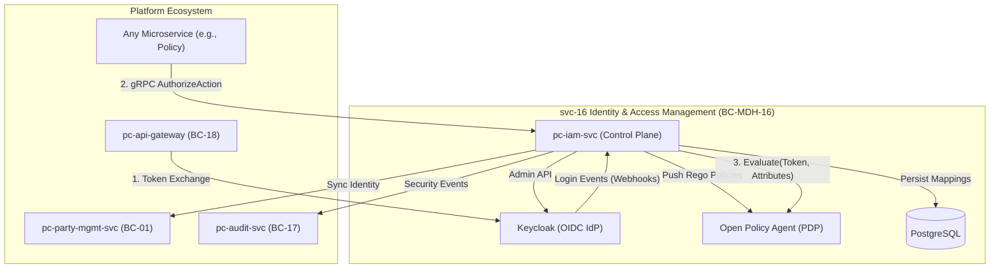

# svc-16: Identity & Access Management Specification (v1)

| Field | Detail |
|:------|:-------|
| **Document ID** | MDH-SVC-SPEC-IAM-16-v1 |
| **Service ID** | `svc-16` |
| **Service Name** | Identity & Access Management (IAM) |
| **Bounded Context** | `BC-MDH-16` — Identity & Access Management |
| **Version** | 1.0 |
| **Status** | Draft |
| **Date** | 2026-07-16 |
| **Classification** | Internal — Confidential |
| **Tier** | Tier-0 |
| **Deploy Mode** | Microservice (`pc-iam-svc`) + Keycloak (COTS) + OPA (Sidecar) |
| **Target Repo** | `Platform Core/dev/services/pc-iam-svc` |
| **Phase** | Phase 1 (Core MVP) |
| **PRD Anchor** | [Platform Core PRD](../../../../../../docs/prd/Medhen-Platform-PRD.md) (`REQ-IAM-*`) |
| **Capability Anchor** | [Capability Doc BC-MDH-16](../../../../../../docs/prd/Medhen-Platform-Capability-Document.md#bc-mdh-16--identity--access-management-keycloak--pc-iam-svc) |
| **Capabilities** | `CAP-IAM-001` to `CAP-IAM-010`, `CAP-IAM-A1/A2` |
| **Methodologies** | OIDC · Decoupled ABAC (OPA) · Multi-Tenant · Hexagonal · Event-Driven |
| **Companion Specs** | `svc-01` Party Mgmt · `svc-17` Audit & Compliance · `svc-18` API Gateway |

**Revision history**

| Version | Date | Summary |
|:---|:---|:---|
| 1.0 | 2026-07-16 | Initial Tier-0 specification covering Sections 1-13. Encompasses full platform Multi-Tenancy, OPA for decoupled ABAC, and Keycloak integration as an off-the-shelf Identity Provider (IdP). |

---

## Document Structure Overview

1. **Service Overview**
2. **Technology Stack & Architecture**
3. **Functional Requirements & State Machines**
4. **Domain Model & Events (Tactical DDD)**
5. **API Specifications (REST & gRPC)**
6. **Event Schemas & Contracts (Avro)**
7. **Behaviour-Driven Scenarios (BDD)**
8. **Data Ownership & Persistence Schema**
9. **Integration & Dependency Contracts**
10. **Non-Functional Requirements & SLOs**
11. **Observability Specification**
12. **Operational Runbooks**
13. **Engineering Definition of Done (DoD)**

---

## 1. Service Overview

### 1.1 Mission Statement

`svc-16` (IAM) is the **single, uncompromising security authority** for the Medhen Platform. It governs authentication (AuthN) and fine-grained authorization (AuthZ) for every human user and machine-to-machine service interaction across the entire ecosystem. 

The service is strictly **Multi-Tenant by Design**. It orchestrates an off-the-shelf **Keycloak** deployment for standard OIDC (OpenID Connect) authentication flows, while utilizing **Open Policy Agent (OPA)** as the centralized Policy Decision Point (PDP) for sophisticated Attribute-Based Access Control (ABAC). This guarantees that access logic is universally enforced, auditable, and decoupled from individual business microservices.

### 1.2 Business Context

| Aspect | Description |
|:-------|:------------|
| **Problem Space** | Legacy and fragmented systems often implement security locally, leading to inconsistent enforcement, difficulty in onboarding new tenants/agencies, and an inability to dynamically restrict access based on attributes (e.g., branch location, authorization limit). |
| **Value Delivered** | Centralized governance. `pc-iam-svc` enables seamless tenant onboarding (isolating data cryptographically), enforces zero-trust between internal microservices, and guarantees that every action—from an underwriter binding a policy to a broker viewing a claim—is authorized against a unified, auditable ruleset. |
| **Stakeholders** | CISOs, Compliance Officers (NBE Auditors), Platform Administrators, Tenant Admins (Brokers/Agencies), System Operators. |

### 1.3 Business Capabilities Delivered

| Capability (CAP) | Description | Phase |
|:---|:---|:---|
| `CAP-IAM-001` | **Tenant & User Provisioning:** Multi-tenant registration workflows for internal staff, external brokerages, and direct customers. Maps identity to `Party` records (`BC-MDH-01`). | 1 |
| `CAP-IAM-002` | **Federated Authentication (AuthN):** Orchestrates Keycloak to provide standard OIDC flows, JWT issuance, MFA enforcement, and external IdP brokering (e.g., Fayda ID, Google Workspace). | 1 |
| `CAP-IAM-003` | **Strict Multi-Tenancy:** Cryptographic segregation of tokens and policies. A user in `Tenant-A` physically cannot acquire a token scoped for `Tenant-B`. | 1 |
| `CAP-IAM-004` | **Decoupled ABAC (OPA):** Evaluates fine-grained permissions dynamically using Rego policies. Evaluates attributes like `branch_id`, `product_line`, and `financial_limit`. | 1 |
| `CAP-IAM-005` | **Role Management (RBAC):** Centralized definition of platform-level and tenant-level roles, mapping business functions (e.g., `Senior Underwriter`) to OPA policy sets. | 1 |
| `CAP-IAM-006` | **M2M Security:** Service Account management and Client Credentials grant orchestration for secure microservice-to-microservice communication. | 1 |
| `CAP-IAM-007` | **Audit Logging:** Emits immutable, high-fidelity security events (Login Success/Failure, Policy Deny) to the Audit service (`BC-MDH-17`). | 1 |

### 1.4 Bounded Context Responsibilities (`BC-MDH-16`)

| Owns | Exposes | Produces (via Outbox) | Invariants |
|:---|:---|:---|:---|
| `Tenant` aggregate | Tenant Mgmt REST API | `pc.iam.tenant.provisioned.v1` | Tenant IDs are globally unique, immutable. |
| `User` profile mapping | User Provisioning REST API | `pc.iam.user.created.v1` | Users are strictly bound to a single Tenant. |
| `Role` & `AccessPolicy` | Policy Management REST API | `pc.iam.policy.updated.v1` | Policies are defined in declarative Rego. |
| AuthZ Decisions | `AuthorizeAction` gRPC API | `pc.iam.access.denied.v1` | Every action is implicitly denied unless explicitly permitted. |

### 1.5 Context Map



---

## 2. Technology Stack & Architecture

### 2.0 Architectural Paradigm

The IAM architecture separates Identity Providing (AuthN) from Policy Decision (AuthZ):

1. **Authentication (Keycloak):** Deployed as a highly-available, off-the-shelf component. It handles the heavy lifting of OAuth2/OIDC flows, password hashing, MFA, social login, and session persistence. `pc-iam-svc` interacts with Keycloak *exclusively* via its Admin REST API to provision Realms (Tenants), Clients, and Users. No custom Keycloak Java SPIs are maintained, ensuring frictionless Keycloak version upgrades.
2. **Authorization (OPA):** Open Policy Agent is the Policy Decision Point (PDP). It evaluates incoming requests (containing the user's JWT and contextual attributes) against declarative rules written in Rego.
3. **Control Plane (`pc-iam-svc`):** A Go-based microservice that acts as the control plane. It provides the business APIs for the Medhen Platform (e.g., "Create a new Agency Tenant", "Assign Underwriter Role"), orchestrates the necessary state changes in Keycloak, translates business roles into Rego policies, and pushes them to OPA. It also serves as the high-throughput gRPC endpoint (`AuthorizeAction`) that downstream microservices call to check permissions.

### 2.1 Technology Selection

| Component | Technology | Rationale |
|:---|:---|:---|
| Control Plane | **Go 1.26.x** | Maximum concurrency for sub-millisecond gRPC AuthZ routing. |
| Identity Provider (IdP)| **Keycloak 24.x** | Industry standard, robust OIDC, built-in MFA and federation. |
| Policy Engine (PDP) | **Open Policy Agent (OPA)**| Decouples policy from code; declarative Rego syntax; extremely fast in-memory evaluation. |
| Primary Store | **PostgreSQL 18.x** | Stores Tenant topologies, Role-to-Permission mappings, and OPA rule templates. |
| Event Backbone | **Kafka + Avro** | For propagating tenant creation and user lifecycle events across the platform. |
| Cache | **Redis** | Caching Keycloak JWKS (JSON Web Key Sets) and compiled OPA policy results. |

### 2.2 Multi-Tenancy Strategy

Multi-tenancy is implemented at the **IdP Realm Level**:
- **System Tenant (`tenant_id: root`):** The administrative tenant for Medhen Platform engineers and global operators. Maps to the `master` realm in Keycloak.
- **Customer Tenants (`tenant_id: uuid`):** Every B2B customer (e.g., an independent Brokerage, a distinct Insurance Carrier sharing the platform) receives a dedicated Keycloak Realm. This ensures complete cryptographic isolation of user pools, tokens, and session states.
- `pc-iam-svc` manages the lifecycle of these Keycloak Realms automatically when a `ProvisionTenant` command is executed.

---

## 3. Functional Requirements & State Machines

### 3.1 Detailed Requirement Catalog

#### 3.1.1 Tenant & Realm Management (`FR-IAM-TEN-*`)
- **FR-IAM-TEN-1 — Provision Tenant:** The service SHALL expose `POST /v1/tenants`. It provisions a new logical Tenant in PostgreSQL and orchestrates the creation of a dedicated Realm in Keycloak.
- **FR-IAM-TEN-2 — Tenant Isolation:** JWTs issued by Keycloak MUST contain the `tenant_id` in the `tid` claim. `pc-iam-svc` MUST instantly reject any gRPC AuthZ request where the `tid` does not match the target resource's `tenant_id`.

#### 3.1.2 User Identity & Provisioning (`FR-IAM-USR-*`)
- **FR-IAM-USR-1 — User Onboarding:** The service SHALL expose `POST /v1/tenants/{tid}/users`. It creates the user in the Keycloak Realm and links them to a physical `Party` ID (`BC-MDH-01`).
- **FR-IAM-USR-2 — M2M Clients:** The service SHALL support creation of Service Accounts (OAuth2 Client Credentials grant) for headless microservice tasks, scoped strictly to specific API namespaces.
- **FR-IAM-USR-3 — Lifecycle Management:** Suspending a user in `pc-iam-svc` MUST instantly invoke the Keycloak Admin API to revoke all active sessions and disable the account.

#### 3.1.3 Authentication & Session (`FR-IAM-AUT-*`)
- **FR-IAM-AUT-1 — Standard OIDC:** All human authentication SHALL be delegated to Keycloak via standard Authorization Code Flow with PKCE.
- **FR-IAM-AUT-2 — MFA Enforcement:** The platform SHALL allow Tenant Admins to mandate TOTP (Time-based One-Time Password) MFA for specific roles (e.g., `Financial_Approver`).
- **FR-IAM-AUT-3 — Token Expiry:** Access Tokens (JWT) SHALL have a maximum lifespan of 15 minutes. Refresh Tokens SHALL be used for session extension.

#### 3.1.4 Attribute-Based Access Control (ABAC) (`FR-IAM-ABAC-*`)
- **FR-IAM-ABAC-1 — Policy Definition:** The system SHALL allow defining access policies in OPA Rego format.
- **FR-IAM-ABAC-2 — Contextual Evaluation:** Access decisions MUST evaluate the User's Roles, the Resource Type, the Action, and dynamic Attributes (e.g., User is in `Branch-A`, Resource belongs to `Branch-A`).
- **FR-IAM-ABAC-3 — Financial Limits:** ABAC policies MUST support numeric evaluations (e.g., `allow if action == "approve_claim" and claim_amount <= user.approval_limit`).

### 3.2 State Machine: User Lifecycle

| Current State | Trigger Command | Target State | Keycloak Action |
|:---|:---|:---|:---|
| `—` | `ProvisionUser` | `PENDING_ACTIVATION`| Create User; Send Reset Password Email. |
| `PENDING_ACTIVATION`| `UserFirstLogin` (Webhook)| `ACTIVE` | — |
| `ACTIVE` | `SuspendUser` | `SUSPENDED` | `PUT /users/{id}` (enabled: false); Revoke sessions. |
| `ACTIVE` | `LockUser` (Failed attempts) | `LOCKED` | Managed automatically by Keycloak Brute Force protection. |
| `SUSPENDED`/`LOCKED`| `RestoreUser` | `ACTIVE` | `PUT /users/{id}` (enabled: true). |

---

## 4. Domain Model & Events (Tactical DDD)

### 4.1 Aggregate Roots

| Aggregate Root | Definition & Invariants | Emitted Events |
|:---|:---|:---|
| **`Tenant`** | Represents a segregated business entity (e.g., Brokerage A). <br><br>**Invariants:** `realm_name` must be globally unique. | `TenantProvisioned`<br>`TenantSuspended` |
| **`UserIdentity`** | The platform representation of a Keycloak user. <br><br>**Invariants:** Must belong to a valid `Tenant`. Must map to a `Party` UUID. | `UserCreated`<br>`UserRoleAssigned`<br>`UserSuspended` |
| **`AccessPolicy`** | A versioned ABAC rule definition. <br><br>**Invariants:** Valid Rego syntax. | `PolicyDeployed`<br>`PolicyRevoked` |

### 4.2 The OPA Policy Model (Rego)

`pc-iam-svc` dynamically generates and pushes Rego bundles to the OPA sidecar.

**Example Rego Policy (Branch & Limit Enforcement):**
```rego
package medhen.authz

default allow = false

# Allow if the user has the 'claim_adjuster' role, AND they belong to the 
# same branch as the claim, AND the claim amount is under their limit.
allow {
    input.action == "approve"
    input.resource_type == "claim"
    
    # Check Role
    "claim_adjuster" == input.user.roles[_]
    
    # Check Branch Attribute (ABAC)
    input.user.attributes.branch_id == input.resource.attributes.branch_id
    
    # Check Financial Limit (ABAC)
    input.resource.attributes.amount <= to_number(input.user.attributes.approval_limit)
}
```

---

## 5. API Specifications (REST & gRPC)

### 5.1 REST API (Control Plane Administration)

**Base path:** `/api/pc-iam-svc/v1`

| Method | Endpoint | Purpose | Security Scope |
|:---|:---|:---|:---|
| `POST` | `/tenants` | Provision a new Multi-Tenant Realm | `platform.admin` |
| `POST` | `/tenants/{tid}/users` | Create a user within a tenant | `tenant.admin` |
| `PUT`  | `/tenants/{tid}/users/{uid}/roles` | Assign functional roles | `tenant.admin` |
| `POST` | `/policies` | Upload a new Rego access policy | `platform.security` |
| `POST` | `/m2m-clients` | Provision a Service Account | `platform.admin` |

### 5.2 gRPC API (High-Throughput Policy Enforcement)

This API is on the critical path for every single request made in the platform.

**Service Definition:** `medhen.platform.iam.v1.PolicyEnforcementService`

| RPC | Request | Response | Description | SLA (P95) |
|:---|:---|:---|:---|:---|
| `AuthorizeAction` | `AuthorizationRequest` | `AuthorizationDecision` | Evaluates a JWT and resource context against OPA. | < 5ms |
| `IntrospectToken` | `TokenString` | `TokenClaims` | Validates JWT signature (offline via cached JWKS) and returns claims. | < 2ms |

**Protobuf Definition (`AuthorizeAction`):**
```protobuf
message AuthorizationRequest {
  string jwt_token = 1;
  string action = 2;              // e.g., "approve"
  string resource_type = 3;       // e.g., "claim"
  string resource_tenant_id = 4;
  map<string, string> resource_attributes = 5; // e.g., {"branch_id": "B-123", "amount": "5000"}
}

message AuthorizationDecision {
  bool is_allowed = 1;
  string denial_reason = 2; // e.g., "INSUFFICIENT_FINANCIAL_LIMIT"
  string policy_version = 3;
}
```

---

## 6. Event Schemas & Contracts (Avro)

All domain events are published to Kafka utilizing the Apicurio Schema Registry with `BACKWARD` compatibility mode.

### 6.1 Topic Mapping

| Event | Topic | Partition Key |
|:---|:---|:---|
| `TenantProvisioned` | `platform.iam.tenant.v1` | `tenant_id` |
| `UserCreated`, `UserRoleAssigned` | `platform.iam.user.v1` | `tenant_id:user_id` |
| `SecurityAuditAlert` | `platform.iam.audit.v1` | `tenant_id` |

### 6.2 Avro Schema: `SecurityAuditAlert`

Emitted for critical AuthZ failures to be ingested by the Audit service.

```json
{
  "namespace": "medhen.platform.iam.v1",
  "type": "record",
  "name": "SecurityAuditAlert",
  "fields": [
    {"name": "event_id", "type": "string", "logicalType": "uuid"},
    {"name": "tenant_id", "type": "string"},
    {"name": "user_id", "type": "string"},
    {"name": "alert_type", "type": "string", "doc": "e.g., REPEATED_POLICY_DENIAL"},
    {"name": "target_resource", "type": "string"},
    {"name": "occurred_at", "type": {"type": "long", "logicalType": "timestamp-millis"}}
  ]
}
```

---

## 7. Behaviour-Driven Scenarios (BDD)

### 7.1 Cross-Tenant Access Denial (Cryptographic Boundary)

**Scenario: IAM-BDD-01 | Prevent Tenant-Bleed**
* **Given** a User "Alice" belonging to Tenant A (Brokerage A)
* **And** a resource `Policy-999` belonging to Tenant B (Brokerage B)
* **When** `pc-policy-svc` calls `AuthorizeAction(Alice_JWT, "read", "policy", Tenant_B_ID)`
* **Then** the service parses the JWT and extracts `tid = Tenant_A_ID`
* **And** identifies a tenant mismatch
* **Then** `AuthorizeAction` immediately returns `is_allowed = false`
* **And** the OPA engine is bypassed entirely (fast-fail)
* **And** a `SecurityAuditAlert` is emitted for cross-tenant access attempt.

### 7.2 ABAC Financial Limit Enforcement

**Scenario: IAM-BDD-02 | ABAC Approval Limit**
* **Given** an Underwriter "Bob" with Role `JUNIOR_UNDERWRITER` and Attribute `approval_limit = 50000`
* **When** Bob attempts to approve a Policy Quote with `premium_amount = 75000`
* **And** `pc-policy-svc` calls `AuthorizeAction` passing the amount attribute
* **Then** the OPA Rego policy evaluates the context
* **And** identifies that `75000 > 50000`
* **Then** `AuthorizeAction` returns `is_allowed = false` with reason `LIMIT_EXCEEDED`.

---

## 8. Data Ownership & Persistence Schema

### 8.1 Keycloak Storage

Keycloak maintains its own relational database. `pc-iam-svc` **never** queries the Keycloak DB directly.
- Owns: Passwords (hashed), OIDC Client Definitions, Realm Definitions, User Sessions.

### 8.2 PostgreSQL Transactional Schema (`pc-iam-svc`)

Stores policy definitions, medhen-specific mappings, and outbox events.

```sql
-- Tenant Directory
CREATE TABLE tenants (
    id UUID PRIMARY KEY,
    name VARCHAR(200) NOT NULL,
    keycloak_realm_id VARCHAR(100) NOT NULL UNIQUE,
    status VARCHAR(20) NOT NULL, -- ACTIVE, SUSPENDED
    created_at TIMESTAMPTZ NOT NULL DEFAULT now()
);

-- User to Party Mapping
CREATE TABLE user_identities (
    id UUID PRIMARY KEY,
    tenant_id UUID REFERENCES tenants(id),
    keycloak_user_id UUID NOT NULL UNIQUE,
    party_id UUID NOT NULL, -- Reference to BC-MDH-01
    status VARCHAR(20) NOT NULL,
    UNIQUE(tenant_id, party_id)
);

-- OPA Policy Bundles
CREATE TABLE access_policies (
    id UUID PRIMARY KEY,
    name VARCHAR(100) NOT NULL UNIQUE,
    rego_content TEXT NOT NULL,
    version INT NOT NULL DEFAULT 1,
    is_active BOOLEAN DEFAULT true,
    updated_at TIMESTAMPTZ NOT NULL DEFAULT now()
);
```

---

## 9. Integration & Dependency Contracts

| External Service | Contract / Protocol | Coupling | Resilience / Fallback |
|:---|:---|:---|:---|
| **Keycloak** | REST API (Admin) | Sync (Write) | If Keycloak Admin API is down, user/tenant provisioning fails. AuthZ (Reads) remain unaffected as OPA is local. |
| **OPA (Sidecar)**| HTTP / Unix Domain Socket| Sync (Read) | Hard dependency for AuthZ. OPA runs as a sidecar to `pc-iam-svc` to guarantee < 1ms network latency. |
| **`pc-party-mgmt-svc`** | gRPC `ResolveParty` | Sync | Used during user onboarding to verify the physical identity exists before creating a login. |
| **`pc-audit-svc`** | Kafka `platform.iam.audit.v1` | Async | Non-blocking. Outbox pattern ensures audit logs are never lost. |

---

## 10. Non-Functional Requirements & SLOs

| Metric | SLO | Consequence of Breach | Measurement / Triggers |
|:---|:---|:---|:---|
| **Availability (gRPC AuthZ)**| **99.999%** (Tier-0+) | The entire platform goes down. No service can authenticate any request. | Prometheus `grpc_server_handled_total`. Alert if < 99.999% over 5m. |
| **Latency (Token Introspect)**| P95 < 2ms | High overhead on every API call across the platform. | OPA sidecar evaluation span + JWKS cache lookup. |
| **Latency (AuthZ Evaluate)** | P95 < 5ms | Sluggish UI operations; cascading service timeouts. | OPA evaluation duration metric. |
| **Keycloak Availability** | 99.99% | Users cannot log in or refresh tokens. Existing sessions (until JWT expiry) continue to work. | Keycloak health endpoint monitor. |

---

## 11. Observability Specification

### 11.1 Golden Signals (Prometheus)

- **Traffic:** `grpc_server_handled_total{method="AuthorizeAction"}`
- **Latency:** `opa_evaluation_duration_seconds_bucket`
- **Errors:** `iam_authz_denials_total{reason="tenant_mismatch|policy_denial|token_expired"}`
- **Saturation:** `keycloak_db_pool_active`, `opa_memory_usage_bytes`

### 11.2 Custom Domain Metrics

- `iam_tenants_provisioned_total`
- `iam_active_sessions_total{tenant_id="..."}` (Exported from Keycloak metrics SPI)
- `iam_mfa_challenges_total{result="success|failure"}`

### 11.3 Logging (Structured `slog`)

All AuthZ denials MUST be logged explicitly for audit tracing:

```json
{"level":"WARN","time":"2026-07-16T12:00:00Z","msg":"Access Denied by OPA Policy","tenant_id":"t-123","user_id":"u-456","action":"approve","resource":"claim","reason":"LIMIT_EXCEEDED","trace_id":"...","span_id":"..."}
```

---

## 12. Operational Runbooks

### 12.1 Keycloak JWKS Rotation Issue
**Symptom**: `IntrospectToken` starts failing platform-wide with `InvalidSignature` errors.
**Action**: 
1. Keycloak may have rotated its keys, but the `pc-iam-svc` Redis cache failed to update.
2. Manually flush the JWKS cache: `kubectl exec -it deploy/pc-iam-svc -- ./bin/cli ops flush-jwks-cache`
3. The service will immediately perform an synchronous out-of-band fetch to `Keycloak /certs` endpoint.

### 12.2 OPA Policy Misconfiguration (Emergency Lockout)
**Symptom**: A newly deployed Rego policy contains a logic flaw, accidentally denying access to all admins (`Deny All` behavior).
**Action**:
1. Platform Engineers must revert the policy via CLI using root system tokens (which bypass OPA and use hardcoded root-trust).
2. `kubectl exec -it deploy/pc-iam-svc -- ./bin/cli policy rollback --version=previous`
3. The service flushes the OPA sidecar bundle cache and reloads the previous working state.

---

## 13. Engineering Definition of Done (DoD)

Before `svc-16` can be deployed to the `staging` environment for Phase 1:

1. **OPA Performance Profiling**: Benchmark tests MUST prove that a complex ABAC Rego policy evaluates in `< 2ms` at `10,000 requests/second`.
2. **Tenant Isolation Verification**: Penetration testing MUST programmatically attempt 100,000 cross-tenant API requests; **zero** must succeed.
3. **Keycloak Statelessness**: Keycloak deployment MUST be validated to run across multiple Kubernetes pods seamlessly using Infinispan caching, proving horizontal scalability without session loss during pod eviction.
4. **Resilience**: Simulating a Keycloak outage MUST prove that microservices can still authorize existing valid JWTs via the OPA sidecar without blocking.
5. **Security**: The service MUST pass strict linting ensuring no JWT secrets or private keys are ever logged or serialized to the Outbox.
