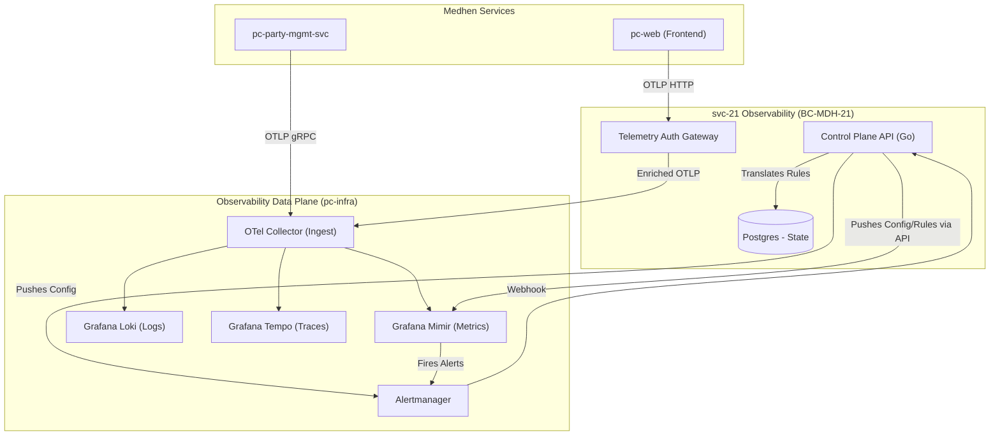

# svc-21: Observability Control Plane Specification (v1)

| Field | Detail |
|:------|:-------|
| **Document ID** | MDH-SVC-SPEC-PC-21-v1 |
| **Service ID** | `svc-21` |
| **Service Name** | Observability Control Plane (OBS) |
| **Bounded Context** | `BC-MDH-21` — Observability & Telemetry |
| **Version** | 1.0 |
| **Status** | Approved |
| **Date** | 2026-07-16 |
| **Classification** | Internal — Confidential |
| **Tier** | Tier-1 |
| **Deploy Mode** | Microservice (`pc-observability-svc`) + Sidecars |
| **Target Repo** | `Platform Core/dev/services/pc-observability-svc` |
| **Phase** | Phase 0 (Pilot MVP) |
| **PRD Anchor** | [Platform Core PRD](../../../../../../docs/prd/Medhen-Platform-PRD.md) |
| **Methodologies** | OTLP, SLO-as-Code, Multi-Tenancy, GitOps, Control Plane / Data Plane Separation |

**Revision history**

| Version | Date | Summary |
|:---|:---|:---|
| 1.0 | 2026-07-16 | Initial Tier-1 specification. Establishes the service as an active Control Plane for dynamic tenant provisioning, SLO management, and OTel Gateway authentication. |

---

## Document Structure Overview

1. **Service Overview**
2. **Technology Stack & Architecture**
3. **Functional Requirements & State Machines**
4. **Domain Model & Events (Tactical DDD)**
5. **API Specifications (REST & gRPC)**
6. **Event Schemas & Contracts (Avro)**
7. **Behaviour-Driven Scenarios (BDD)**
8. **Data Ownership & Persistence Schema**
9. **Integration & Dependency Contracts**
10. **Non-Functional Requirements & SLOs**
11. **Observability Specification**
12. **Operational Runbooks**
13. **Engineering Definition of Done (DoD)**

---

## 1. Service Overview

### 1.1 Mission Statement

`svc-21` Observability Control Plane (`BC-MDH-21`) acts as the active, programmatic orchestrator for the Medhen Platform's telemetry infrastructure. Rather than relying on static, disconnected YAML configurations for Prometheus and Grafana, this service provides an API-driven control plane for managing Service Level Objectives (SLOs), dynamically provisioning Grafana Mimir/Loki tenants for multi-product isolation, and managing the OpenTelemetry (OTel) Gateway.

It separates the "Control Plane" (this service) from the "Data Plane" (Mimir, Loki, Tempo, OTel Collectors). It empowers product teams to declare "SLO-as-Code" via APIs, which the service then translates into actual Prometheus recording rules, Alertmanager configurations, and Grafana dashboard assets.

### 1.2 Business Context

| Aspect | Description |
|:-------|:------------|
| **Problem Space** | Enterprise telemetry often degrades into "alert fatigue" and unmanageable, monolithic Prometheus configurations. Multi-tenancy (isolating metrics by Line of Business or deployment) is historically difficult to automate securely. |
| **Value Delivered** | Ensures 100% automated provisioning of observability resources when new products launch. Guarantees that every new microservice complies with Tier-0/Tier-1 SLO standards. Protects the Data Plane by serving as an authenticated ingress gateway for frontend/mobile telemetry. |
| **Stakeholders** | Site Reliability Engineers (SREs), Platform Engineers, Product Owners (SLO monitoring). |

### 1.3 Business Capabilities Delivered

| Capability (CAP) | Description | Phase |
|:---|:---|:---|
| `CAP-OBS-001` | **Dynamic Tenant Provisioning:** API to provision isolated Mimir (Metrics) and Loki (Logs) tenants per Line of Business (LOB). | 0 |
| `CAP-OBS-002` | **Programmable SLO Management:** REST API to register SLOs (e.g., 99.9% availability, P95 < 200ms latency), which are dynamically translated into Mimir recording rules. | 0 |
| `CAP-OBS-003` | **Telemetry Gateway Auth:** Acts as an auth proxy for OTel data originating from untrusted sources (e.g., `pc-web` frontend, mobile apps) before routing to the core OTel Collector. | 0 |
| `CAP-OBS-004` | **Alert Routing & Escalation:** Manages the mapping of alert thresholds to destination webhooks (PagerDuty, Slack, Email) based on service Tier and Bounded Context. | 1 |
| `CAP-OBS-005` | **Audit Sync / Cold Storage:** Orchestrates the periodic export of immutable Loki audit logs to MinIO/S3 for compliance and long-term retention. | 1 |

### 1.4 Bounded Context Responsibilities (`BC-MDH-21`)

| Owns | Exposes | Produces (via Outbox) | Invariants |
|:---|:---|:---|:---|
| `SLO` definitions | REST CRUD API | `pc.observability.slo_breached.v1` | An SLO must target an existing Mimir metric. |
| `Tenant` metadata | gRPC / REST API | `pc.observability.tenant_created.v1` | Tenant IDs are immutable UUIDs. |
| Alert Configurations | Internal gRPC API | `pc.observability.alert_triggered.v1` | Tier-0 alerts must have at least one paging route. |

### 1.5 Context Map



---

## 2. Technology Stack & Architecture

### 2.0 Operations-Plane Architecture Narrative

The architecture strictly delineates state from telemetry. The **Control Plane** (this service, backed by PostgreSQL) holds the desired state of the world: who the tenants are, what the SLOs are, and where alerts should go.

The **Data Plane** consists of the highly scalable Grafana stack (Mimir, Loki, Tempo) deployed via Kubernetes/Docker Compose. The Control Plane continuously reconciles its Postgres state with the Data Plane using the Mimir/Loki Ruler APIs, effectively making it a specialized Kubernetes Operator but operating at the application layer to allow for business logic (like tying an SLO to a specific Insurance Product).

### 2.1 Technology Selection

| Layer | Technology | Rationale |
|:---|:---|:---|
| Language / runtime | **Go 1.26.x** | Fast, excellent ecosystem for OTel and Prometheus rule parsing. |
| Control Plane API | **gRPC & REST** | For internal and portal-based management. |
| Primary Store | **PostgreSQL 16.x** | Storing Tenant, SLO, and Alert configurations. |
| Data Plane (Metrics) | **Grafana Mimir** | Horizontally scalable, highly available, multi-tenant Prometheus storage. |
| Data Plane (Logs) | **Grafana Loki** | Cost-effective, label-indexed log storage. |
| Data Plane (Traces) | **Grafana Tempo** | High-volume distributed tracing storage. |
| Ingestion Agent | **OpenTelemetry Collector** | Vendor-agnostic, standard telemetry pipeline. |

---

## 3. Functional Requirements & State Machines

### 3.1 Detailed Requirement Catalog (RFC 2119)

#### 3.1.1 Dynamic Tenant Provisioning (`FR-OBS-TEN-*`)
- **FR-OBS-TEN-1:** The service SHALL expose an API to create a `Tenant`. A Tenant represents a logical isolation boundary (e.g., a specific Line of Business like "Motor" or "Life").
- **FR-OBS-TEN-2:** Upon Tenant creation, the service SHALL generate cryptographic API keys used by the OTel Collector to inject the `X-Scope-OrgID` header when writing to Mimir/Loki.

#### 3.1.2 Programmable SLOs (`FR-OBS-SLO-*`)
- **FR-OBS-SLO-1:** The service SHALL allow registration of an `SLO`. It requires a target percentage (e.g., `99.9`), a time window (e.g., `28d`), a SLI metric query (e.g., `sum(rate(grpc_server_handled_total{grpc_code="OK"}[5m])) / sum(rate(grpc_server_handled_total[5m]))`), and an Alerting Policy.
- **FR-OBS-SLO-2:** The service SHALL translate the `SLO` entity into Prometheus Recording Rules (for fast querying) and Alerting Rules (for multi-burn-rate alerting) and push them to the Mimir Ruler API.
- **FR-OBS-SLO-3:** If the Mimir Ruler API is unavailable, the service SHALL queue the translation job using the Transactional Outbox pattern until successful.

#### 3.1.3 Telemetry Gateway (`FR-OBS-GW-*`)
- **FR-OBS-GW-1:** The service SHALL run an OTLP-compatible proxy for external clients (e.g., web portals).
- **FR-OBS-GW-2:** The Gateway SHALL validate the incoming JWT token (via `pc-iam-svc`), extract the user ID and tenant context, and inject these as Resource Attributes into the OTel spans/metrics before forwarding them to the internal OTel Collector.
- **FR-OBS-GW-3:** The Gateway SHALL rate-limit external telemetry to prevent DoS attacks against the Data Plane.

### 3.2 State Machine Definition (SLO Lifecycle)

| Current State | Trigger Command | Target State | Post-conditions |
|:---|:---|:---|:---|
| `—` | `CreateSLO` | `SYNCING` | Postgres record created; async job spawned. |
| `SYNCING` | `MimirAcknowledge` | `ACTIVE` | Rules successfully applied to Mimir Data Plane. |
| `ACTIVE` | `BreachThreshold` (Webhook) | `BREACHED` | Alerts dispatched to external systems. |
| `BREACHED` | `BurnRateNormalized` | `ACTIVE` | Breach incident closed. |
| `ACTIVE` | `DeactivateSLO` | `ARCHIVED` | Rules deleted from Mimir; Postgres record soft-deleted. |

---

## 4. Domain Model & Events (Tactical DDD)

### 4.1 Aggregate Roots

| Aggregate Root | Definition & Invariants | Emitted Events |
|:---|:---|:---|
| **`Tenant`** | The isolation boundary. Invariants: Name must be unique. | `TenantProvisioned` |
| **`SLO`** | A Service Level Objective. Invariants: Must belong to a valid Tenant. Target must be 0 < x < 100. | `SLOCreated`, `SLOSynced`, `SLOBreached` |
| **`AlertPolicy`** | Routing logic for alerts (e.g., Slack channel, PagerDuty). Invariants: Must have at least one valid destination. | `AlertPolicyUpdated` |

### 4.2 Entities vs Value Objects

| Concept | Type | Justification |
|:---|:---|:---|
| `SLO` | Entity (Root) | Possesses global identity (`slo_id`). Can be updated over time. |
| `BurnRateRule` | Value Object | Specific thresholds derived from the SLO. Fully replaced when SLO changes. |
| `AlertDestination` | Value Object | e.g., a Webhook URL. No distinct lifecycle outside the Policy. |

---

## 5. API Specifications (REST & gRPC)

### 5.1 REST API (Control Plane Management)

**Base path:** `/api/pc-observability/v1`

| Method | Endpoint | Purpose | Security / RBAC |
|:---|:---|:---|:---|
| `POST` | `/tenants` | Provision a new tenant boundary | `platform.admin` |
| `POST` | `/slos` | Create a new SLO for a service | `service.owner` |
| `GET`  | `/slos/{id}/status` | Get current error budget and burn rate | `service.read` |
| `POST` | `/alerts/policies` | Configure alert routing | `service.owner` |

#### 5.1.1 Payload Example: `CreateSLO`
```json
{
  "name": "pc-party-mgmt-svc-latency",
  "tenant_id": "T-1001",
  "description": "Party Service P95 Latency",
  "type": "LATENCY",
  "target_percentage": 99.9,
  "window_days": 28,
  "sli_query": "histogram_quantile(0.95, sum(rate(grpc_server_handling_seconds_bucket{job=\"pc-party-mgmt-svc\"}[5m])) by (le))",
  "threshold_ms": 200,
  "alert_policy_id": "AP-5544"
}
```

### 5.2 OTLP Gateway API

**Base path:** `/v1/traces`, `/v1/metrics`
Accepts standard OTLP HTTP/Protobuf payloads but mandates an `Authorization: Bearer <JWT>` header.

---

## 6. Event Schemas & Contracts (Avro)

Events emitted to Kafka by the Control Plane.

### 6.1 `pc.observability.slo_breached.v1`
Emitted when Alertmanager fires a webhook indicating an SLO multi-burn rate threshold has been crossed.
```json
{
  "type": "record",
  "name": "SLOBreached",
  "namespace": "medhen.observability",
  "fields": [
    { "name": "incident_id", "type": "string" },
    { "name": "slo_id", "type": "string" },
    { "name": "tenant_id", "type": "string" },
    { "name": "service_name", "type": "string" },
    { "name": "burn_rate", "type": "double" },
    { "name": "error_budget_consumed_pct", "type": "double" },
    { "name": "timestamp", "type": "long", "logicalType": "timestamp-millis" }
  ]
}
```

---

## 7. Behaviour-Driven Scenarios (BDD)

### 7.1 Scenario: Dynamic SLO Creation

```gherkin
Feature: Programmable SLO
  As a Service Owner
  I want to define an SLO via API
  So that I don't have to write complex PromQL recording rules manually

  Scenario: Creating a latency SLO
    Given a valid Tenant "core-insurance" exists
    When I submit a POST to "/slos" with target "99.9%" and threshold "200ms" for "pc-policy-svc"
    Then the system creates the SLO record in Postgres
    And the system translates this into 4 multi-burn-rate Prometheus rules
    And the system successfully pushes the rules to the Mimir Ruler API
    And the SLO status becomes ACTIVE
```

### 7.2 Scenario: External Frontend Telemetry Ingestion

```gherkin
Feature: Telemetry Gateway
  As the Frontend App
  I want to send performance traces securely
  So that the platform can measure end-user latency

  Scenario: Sending an authenticated trace
    Given I have a valid JWT for User "U-77"
    When I POST an OTLP trace payload to the Gateway with the JWT
    Then the Gateway validates the JWT via pc-iam-svc
    And the Gateway injects "user.id=U-77" as a span attribute
    And the Gateway forwards the payload to the internal OTel Collector
```

---

## 8. Data Ownership & Persistence Schema

### 8.1 PostgreSQL (Control Plane State)

| Table | Primary Key | Critical Columns | Relationships |
|:---|:---|:---|:---|
| `tenants` | `tenant_id` (UUID) | `name`, `status`, `api_key_hash` | None |
| `slos` | `slo_id` (UUID) | `tenant_id`, `name`, `target`, `sli_query`, `status`, `version` | Belongs to `tenants` |
| `alert_policies` | `policy_id` (UUID)| `tenant_id`, `name`, `routing_json` | Belongs to `tenants` |
| `outbox` | `event_id` (UUID) | `aggregate_type`, `payload`, `published_at` | Global |

---

## 9. Integration & Dependency Contracts

### 9.1 Upstream Dependencies
- **`pc-iam-svc` (Sync):** The Gateway relies on IAM to validate JWTs and introspect scopes.
- **Mimir/Loki Ruler APIs (Sync):** The Control Plane calls these external APIs to configure the Data Plane.

### 9.2 Downstream Consumers
- **All Medhen Services (OTLP):** All services push telemetry to the OTel Collector.
- **`pc-audit-svc` (Async):** May consume `SLOBreached` events for long-term governance auditing.

---

## 10. Non-Functional Requirements & SLOs

Because this is the Observability system, its NFRs represent "meta-observability".

| Metric | Target | Rationale |
|:---|:---|:---|
| **Control Plane Availability** | 99.9% | Failure prevents new SLO creation, but *does not* impact telemetry ingestion (Data Plane). |
| **Gateway Availability** | 99.99% | Failure causes dropped traces from external clients. |
| **Gateway Latency** | P95 < 20ms | Minimal overhead on frontend trace submissions. |

---

## 11. Observability Specification

How the Observability Control Plane observes itself:

1. **Metrics:**
   - `obs_gateway_requests_total`: Throughput of external telemetry.
   - `obs_slo_sync_errors_total`: Failures when pushing rules to Mimir.
2. **Traces:**
   - The Control Plane API calls to Mimir/Loki are fully traced.
   - The Gateway adds linking spans to incoming external traces.

---

## 12. Operational Runbooks

### 12.1 Handling Mimir Ruler Desync
If Mimir restarts and loses its rule state, the Control Plane exposes a manual reconciliation endpoint:
`POST /api/pc-observability/v1/ops/reconcile-all`
This reads all `ACTIVE` SLOs from Postgres and forcefully overwrites the Mimir ruler configurations.

### 12.2 Gateway Rate Limiting Activation
If external clients flood the Gateway, Redis-backed rate limiting automatically engages. SREs can adjust the threshold dynamically via `PUT /api/pc-observability/v1/config/rate-limit`.

---

## 13. Engineering Definition of Done (DoD)

1. **Test Coverage:** > 85% line coverage; Mimir integration mocked via testcontainers.
2. **Schema:** Postgres migrations authored via `golang-migrate`; outbox configured.
3. **Docs:** OpenAPI 3.1 specs published to the Dev Portal.
4. **Security:** Gateway JWT validation fully tested against a Keycloak container.
5. **Helm:** The service is packaged as two distinct deployments: `obs-control-plane` and `obs-gateway`.
