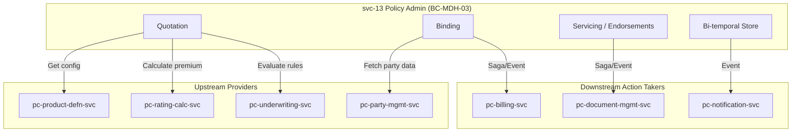

# svc-13: Policy Administration Engine Specification (v1)

| Field | Detail |
|:------|:-------|
| **Document ID** | MDH-SVC-SPEC-PC-13-v1 |
| **Service ID** | `svc-13` |
| **Service Name** | Policy Administration Engine |
| **Bounded Context** | `BC-MDH-03` — Policy Administration |
| **Version** | 1.0 |
| **Status** | Draft |
| **Date** | 2026-07-17 |
| **Classification** | Internal — Confidential |
| **Tier** | Tier-0 |
| **Deploy Mode** | Microservice (`pc-policy-svc`) |
| **Target Repo** | `Platform Core/dev/pc-policy-svc` |
| **Phase** | Phase 1 |
| **PRD Anchor** | [Platform Core PRD](../prd/Medhen-Platform-PRD.md) (`REQ-PRD-*`) |
| **Capability Anchor** | [Capability Doc BC-MDH-03](../prd/Medhen-Platform-Capability-Document.md#bc-mdh-03--policy-administration-pc-policy-svc) |
| **Capabilities** | `CAP-POL-001` to `CAP-POL-007` |
| **Methodologies** | DDD · Hexagonal · EDA · CQRS-lite · Transactional Outbox · Bi-temporal Versioning |
| **Companion Specs** | `svc-10` Product Definition · `svc-11` Rating Engine · `svc-12` Underwriting |

**Revision history**

| Version | Date | Summary |
|:---|:---|:---|
| 1.0 | 2026-07-17 | Initial Tier-0 specification. Drafted against PRD capabilities (`CAP-POL-001` through `007`). |

---

## Document Structure Overview

1. **Service Overview**
2. **Technology Stack**
3. **Functional Requirements**
4. **Domain Model & Events (Tactical DDD)**
5. **API Specifications**
6. **Event Schemas & Contracts (Avro)**
7. **Behaviour-Driven Scenarios (BDD)**
8. **Data Ownership & Persistence**
9. **Integration & Dependency Contracts**
10. **Non-Functional Requirements & SLOs**
11. **Observability Specification**
12. **Operational Runbooks**
13. **Engineering Definition of Done (DoD)**

---

## 1. Service Overview

### 1.1 Mission Statement

`svc-13` Policy Administration Engine (`BC-MDH-03`) is the **central nervous system** of the Medhen Platform. It owns the complete policy lifecycle—quotation → binding → issuance → endorsement → renewal → cancellation → expiry/lapse—with strict **bi-temporal versioning**, ensuring that any policy state is reconstructable at both business-time (effective date) and system-time (transaction date). 

The service is completely LOB-agnostic: the lifecycle state machine is identical whether the insured item is a vehicle, a life, or a cargo shipment; LOB specifics are provided dynamically via the risk schema definitions (`BC-MDH-20` / Kernel extension).

The service owns the following strict responsibilities:
1. **Quotation Management** — Creating, pricing, comparing, and managing the validity of quotes.
2. **Policy Lifecycle & State Machine** — Managing the progression from DRAFT quote through BOUND, ACTIVE, CANCELLED, etc.
3. **Mid-Term Adjustments (Endorsements)** — Managing out-of-sequence endorsements with automatic pro-rata/short-rate premium adjustments and bi-temporal state tracking.
4. **Renewals & Cancellations** — Orchestrating renewal invitations, NCD loading, and strict cancellation workflows.
5. **Bi-Temporal Auditability** — Maintaining an immutable history of what was known, and when it became effective.

### 1.2 Product Context

`svc-13` consumes generic JSONB structures to support diverse lines of business without core code changes. It references product configurations defined by `pc-product-defn-svc` (`BC-MDH-02`).

### 1.3 Business Context

| Aspect | Description |
|:-------|:------------|
| **Problem** | Traditional core systems struggle with out-of-sequence endorsements and retro-active cancellations, leading to data corruption and incorrect billing. |
| **Value** | By enforcing bi-temporal data structures from day 1, `svc-13` guarantees 100% accurate historical reconstruction of risk, enabling perfect pro-rata billing and bulletproof auditability for regulators. |
| **Stakeholders** | Operations, Underwriters, Brokers/Agents, Policyholders, Regulatory Compliance Officers. |

### 1.4 Business Capabilities Delivered

| Capability (CAP) | Description | Primary Phase |
|:---|:---|:---|
| `CAP-POL-001` | Quotation management (wizard, calculate, validities) | 1 |
| `CAP-POL-002` | Policy binding (number generation, cover note, effective dating) | 1 |
| `CAP-POL-003` | Policy issuance (schedules, certificates, dispatch) | 1 |
| `CAP-POL-004` | Policy servicing (endorsements, bi-temporal versioning) | 1 |
| `CAP-POL-005` | Policy renewal (identification, quoting, acceptance, lapse) | 1 |
| `CAP-POL-006` | Policy cancellation (pro-rata/short-rate, cooling off) | 1 |
| `CAP-POL-007` | Policy search & retrieval (timeline, fast lookup) | 1 |

### 1.5 In-Scope / Out-of-Scope Responsibilities

**In-Scope:**
* Quotation and policy state machine enforcement.
* Bi-temporal versioning of policy state.
* Integration orchestration (Calling rating, triggering billing, triggering documents).
* Event emission (`pc.policy.*`) via transactional outbox.

**Out-of-Scope:**
* Rate calculation execution (owned by `pc-rating-calc-svc`).
* Underwriting execution logic (owned by `pc-underwriting-svc`).
* Product/Coverage configuration (owned by `pc-product-defn-svc`).
* Customer/Party identity (owned by `pc-party-mgmt-svc`).
* Payment collection & Invoicing (owned by `pc-billing-svc`).

### 1.6 Context Map



---

## 2. Technology Stack

### 2.0 Operations-Plane Architecture Narrative

`svc-13` is a highly transactional, **write-heavy and strictly consistent** service. Unlike read-heavy configuration services, policy administration requires complex sagas (cross-service transactions) for operations like binding (reserving funds, issuing documents, updating policy state). It implements the Saga pattern for cross-BC orchestration and strictly utilizes Bi-temporal modeling in PostgreSQL to ensure no update ever destructs historical truth.

### 2.1 Technology Selection

| Layer | Technology | Rationale |
|:---|:---|:---|
| Language / runtime | **Go 1.26.x** | Optimized for complex concurrent state machines |
| API — external/UI | **REST/JSON**, OpenAPI 3.1 | Core API for frontend quoting applications |
| API — internal | **gRPC** | Internal querying by claims or billing |
| Primary store | **PostgreSQL 18.x** | ACID guarantees; JSONB for flexible risk payloads; range types for bi-temporal data |
| Event backbone | **Kafka** + **Avro** | Durable `pc.policy.*` topics |
| Outbox relay | **Transactional outbox** | Atomic commit of policy state and domain events |
| Distributed Tracing | **OpenTelemetry** | Mandatory for debugging sagas across boundaries |

### 2.2 Configuration Reference

| Key | Default | Purpose |
|:---|:---|:---|
| `policy.quote_validity_days` | `30` | Default days a quote remains valid before expiry |
| `policy.number_format` | `EIC/{LOB}/{YYYY}/{SEQ}` | Template for bound policy IDs |
| `saga.bind_timeout` | `10s` | Maximum time to wait for billing response during bind |

---

## 3. Functional Requirements

### 3.1 Functional Requirement Catalog

#### 3.1.1 Quotation Management (`FR-POL-QUO-*`)
- **FR-POL-QUO-1 — Create Quote.** The service SHALL expose `POST /v1/quotes` to initiate a quote mapping to an active `product_id`. The quote SHALL be assigned a validity period.
- **FR-POL-QUO-2 — Rating Integration.** The service SHALL invoke `pc-rating-calc-svc` synchronously to obtain premium calculations for the specified risk payload.
- **FR-POL-QUO-3 — Underwriting Integration.** The service SHALL invoke `pc-underwriting-svc` to determine if the quote is `AUTO_ACCEPT`, `REFER`, or `DECLINE`.

#### 3.1.2 Policy Binding & Issuance (`FR-POL-BND-*`)
- **FR-POL-BND-1 — Bind Execution.** The service SHALL expose an endpoint to accept a quote, transition it to `BOUND`, and generate a globally unique Policy Number.
- **FR-POL-BND-2 — Financial Saga.** Binding SHALL trigger a Saga with `pc-billing-svc` to ensure payment or credit limits are verified before finalizing the `BOUND` state.
- **FR-POL-BND-3 — Document Generation.** Upon transitioning to `BOUND` or `ACTIVE`, the service SHALL asynchronously request `pc-document-mgmt-svc` to generate the Policy Schedule and Certificate of Insurance.

#### 3.1.3 Servicing & Endorsements (`FR-POL-END-*`)
- **FR-POL-END-1 — Mid-Term Adjustments.** The service SHALL allow capturing a mid-term amendment (e.g., adding a driver). This creates a new Policy Version.
- **FR-POL-END-2 — Premium Recalculation.** The service SHALL automatically calculate the pro-rata or short-rate premium difference for the remainder of the policy term.
- **FR-POL-END-3 — Out-of-Sequence Re-rating.** If an endorsement is back-dated prior to a recent change, the service SHALL automatically ripple the change and recalculate all subsequent versions.

#### 3.1.4 Bi-Temporal Versioning (`FR-POL-BTP-*`)
- **FR-POL-BTP-1 — Immutability.** A saved policy version is absolutely immutable. Any correction, even for a typo, MUST create a new system-time record.
- **FR-POL-BTP-2 — Effective & Transaction Time.** Every policy version SHALL define `effective_period` (when it is true in the real world) and `system_period` (when it was recorded in the database).

### 3.2 State Machine Definition

| From State | Trigger Action | To State | Guards & Preconditions |
|:---|:---|:---|:---|
| `—` | `CreateQuote` | `DRAFT` | Valid schema mapping to active product |
| `DRAFT` | `Calculate` | `QUOTED` / `REFERRED` | Underwriting engine response |
| `QUOTED` | `Accept` | `ACCEPTED` | Within validity period |
| `ACCEPTED` | `Bind` | `BOUND` | Payment verified via Billing Saga |
| `BOUND` | `TimePasses` | `ACTIVE` | `effective_from` reached |
| `ACTIVE` | `Endorse` | `ACTIVE` | Creates new bi-temporal version |
| `ACTIVE` | `Cancel` | `CANCELLED` | — |
| `ACTIVE` | `TimePasses` | `EXPIRED` | `effective_to` reached |

### 3.3 Regulatory & Compliance Mapping

| Capability | Regulatory Driver | Impact on Architecture |
|:---|:---|:---|
| Certificate of Insurance & motor sticker | NBE Reg. 554/2024 (compulsory motor TP) | Synchronous issuance orchestration with `pc-document-mgmt-svc` |
| Cooling-off / cancellation rights | UK conduct (ICOBS) | Enforces precise pro-rata/short-rate refund calculations during cancellation |
| Bi-temporal audit of policy states | NBE record-keeping; 7-year retention | Necessitates the `tsrange` PostgreSQL bi-temporal data model |
| Refund correctness | Financial correctness; consumer fairness | Zero-tolerance for rounding errors in premium calculation during endorsements |

---

## 4. Domain Model & Events (Tactical DDD)

### 4.1 Aggregate Roots

| Aggregate Root | Definition & Invariants | Emitted Events |
|:---|:---|:---|
| **`Quote`** | A pre-contract proposal. <br>• Once converted to a policy, it is read-only.<br>• Valid only until `expires_at`. | `QuoteCreated`, `QuoteRated`, `QuoteReferred` |
| **`Policy`** | The formalized contract. Owns the timeline of `PolicyVersion` records.<br>• Policy number is permanent.<br>• Must have at least one active version if `ACTIVE`. | `PolicyBound`, `PolicyIssued`, `PolicyEndorsed`, `PolicyCancelled`, `PolicyRenewed` |

### 4.2 Bi-Temporal Entities

| Entity | Type | Justification |
|:---|:---|:---|
| `PolicyVersion` | Entity (Local to Policy) | Represents the state of the policy for a specific `effective_period` and `system_period`. Holds the generic JSONB risk payload. |
| `Coverage` | Value Object | Bound to a specific `PolicyVersion`. |

### 4.3 Command Catalog

| Command | Aggregate | Pre-conditions | Domain Exception |
|:---|:---|:---|:---|
| `CreateQuote` | `Quote` | Valid product ID | `ProductNotActive` |
| `BindPolicy` | `Quote` | Quote status `ACCEPTED` | `QuoteExpired`, `BillingFailed` |
| `CreateEndorsement` | `Policy` | Policy status `ACTIVE` | `InvalidEndorsementDate` |
| `CancelPolicy` | `Policy` | Policy status `ACTIVE` | `PolicyAlreadyCancelled` |

---

## 5. API Specifications

Base path: `/api/pc-policy/v1`

### 5.1 REST API (Commands & UI Queries)

| Method | Endpoint | Purpose | Idempotency | Auth / Scope |
|:---|:---|:---|:---|:---|
| `POST` | `/quotes` | Create a new quote | Required | OAuth2 + RBAC (Agent/UW/Branch) |
| `POST` | `/quotes/{id}/calculate` | Re-trigger rating and UW | Required | OAuth2 + RBAC (Agent/UW/Branch) |
| `POST` | `/quotes/{id}/accept` | Accept the quoted terms | Required | OAuth2 + RBAC (Agent/UW/Branch) |
| `POST` | `/policies` | Bind an accepted quote | Required | OAuth2 + RBAC |
| `POST` | `/policies/{id}/endorsements` | Initiate mid-term change | Required | OAuth2 + RBAC |
| `POST` | `/policies/{id}/cancel` | Cancel policy | Required | OAuth2 + RBAC |
| `GET` | `/policies/{id}` | Retrieve current policy state | N/A | OAuth2 + RBAC (branch-scoped) |
| `GET` | `/policies/search` | Search by policy number, customer, item | N/A | OAuth2 + RBAC (branch-scoped) |
| `GET` | `/policies/{id}/timeline` | Retrieve bi-temporal timeline | N/A | OAuth2 + RBAC (branch-scoped) |

### 5.2 Error Taxonomy

| Domain Exception | HTTP Code | Error Code | Client Action |
|:---|:---|:---|:---|
| `QuoteExpired` | `422 Unprocessable Entity` | `POL-1001` | Customer must request a new quote. |
| `ProductNotActive` | `400 Bad Request` | `POL-1002` | Select a currently active product version. |
| `InvalidEndorsementDate` | `422 Unprocessable Entity` | `POL-1003` | Date cannot precede original policy inception. |
| `OptimisticLockException` | `409 Conflict` | `SYS-0002` | Refetch resource and retry. |

---

## 6. Event Schemas & Contracts (Avro)

All state changes are emitted to Kafka via outbox.

### 6.1 Topic Mapping

| Event | Topic | Partition Key | Schema ID |
|:---|:---|:---|:---|
| `PolicyBound`, `PolicyIssued` | `pc.policy.lifecycle.v1` | `tenant_id:policy_id` | `PolicyLifecycleEvent` |
| `PolicyEndorsed` | `pc.policy.servicing.v1` | `tenant_id:policy_id` | `PolicyEndorsementEvent` |
| `PolicyCancelled` | `pc.policy.servicing.v1` | `tenant_id:policy_id` | `PolicyCancellationEvent` |

### 6.2 Avro Schema: `PolicyLifecycleEvent`

```json
{
  "namespace": "medhen.pc.policy.v1",
  "type": "record",
  "name": "PolicyLifecycleEvent",
  "fields": [
    {"name": "event_id", "type": "string", "logicalType": "uuid"},
    {"name": "tenant_id", "type": "string"},
    {"name": "policy_id", "type": "string"},
    {"name": "policy_number", "type": "string"},
    {"name": "product_code", "type": "string"},
    {"name": "party_id", "type": "string"},
    {"name": "action", "type": {"type": "enum", "name": "Action", "symbols": ["BOUND", "ISSUED", "ACTIVATED", "EXPIRED"]}},
    {"name": "total_premium", "type": "string"},
    {"name": "effective_from", "type": {"type": "long", "logicalType": "timestamp-millis"}},
    {"name": "effective_to", "type": {"type": "long", "logicalType": "timestamp-millis"}},
    {"name": "occurred_at", "type": {"type": "long", "logicalType": "timestamp-millis"}}
  ]
}

### 6.3 Consumed Events

The service listens to downstream orchestration components to complete state machine transitions.

| Topic | Producer | Expected Action |
|:---|:---|:---|
| `pc.billing.payment.received.v1` | `BC-MDH-07` (Billing) | Confirms payment for a `ACCEPTED` quote, advancing it to `BOUND`, or reinstates a suspended policy. |
| `pc.billing.payment.overdue.v1` | `BC-MDH-07` (Billing) | Triggers suspension or lapse logic per the product's grace period rules. |
| `pc.underwriting.referral.decided.v1` | `BC-MDH-05` (UW) | Advances a `REFERRED` quote to `ACCEPTED` or `DECLINED` based on underwriter decision. |
```

---

## 7. Behaviour-Driven Scenarios (BDD)

**Scenario: POL-BDD-01 | Successful Policy Bind**
* **Given** a Quote `Q-100` in `ACCEPTED` state
* **When** an agent submits a `BindPolicy` command
* **Then** the Billing Saga is initiated
* **And** upon payment success, the Quote transitions to `BOUND`
* **And** a formal Policy record is created with a generated number
* **And** a `PolicyBound` event is published

**Scenario: POL-BDD-02 | Out-of-Sequence Endorsement**
* **Given** an `ACTIVE` Policy valid from Jan 1 to Dec 31
* **And** a previous endorsement was applied effective Mar 1
* **When** an agent submits a new endorsement effective Feb 1
* **Then** the service recalculates premium for the Feb 1 - Mar 1 period
* **And** automatically ripples changes into the Mar 1 - Dec 31 period
* **And** emits a `PolicyEndorsed` event with pro-rata differences

---

## 8. Data Ownership & Persistence

### 8.1 PostgreSQL DDL (Bi-temporal)

`svc-13` relies heavily on PostgreSQL's `tsrange` (timestamp ranges) to enforce bi-temporal constraints.

```sql
CREATE EXTENSION IF NOT EXISTS btree_gist;

CREATE TABLE policies (
    id UUID PRIMARY KEY,
    tenant_id VARCHAR(36) NOT NULL,
    policy_number VARCHAR(100) UNIQUE NOT NULL,
    product_id UUID NOT NULL,
    party_id UUID NOT NULL,
    status VARCHAR(30) NOT NULL,
    created_at TIMESTAMPTZ DEFAULT CURRENT_TIMESTAMP
);

CREATE TABLE policy_versions (
    id UUID PRIMARY KEY,
    policy_id UUID REFERENCES policies(id) ON DELETE CASCADE,
    version_seq INT NOT NULL,
    risk_payload JSONB NOT NULL,
    total_premium NUMERIC(15, 2) NOT NULL,
    
    -- Bi-temporal axes
    effective_period tstzrange NOT NULL,
    system_period tstzrange NOT NULL DEFAULT tstzrange(CURRENT_TIMESTAMP, 'infinity'),
    
    -- Prevent overlapping effective dates for currently known system truth
    EXCLUDE USING gist (
        policy_id WITH =,
        effective_period WITH &&,
        system_period WITH &&
    )
);
```

### 8.2 Data Classification & Privacy

| Data Domain | Classification | Residency Constraints | Notes |
|:---|:---|:---|:---|
| Policy Numbers & Dates | Internal | None | Identifiers |
| Risk Payload (Insured Items) | **Confidential/PII** | In-country | Contains specifics like VINs, Health data, Property addresses. Strict RBAC required. |
| Premium Amounts | **Confidential** | In-country | Financial data. |

---

## 9. Integration & Dependency Contracts

### 9.1 Dependency Matrix

| Service | Contract | Coupling | Timeout | Fallback |
|:---|:---|:---|:---|:---|
| **`pc-rating-calc-svc`** | `CalculatePremium` | Sync (gRPC) | 2s | Fail quote creation |
| **`pc-underwriting-svc`** | `EvaluateRules` | Sync (gRPC) | 2s | Default to `REFER` |
| **`pc-party-mgmt-svc`** | `GetParty` | Sync (gRPC) | 1s | Fail bind |
| **`pc-billing-svc`** | `ReserveFunds` | Saga / Async | 10s | Saga Rollback |
| **`pc-document-mgmt-svc`** | `GenerateDocs` | Async (Kafka) | N/A | Eventual consistency |

---

## 10. Non-Functional Requirements & SLOs

### 10.1 Service Level Objectives (SLOs)

| Metric | SLO | Consequence of Breach | Measurement |
|:---|:---|:---|:---|
| **Availability** | 99.99% | Entire platform halted. Core Tier-0 capability offline. | Prometheus: successful / total |
| **Latency (Reads)** | P95 < 100ms | Sluggish UI for agents and brokers. | OpenTelemetry span duration |
| **Latency (Bind Saga)** | P95 < 5s | Agents left hanging during critical financial commit. | End-to-end trace duration |
| **Data Integrity** | 100% | Regulatory fines; incorrect billing. | Automated reconciliation jobs |

---

## 11. Observability Specification

The service utilizes the standard `pc-telemetry-sdk`.

### 11.1 Golden Signals

- **Traffic:** `http_server_requests_total{path="/api/pc-policy/v1/policies"}`
- **Latency:** `http_server_request_duration_seconds_bucket`
- **Business:** `policy_bound_total{lob="motor"}`, `quote_conversion_rate`

---

## 12. Operational Runbooks

### 12.1 Bind Saga Stuck

**Symptom:** Quote is stuck in `ACCEPTED` or `PENDING_BIND`, customer claims money was taken.
**Action:**
1. Check `pc-billing-svc` logs for payment confirmation failure.
2. Manually replay the saga callback using the admin endpoint:
   ```bash
   curl -X POST https://api.medhen.internal/pc-policy/v1/admin/sagas/replay/{saga_id} \
     -H "Authorization: Bearer $ADMIN_TOKEN"
   ```

---

## 13. Engineering Definition of Done (DoD)

1. **Test Coverage:** Bi-temporal versioning logic must have 100% unit test coverage.
2. **BDD Scenarios:** All scenarios in §7 pass in CI.
3. **Saga Testing:** Chaos engineering tests prove that terminating `pc-policy-svc` or `pc-billing-svc` mid-bind results in correct saga rollbacks or successful resumes.
4. **Performance:** Load tests prove 500 binds/second sustained without latency degradation.
5. **Security:** PII masking implemented in logs and risk payload fields.
