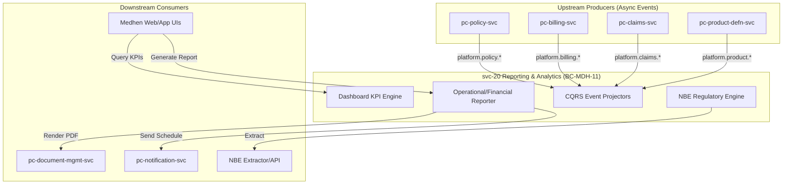

# svc-20: Reporting & Analytics Specification (v1)

| Field | Detail |
|:------|:-------|
| **Document ID** | MDH-SVC-SPEC-PC-20-v1 |
| **Service ID** | `svc-20` |
| **Service Name** | Reporting & Analytics |
| **Bounded Context** | `BC-MDH-11` — Reporting & Analytics |
| **Version** | 1.0 |
| **Status** | Draft |
| **Date** | 2026-07-18 |
| **Classification** | Internal — Confidential |
| **Tier** | Tier-1 |
| **Deploy Mode** | Microservice (`pc-reporting-svc`) |
| **Target Repo** | `Platform Core/dev/pc-reporting-svc` |
| **Phase** | Phase 2 (Foundations in Phase 1) |
| **PRD Anchor** | [Platform Core PRD](../../../docs/prd/Medhen-Platform-PRD.md) (`REQ-RPT-*`) |
| **Capability Anchor** | [Capability Doc BC-MDH-11](../../../docs/prd/Medhen-Platform-Capability-Document.md#bc-mdh-11--reporting--analytics-pc-reporting-svc) |
| **Capabilities** | `CAP-RPT-001` to `CAP-RPT-A4` |
| **Methodologies** | DDD · CQRS (Read-Side) · Event Sourcing · Materialized Views |
| **Companion Specs** | All Core BCs (Upstream Event Producers) |

**Revision history**

| Version | Date | Summary |
|:---|:---|:---|
| 1.0 | 2026-07-18 | Initial Tier-1 specification covering Sections 1-13. Drafted against PRD capabilities (`REQ-RPT-001` through `052`). |

---

## Document Structure Overview

1. **Service Overview**
2. **Technology Stack**
3. **Functional Requirements**
4. **Domain Model & Event Handling (CQRS Read-Side)**
5. **API Specifications**
6. **Event Schemas & Contracts (Kafka Consumption)**
7. **Behaviour-Driven Scenarios (BDD)**
8. **Data Ownership & Persistence**
9. **Integration & Dependency Contracts**
10. **Non-Functional Requirements & SLOs**
11. **Observability Specification**
12. **Operational Runbooks**
13. **Engineering Definition of Done (DoD)**

---

## 1. Service Overview

### 1.1 Mission Statement

`svc-20` Reporting & Analytics (`BC-MDH-11`) is the **primary CQRS read-side projection engine** for the Medhen Platform. It consumes asynchronous domain events emitted across all Bounded Contexts (Policy, Billing, Claims, Product, Party) to construct read-optimized, highly denormalized views of the platform's state. It is the analytical and regulatory authority, powering real-time executive dashboards, operational oversight, financial reconciliation, and strict National Bank of Ethiopia (NBE) regulatory reporting.

The service owns the following strict Tier-0 responsibilities:
1. **Ultra-Low Latency CQRS Projections** — Exactly-once, real-time consumption of `platform.*` events via streaming engines (e.g., Apache Flink) to build query-optimized read models with end-to-end P99 latency < 50ms.
2. **Dashboard KPIs & Metrics** — Serving sub-10ms aggregation queries for GWP, NWP, Loss Ratios, and Collection Rates using in-memory and OLAP data stores.
3. **Operational & Financial Reporting** — Generating immutable, point-in-time reports across underwriting, claims, and finance (Billing/Reinsurance).
4. **Regulatory Reporting (NBE)** — Enforcing deterministic extraction of statutory, motor third-party (Reg. 554/2024), and solvency metrics. Implements tamper-evident cryptographic sealing and an NBE-native "Examination Egress" portal for direct supervisory access without data sovereignty violations.
5. **Data Warehouse & BI Bridging** — Acting as the foundational layer and structured export point for future Phase 3 Data Warehouse, Lakehouse, and Self-Service BI toolchains.

### 1.2 Business Context

| Aspect | Description |
|:-------|:------------|
| **Problem** | Transactional domains (Policy, Billing, Claims) are heavily normalized for write-efficiency and consistency. Querying them directly for complex cross-domain aggregations, temporal reporting, or large-scale exports degrades core platform performance and violates bounded context isolation. |
| **Value** | Decouples analytical read workloads from transactional write workloads (CQRS). Enables sub-second dashboard rendering, cross-domain insights without distributed joins, and risk-free regulatory data extraction. |
| **Stakeholders** | Executive Management, Operations Managers, Finance Teams, Underwriters, Actuaries, NBE Auditors. |

### 1.3 Business Capabilities Delivered

| Capability (CAP) | Description | Primary REQ | Phase |
|:---|:---|:---|:---|
| `CAP-RPT-001` | Dashboard KPIs (GWP, NWP, loss ratio, retention, etc.) | `REQ-RPT-001` | 1-2 |
| `CAP-RPT-002` | Operational reports (production, claims, agents, renewals) | `REQ-RPT-010` | 1-2 |
| `CAP-RPT-003` | Financial reports (premium income, aging, commission) | `REQ-RPT-020` | 2 |
| `CAP-RPT-004` | Regulatory reports (NBE Quarterly, Solvency, Motor 554) | `REQ-RPT-030` | 1-2 |
| `CAP-RPT-005` | Report features (drill-down, PDF/Excel export, scheduling) | `REQ-RPT-040` | 1-2 |
| `CAP-RPT-A4` | IFRS 17 reporting (CSM, risk adjustment, disclosures) | `REQ-RPT-051` | 2 |
| `CAP-RPT-A1` | Data warehouse / lakehouse foundations | `REQ-RPT-050` | 3 |
| `CAP-RPT-A3` | Predictive analytics (churn, pricing insight, fraud) | `REQ-RPT-052` | 4 |

### 1.4 In-Scope / Out-of-Scope Responsibilities

**In-Scope:**
* Subscribing to all platform domain events (Kafka) securely and idempotently.
* Maintaining highly denormalized read models (Materialized Views, Elasticsearch indices, OLAP tables).
* Serving REST/gRPC endpoints for Dashboard UI components.
* Executing scheduled jobs for EOD/EOM/EOY report generation.
* Formatting and exporting NBE regulatory reports.
* Integration with Document Management (`svc-15`) for PDF generation of reports.

**Out-of-Scope:**
* Issuing policies, generating invoices, or paying claims (Strictly Read-Only).
* Mutating source data (Corrections must happen in the source system and flow via events).
* Complex unstructured big-data processing (Delegated to external Data Lake in Phase 3+).
* End-user notification delivery (Delegated to `pc-notification-svc`).

### 1.5 Context Map



---

## 2. Technology Stack

### 2.0 Operations-Plane Architecture Narrative

`svc-20` implements the **Read Side of the CQRS pattern**. It listens to immutable domain events via Kafka, processes them through a series of specialized projectors, and stores the state into highly optimized read models. To support both point-in-time exactitude (for finance/regulatory) and sub-second analytical aggregations (for dashboards), the service employs a polyglot persistence strategy: PostgreSQL for exact tabular reporting schemas, and an OLAP/Search engine (e.g., Elasticsearch or ClickHouse) for fast multi-dimensional aggregations and full-text searches.

### 2.1 Technology Selection

| Layer | Technology | Rationale |
|:---|:---|:---|
| Language / runtime | **Go 1.26.x** | High throughput for processing thousands of events/sec concurrently. |
| API — external/UI | **REST/JSON**, OpenAPI 3.1 | Used by UIs for dashboard rendering and report downloads. |
| Event Consumer | **Kafka** + **Avro** | Guaranteed delivery, replay capabilities, backward-compatible schemas. |
| Stream Processing | **Apache Flink / Kafka Streams** | Tier-0 exactly-once stateful processing, sub-50ms projection latency. |
| OLTP/Relational Store | **PostgreSQL 18.x** | Stores report definitions, schedules, and materialized regulatory models. |
| OLAP/Analytical Store | **ClickHouse** | Tier-0 sub-10ms multi-dimensional aggregation (GWP by region, LOB, age). |
| File Export | **CSV / Excel / PDF** | Generated via Go templates / integration with `pc-document-mgmt-svc`. |
| Cache | **Redis** | Temporary caching of complex EOD dashboard metrics. |

### 2.2 Configuration Reference

| Key | Default | Purpose |
|:---|:---|:---|
| `kafka.consumer_group` | `pc-reporting-projectors` | Consistent group ID for event consumption and scaling. |
| `projection.retry_limit` | `3` | Max retries for a failed projection before routing to Dead Letter Queue (DLQ). |
| `report.retention_days` | `2555` (7 yrs) | Statutory retention for generated financial and NBE reports. |

---

## 3. Functional Requirements

### 3.1 Functional Requirement Catalog

#### 3.1.1 Dashboard KPIs (`FR-RPT-KPI-*`) — `REQ-RPT-001`
- **FR-RPT-KPI-1 — Core Metrics:** The service SHALL calculate and serve near real-time metrics including Gross Written Premium (GWP), Net Written Premium (NWP), Loss Ratio, Combined Ratio, Claims Frequency, and Premium Collection Rate.
- **FR-RPT-KPI-2 — Slicing/Dicing:** KPIs SHALL be queriable dynamically sliced by dimensions such as Line of Business (LOB), Branch, Agent, Product, and temporal windows (YTD, MTD, Trailing 12-Month).
- **FR-RPT-KPI-3 — Latency:** Dashboard endpoints MUST respond in P95 < 2s for aggregate views.

#### 3.1.2 Operational & Financial Reports (`FR-RPT-OPF-*`) — `REQ-RPT-010`, `REQ-RPT-020`
- **FR-RPT-OPF-1 — Standard Reports:** The service SHALL provide built-in tabular reports for Production (new biz/renewal), Claims Bordereau, Premium Aging, and Agent Commission summaries.
- **FR-RPT-OPF-2 — Event Reconciliation:** The data surfaced in financial reports SHALL mathematically reconcile with the source event streams from Billing, Reinsurance, and Claims without data loss or drift.
- **FR-RPT-OPF-3 — Snapshotting:** Financial reports executed for historical periods MUST reflect the exact state as of that period end (Temporal point-in-time queries).

#### 3.1.3 Regulatory Reporting (`FR-RPT-REG-*`) — `REQ-RPT-030`
- **FR-RPT-REG-1 — NBE Formats:** The service SHALL generate strict structural output complying with NBE (National Bank of Ethiopia) templates, including Quarterly Returns, Annual Statutory, and Motor Third-Party registers (per Reg. 554/2024).
- **FR-RPT-REG-2 — Solvency Margins:** The service SHALL aggregate assets and liabilities to calculate the minimum solvency margin as per NBE directives, incorporating Solvency II aligned margin computations adapted for Ethiopia.
- **FR-RPT-REG-3 — Cryptographic Sealing & Immutability:** Generated regulatory reports MUST be sealed with cryptographic chaining (Merkle trees) upon creation and persisted in Write-Once-Read-Many (WORM) storage to guarantee 7-year statutory retention without tampering.
- **FR-RPT-REG-4 — Examination Egress:** The service SHALL expose a dedicated, read-only "Examination Egress" portal/API allowing NBE auditors direct supervisory access to verify ledgers locally without violating data sovereignty limits.

#### 3.1.4 Export & Tooling (`FR-RPT-EXP-*`) — `REQ-RPT-040`
- **FR-RPT-EXP-1 — Export Formats:** All tabular reports SHALL support immediate download in `.csv`, `.xlsx`, and formatted `.pdf`.
- **FR-RPT-EXP-2 — Scheduling:** Authorized users SHALL be able to configure cron-based schedules for reports (e.g., "Email Daily Production to Managers at 18:00").
- **FR-RPT-EXP-3 — Drill-down:** Summarized metric endpoints MUST provide traceability links to query the underlying transaction IDs comprising the aggregate.

### 3.2 Negative Requirements

- **FR-RPT-NEG-1:** The service SHALL NOT expose APIs to create, update, or delete transactional state (e.g., policies, invoices).
- **FR-RPT-NEG-2:** Event projectors MUST NOT synchronously call upstream REST/gRPC services to fetch missing data; all required state MUST be present in the domain events (Event-carried state transfer).
- **FR-RPT-NEG-3:** Ad-hoc analytical queries SHALL NOT block or degrade the performance of the synchronous event consumption pipeline.

---

## 4. Domain Model & Event Handling (CQRS)

Unlike transactional services based on rich DDD Aggregates, `svc-20` is modeled around **Projectors** and **Read Models**.

### 4.1 Projectors

A Projector listens to a specific Kafka topic, extracts data, and upserts a highly denormalized view into the datastore.

| Projector | Subscribed Topics | Read Model Target | Purpose |
|:---|:---|:---|:---|
| **Policy Projector** | `platform.policy.lifecycle.v1`<br>`platform.policy.endorsement.v1` | `rm_policies_denorm` | Tracks active policies, LOBs, GWP, insureds. Powers production reports. |
| **Claims Projector** | `platform.claims.lifecycle.v1`<br>`platform.claims.financial.v1` | `rm_claims_denorm` | Tracks claim status, outstanding reserves, paid amounts. Powers loss ratio KPIs. |
| **Billing Projector** | `platform.billing.invoice.v1`<br>`platform.billing.payment.v1` | `rm_financials_denorm` | Tracks accounts receivable, collection rates, premium aging. |
| **Party Projector** | `platform.party.customer.v1`<br>`platform.party.agent.v1` | `rm_parties_denorm` | Enriches policy/claim views with demographic and agent network data. |

### 4.2 Idempotency & Replay

- **Exactly-Once Processing:** Leveraging Apache Flink or Kafka Transactions, Tier-0 projectors guarantee exactly-once semantics end-to-end. Updates to the Read Model and tracking of the Kafka consumer offsets are committed atomically.
- **Idempotent Projection:** As a fallback, every projector utilizes the `event_id` and `occurred_at` timestamp. Out-of-order or duplicate events are rejected using optimistic locking on the Read Model's `last_event_timestamp`.
- **Zero-Downtime Blue-Green Rebuild:** If a Read Model becomes corrupted or requires structural change, the service supports deterministic replay from offset `0` into a parallel read-model alias (`v2`). Once the stream catches up (lag = 0), traffic is seamlessly routed to the new alias without degrading P99 latency.

---

## 5. API Specifications

Base path: `/api/pc-reporting/v1`

### 5.1 Dashboard APIs (Synchronous Reads)

| Method | Endpoint | Purpose | Latency Target |
|:---|:---|:---|:---|
| `GET` | `/kpis/production` | Returns GWP/NWP/Policy counts scoped by LOB/Time. | < 50ms (Cached) |
| `GET` | `/kpis/claims` | Returns Loss Ratios, Frequencies, Reserves. | < 50ms |
| `GET` | `/kpis/collections` | Returns aged debt, collection %. | < 50ms |

### 5.2 Reporting Job APIs (Asynchronous/Heavy)

Large reports are executed asynchronously to prevent API timeout.

| Method | Endpoint | Purpose |
|:---|:---|:---|
| `POST` | `/reports/jobs` | Trigger a new report run. Returns a `job_id`. |
| `GET` | `/reports/jobs/{id}` | Poll report execution status (`PENDING`, `RUNNING`, `COMPLETED`). |
| `GET` | `/reports/jobs/{id}/download` | Retrieve the generated file (PDF/Excel) once complete. |
| `POST` | `/reports/schedules` | Create a recurring cron schedule for a report type. |

### 5.3 Error Mapping & Taxonomy

| Error Code | HTTP Code | Scenario | Resolution |
|:---|:---|:---|:---|
| `RPT-1001` | `400 Bad Request` | Invalid dimension filters provided for KPI. | Review allowed dimensions in OpenAPI spec. |
| `RPT-1002` | `422 Unprocessable` | Report date range exceeds allowed maximum (e.g., > 5 years). | Narrow the date range. |
| `RPT-1003` | `404 Not Found` | Requested report `job_id` does not exist. | Verify job ID. |
| `RPT-1004` | `409 Conflict` | Conflicting report schedules. | Modify cron expression. |

---

## 6. Event Schemas & Contracts (Kafka Consumption)

`svc-20` is a pure **Consumer**. It relies heavily on strict Avro schemas enforced by the Apicurio Schema Registry to ensure that upstream changes do not break downstream projections.

### 6.1 Critical Consumption Contracts

**From `pc-policy-svc` (`platform.policy.lifecycle.v1`)**
Must contain resolved premium breakdowns (Base, Tax, Stamp Duty) for accurate GWP projection. Event payload must utilize "event-carried state transfer" containing the full state of the policy snapshot, not just an ID.

**From `pc-claims-svc` (`platform.claims.financial.v1`)**
Must distinguish strictly between `RESERVE_ADJUSTMENT` (does not affect cash flow) and `PAYMENT_ISSUED` (affects cash ledger) to maintain precise Loss Ratio metrics.

**Dead Letter Queue (DLQ) Strategy:**
If a projector fails to deserialize an event or violates a database constraint, it is retried 3 times with exponential backoff. On ultimate failure, the event is routed to `platform.reporting.dlq.v1` for manual engineering review, bypassing the blockage and allowing subsequent events to process.

---

## 7. Behaviour-Driven Scenarios (BDD)

### 7.1 Dashboard Projection (`FR-RPT-KPI-*`)

**Scenario: RPT-BDD-01 | Real-time GWP calculation**
* **Given** the GWP for Motor in January is $100,000
* **When** `pc-policy-svc` emits a `PolicyActivatedEvent` for Motor with a premium of $500
* **And** the Policy Projector consumes the event
* **Then** a subsequent call to `GET /kpis/production?lob=motor&month=Jan` returns $100,500
* **And** the data is available in under 2 seconds from event emission.

### 7.2 Financial Reporting (`FR-RPT-OPF-*`)

**Scenario: RPT-BDD-02 | Premium Aging Report Execution**
* **Given** 50 invoices exist in the denormalized read model in various states (Paid, Overdue 30d, Overdue 90d)
* **When** an authorized user posts to `/reports/jobs` requesting `AGING_SUMMARY`
* **Then** the service synchronously returns a `job_id`
* **And** asynchronously compiles the data, grouping by age buckets
* **And** marks the job `COMPLETED` making the Excel available at `/download`.

### 7.3 Regulatory Extraction (`FR-RPT-REG-*`)

**Scenario: RPT-BDD-03 | NBE Motor Third-Party Extract**
* **Given** an NBE auditor requires the Reg. 554/2024 compliance report
* **When** the `NBE_MTP_RETURN` report is executed for Q1
* **Then** the service extracts exclusively Third-Party Motor policies active in Q1
* **And** formats the CSV headers to match the exact NBE directive standard
* **And** cryptographically hashes the output to prevent tampering.

---

## 8. Data Ownership & Persistence

### 8.1 Read Model Schemas (PostgreSQL / ClickHouse)

#### 8.1.1 Denormalized Policy Fact Table (OLAP Concept)
```sql
CREATE TABLE rm_policies_fact (
    policy_id UUID PRIMARY KEY,
    policy_number VARCHAR(50),
    tenant_id VARCHAR(36),
    lob VARCHAR(50),
    product_code VARCHAR(50),
    branch_code VARCHAR(50),
    agent_id UUID,
    status VARCHAR(30),
    effective_date DATE,
    expiry_date DATE,
    gross_written_premium NUMERIC(15, 2),
    net_written_premium NUMERIC(15, 2),
    taxes_fees NUMERIC(15, 2),
    last_event_timestamp TIMESTAMPTZ,
    last_event_id UUID
);
-- Indexed heavily for multi-dimensional aggregation
CREATE INDEX idx_rm_pol_lob_date ON rm_policies_fact(lob, effective_date);
CREATE INDEX idx_rm_pol_branch ON rm_policies_fact(branch_code);
```

#### 8.1.2 Report Jobs Ledger
```sql
CREATE TABLE report_jobs (
    job_id UUID PRIMARY KEY,
    report_type VARCHAR(50) NOT NULL,
    requested_by UUID NOT NULL,
    parameters JSONB,
    status VARCHAR(20) NOT NULL, -- PENDING, RUNNING, COMPLETED, FAILED
    file_reference VARCHAR(255), -- Link to S3 / Blob store
    started_at TIMESTAMPTZ,
    completed_at TIMESTAMPTZ,
    error_log TEXT
);
```

### 8.2 Data Classification & Privacy
`BC-MDH-11` consolidates data from across the enterprise, making it a high-value target.
- **Classification:** **Strictly Confidential** (Tier-0 Asset).
- **Data Sovereignty & NBE Localization:** All transactional read models, cryptographic seals, and generated reports MUST be hosted on in-country infrastructure. No NBE examination data may cross sovereign boundaries.
- **Privacy:** PII (names, emails) mapped from `Party` events MUST be logically separated or dynamically masked using Role-Based Access Control (RBAC) and Row-Level Security (RLS). RLS must tightly scope visibility by `tenant_id` and `branch_code`. Unmasked PII is strictly reserved for mandatory NBE inclusions (e.g., MTP claims registers).

---

## 9. Integration & Dependency Contracts

| Service | Contract | Coupling | Timeout/Circuit Breaker | Fallback/Degraded State |
|:---|:---|:---|:---|:---|
| **Kafka Backbone** | Event Consumption | Async | N/A | Projections lag; dashboards show stale data (indicated via `last_updated` UI badge). |
| **`pc-document-mgmt-svc`** | PDF Rendering | Sync | 10s | Report generation falls back to CSV only if PDF rendering fails. |
| **`pc-notification-svc`** | Scheduled Email Delivery | Async | N/A | Reports stored locally until notification engine recovers. |
| **Object Store (S3)** | Report Artifact Storage | Sync | 5s | Job marked `FAILED`, requires user retry. |

---

## 10. Non-Functional Requirements & SLOs

### 10.1 Service Level Objectives (SLOs)

| Metric | SLO (Tier-0) | Consequence of Breach | Measurement |
|:---|:---|:---|:---|
| **Projection Lag** | P99 < 50ms | Dashboards lose real-time coherence; algorithmic underwriting reads stale data. | Time delta between Kafka event `occurred_at` and DB commit. |
| **KPI Read Latency** | P99 < 10ms | Poor executive UX; UI thread blocking. | OpenTelemetry span duration on `/kpis/*`. |
| **Report Generation** | P95 < 15 seconds | Frustrated operational users; timeouts in async gateways. | Duration from `job_id` creation to `COMPLETED` status. |
| **Availability (Reads)**| 99.999% | Massive platform impairment; NBE examination failure. | Prometheus: successful requests / total. |

### 10.2 Scalability & Capacity Targets
- **Event Consumption:** Capable of sustained ingestion of 5,000 events/second during bulk renewals.
- **Data Volume:** Capable of querying across 5-10 million active and historical policies without degradation (Phase 2 constraint; Phase 3 moves to Lakehouse).

---

## 11. Observability Specification

The service utilizes `pc-telemetry-sdk`.

### 11.1 Golden Signals (Prometheus)
- **Consumption Lag:** `kafka_consumer_lag{topic="platform.policy.lifecycle.v1"}`
- **Projector Errors:** `reporting_projector_errors_total{projector="billing"}`
- **Job Duration:** `reporting_job_duration_seconds_bucket{report_type="NBE_MTP"}`

### 11.2 Logging (Structured `slog`)
```json
{"level":"INFO","time":"2026-07-18T10:00:00Z","msg":"Report job completed","job_id":"j-123","report_type":"FIN_AGING","duration_ms":14500,"trace_id":"..."}
```

---

## 12. Operational Runbooks

### 12.1 Projector Poison Pill
**Symptom:** `reporting_projector_errors_total` spikes; consumer lag on `platform.policy.lifecycle.v1` increases indefinitely.
**Cause:** A malformed event schema bypassing validation or a DB constraint violation.
**Action:**
1. Check the `platform.reporting.dlq.v1` topic for the failing payload.
2. If DLQ routing failed, manually increment the consumer group offset past the toxic event using `kafka-consumer-groups.sh`.
3. Re-ingest the corrected event via a maintenance script.

### 12.2 Dashboard Performance Degradation
**Symptom:** `/kpis/production` latency exceeds 2 seconds.
**Cause:** Missing index on the denormalized table or lack of vacuuming.
**Action:** Execute `ANALYZE rm_policies_fact;` in PostgreSQL. Ensure Redis caching layer is operational.

---

## 13. Engineering Definition of Done (DoD)

Before `svc-20` is promoted to `staging` for Phase 2:
1. **Idempotency Proof:** Unit tests must demonstrate that processing the exact same event 100 times results in zero duplicate rows or aggregated metric inflation.
2. **Reconciliation Test:** An automated suite must run 1,000 generated policies, invoices, and claims, and assert that the Reporting Service's GWP and Loss Ratio match the transactional DB sum exactly to the cent.
3. **Load Testing:** The KPI endpoints must be load-tested against a seeded database of 2 million records to prove sub-second latency.
4. **NBE Verification:** Output of regulatory endpoints must be cross-checked against standard NBE templates for column-exact structural compliance.
