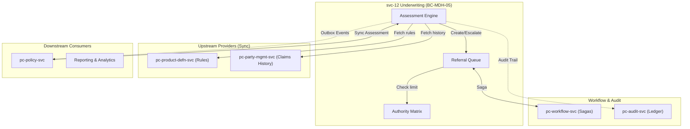

# svc-12: Underwriting Engine Specification (v1)

| Field | Detail |
|:------|:-------|
| **Document ID** | MDH-SVC-SPEC-PC-12-v1 |
| **Service ID** | `svc-12` |
| **Service Name** | Underwriting Engine |
| **Bounded Context** | `BC-MDH-05` — Underwriting |
| **Version** | 1.0 |
| **Status** | Draft |
| **Date** | 2026-07-17 |
| **Classification** | Internal — Confidential |
| **Tier** | Tier-1 |
| **Deploy Mode** | Microservice (`pc-underwriting-svc`) |
| **Target Repo** | `Platform Core/dev/pc-underwriting-svc` |
| **Phase** | Phase 1 (Core) |
| **PRD Anchor** | [Platform Core PRD](../prd/Medhen-Platform-PRD.md) (`REQ-UW-*`) |
| **Capability Anchor** | [Capability Doc BC-MDH-05](../prd/Medhen-Platform-Capability-Document.md#bc-mdh-05--underwriting-pc-underwriting-svc) |
| **Capabilities** | `CAP-UW-001` to `CAP-UW-A1` |
| **Methodologies** | DDD · Hexagonal · EDA · CQRS-lite · Transactional Outbox |
| **Companion Specs** | `svc-10` Product Definition · `svc-13` Policy Management · `svc-09` Workflow |

**Revision history**

| Version | Date | Summary |
|:---|:---|:---|
| 1.0 | 2026-07-17 | Initial Tier-1 specification covering Sections 1-13. Drafted against PRD capabilities (`REQ-UW-001` through `030`). |

---

## Document Structure Overview

1. **Service Overview**
2. **Technology Stack**
3. **Functional Requirements**
4. **Domain Model & Events (Tactical DDD)**
5. **API Specifications**
6. **Event Schemas & Contracts (Avro)**
7. **Behaviour-Driven Scenarios (BDD)**
8. **Data Ownership & Persistence**
9. **Integration & Dependency Contracts**
10. **Non-Functional Requirements & SLOs**
11. **Observability Specification**
12. **Operational Runbooks**
13. **Engineering Definition of Done (DoD)**

---

## 1. Service Overview

### 1.1 Mission Statement

`svc-12` Underwriting Engine (`BC-MDH-05`) is the **centralised risk assessment and authority matrix authority** for the Medhen Platform. It evaluates submissions against immutable underwriting rules provided by the Product Definition Engine (`BC-MDH-02`), aiming to maximise Straight-Through Processing (STP) while strictly governing exceptions through automated referral workflows and delegated authority limits.

The service owns the following strict responsibilities:
1. **Automated Risk Assessment** — Evaluating submissions dynamically to auto-accept, auto-decline, or refer based on product rules, claim history, and risk scores.
2. **Referral Management** — Managing the lifecycle of referred risks, providing an underwriter workbench for capturing decisions (approve, approve-with-conditions, decline, refer-higher).
3. **Authority Matrix Governance** — Enforcing delegated authority limits (by premium and sum-insured) for individual underwriters and committees.
4. **Condition Capture & Escalation** — Structuring and preserving mandatory conditions (exclusions, loadings, warranties) imposed during manual underwriting and handling SLAs for escalations.
5. **Immutable Audit Trail** — Guaranteeing that every automated and manual underwriting decision, along with its full context and authority level, is recorded for regulatory compliance (UK fair-presentation / delegated-authority practices).

### 1.2 Product Context (Must-Include)

`svc-12` operates completely agnostically to the Line of Business (LOB). Risk data shapes are resolved at runtime based on the `product_id`.

| Product Line | Phase | Target STP Rate | Key REQs |
|:---|:---|:---|:---|
| **Motor** | 1 (Core) | ≥ 80% | `REQ-UW-001`, `REQ-UW-002`, `REQ-UW-010` |
| **Life** | 2 | ≥ 60% | `REQ-UW-030` (Disclosure) |
| **Commercial** | 3 | ≥ 40% | `REQ-UW-021` (Committee) |
| **Specialty** | 4 | ≥ 10% | `REQ-UW-021`, `REQ-UW-A2` |

### 1.3 Business Context

| Aspect | Description |
|:-------|:------------|
| **Problem** | Manual underwriting creates bottlenecks, subjective inconsistencies, and compliance risks if authority limits are bypassed. Lack of structured condition capture makes claims adjudication error-prone. |
| **Value** | Standardises risk assessment, significantly reducing quote-to-issue latency via STP. Enforces strict governance and accountability on manual referrals, mitigating financial exposure and ensuring regulatory compliance. |
| **Stakeholders** | Chief Underwriting Officer (CUO), Underwriters, Platform Engineering, Legal/Compliance, Auditors. |

### 1.4 Business Capabilities Delivered

| Capability (CAP) | Description | Primary REQ | Phase |
|:---|:---|:---|:---|
| `CAP-UW-001` | Automated risk assessment (Rules engine, auto-accept/decline/refer, risk score) | `REQ-UW-001` - `006` | 1 |
| `CAP-UW-002` | Referral management (Workbench, decisioning, conditions, SLA tracking, escalation) | `REQ-UW-010` - `013` | 1 |
| `CAP-UW-003` | Authority matrix (Limits, assignment, committee routing, audit) | `REQ-UW-020` - `022` | 1 |
| `CAP-UW-A1` | Fair-presentation / disclosure capture | `REQ-UW-030` | 2 |
| `CAP-UW-A2` | ML risk triage & explainable prioritization | — | 4 |
| `CAP-UW-A3` | External data enrichment (claims bureau, credit signals) | — | 3 |

### 1.5 In-Scope / Out-of-Scope Responsibilities

**In-Scope:**
* Synchronous rules evaluation for risk assessment requests using DMN 1.3 standard.
* Orchestrating the creation, assignment, and escalation of referrals.
* Providing the Underwriter Workbench API for queues and decision-making.
* Storing conditions (loadings, exclusions) and fair presentation disclosures against specific quotes/submissions.
* Maintaining and enforcing the authority matrix, including Facultative Reinsurance triggers.
* Managing decision invalidation upon quote amendment.
* Emitting decision and referral events via outbox.

**Out-of-Scope:**
* Policy lifecycle and quoting orchestration (owned by `pc-policy-svc`).
* Rate calculation or premium impact of loadings (owned by `pc-rating-calc-svc`).
* Product underwriting rule authoring (owned by `pc-product-defn-svc`).
* Workflow engine saga execution (owned by `pc-workflow-svc`).
* Claims adjudication (owned by `pc-claims-svc`).
* Reinsurance contract management (owned by Reinsurance module).

### 1.6 Bounded Context Responsibilities (`BC-MDH-05`)

`BC-MDH-05` is the sole owner of the Underwriting domain.

| Owns | Exposes | Produces (via Outbox) | Invariants |
|:---|:---|:---|:---|
| `UnderwritingAssessment` aggregate | gRPC Risk Assessment API | `pc.underwriting.risk.assessed.v1` | A decision must resolve to strictly one outcome (accept/refer/decline) (`INV-UW-1`). |
| `Referral` entity | REST Workbench API | `pc.underwriting.referral.created.v1`<br>`pc.underwriting.referral.decided.v1` | Referrals can only be closed by authorised personnel/roles (`INV-UW-2`). |
| `AuthorityLevel` configurations | REST Authoring API | `pc.underwriting.authority.updated.v1` | Decisions exceeding limit must trigger `refer-higher` (`INV-UW-3`). |

### 1.7 Context Map



---

## 2. Technology Stack

### 2.0 Operations-Plane Architecture Narrative

`svc-12` handles a highly transactional, hybrid workload. The **Automated Risk Assessment** path is synchronous and must be sub-second to keep the quoting flow responsive. It heavily relies on fast gRPC reads from upstream (Product rules) and an in-memory rule evaluation engine. The **Referral Management** path is asynchronous, human-in-the-loop, and state-heavy, requiring robust saga orchestration with `pc-workflow-svc` and flexible querying capabilities for the Underwriter Workbench.

### 2.1 Technology Selection

| Layer | Technology | Rationale |
|:---|:---|:---|
| Language / runtime | **Go 1.26.x** | Optimized for concurrent rule evaluations and fast gRPC serving. |
| API — external/UI | **REST/JSON**, OpenAPI 3.1 | Underwriter Workbench UI. |
| API — internal | **gRPC** | Sub-second latency for Policy quoting assessments. |
| Primary store | **PostgreSQL 18.x** | ACID guarantees for referral states; JSONB for dynamic risk schemas and conditions. |
| Event backbone | **Kafka** + **Avro** | Durable `pc.underwriting.*` topics. |
| Outbox relay | **Transactional outbox** | Atomic commit of assessment and event. |
| Rule Engine | **DMN 1.3 Compliant Engine** | Standardised decision table evaluation (e.g., executing DMN files exported from Drools/Camunda) for true business agility. |

### 2.2 Configuration Reference

| Key | Default | Purpose |
|:---|:---|:---|
| `uw.rules.evaluation_timeout_ms` | `200` | Max time allowed for evaluating all rules on a submission. |
| `uw.referral.sla.default_hours` | `24` | Default time before a referral escalates automatically. |
| `uw.stp.enabled` | `true` | Global kill-switch for Straight-Through Processing (forces everything to refer). |

### 2.3 Event Publishing (Outbox)

All assessments and referral state changes write to the outbox atomically.

```sql
CREATE TABLE outbox (
  id            bigserial PRIMARY KEY,
  topic         text NOT NULL,               
  partition_key text NOT NULL,               -- {quote_id}
  payload       bytea NOT NULL,              -- Avro-encoded event
  headers       jsonb NOT NULL,              -- CloudEvents v1.0
  created_at    timestamptz NOT NULL DEFAULT now(),
  published_at  timestamptz
);
```

---

## 3. Functional Requirements

### 3.1 Functional Requirement Catalog

#### 3.1.1 Automated Risk Assessment (`FR-UW-ASSESS-*`) — `REQ-UW-001` to `006`

- **FR-UW-ASSESS-1 — Rule Evaluation.** The service SHALL receive a submission payload (via gRPC) and synchronously evaluate it against the active rules fetched from `svc-10`.
- **FR-UW-ASSESS-2 — Deterministic Outcomes.** Rules MUST be evaluated in priority order. The outcome MUST be strictly one of: `AUTO_ACCEPT`, `REFER`, or `DECLINE`. If no rules trigger, the default outcome is `REFER`.
- **FR-UW-ASSESS-3 — STP Processing.** If the outcome is `AUTO_ACCEPT`, the service SHALL record the decision and immediately return to the caller, emitting a `RiskAssessed` event.
- **FR-UW-ASSESS-4 — Referral Trigger.** If the outcome is `REFER`, the service SHALL automatically generate a `Referral` record, calculate the required authority level, and initiate the referral workflow.
- **FR-UW-ASSESS-5 — History Check.** During evaluation, the service SHALL query `svc-15` (Party) for prior claims history of the proposer to feed into the rule engine context.
- **FR-UW-ASSESS-6 — Risk Scoring.** The service SHALL compute a weighted `risk_score` (0-100) based on configured risk factors to aid underwriter prioritization.

#### 3.1.2 Referral Management (`FR-UW-REF-*`) — `REQ-UW-010` to `013`

- **FR-UW-REF-1 — Workbench Queue.** The service SHALL expose APIs for querying referrals based on status, assignee, risk score, and SLA status.
- **FR-UW-REF-2 — Decisioning.** An underwriter SHALL be able to submit a decision (`APPROVE`, `APPROVE_WITH_CONDITIONS`, `DECLINE`, `REFER_HIGHER`) for an open referral.
- **FR-UW-REF-3 — Condition Capture.** If `APPROVE_WITH_CONDITIONS` is selected, the API MUST accept and validate a structured payload of exclusions, specific deductibles, or premium loadings.
- **FR-UW-REF-4 — SLA Tracking.** The service SHALL track the elapsed time of `OPEN` referrals and trigger an SLA breach event if it exceeds the authority level's configured SLA.
- **FR-UW-REF-5 — Escalation.** An explicit `REFER_HIGHER` decision or an SLA breach SHALL automatically route the referral to the next higher authority tier.
- **FR-UW-REF-6 — Facultative Reinsurance Trigger.** If the quote's risk metrics breach the configured treaty limits (e.g., TSI > 50M ETB), the service SHALL mandate a `FACULTATIVE_REQUIRED` flag on the referral, blocking `APPROVE` until the Reinsurance Authority tier clears it.
- **FR-UW-REF-7 — Decision Invalidation.** The service SHALL consume `pc.policy.quote.amended.v1` events. If a quote is amended (e.g., sum insured changed) after an underwriting decision is made but before binding, the existing `Referral` and `Assessment` MUST transition to `INVALIDATED` and trigger a re-assessment.

#### 3.1.3 Authority Matrix (`FR-UW-AUTH-*`) — `REQ-UW-020` to `022`

- **FR-UW-AUTH-1 — Authority Limits.** The service SHALL define `AuthorityLevel` entities specifying max Total Sum Insured (TSI) and max Premium allowed for approval per product.
- **FR-UW-AUTH-2 — Limit Enforcement.** When an underwriter submits an approval, the service MUST synchronously validate their assigned `AuthorityLevel` against the quote's financial metrics. If exceeded, the request MUST be rejected (HTTP 403) or automatically converted to `REFER_HIGHER`.
- **FR-UW-AUTH-3 — Committee Routing.** The service SHALL support a `COMMITTEE` authority tier requiring multiple approvals (maker-checker) before finalizing the decision.
- **FR-UW-AUTH-4 — Decision Audit.** Every manual decision MUST be appended to an immutable audit trail indicating the `actor_id`, `authority_level`, and the exact rules/data present at the time.

#### 3.1.4 Fair Presentation / Disclosure (`FR-UW-DISC-*`) — `REQ-UW-030`

- **FR-UW-DISC-1 — Disclosure Record.** The service SHALL accept a structured payload representing the proposer's statutory disclosures (e.g., UK Insurance Act 2015 fair presentation obligations).
- **FR-UW-DISC-2 — Underwriter Acknowledgment.** When submitting an `APPROVE_WITH_CONDITIONS` or `DECLINE` decision, the underwriter MUST explicitly attach an array of `disclosures_acknowledged` IDs proving that the material facts were reviewed.

### 3.2 Negative Requirements

- **FR-UW-NEG-1:** The service SHALL NOT alter premium values directly; it only outputs 'loading' instructions (percentages or flat amounts) which are interpreted by the Policy/Rating engines.
- **FR-UW-NEG-2:** The service SHALL NOT process a decision from an underwriter whose IAM profile is inactive or lacks the necessary Product Line RBAC roles.
- **FR-UW-NEG-3:** A closed referral (Approved/Declined) SHALL NOT be reopened. A requote necessitates a new assessment.

### 3.3 State Machine Definition (Referrals)

| From State | Trigger Action | To State | Guards & Preconditions |
|:---|:---|:---|:---|
| `—` | `CreateReferral` | `OPEN` | Rule evaluation resulted in `REFER` |
| `OPEN` | `Assign` | `IN_REVIEW` | Valid Underwriter ID |
| `IN_REVIEW` | `SubmitDecision(Approve)` | `APPROVED` | Financials within Authority Limit |
| `IN_REVIEW` | `SubmitDecision(Decline)` | `DECLINED` | — |
| `IN_REVIEW`/`OPEN`| `Escalate` | `ESCALATED` | `refer-higher` triggered or SLA breached |
| `ESCALATED` | `Reassign` | `OPEN` | Assigned to higher authority queue |
| `Any non-terminal`| `ConsumeQuoteAmended` | `INVALIDATED` | Quote payload changed externally before binding |

---

## 4. Domain Model & Events (Tactical DDD)

### 4.1 Aggregate Roots

| Aggregate Root | Definition & Invariants | Emitted Events |
|:---|:---|:---|
| **`UnderwritingAssessment`** | Represents the point-in-time evaluation of a quote submission. It tracks the outcome and the specific rules that triggered.<br><br>**Invariants:**<br>• Must link to exactly one `quote_id`.<br>• Once finalised (STP or manual decision), it becomes immutable. | `RiskAssessed` |
| **`Referral`** | Manages the human-in-the-loop workflow for a specific assessment.<br><br>**Invariants:**<br>• Must link to an `UnderwritingAssessment`.<br>• Cannot be decided by an actor lacking the necessary `AuthorityLevel`. | `ReferralCreated`<br>`ReferralAssigned`<br>`ReferralEscalated`<br>`ReferralDecided` |
| **`AuthorityMatrix`** | The configuration governing who can approve what.<br><br>**Invariants:**<br>• Levels must be strictly hierarchical (e.g., L1 < L2 < L3). | `AuthorityLevelUpdated` |

### 4.2 Entities vs Value Objects

| Concept | Type | Justification |
|:---|:---|:---|
| `Referral` | Entity (Aggregate Root) | Has identity, state machine, and SLA timers. |
| `Assessment` | Entity (Aggregate Root) | Identity tied to a quote evaluation request. |
| `Condition` | Value Object | An exclusion or loading applied to a decision. Replaced entirely if the decision is amended prior to finalization. |
| `RiskScore` | Value Object | Computed integer value based on rules. |
| `AuthorityLevel` | Value Object | Configured thresholds. |

### 4.3 Command Catalog

| Command | Aggregate | Pre-conditions | Post-conditions (Success) | Domain Exception |
|:---|:---|:---|:---|:---|
| `AssessRisk` | `Assessment` | Quote payload is structurally valid. | Assessment created. If STP, `RiskAssessed` emitted. If refer, `Referral` created. | `InvalidRiskPayload` |
| `AssignReferral` | `Referral` | Referral is `OPEN`. Actor has correct role. | Status becomes `IN_REVIEW`. | `ReferralNotOpen` |
| `DecideReferral` | `Referral` | Referral is `IN_REVIEW`. Actor authority ≥ required. | Status finalized. `ReferralDecided` emitted. | `InsufficientAuthority` |
| `EscalateReferral`| `Referral` | Referral not finalized. | Status becomes `ESCALATED`. Routing updated. | `ReferralAlreadyClosed` |

### 4.4 Unit of Work (UoW) & Transaction Boundary

Similar to `svc-10`, `svc-12` employs a Unit of Work to atomically commit the Referral state change, the Outbox event, and the Audit ledger entry. Optimistic concurrency control via a `version` column on the `Referral` aggregate ensures that simultaneous decisions (e.g., two underwriters picking up the same queue item) do not overwrite one another.

---

## 5. API Specifications

### 5.1 gRPC API (High-Throughput Risk Assessment)

Used synchronously by `pc-policy-svc` during the quoting journey.

**Service Definition:** `medhen.platform.underwriting.v1.AssessmentService`

| RPC | Request | Response | SLA (P95) |
|:---|:---|:---|:---|
| `AssessQuote` | `quote_id`, `product_id`, `risk_payload_json` | `AssessmentResult` (STP Accept, Decline, or Pending Referral) | < 500ms |
| `GetAssessmentStatus`| `assessment_id` | `AssessmentStatus` | < 10ms |

### 5.2 REST API (Underwriter Workbench)

Base path: `/api/pc-underwriting/v1`

| Method | Endpoint | Purpose |
|:---|:---|:---|
| `GET` | `/referrals` | List referrals (filtering by queue, status, assignee) |
| `GET` | `/referrals/{id}` | View full referral context & risk data |
| `POST` | `/referrals/{id}/assign` | Claim a referral from the queue |
| `POST` | `/referrals/{id}/decision` | Submit Approve/Decline/Refer-Higher |
| `GET` | `/authority-levels` | Admin: View authority matrix |
| `PUT` | `/authority-levels/{id}` | Admin: Update limits |

#### 5.2.1 Payload: `SubmitDecision`
```json
{
  "decision": "APPROVE_WITH_CONDITIONS",
  "reasoning_notes": "Driver has 2 minor speeding tickets, applying loading.",
  "disclosures_acknowledged": ["disc-789", "disc-790"],
  "facultative_cleared": false,
  "conditions": [
    {
      "type": "PREMIUM_LOADING",
      "value_type": "PERCENTAGE",
      "value": 15.0,
      "target_coverage": "COMPREHENSIVE"
    },
    {
      "type": "MANDATORY_EXCLUSION",
      "text": "Excluded from driving outside national borders."
    }
  ]
}
```

### 5.3 Error Mapping & Taxonomy

| Domain Exception | HTTP/gRPC Code | Error Code | Client Action |
|:---|:---|:---|:---|
| `InsufficientAuthority` | `403 Forbidden` | `UW-2001` | Use `REFER_HIGHER` instead of `APPROVE`. |
| `ReferralNotOpen` | `409 Conflict` | `UW-2002` | Another underwriter has claimed or closed this. |
| `InvalidRiskPayload`| `400 Bad Request`| `UW-2003` | Correct schema missing mandatory fields. |

---

## 6. Event Schemas & Contracts (Avro)

All domain events emitted by `svc-12` are published to Kafka via the outbox pattern. 

### 6.1 Topic Mapping

| Event | Topic | Partition Key |
|:---|:---|:---|
| `RiskAssessed` | `pc.underwriting.risk.assessed.v1` | `tenant_id:quote_id` |
| `ReferralCreated`, `ReferralAssigned`, `ReferralEscalated` | `pc.underwriting.referral.lifecycle.v1` | `tenant_id:referral_id` |
| `ReferralDecided` | `pc.underwriting.referral.decided.v1` | `tenant_id:quote_id` |

### 6.2 Avro Schema: `ReferralDecidedEvent`

```json
{
  "namespace": "medhen.platform.underwriting.v1",
  "type": "record",
  "name": "ReferralDecidedEvent",
  "fields": [
    {"name": "event_id", "type": "string", "logicalType": "uuid"},
    {"name": "tenant_id", "type": "string"},
    {"name": "referral_id", "type": "string"},
    {"name": "assessment_id", "type": "string"},
    {"name": "quote_id", "type": "string"},
    {"name": "decision", "type": {"type": "enum", "name": "DecisionType", "symbols": ["APPROVED", "APPROVED_WITH_CONDITIONS", "DECLINED", "INVALIDATED"]}},
    {"name": "underwriter_id", "type": "string"},
    {"name": "authority_level", "type": "string"},
    {"name": "conditions", "type": {"type": "array", "items": "string"}}, 
    {"name": "disclosures_acknowledged", "type": {"type": "array", "items": "string"}, "default": []},
    {"name": "facultative_reinsurance_attached", "type": "boolean", "default": false},
    {"name": "decided_at", "type": {"type": "long", "logicalType": "timestamp-millis"}}
  ]
}
```

---

## 7. Behaviour-Driven Scenarios (BDD)

### 7.1 Automated Assessment (`FR-UW-ASSESS-*`)

**Scenario: UW-BDD-01 | Straight Through Processing (STP)**
* **Given** a valid motor quote submission
* **And** the active product rules indicate `AUTO_ACCEPT` for this profile
* **When** `AssessQuote` is called via gRPC
* **Then** the service returns `ACCEPT`
* **And** no referral is created
* **And** a `RiskAssessed` event is emitted

**Scenario: UW-BDD-02 | Auto-Decline Trigger**
* **Given** a valid motor quote submission
* **And** the proposer's age is under 18
* **And** a product rule dictates `DECLINE` for age < 18
* **When** `AssessQuote` is called
* **Then** the service returns `DECLINE` with reason "Minimum age not met"

### 7.2 Referral & Authority (`FR-UW-REF-*`, `FR-UW-AUTH-*`)

**Scenario: UW-BDD-03 | Authority Limit Exceeded**
* **Given** a referral in `IN_REVIEW`
* **And** the assigned underwriter has an authority limit of `1,000,000 ETB` TSI
* **And** the quote's TSI is `2,500,000 ETB`
* **When** the underwriter submits an `APPROVE` decision
* **Then** the request is rejected with `InsufficientAuthority`

**Scenario: UW-BDD-04 | Successful Escalation**
* **Given** the state from UW-BDD-03
* **When** the underwriter submits a `REFER_HIGHER` decision
* **Then** the referral state changes to `ESCALATED`
* **And** the target authority level is incremented to match the TSI requirement

**Scenario: UW-BDD-05 | Decision Invalidation on Quote Amendment**
* **Given** an `APPROVED` referral for `q-456`
* **When** the service consumes a `pc.policy.quote.amended.v1` event for `q-456`
* **Then** the referral state transitions to `INVALIDATED`
* **And** an audit trail entry is created noting the quote invalidation

**Scenario: UW-BDD-06 | Facultative Reinsurance Block**
* **Given** a commercial property quote exceeding the 50M ETB treaty limit
* **When** an underwriter with L3 authority (Max 100M ETB) attempts to `APPROVE`
* **Then** the service rejects the approval because `FACULTATIVE_REQUIRED` is true and `facultative_cleared` is false

---

## 8. Data Ownership & Persistence

`svc-12` utilizes PostgreSQL. `pc_underwriting_db` contains tables for assessments, referrals, and authority matrices.

### 8.1 PostgreSQL DDL

#### 8.1.1 Assessments Table

```sql
CREATE TABLE assessments (
    id UUID PRIMARY KEY,
    tenant_id VARCHAR(36) NOT NULL,
    quote_id UUID NOT NULL,
    product_id VARCHAR(50) NOT NULL,
    status VARCHAR(30) NOT NULL, -- STP_ACCEPT, STP_DECLINE, REFERRED
    risk_score INT,
    rules_triggered JSONB, -- Record of which rules fired
    created_at TIMESTAMPTZ DEFAULT CURRENT_TIMESTAMP,
    UNIQUE(tenant_id, quote_id)
);
```

#### 8.1.2 Referrals Table

```sql
CREATE TABLE referrals (
    id UUID PRIMARY KEY,
    assessment_id UUID REFERENCES assessments(id),
    tenant_id VARCHAR(36) NOT NULL,
    status VARCHAR(30) NOT NULL, -- OPEN, IN_REVIEW, ESCALATED, RESOLVED
    required_authority_level VARCHAR(50) NOT NULL,
    assigned_to VARCHAR(100),
    decision VARCHAR(50),
    conditions JSONB,
    sla_deadline TIMESTAMPTZ NOT NULL,
    version INT NOT NULL, -- Optimistic Lock
    created_at TIMESTAMPTZ DEFAULT CURRENT_TIMESTAMP,
    resolved_at TIMESTAMPTZ
);
```

#### 8.1.3 Authority Matrix Table

```sql
CREATE TABLE authority_levels (
    id UUID PRIMARY KEY,
    tenant_id VARCHAR(36) NOT NULL,
    level_code VARCHAR(20) NOT NULL, -- e.g. L1, L2, COMMITTEE
    product_lob VARCHAR(50) NOT NULL,
    max_premium NUMERIC(15, 2) NOT NULL,
    max_tsi NUMERIC(15, 2) NOT NULL,
    UNIQUE(tenant_id, level_code, product_lob)
);
```

### 8.2 Data Classification & Privacy

| Data Domain | Classification | Notes |
|:---|:---|:---|
| Risk Data Payload | **Confidential / PII** | May contain sensitive proposer details (medical, convictions). Stored ephemerally or heavily encrypted at rest. |
| Underwriting Decisions | Internal | Standard business records. |
| Authority Matrix | Internal | Role definitions. |

---

## 9. Integration & Dependency Contracts

### 9.1 Dependency Matrix

| Service | Contract | Coupling | Timeout/Resilience |
|:---|:---|:---|:---|
| **`svc-10` Product** | Consumer of `GetUWRules` | Sync (gRPC) | 100ms timeout. Circuit breaker applied. If `svc-10` is down, fail-open to default `REFER`. |
| **`svc-15` Party** | Consumer of `GetClaimsHistory`| Sync (gRPC) | 100ms timeout. If down, degrade risk score, default to `REFER`. |
| **`svc-09` Workflow**| Producer/Consumer Saga | Async (Events)| Saga timeout governed by `svc-09`. |
| **`svc-13` Policy** | Provider of `AssessQuote` | Sync (gRPC) | We must respond < 500ms. |

---

## 10. Non-Functional Requirements & SLOs

### 10.1 Service Level Objectives (SLOs)

| Metric | SLO | Consequence of Breach | Measurement |
|:---|:---|:---|:---|
| **Availability (gRPC Assess)**| 99.99% | Quoting journey stalls. | Prometheus: successful / total requests. |
| **Latency (gRPC Assess)** | P95 < 500ms | Poor UI UX during quoting. | OpenTelemetry span duration. |
| **Availability (REST UI)** | 99.9% | Underwriters cannot access workbench. | Prometheus. |
| **SLA Tracking Accuracy** | 99.99% | Missed escalations, regulatory breach. | DB timestamp vs Event timestamp. |

---

## 11. Observability Specification

The service utilizes the standard `pc-telemetry-sdk`.

### 11.1 Golden Signals (Prometheus)

- **Traffic:** `grpc_server_handled_total{method="AssessQuote"}`
- **Latency:** `grpc_server_handling_seconds_bucket`
- **Errors:** `grpc_server_handled_total{grpc_code!="OK"}`
- **Business Metrics:** 
  - `uw_assessment_outcome_total{result="STP_ACCEPT|STP_DECLINE|REFER"}`
  - `uw_referral_sla_breach_total`

### 11.2 Logging (Structured `slog`)

```json
{"level":"INFO","time":"2026-07-17T12:00:00Z","msg":"Risk assessment completed","tenant_id":"t-123","quote_id":"q-456","outcome":"STP_ACCEPT","risk_score":12,"trace_id":"...","span_id":"..."}
```

---

## 12. Operational Runbooks

### 12.1 Product Service Outage

**Symptom:** `svc-10` (Product Definition) goes down. Circuit breaker trips.
**Impact:** `AssessQuote` cannot fetch rules.
**Action:** The system automatically degrades to `FAIL_OPEN`. All quotes are assessed as `REFER` with reason `RULES_ENGINE_UNAVAILABLE`. Underwriters must manually process the queue once systems recover.

### 12.2 Massive SLA Breach Alert

**Symptom:** Alert `HighReferralSLABreachRate` fires.
**Action:** 
1. Check `pc-workflow-svc` for backlogs in the escalation saga.
2. Check Underwriter capacity/login metrics via IAM.
3. If necessary, CUO can temporarily increase `uw.stp.enabled` thresholds via feature flags to clear backlogs.

---

## 13. Engineering Definition of Done (DoD)

1. **Test Coverage:** AST Rule Evaluator must have > 95% unit test coverage.
2. **BDD Scenarios:** All scenarios in §7 pass integration.
3. **Idempotency:** `SubmitDecision` and `AssessQuote` endpoints strictly handle duplicate requests safely.
4. **Performance:** Load testing proves `AssessQuote` handles 500 req/sec at P95 < 200ms using mock `svc-10` responses.
5. **Security:** Authority limit evasion tests pass (attempting to bypass limit validation fails securely).
