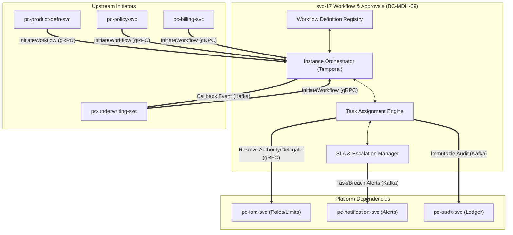
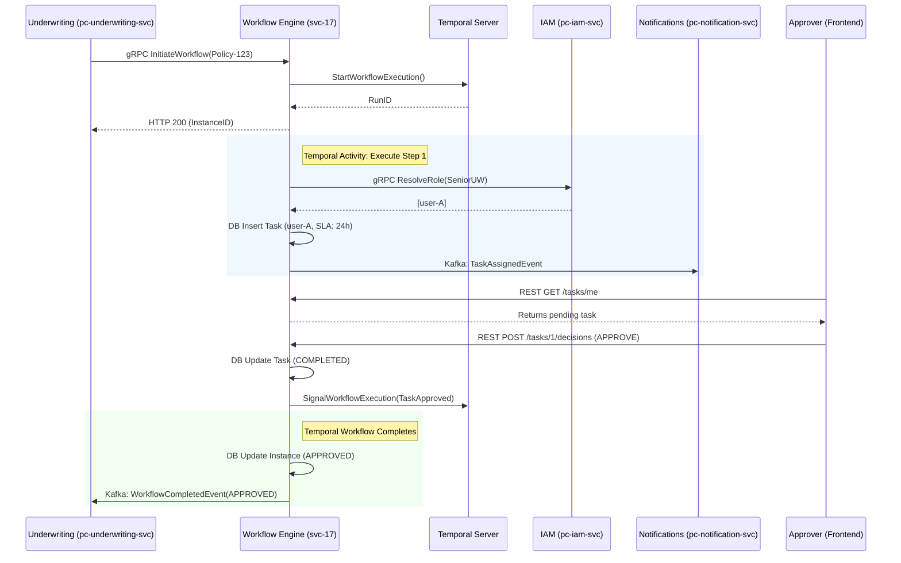

# svc-17: Workflow & Approvals Engine Specification (v1)

| Field | Detail |
|:------|:-------|
| **Document ID** | MDH-SVC-SPEC-PC-17-v1 |
| **Service ID** | `svc-17` |
| **Service Name** | Workflow & Approvals Engine |
| **Bounded Context** | `BC-MDH-09` — Workflow & Approvals |
| **Version** | 1.1 (Comprehensive Enterprise Draft) |
| **Status** | Draft |
| **Date** | 2026-07-18 |
| **Classification** | Internal — Confidential |
| **Tier** | Tier-1 |
| **Deploy Mode** | Microservice (`pc-workflow-svc`) |
| **Target Repo** | `Platform Core/dev/pc-workflow-svc` |
| **Phase** | Phase 1 (core) |
| **PRD Anchor** | [Platform Core PRD](../prd/Medhen-Platform-PRD.md) (`REQ-WFA-001` to `017`) |
| **Capability Anchor** | [Capability Doc BC-MDH-09](../../../docs/prd/Medhen-Platform-Capability-Document.md#bc-mdh-09--workflow--approvals-pc-workflow-svc) |
| **Capabilities** | `CAP-WF-001` to `CAP-WF-A2` |
| **Methodologies** | DDD · Hexagonal · EDA · CQRS · Distributed Saga Orchestration · Temporal |

**Revision history**

| Version | Date | Summary |
|:---|:---|:---|
| 1.0 | 2026-07-17 | Initial Tier-1 specification. |
| 1.1 | 2026-07-18 | Massively expanded to international enterprise standards. Deepened FRs, Domain Models, API Payloads, Avro Schemas, and BDD Scenarios. Introduced Temporal.io architecture details. |

---

## Document Structure Overview

1. **Service Overview & Architectural Context**
2. **Technology Stack & Orchestration Topology**
3. **Comprehensive Functional Requirements (FRs)**
4. **Domain Model & Events (Tactical DDD)**
5. **API & Contract Specifications**
6. **Event Schemas & Contracts (Avro)**
7. **Behaviour-Driven Scenarios (BDD)**
8. **Data Ownership & Persistence Strategy**
9. **Integration & Dependency Contracts**
10. **Non-Functional Requirements & SLOs**
11. **Observability, Tracing & Auditing**
12. **Operational Runbooks**
13. **Engineering Definition of Done (DoD)**

---

## 1. Service Overview & Architectural Context

### 1.1 Mission Statement

`svc-17` Workflow & Approvals (`BC-MDH-09`) is the Medhen Platform's **centralized, stateful orchestration engine for all human-in-the-loop and automated maker-checker workflows**. Moving away from fragmented, hard-coded state machines scattered across business domains, `svc-17` provides a robust, BPMN-inspired substrate. It handles dynamic task routing by querying IAM authority matrices, executing sequential and parallel approval graphs, managing complex delegations, tracking granular SLAs, and enforcing unyielding Maker-Checker segregation of duties.

### 1.2 Enterprise Workload Context

As a Tier-1 Operations Control Plane service, `svc-17` abstracts the "state of waiting" away from upstream microservices. When `pc-underwriting-svc` refers a complex risk, or `pc-policy-svc` requires approval for a massive premium refund, they initiate a workflow in `svc-17` and immediately release their transactional locks. `svc-17` then guarantees the workflow's progression, no matter if the approval takes 5 seconds or 5 weeks, surviving pod restarts, deployments, and datacenter shifts.

### 1.3 Business Context & Value Proposition

| Aspect | Description |
|:-------|:------------|
| **Problem** | Hard-coding approval hierarchies creates technical debt and brittle systems. When organizational structures, authority limits, or compliance mandates change, modifying code in multiple services (Billing, Claims, Underwriting) is risky and slow. |
| **Value** | **Agility & Compliance.** Business administrators define approval matrices as configuration. The service ensures an absolute, non-repudiable audit trail of who approved what, when, and with what authority, satisfying NBE governance directives instantly. Users benefit from a unified cross-platform "My Tasks" inbox. |

### 1.4 Context Map & Boundaries



---

## 2. Technology Stack & Orchestration Topology

### 2.1 Technology Selection

| Layer | Technology | Enterprise Rationale |
|:---|:---|:---|
| **Language** | **Go 1.26.x** | Optimized for highly concurrent, low-latency API serving and Temporal worker execution. |
| **Workflow Engine**| **Temporal.io** | The industry standard for distributed saga orchestration. Provides durable execution, out-of-the-box timer management, and transparent retries for long-running processes. |
| **API (Inbound)** | **gRPC** | Strict, versioned Protobuf contracts for synchronous workflow initiation from other backend BCs. |
| **API (Outbound)** | **REST/OpenAPI 3.1** | Feature-rich endpoints serving the Frontend UI ("My Tasks", Manager Dashboards). |
| **Primary Store** | **PostgreSQL 18.x** | ACID guarantees for the Task inbox, Delegation rules, and definition schemas. |
| **Event Backbone** | **Kafka + Avro** | Guaranteed, ordered delivery of decision callbacks and audit trails. |
| **Caching** | **Redis** | Millisecond access to IAM role structures to prevent hammering `pc-iam-svc` during mass task assignments. |

### 2.2 Temporal Orchestration Architecture

Unlike purely event-driven choreographies which become tangled "event spaghetti", `svc-17` uses Temporal for central orchestration.
1. **Temporal Server (Cluster):** Maintains the persistent state of the workflow graph and timers.
2. **Temporal Workers (`pc-workflow-svc` pods):** Poll the Temporal server, executing the actual Go workflow code (the routing logic, IAM lookups, and task creation).
3. **Local Database (PostgreSQL):** Stores the relational, queryable views of Tasks (e.g., `SELECT * FROM tasks WHERE assignee = 'user-1'`) so the UI doesn't have to scan Temporal event histories.

---

## 3. Comprehensive Functional Requirements (FRs)

The following categorizes the PRD capabilities into deep engineering requirements.

### 3.1 Definition & Schemas (`FR-WF-DEF`)

| ID | Requirement Statement | Trace |
|:---|:---|:---|
| `FR-WF-DEF-1` | **Graph Storage:** The service SHALL store workflow definitions as directed acyclic graphs (DAGs) in JSONB, defining nodes (Steps) and edges (Transitions). | `REQ-WFA-001` |
| `FR-WF-DEF-2` | **Versioning:** A published definition MUST be immutable. Modifications require minting `v+1`. In-flight instances MUST continue executing against the version they were initiated on. | `REQ-WFA-001` |
| `FR-WF-DEF-3` | **Routing Rules:** A Step SHALL define dynamic assignment criteria using an expression language (e.g., `role == 'BranchManager' AND authority >= context.premium_amount`). | `REQ-WFA-010` |

### 3.2 Initiation & Execution (`FR-WF-EXE`)

| ID | Requirement Statement | Trace |
|:---|:---|:---|
| `FR-WF-EXE-1` | **Idempotent Trigger:** The gRPC `InitiateWorkflow` endpoint MUST be idempotent, returning the existing `instance_id` if triggered repeatedly with the same `Idempotency-Key`. | `REQ-WFA-002` |
| `FR-WF-EXE-2` | **Context Snapshot:** The service SHALL capture a snapshot of the business entity payload (e.g., the Quote data) at initiation, using it to evaluate all subsequent routing conditions. | `REQ-WFA-002` |

### 3.3 Routing, Multi-Level & Parallelism (`FR-WF-ROU`)

| ID | Requirement Statement | Trace |
|:---|:---|:---|
| `FR-WF-ROU-1` | **IAM Resolution:** At each Step, the engine SHALL synchronously query `pc-iam-svc` to resolve the assignment rule into a concrete list of `user_ids`. | `REQ-WFA-010` |
| `FR-WF-ROU-2` | **Sequential Chaining:** The engine SHALL support sequential tiers (e.g., Tier 1 -> Tier 2 -> Tier 3), only advancing when the lower tier submits an `APPROVE` decision. | `REQ-WFA-012` |
| `FR-WF-ROU-3` | **Parallel Quorum:** For parallel steps, the definition SHALL specify a quorum rule (e.g., `ALL`, `ANY_ONE`, or a percentage `50%`). The workflow blocks until the quorum is met. | `REQ-WFA-012` |
| `FR-WF-ROU-4` | **Maker-Checker:** The engine SHALL strictly reject any `APPROVE` decision submitted by the user identified as the `initiator_id` of the workflow, returning `HTTP 403 MakerCheckerViolation`. | NBE Gov |

### 3.4 Delegation of Authority (`FR-WF-DEL`)

| ID | Requirement Statement | Trace |
|:---|:---|:---|
| `FR-WF-DEL-1` | **Absence Registration:** Users SHALL be able to register a `DelegationRule` specifying a start date, end date, and target `delegate_id`. | `REQ-WFA-013` |
| `FR-WF-DEL-2` | **Authority Validation:** Before persisting a delegation, the service SHALL verify via IAM that the `delegate_id` possesses equal or greater authority bounds than the delegator. | `REQ-WFA-013` |
| `FR-WF-DEL-3` | **Dynamic Rerouting:** During Task generation, if the assignee has an active `DelegationRule`, the Task SHALL be assigned to the delegate, but permanently tagged with `delegated_from: original_user_id`. | `REQ-WFA-013` |
| `FR-WF-DEL-4` | **Circular Prevention:** The service SHALL detect and block circular delegations (A -> B -> A) at the time of rule registration. | `REQ-WFA-013` |

### 3.5 SLAs & Escalation Chains (`FR-WF-SLA`)

| ID | Requirement Statement | Trace |
|:---|:---|:---|
| `FR-WF-SLA-1` | **Granular Timers:** Each Step SHALL support a configured SLA duration (e.g., `PT24H`). | `REQ-WFA-014` |
| `FR-WF-SLA-2` | **Manager Escalation:** Upon SLA timer expiry, the engine SHALL automatically escalate the task by querying IAM for the current assignee's `manager_id`, assigning the task to the manager. | `REQ-WFA-014` |
| `FR-WF-SLA-3` | **Breach Notification:** Upon escalation, the service SHALL emit an `sla.breached.v1` event to trigger real-time notifications to both the original assignee and their manager. | `REQ-WFA-014` |

---

## 4. Domain Model & Events (Tactical DDD)

### 4.1 Aggregate Definitions

| Aggregate Root | Definition & Lifecycle | Primary Invariants | Emitted Domain Events |
|:---|:---|:---|:---|
| **`WorkflowDefinition`** | The declarative blueprint. Created in DRAFT, transitioned to ACTIVE. | Must contain ≥1 start node and ≥1 terminal node (Approved/Rejected). | `WorkflowDefinitionPublished` |
| **`WorkflowInstance`** | The execution context. Spans from `InitiateWorkflow` to a terminal decision. | Cannot be paused; only runs or terminates. | `WorkflowInitiated`<br>`WorkflowCompleted`<br>`WorkflowTerminated` |
| **`Task`** | An actionable item bound to a user/group. Lives entirely within the lifespan of its parent Instance. | Decisions are final. Only designated assignees or delegates can mutate. | `TaskAssigned`<br>`TaskDecisionMade`<br>`TaskEscalated` |
| **`DelegationContract`**| Represents an agreement transferring authority during a specific temporal window. | Delegate's `authority_level` ≥ Delegator's `authority_level`. | `DelegationActivated`<br>`DelegationExpired` |

### 4.2 Value Objects

- **`RoutingExpression`**: An AST-parsable string (e.g. `role:SeniorUW && branch:ADDIS`).
- **`DecisionContext`**: Contains the `Outcome` (`APPROVE`, `REJECT`, `REFER`), the `comments` (mandatory), and the `reason_code`.
- **`SlaPolicy`**: Defines `duration` (e.g., 48h) and `action` (`ESCALATE_TO_MANAGER`, `AUTO_REJECT`, `NOTIFY_ONLY`).

### 4.3 Command Dictionary

| Command Name | Target | Auth Required | Execution Semantic |
|:---|:---|:---|:---|
| `InitiateWorkflow` | Instance | System/Service | Synchronous RPC, Async Execution |
| `ClaimTask` | Task | Assignee (Group) | Optimistic concurrency (Versioned) |
| `SubmitDecision` | Task | Assignee (User) | Transactional UoW, triggers Temporal signal |
| `RegisterDelegation`| Delegation | User/Admin | Synchronous validation against IAM |

---

## 5. API & Contract Specifications

### 5.1 REST API (Frontend Inboxes & Management)

#### `GET /api/pc-workflow/v1/tasks` (Inbox Query)
Fetches tasks for the authenticated user, resolving group memberships and active delegations.

**Query Params:**
- `status` (PENDING, COMPLETED)
- `sort` (created_at:desc, sla_breach_at:asc)
- `entity_type` (e.g., POLICY, CLAIM)

**Response:**
```json
{
  "data": [
    {
      "task_id": "tsk-9876-1234",
      "instance_id": "inst-5555",
      "business_entity": {
        "type": "POLICY_MTA",
        "id": "POL-2026-001",
        "summary": "MTA Premium Refund: 50,000 ETB"
      },
      "status": "PENDING",
      "assigned_to": "usr-888",
      "delegated_from": "usr-999",
      "created_at": "2026-07-18T08:00:00Z",
      "sla_breach_at": "2026-07-19T08:00:00Z"
    }
  ],
  "meta": { "total": 1, "page": 1 }
}
```

#### `POST /api/pc-workflow/v1/tasks/{task_id}/decisions`
Submits an immutable decision.

**Request Payload:**
```json
{
  "decision": "REJECT",
  "reason_code": "EXCEEDS_TREATY_LIMIT",
  "comments": "The requested sum insured exceeds our treaty limit for this vehicle class. Refer to facultative reinsurance."
}
```

### 5.2 gRPC Interface (Backend Triggers)

**Service Definition:** `medhen.platform.workflow.v1.WorkflowOrchestrator`

```protobuf
syntax = "proto3";
package medhen.platform.workflow.v1;

import "google/protobuf/struct.proto";
import "google/protobuf/timestamp.proto";

service WorkflowOrchestrator {
  // Idempotent initiation from an upstream BC
  rpc InitiateWorkflow(InitiateWorkflowRequest) returns (InitiateWorkflowResponse);
  
  // Real-time status polling for backend systems
  rpc GetInstanceStatus(GetInstanceStatusRequest) returns (WorkflowStatusResponse);
  
  // System-level cancellation (e.g. user aborted the quote)
  rpc TerminateInstance(TerminateInstanceRequest) returns (TerminateInstanceResponse);
}

message InitiateWorkflowRequest {
  string idempotency_key = 1;
  string workflow_definition_code = 2; // e.g. "UW_MOTOR_REFERRAL"
  string business_entity_id = 3;       // e.g. "QTE-999"
  string initiator_id = 4;             // The user who triggered the quote
  google.protobuf.Struct context_data = 5; // JSON snapshot of the quote/risk
}

message InitiateWorkflowResponse {
  string instance_id = 1;
  string status = 2; // e.g. "RUNNING", "AUTO_APPROVED"
}
```

---

## 6. Event Schemas & Contracts (Avro)

All domain events are emitted to Kafka via a Transactional Outbox pattern, serialized in Avro, enforcing strictly backward-compatible schemas via the Apicurio Registry.

### 6.1 `WorkflowCompletedEvent` (`platform.workflow.instance.v1`)

Produced when a workflow reaches a terminal state. Originating BCs (Underwriting, Policy) consume this to unblock their local state machines.

```json
{
  "namespace": "medhen.platform.workflow.v1",
  "type": "record",
  "name": "WorkflowCompletedEvent",
  "fields": [
    {"name": "event_id", "type": "string", "logicalType": "uuid"},
    {"name": "tenant_id", "type": "string"},
    {"name": "instance_id", "type": "string"},
    {"name": "business_entity_id", "type": "string"},
    {"name": "definition_code", "type": "string"},
    {"name": "final_outcome", "type": {"type": "enum", "name": "Outcome", "symbols": ["APPROVED", "REJECTED", "SYSTEM_TERMINATED"]}},
    {"name": "execution_duration_ms", "type": "long"},
    {"name": "audit_trail", "type": {"type": "array", "items": "string"}, "doc": "Array of decision summaries"},
    {"name": "completed_at", "type": {"type": "long", "logicalType": "timestamp-millis"}}
  ]
}
```

### 6.2 `TaskAssignedEvent` (`platform.workflow.task.v1`)

Produced whenever a task is generated or reassigned. Consumed heavily by `pc-notification-svc` to send "You have a new task" emails/in-app alerts.

```json
{
  "namespace": "medhen.platform.workflow.v1",
  "type": "record",
  "name": "TaskAssignedEvent",
  "fields": [
    {"name": "task_id", "type": "string"},
    {"name": "instance_id", "type": "string"},
    {"name": "assignee_id", "type": "string"},
    {"name": "assignee_type", "type": {"type": "enum", "name": "AssigneeType", "symbols": ["USER", "GROUP"]}},
    {"name": "is_escalation", "type": "boolean", "default": false},
    {"name": "delegated_from", "type": ["null", "string"], "default": null},
    {"name": "sla_breach_timestamp", "type": {"type": "long", "logicalType": "timestamp-millis"}}
  ]
}
```

---

## 7. Behaviour-Driven Scenarios (BDD)

These BDDs serve as the definitive specification for the test engineering team.

### Scenario 1: Multi-Level Sequential Approval
* **Given** a definition requiring `Tier 1 (Branch UW)` then `Tier 2 (HQ UW)`
* **When** a workflow is initiated
* **Then** a Task is created for `Tier 1`
* **When** `Tier 1` submits an `APPROVE` decision
* **Then** the workflow advances and creates a Task for `Tier 2`
* **And** no `WorkflowCompleted` event is emitted yet
* **When** `Tier 2` submits an `APPROVE` decision
* **Then** `WorkflowCompletedEvent(outcome=APPROVED)` is emitted to Kafka

### Scenario 2: Parallel Quorum Rejection
* **Given** a parallel definition requiring `Risk Dept` AND `Finance Dept`
* **When** the workflow is initiated
* **Then** two Tasks are generated concurrently
* **When** `Finance Dept` submits a `REJECT` decision
* **Then** the `Risk Dept` task is automatically marked as `SYSTEM_CANCELLED`
* **And** `WorkflowCompletedEvent(outcome=REJECTED)` is emitted immediately

### Scenario 3: Maker-Checker Enforcement
* **Given** a Task assigned to the `Underwriter` role
* **And** the workflow was initiated by `user-123`
* **When** `user-123` (who holds the Underwriter role) attempts to claim or approve the Task
* **Then** the API returns HTTP 403 `MakerCheckerViolation`
* **And** the Task remains `PENDING`

### Scenario 4: Absence Rerouting
* **Given** `user-A` has an active delegation to `user-B`
* **When** the Temporal engine resolves a task assigned specifically to `user-A`
* **Then** the Task is actually assigned to `user-B`
* **And** `TaskAssignedEvent` includes `delegated_from="user-A"`

---

## 8. Data Ownership & Persistence Strategy

`svc-17` strictly segregates high-throughput query models (PostgreSQL) from durable orchestration state (Temporal).

### 8.1 PostgreSQL Relational Schema (Query Model)

```sql
CREATE TABLE workflow_definitions (
    id UUID PRIMARY KEY,
    tenant_id VARCHAR(36) NOT NULL,
    code VARCHAR(100) NOT NULL,
    version INT NOT NULL,
    graph_payload JSONB NOT NULL, -- The AST / DAG structure
    is_active BOOLEAN DEFAULT false,
    created_at TIMESTAMPTZ DEFAULT CURRENT_TIMESTAMP,
    UNIQUE (tenant_id, code, version)
);

CREATE TABLE workflow_instances (
    id UUID PRIMARY KEY,
    tenant_id VARCHAR(36) NOT NULL,
    definition_id UUID REFERENCES workflow_definitions(id),
    business_entity_id VARCHAR(100) NOT NULL,
    initiator_id VARCHAR(100) NOT NULL,
    status VARCHAR(30) NOT NULL, -- RUNNING, APPROVED, REJECTED, TERMINATED
    temporal_run_id VARCHAR(100) NOT NULL, -- Link to Temporal execution
    context_snapshot JSONB,
    created_at TIMESTAMPTZ DEFAULT CURRENT_TIMESTAMP
);
CREATE INDEX idx_wfi_entity ON workflow_instances(business_entity_id);

CREATE TABLE tasks (
    id UUID PRIMARY KEY,
    tenant_id VARCHAR(36) NOT NULL,
    instance_id UUID REFERENCES workflow_instances(id) ON DELETE CASCADE,
    step_node_id VARCHAR(100) NOT NULL,
    assignee_id VARCHAR(100), -- User ID or Group ID
    delegated_from_id VARCHAR(100),
    status VARCHAR(30) NOT NULL, -- PENDING, COMPLETED, CANCELLED
    decision_outcome VARCHAR(30),
    decision_comment TEXT,
    decision_by VARCHAR(100),
    sla_breach_at TIMESTAMPTZ,
    resolved_at TIMESTAMPTZ,
    created_at TIMESTAMPTZ DEFAULT CURRENT_TIMESTAMP
);
CREATE INDEX idx_tasks_assignee ON tasks(assignee_id) WHERE status = 'PENDING';

CREATE TABLE delegations (
    id UUID PRIMARY KEY,
    tenant_id VARCHAR(36) NOT NULL,
    delegator_id VARCHAR(100) NOT NULL,
    delegate_id VARCHAR(100) NOT NULL,
    valid_from TIMESTAMPTZ NOT NULL,
    valid_to TIMESTAMPTZ NOT NULL,
    is_revoked BOOLEAN DEFAULT false
);
```

### 8.2 Temporal Persistence
Temporal manages its own Cassandra/Postgres datastore for maintaining event histories (WorkflowExecutionStarted, ActivityTaskScheduled, TimerStarted). `svc-17` does NOT query Temporal for UI dashboard data; it relies entirely on the local PostgreSQL tables updated synchronously by the workflow worker activities.

---

## 9. Integration & Dependency Contracts

### 9.1 IAM Authority Resolution (`pc-iam-svc`)
During Task creation, `svc-17` calls IAM via gRPC.
* **Request:** `GetEligibleUsers(Role="SeniorUW", MinAuthority=100000, Branch="B-01")`
* **Response:** `["usr-1", "usr-2"]`
* **Resiliency:** If IAM is degraded, the task is assigned to a fallback Admin Queue, and the workflow is NOT failed.

### 9.2 Sequence: End-to-End Approval Journey



---

## 10. Non-Functional Requirements & SLOs

| Category | Metric | SLO Target | Mitigation Strategy |
|:---|:---|:---|:---|
| **Availability** | gRPC Initiation Uptime | **99.99%** | If Temporal is down, `InitiateWorkflow` buffers to an internal outbox queue and returns success, ensuring upstream BCs are never blocked. |
| **Latency** | My Tasks API (`GET`) | **P95 < 150ms** | Indexed directly on `assignee_id` + `status` in Postgres. |
| **Durability** | Workflow State Loss | **0.00% (RPO=0)** | Temporal guarantees durable execution via synchronous persistence to its underlying database before stepping forward. |
| **Scalability** | Concurrent Workflows | **> 100,000 active** | Horizontally scale Temporal Workers deployment independently of the HTTP/gRPC server pods. |
| **Accuracy** | SLA Timer Fire | **± 5 seconds** | Temporal's native timer queue guarantees exact execution intervals, eliminating cron-based polling architectures. |

---

## 11. Observability, Tracing & Auditing

`svc-17` integrates with the `pc-telemetry-sdk` to provide complete transparency into distributed sagas.

### 11.1 OpenTelemetry Tracing
A single trace MUST span from the upstream service, through the Workflow API, into the Temporal Worker execution, and out to the Kafka callback.
* **Context Propagation:** The `traceparent` is serialized into the `InitiateWorkflow` context payload, and extracted by the Temporal Worker to continue the trace.

### 11.2 Prometheus Golden Metrics
- `workflow_initiations_total{definition_code="...", status="success|buffered|failed"}`
- `workflow_execution_duration_seconds_bucket{definition_code="..."}`
- `task_sla_breaches_total{role="..."}`
- `temporal_worker_task_slots_available` (Saturation metric for autoscaling)

### 11.3 Audit Ledger
Every mutating action (Task Decision, Delegation, Escalation) is recorded to an append-only `workflow_audit_log` table, which is periodically archived to cold storage for 7-year regulatory compliance.

---

## 12. Operational Runbooks

### 12.1 Poison Pill Task (Worker Panics)
**Symptom:** A specific task consistently causes the Temporal Worker to crash (e.g., malformed context payload).
**Action:** 
1. Identify the workflow ID from the crash logs.
2. Terminate the workflow administratively via CLI:
   `tctl workflow terminate --workflow_id "inst-123" --reason "Poison pill data"`
3. The upstream service will remain in pending; manually intervene via DB script to resolve the source entity.

### 12.2 IAM Degradation Handling
**Symptom:** `pc-iam-svc` is returning 503s. Tasks are failing to assign.
**Action:**
Temporal will automatically employ exponential backoff to retry the `ResolveAssignee` activity. Do not manually intervene. Once IAM recovers, tasks will automatically generate and SLAs will begin from the time of successful creation.

---

## 13. Engineering Definition of Done (DoD)

To promote `svc-17` to the `staging` environment for Phase 1, the following enterprise gates MUST be passed:

1. **Test Coverage:** All routing, SLA, and Maker-Checker logic requires strictly > 95% line coverage.
2. **Saga Chaos Testing:** The QA suite MUST include chaos tests that randomly terminate Temporal worker pods during mid-execution of a workflow. Workflows MUST resume flawlessly without dropped tasks or duplicated events.
3. **Idempotency Verification:** The double-submit test suite MUST prove that rapid-fire duplicate REST API decisions (`POST /decision`) do not advance the Temporal workflow twice.
4. **Data Privacy Scan:** Ensure that the `context_snapshot` JSONB column strips or masks any PII (Policyholder names) before storage, relying only on identifiers.
5. **Security/PenTest:** Verification that role-based access control prevents User A from querying User B's `My Tasks` endpoints.
